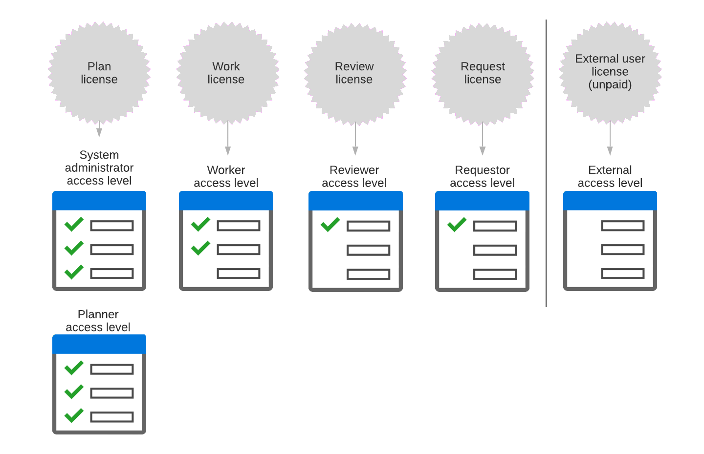

# Présentation des licences Adobe Workfront

Votre entreprise a acheté un certain nombre de licences lorsqu’elle a acquis Adobe Workfront. En tant qu’administrateur Workfront, vous attribuez à chaque utilisateur l’un des quatre types de licences Workfront payantes lorsque vous lui attribuez un niveau d’accès.

## Comment les licences et les niveaux d’accès Workfront sont liés entre eux

Les 4 types de licences Workfront payantes permettent différents niveaux d’accès à Workfront. Chaque niveau d’accès est associé à l’une de ces licences.

En tant qu’administrateur Workfront, au lieu d’affecter une licence à un utilisateur, vous lui attribuez le niveau d’accès associé à cette licence.

Ce tableau et diagramme présentent les principaux niveaux d’accès à Workfront :

| Licence | Niveau d’accès associé |
|--- |--- |
| Plan | Administrateur système, planificateur |
| Travail | Employé |
| Vérifier | Réviseur |
| Externe* | Utilisateur externe |

>[!NOTE]
>
>La licence externe n’est pas une licence payante. Il est principalement conçu pour partager des documents avec des collaborateurs qui n’utilisent pas Workfront. Pour plus d’informations, voir [Niveaux d’accès intégrés dans Adobe Workfront](default-access-levels-in-workfront.md).

## Comment une licence définit un niveau d’accès

La licence associée à un niveau d’accès détermine la portée globale des fonctionnalités disponibles au niveau d’accès.

Vous pouvez copier un niveau d’accès par défaut et personnaliser la copie selon vos besoins pour vos utilisateurs. Dans le cadre des fonctionnalités autorisées par la licence pour le niveau d’accès copié, vous pouvez ajuster les paramètres d’accès pour répondre aux besoins de l’utilisateur.

Pour plus d’informations, voir [Présentation des niveaux d’accès](../../../administration-and-setup/add-users/access-levels-and-object-permissions/access-levels-overview.md) et [Création ou modification de niveaux d’accès personnalisés](../../../administration-and-setup/add-users/configure-and-grant-access/create-modify-access-levels.md).

## Nombre de licences

Lorsque vous attribuez un niveau d’accès à un utilisateur, le nombre de licences disponibles est réduit de 1.

Par exemple, si vous attribuez le niveau d’accès Planificateur à un utilisateur, votre nombre de licences d’abonnement disponibles est réduit de 1.

Vous pouvez afficher les licences et les niveaux d’accès attribués à vos utilisateurs. Pour plus d’informations, voir [Répertorier les niveaux d’accès et les licences de vos utilisateurs](../../../administration-and-setup/add-users/access-levels-and-object-permissions/list-access-levels-and-licenses-for-your-users.md).

Pour plus d’informations sur la gestion de vos licences, voir [Gestion des licences disponibles dans votre système](../../../administration-and-setup/get-started-wf-administration/manage-available-licenses-in-your-system.md).
