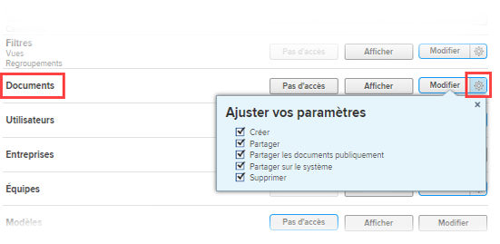

# Accorder l’accès aux documents

En tant que personne membre de l’administration Adobe Workfront, vous pouvez utiliser un niveau d’accès pour définir l’accès d’un utilisateur ou d’une utilisatrice aux documents, comme expliqué dans [Vue d’ensemble des niveaux d’accès](../../../administration-and-setup/add-users/access-levels-and-object-permissions/access-levels-overview.md).

Cet accès s’applique également aux dossiers de documents.

Pour plus d’informations sur l’utilisation de niveaux d’accès personnalisés pour gérer l’accès des personnes à d’autres types d’objets dans Workfront, voir [Créer ou modifier des niveaux d’accès personnalisés](../../../administration-and-setup/add-users/configure-and-grant-access/create-modify-access-levels.md).

## Conditions d’accès

+++ Développez pour afficher les exigences d’accès aux fonctionnalités de cet article.

<table style="table-layout:auto"> 
 <col> 
 <col> 
 <tbody> 
  <tr> 
   <td role="rowheader">Package Adobe Workfront</td> 
   <td>Tous</td> 
  </tr> 
  <tr> 
   <td role="rowheader">Licence Adobe Workfront</td> 
   <td>
   
Standard

   
Plan

   </td> 
  </tr> 
  <tr> 
   <td role="rowheader">Configurations des niveaux d’accès</td> 
   <td> 
Vous devez être un administrateur ou une administratrice Workfront.
 </td> 
  </tr> 
 </tbody> 
</table>

Pour plus de détails sur les informations contenues dans ce tableau, consultez l’article [Conditions d’accès dans la documentation Workfront](/help/quicksilver/administration-and-setup/add-users/access-levels-and-object-permissions/access-level-requirements-in-documentation.md).
+++

## Configurer l’accès des utilisateurs et des utilisatrices aux documents à l’aide d’un niveau d’accès personnalisé

1. Commencez à créer ou à modifier le niveau d’accès, comme expliqué dans la section [Créer ou modifier des niveaux d’accès personnalisés](../../../administration-and-setup/add-users/configure-and-grant-access/create-modify-access-levels.md).
1. Cliquez sur l’icône en forme d’engrenage  sur le bouton **Afficher** ou **Modifier** à droite de la section des documents, puis sélectionnez les capacités que vous souhaitez accorder sous **Ajuster vos paramètres**.

   

   Vous pouvez autoriser les utilisateurs et les utilisatrices à effectuer les opérations suivantes sur les projets, les tâches et les problèmes pour lesquels les droits d’accès leur ont été accordés :

   <table style="table-layout:auto"> 
    <col> 
    <col> 
    <tbody> 
     <tr> 
      <td role="rowheader">Créer</td> 
      <td>Charger des documents.</td> 
     </tr> 
     <tr> 
      <td role="rowheader">Supprimer</td> 
      <td> 
Supprimer des documents chargés.
 
L’option <b>Créer</b> est automatiquement activée lorsque cette option est activée.
 </td> 
     </tr> 
     <tr> 
      <td role="rowheader">Partager</td> 
      <td>Partager des documents avec des utilisateurs et des utilisatrices, des fonctions et des équipes spécifiques.</td> 
     </tr> 
     <tr> 
      <td role="rowheader">Partager les documents publiquement</td> 
      <td>Partager des documents avec des utilisateurs et des utilisatrices externes (sans licence Workfront).</td> 
     </tr> 
     <tr> 
      <td role="rowheader">Partager sur le système</td> 
      <td> 
Mettez les documents à la disposition de tous les utilisateurs et de toutes les utilisatrices de votre instance Workfront.
 
Toute personne dans le système peut voir un document partagé de cette manière si les conditions suivantes sont remplies :
 
       <ul> 
        <li> 
Vous lui envoyez un lien vers la page des documents où il est chargé.
 </li> 
        <li> 
Elle le recherche dans Workfront.
 </li> 
       </ul> 
L’option <b>Partager</b> est automatiquement activée lorsque cette option est activée.
 </td> 
     </tr> 
    </tbody> 
   </table>

   >[!NOTE]
   >
   >Lorsque vous configurez un niveau d’accès pour un certain type d’objet, cette configuration n’affecte pas l’accès des utilisateurs et utilisatrices aux objets de rang inférieur. Par exemple, vous pouvez interdire aux utilisateurs et aux utilisatrices de supprimer des projets dans leur niveau d’accès, mais cela ne les empêche pas de supprimer des documents dont le rang est inférieur à celui des projets. Pour plus d’informations sur la hiérarchie des objets, consultez la section [Interdépendance et hiérarchie des objets](../../../workfront-basics/navigate-workfront/workfront-navigation/understand-objects.md#understanding-interdependency-and-hierarchy-of-objects) dans l’article [Comprendre les objets dans Adobe Workfront](../../../workfront-basics/navigate-workfront/workfront-navigation/understand-objects.md).

1. (Facultatif) Pour restreindre les autorisations héritées des objets de rang supérieur pour les documents, cliquez sur **Définir des restrictions supplémentaires**, puis sélectionnez **Ne jamais hériter l’accès aux documents depuis des projets, des tâches, des problèmes, etc.**.
1. (Facultatif) Pour configurer les paramètres d’accès d’autres objets et domaines dans le niveau d’accès sur lequel vous travaillez, consultez l’un des articles listés dans [Configurer l’accès à Adobe Workfront](../../../administration-and-setup/add-users/configure-and-grant-access/configure-access.md), comme [Autoriser l’accès aux tâches](../../../administration-and-setup/add-users/configure-and-grant-access/grant-access-tasks.md) et [Autoriser l’accès aux données financières](../../../administration-and-setup/add-users/configure-and-grant-access/grant-access-financial.md).
1. Lorsque vous avez terminé, cliquez sur **Enregistrer**.

   Une fois le niveau d’accès créé, vous pouvez l’attribuer à un utilisateur ou à une utilisatrice. Pour plus d’informations, consultez la section [Modifier le profil d’un utilisateur ou d’une utilisatrice](../../../administration-and-setup/add-users/create-and-manage-users/edit-a-users-profile.md).

## Accéder aux documents par type de licence

Pour plus d’informations sur ce que les utilisateurs et les utilisatrices de chaque niveau d’accès peuvent faire avec les documents, consultez la section [Documents](../../../administration-and-setup/add-users/access-levels-and-object-permissions/functionality-available-for-each-object-type.md#document) dans l’article [Fonctionnalités disponibles pour chaque type d’objet](../../../administration-and-setup/add-users/access-levels-and-object-permissions/functionality-available-for-each-object-type.md).

## Accéder aux documents partagés

Après avoir chargé un document dans Workfront, vous pouvez le partager avec d’autres utilisateurs et utilisatrices en leur en accordant l’accès, comme expliqué dans [Partager un document](../../../workfront-basics/grant-and-request-access-to-objects/document-permissions.md).

<!--
If you make changes here, make them also in the "Grant access to" articles where this snippet had to be converted to text:
* reports, dashboards, and calendars
* financial data<
* issue
-->

Lorsque vous partagez un objet avec un autre utilisateur ou une autre utilisatrice, les droits des personnes destinataires sur cet objet sont déterminés par une combinaison de deux éléments :

* Les autorisations que vous accordez à votre personne destinataire pour l’objet.
* Les paramètres du niveau d’accès des personnes destinataires pour le type d’objet.
