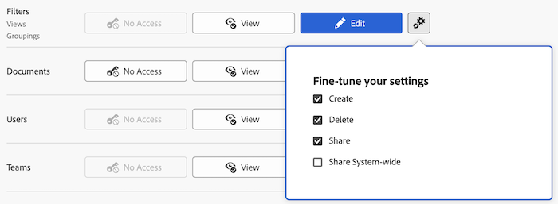

# Accorder l’accès aux filtres, aux vues et aux regroupements

En tant que personne membre de l’administration Adobe Workfront, vous pouvez utiliser un niveau d’accès pour définir l’accès d’un utilisateur ou d’une utilisatrice aux contrôles de filtrage, d’affichage et de regroupement pour les listes et les rapports, comme expliqué dans [Vue d’ensemble des niveaux d’accès](../../../administration-and-setup/add-users/access-levels-and-object-permissions/access-levels-overview.md).

Pour plus d’informations sur les contrôles de filtrage, d’affichage et de regroupement, consultez la section [Éléments de création de rapports : filtres, vues et regroupements](../../../reports-and-dashboards/reports/reporting-elements/reporting-elements-filters-views-groupings.md).

## Conditions d’accès

+++ Développez pour afficher les exigences d’accès aux fonctionnalités de cet article.

<table style="table-layout:auto"> 
 <col> 
 <col> 
 <tbody> 
  <tr> 
   <td role="rowheader">Package Adobe Workfront</td> 
   <td>Tous</td> 
  </tr> 
  <tr> 
   <td role="rowheader">Licence Adobe Workfront</td> 
   <td> 
Standard

   
Plan
</td> 
  </tr> 
  <tr> 
   <td role="rowheader">Configurations des niveaux d’accès</td> 
   <td> 
Vous devez être un administrateur ou une administratrice Workfront.
 </td> 
  </tr> 
 </tbody> 
</table>

Pour plus de détails sur les informations contenues dans ce tableau, consultez l’article [Conditions d’accès dans la documentation Workfront](/help/quicksilver/administration-and-setup/add-users/access-levels-and-object-permissions/access-level-requirements-in-documentation.md).

+++

## Configurer l’accès des utilisateurs et des utilisatrices aux filtres, aux vues et aux regroupements à l’aide d’un niveau d’accès personnalisé

1. Commencez à créer ou à modifier le niveau d’accès, comme expliqué dans la section [Créer ou modifier des niveaux d’accès personnalisés](../../../administration-and-setup/add-users/configure-and-grant-access/create-modify-access-levels.md).
1. Cliquez sur l’icône en forme d’engrenage  sur les boutons **Vue** ou **Modifier** à droite des filtres, puis sélectionnez les capacités que vous souhaitez accorder sous **Ajuster vos paramètres**.

   

   Par défaut, les utilisateurs disposant d’une licence Standard, Plan, Travail, Léger, Réviseur, Contributeur ou Demander disposent de toutes les capacités d’affichage et de modification. Les utilisateurs disposant d’une licence d’utilisateur externe n’ont pas accès aux filtres, vues et regroupements.

   <!--
   If this changes, undraft section with table below
   -->

1. (Facultatif) Pour configurer les paramètres d’accès pour d’autres objets et domaines dans le niveau d’accès sur lequel vous travaillez, continuez avec l’un des articles listés dans [Configurer l’accès à Adobe Workfront](../../../administration-and-setup/add-users/configure-and-grant-access/configure-access.md), tels que [Accorder l’accès aux tâches](../../../administration-and-setup/add-users/configure-and-grant-access/grant-access-tasks.md) et [Accorder l’accès aux données financières](../../../administration-and-setup/add-users/configure-and-grant-access/grant-access-financial.md).
1. Lorsque vous avez terminé, cliquez sur **Enregistrer**.

   Une fois le niveau d’accès créé, vous pouvez l’attribuer à un utilisateur ou à une utilisatrice. Pour plus d’informations, voir [Modifier le profil d’une personne](../../../administration-and-setup/add-users/create-and-manage-users/edit-a-users-profile.md).

## Accès aux filtres, vues et regroupements par type de licence

Pour plus d&#39;informations sur ce que les utilisateurs de chaque niveau d&#39;accès peuvent faire avec les filtres, les vues et les regroupements, consultez la section [Filtres, vues et regroupements](/help/quicksilver/administration-and-setup/add-users/how-access-levels-work/functionality-available-for-objects.md#filters-views-and-groupings) dans l&#39;article [Fonctionnalité disponible pour chaque type d&#39;objet](/help/quicksilver/administration-and-setup/add-users/how-access-levels-work/functionality-available-for-objects.md).

<!--

Drafting out this section for now because the table is redundant since all four license types can do everything.

This table lists what a Workfront administrator can allow users with each license type to do with filter, views, and groupings. For information about the Workfront license types, see [Adobe Workfront licenses overview](../../../administration-and-setup/add-users/access-levels-and-object-permissions/wf-licenses.md).

<table style="table-layout:auto">
<col>
<col>
<col>
<col>
<col>
<thead>
<tr>
<th> Action </th>
<th> Planner </th>
<th> Worker </th>
<th> Reviewer </th>
<th> Requester </th>
</tr>
</thead>
<tbody>
<tr>
<td>Edit filters, views, and groupings</td>
<td>✓</td>
<td>✓</td>
<td>✓</td>
<td>✓</td>
</tr>
<tr>
<td>Create filters, views, and groupings</td>
<td>✓</td>
<td>✓</td>
<td>✓</td>
<td>✓</td>
</tr>
<tr>
<td>View filters, views, and groupings</td>
<td>✓</td>
<td>✓</td>
<td>✓</td>
<td>✓</td>
</tr>
<tr>
<td>Delete filters, views, and groupings</td>
<td>✓</td>
<td>✓</td>
<td>✓</td>
<td>✓</td>
</tr>
<tr>
<td>Share filters, views, and groupings</td>
<td>✓</td>
<td>✓</td>
<td>✓</td>
<td>✓</td>
</tr>
<tr>
<td>Share filters, views, and groupings system-wide</td>
<td>✓</td>
<td>✓</td>
<td>✓</td>
<td>✓</td>
</tr>
</tbody>
</table>

-->