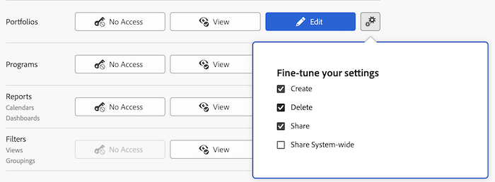

# Accorder l’accès aux portfolios

En tant qu’administrateur ou administratrice Adobe Workfront, vous pouvez utiliser un niveau d’accès pour définir l’accès d’un utilisateur ou d’une utilisatrice aux portfolios, comme expliqué dans la [Vue d’ensemble des niveaux d’accès](../../../administration-and-setup/add-users/access-levels-and-object-permissions/access-levels-overview.md).

## Conditions d’accès

+++ Développez pour afficher les exigences d’accès aux fonctionnalités de cet article.

<table style="table-layout:auto"> 
 <col> 
 <col> 
 <tbody> 
  <tr> 
   <td role="rowheader">Formule Adobe Workfront</td> 
   <td>Tous</td> 
  </tr> 
  <tr> 
   <td role="rowheader">Licence Adobe Workfront</td> 
   <td>
Standard

   
Plan
</td> 
  </tr> 
  <tr> 
   <td role="rowheader">Configurations des niveaux d’accès</td> 
   <td> 
Vous devez être un administrateur ou une administratrice Workfront.
 </td> 
  </tr> 
 </tbody> 
</table>

Pour plus de détails sur les informations contenues dans ce tableau, consultez l’article [Conditions d’accès dans la documentation Workfront](/help/quicksilver/administration-and-setup/add-users/access-levels-and-object-permissions/access-level-requirements-in-documentation.md).

+++

## Configurer l’accès des utilisateurs et utilisatrices aux portfolios à l’aide d’un niveau d’accès personnalisé

1. Commencez à créer ou à modifier le niveau d’accès, comme expliqué dans [Créer ou modifier des niveaux d’accès personnalisés](../../../administration-and-setup/add-users/configure-and-grant-access/create-modify-access-levels.md).
1. Cliquez sur l’icône en forme d’engrenage  sur le bouton **Vue** ou **Modifier** à droite de Portfolios, puis sélectionnez les capacités que vous souhaitez accorder sous **Ajuster vos paramètres**.

   

   >[!NOTE]
   >
   >Lorsque vous configurez un niveau d’accès pour un certain type d’objet, cette configuration n’affecte pas l’accès des utilisateurs et utilisatrices aux objets de rang inférieur. Par exemple, vous pouvez interdire aux utilisateurs et aux utilisatrices de supprimer des portfolios dans leur niveau d’accès, mais cela ne les empêche pas de supprimer des projets, dont le rang est inférieur aux portfolios. Pour plus d’informations sur la hiérarchie des objets, voir la section [Interdépendance et hiérarchie des objets](../../../workfront-basics/navigate-workfront/workfront-navigation/understand-objects.md#understanding-interdependency-and-hierarchy-of-objects) dans l’article [Comprendre les objets dans Adobe Workfront](../../../workfront-basics/navigate-workfront/workfront-navigation/understand-objects.md).

1. (Facultatif) Pour configurer les paramètres d’accès pour d’autres objets et domaines dans le niveau d’accès sur lequel vous travaillez, continuez avec l’un des articles répertoriés dans [Configurer l’accès à Adobe Workfront](../../../administration-and-setup/add-users/configure-and-grant-access/configure-access.md), comme [Accorder l’accès aux tâches](../../../administration-and-setup/add-users/configure-and-grant-access/grant-access-tasks.md) et [Accorder l’accès aux données financières](../../../administration-and-setup/add-users/configure-and-grant-access/grant-access-financial.md).
1. Lorsque vous avez terminé, cliquez sur **Enregistrer**.

   Une fois le niveau d’accès créé, vous pouvez l’attribuer à un utilisateur ou à une utilisatrice. Pour plus d’informations, voir [Modifier le profil d’un utilisateur ou d’une utilisatrice](../../../administration-and-setup/add-users/create-and-manage-users/edit-a-users-profile.md).

## Accéder aux portfolios par type de licence

Pour plus d’informations sur ce que les personnes de chaque niveau d’accès peuvent faire avec les portfolios, voir la section [Portfolios](../../../administration-and-setup/add-users/access-levels-and-object-permissions/functionality-available-for-each-object-type.md#portfoli) dans l’article [Fonctionnalités disponibles pour chaque type d’objet](../../../administration-and-setup/add-users/access-levels-and-object-permissions/functionality-available-for-each-object-type.md).

## Accéder aux portfolios partagés

Lorsque vous possédez ou créez un portfolio, vous pouvez le partager avec d’autres utilisateurs et utilisatrices en leur accordant des autorisations, comme expliqué dans [Partager un portfolio](../../../workfront-basics/grant-and-request-access-to-objects/share-a-portfolio.md).

<!--

If you make changes here, make them also in the "Grant access to" articles where this snippet had to be converted to text:

* reports, dashboards, and calendars

* financial data

* issue

-->

Lorsque vous partagez un objet avec un autre utilisateur ou une autre utilisatrice, les droits des personnes destinataires sur cet objet sont déterminés par une combinaison de deux éléments :

* Les autorisations que vous accordez à votre personne destinataire pour l’objet.
* Les paramètres du niveau d’accès des personnes destinataires pour le type d’objet.

Pour plus d’informations sur les autorisations que les utilisateurs et utilisatrices peuvent accorder pour un portfolio partagé, voir [Partager un portfolio](../../../workfront-basics/grant-and-request-access-to-objects/share-a-portfolio.md).
