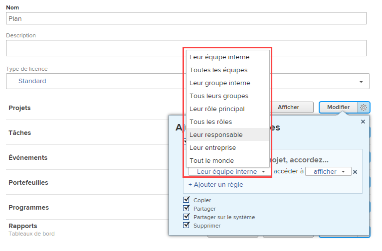

# Accorder l’accès aux projets

<!-- Audited: 12/2023 -->

En tant qu’administrateur ou administratrice Adobe Workfront, vous pouvez utiliser un niveau d’accès pour définir l’accès d’une personne aux projets, comme expliqué dans les articles suivants :

* [Vue d’ensemble des niveaux d’accès](../../../administration-and-setup/add-users/access-levels-and-object-permissions/access-levels-overview.md)
* [Vue d’ensemble des nouveaux niveaux d’accès](/help/quicksilver/administration-and-setup/add-users/how-access-levels-work/access-level-overview.md)

Pour plus d’informations sur l’utilisation des niveaux d’accès personnalisés pour gérer l’accès des personnes à d’autres types d’objets dans Workfront, voir [Créer ou modifier des niveaux d’accès personnalisés](../../../administration-and-setup/add-users/configure-and-grant-access/create-modify-access-levels.md).

## Conditions d’accès

+++ Développez pour afficher les exigences d’accès aux fonctionnalités de cet article.

<table style="table-layout:auto"> 
 <col> 
 <col> 
 <tbody> 
  <tr> 
   <td role="rowheader">Package Adobe Workfront</td> 
   <td>Tous</td> 
  </tr> 
    <tr> 
   <td role="rowheader">Licence Adobe Workfront</td> 
   <td> 
Standard

   
Plan

</td> 
  </tr> 
  <tr> 
   <td role="rowheader">Configurations des niveaux d’accès</td> 
   <td> 
Vous devez être un administrateur ou une administratrice Workfront.
 </td> 
  </tr> 
 </tbody> 
</table>

Pour plus d’informations sur le contenu de ce tableau, voir [Conditions d’accès requises dans la documentation Workfront](/help/quicksilver/administration-and-setup/add-users/access-levels-and-object-permissions/access-level-requirements-in-documentation.md).

+++

## Configurer l’accès des personnes aux projets en utilisant un niveau d’accès personnalisé

1. Commencez à créer ou à modifier le niveau d’accès, comme expliqué dans [Créer ou modifier des niveaux d’accès personnalisés](../../../administration-and-setup/add-users/configure-and-grant-access/create-modify-access-levels.md).
1. Cliquez sur l’icône en forme d’engrenage  sur le bouton **Affichage** ou **Modifier** à droite de Projets, puis sélectionnez les capacités à accorder sous **Ajustez vos paramètres**.

   

   >[!NOTE]
   >
   >* Les personnes disposant d’une licence de travail ont des droits limités sur les projets. Elles peuvent contribuer à un projet, mais pas le gérer.
   >* Les personnes disposant d’une licence de révision ont le droit d’afficher des projets issus de problèmes convertis, mais leurs droits d’affichage sont limités.
   >* Pour plus d’informations sur les autorisations que les personnes peuvent accorder lorsqu&#39;elles partagent des projets avec d’autres personnes, voir [Partager un projet dans Adobe Workfront](../../../workfront-basics/grant-and-request-access-to-objects/share-a-project.md).
   >* Lorsque vous configurez un niveau d’accès pour un certain type d’objet, cette configuration n’affecte pas l’accès des utilisateurs et utilisatrices aux objets de rang inférieur. Par exemple, vous pouvez empêcher les personnes d’effacer des projets dans leur niveau d’accès, mais cela ne les empêche pas d’effacer des tâches, dont le rang est inférieur à celui des projets. Pour plus d’informations sur la hiérarchie des objets, voir la section [Interdépendance et hiérarchie des objets](../../../workfront-basics/navigate-workfront/workfront-navigation/understand-objects.md#understanding-interdependency-and-hierarchy-of-objects) dans l’article [Comprendre les objets dans Adobe Workfront](../../../workfront-basics/navigate-workfront/workfront-navigation/understand-objects.md).
   * Un utilisateur dont le niveau d’accès ne permet pas d’accéder aux données financières ne peut pas accorder un accès qui permettrait à d’autres utilisateurs d’afficher les données financières. Cela inclut l’accès aux projets qui afficheraient des données financières ou la modification d’un niveau d’accès pour permettre l’affichage des données financières.

1. (Facultatif) Cliquez sur **Définir les paramètres de partage par défaut** à droite de l’option Créer, puis sur **Ajouter une règle** pour ajouter une règle de partage pour les nouveaux projets.

   Lorsque la personne ayant ce niveau d’accès crée un projet, celui-ci est automatiquement partagé avec les personnes que vous sélectionnez dans le menu de gauche.

   

   Dans le menu de droite, vous indiquez comment vous souhaitez que le projet soit partagé avec ces personnes :

   

   >[!NOTE]
   >
   >Si une personne ayant ce niveau d’accès utilise un modèle d’accès au projet, le modèle remplace les paramètres de partage du niveau d’accès. Pour plus d’informations sur les modèles d’accès aux projets, voir [Partager un projet dans Adobe Workfront](../../../workfront-basics/grant-and-request-access-to-objects/share-a-project.md).

   Vous pouvez répéter cette étape pour ajouter autant de règles de partage de projet que nécessaire pour le niveau d’accès.

1. Cliquez sur le X pour fermer la case **Affiner vos paramètres**.
1. (Facultatif) Pour configurer les paramètres d’accès pour d’autres objets et domaines dans le niveau d’accès sur lequel vous travaillez, poursuivez avec l’un des articles répertoriés dans [Configurer l’accès à Adobe Workfront](../../../administration-and-setup/add-users/configure-and-grant-access/configure-access.md), tels que [Accorder l’accès aux tâches](../../../administration-and-setup/add-users/configure-and-grant-access/grant-access-tasks.md) et [Accorder l’accès aux données financières](../../../administration-and-setup/add-users/configure-and-grant-access/grant-access-financial.md).
1. Lorsque vous avez terminé, cliquez sur **Enregistrer**.

   Une fois le niveau d’accès créé, vous pouvez l’attribuer à un utilisateur ou à une utilisatrice. Pour plus d’informations, voir [Modifier le profil d’une personne](../../../administration-and-setup/add-users/create-and-manage-users/edit-a-users-profile.md).

## Accéder aux rapports, tableaux de bord et calendriers par type de licence

Pour plus d’informations sur ce que les personnes de chaque niveau d’accès peuvent faire avec les problèms, voir la section [Projets](../../../administration-and-setup/add-users/access-levels-and-object-permissions/functionality-available-for-each-object-type.md#projects) dans l’article [Fonctionnalités disponibles pour chaque type d’objet](../../../administration-and-setup/add-users/access-levels-and-object-permissions/functionality-available-for-each-object-type.md).

## Accéder à des projets partagés

En tant que personne propriétaire ou créatrice d’un problème, vous pouvez le partager avec d’autres personnes en leur accordant des autorisations, comme expliqué dans [Partager un projet dans Adobe Workfront](../../../workfront-basics/grant-and-request-access-to-objects/share-a-project.md).

<!--
If you make changes here, make them also in the "Grant access to" articles where this snippet had to be converted to text:
* reports, dashboards, and calendars
* financial data
* issue
-->

Lorsque vous partagez un objet avec un autre utilisateur ou une autre utilisatrice, les droits des personnes destinataires sur cet objet sont déterminés par une combinaison de deux éléments :

* Les autorisations que vous accordez à votre personne destinataire pour l’objet.
* Les paramètres du niveau d’accès des personnes destinataires pour le type d’objet.
