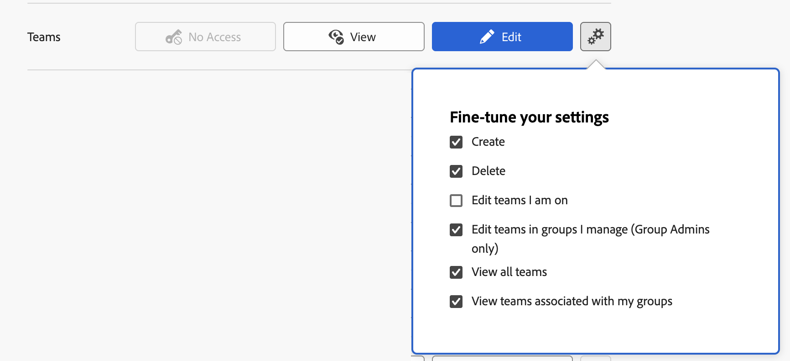

# Accorder l’accès aux équipes

En tant que personne membre de l’administration Adobe Workfront, vous pouvez utiliser un niveau d’accès pour définir l’accès d’utilisation des équipes dans Workfront, comme expliqué dans [Vue d’ensemble des niveaux d’accès](../../../administration-and-setup/add-users/access-levels-and-object-permissions/access-levels-overview.md).

## Conditions d’accès

+++ Développez pour afficher les exigences d’accès aux fonctionnalités de cet article.

<table style="table-layout:auto"> 
 <col> 
 <col> 
 <tbody> 
  <tr> 
   <td role="rowheader">Package Adobe Workfront</td> 
   <td>Tous</td> 
  </tr> 
  <tr> 
   <td role="rowheader">Licence Adobe Workfront</td> 
   <td>
Standard

   
Plan
</td> 
  </tr> 
  <tr> 
   <td role="rowheader">Configurations des niveaux d’accès</td> 
   <td> 
Vous devez être un administrateur ou une administratrice Workfront.
 </td> 
  </tr> 
 </tbody> 
</table>

Pour plus de détails sur les informations contenues dans ce tableau, consultez l’article [Conditions d’accès dans la documentation Workfront](/help/quicksilver/administration-and-setup/add-users/access-levels-and-object-permissions/access-level-requirements-in-documentation.md).

+++

## Configuration de l&#39;accès des utilisateurs pour modifier des équipes à l&#39;aide d&#39;un niveau d&#39;accès personnalisé

1. Commencez à créer ou à modifier le niveau d’accès, comme expliqué dans [Créer ou modifier des niveaux d’accès personnalisés](../../../administration-and-setup/add-users/configure-and-grant-access/create-modify-access-levels.md).
1. Cliquez sur l’icône en forme d’engrenage  sur le bouton **Afficher** ou **Modifier** à droite d’« Équipes », puis sélectionnez les droits que vous souhaitez accorder sous **Ajuster vos paramètres**.

   

   * **Afficher** : si vous configurez la façon dont les utilisateurs et les utilisatrices, quelle que soit leur licence, peuvent afficher les équipes, modifiez l’une des options suivantes :

     <table style="table-layout:auto">
       <col>
       <col>
       <tbody>
        <tr>
         <td role="rowheader">Afficher les équipes associées à mes groupes</td>
         <td>
          
<b>Activé</b> : lorsque les utilisateurs et les utilisatrices recherchent des équipes dans un champ de suggestion automatique « Équipe », les équipes associées à leurs groupes sont visibles, que l’équipe leur soit affectée ou non. 

          
<b>Désactivé</b> : lorsque les utilisateurs et les utilisatrices recherchent des équipes dans un champ de saisie semi-automatique « Équipe », les équipes associées à leurs groupes sont visibles uniquement si elles leur sont affectées.

Cette option est activée par défaut.

          </td>
        </tr>
        <tr>
         <td role="rowheader">Afficher toutes les équipes</td>
         <td>
Lorsque cette option est activée, n’importe quelle équipe peut être affichée et sélectionnée lorsque les utilisateurs et les utilisatrices recherchent des équipes dans un champ de saisie semi-automatique « Équipe ».

Cette option est activée par défaut. 
</td>
        </tr>
       </tbody>
      </table>

   * **Modifier** : si vous configurez la manière dont les utilisateurs disposant d’une licence Standard, Plan ou Travail peuvent gérer les équipes, modifiez l’une des options suivantes :

     <table style="table-layout:auto">
       <col>
       <col>
       <tbody>
        <tr>
         <td role="rowheader">Créer</td>
         <td>
Permet aux utilisateurs disposant d’une licence Standard, Plan ou Travail de créer des équipes.

Cette option est activée par défaut.
</td>
        </tr>
        <tr>
         <td role="rowheader">Supprimer</td>
         <td>
 Permet aux utilisateurs disposant d'une licence Standard ou Plan de supprimer les équipes qu'ils ont accès à modifier (non disponible pour les utilisateurs disposant d'une licence de travail).

Cette option est activée par défaut.
</td>
        </tr>
        <tr>
         <td role="rowheader">Modifier les équipes dans les groupes que je gère (administrateurs de groupe uniquement)</td>
         <td>
Permet aux utilisateurs de licences Standard ou Plan désignés comme administrateurs de groupe de modifier les équipes associées aux groupes qu'ils gèrent.

Cette option est activée par défaut.
</td>
        </tr>
        <tr>
         <td role="rowheader">Modifier les équipes dont je suis membre</td>
         <td>
Permet aux utilisateurs disposant d'une licence Standard, Plan ou Travail de modifier les équipes dont ils sont membres.

Cette option est désactivée par défaut.
</td>
        </tr>
        <tr>
         <td role="rowheader">Afficher les équipes associées à mes groupes</td>
         <td>
         
<b>Activé</b> : lorsque les utilisateurs et les utilisatrices recherchent des équipes dans un champ de suggestion automatique « Équipe », les équipes associées à leurs groupes sont visibles, que l’équipe leur soit affectée ou non. 

         
<b>Désactivé</b> : lorsque les utilisateurs et les utilisatrices recherchent des équipes dans un champ de suggestion automatique « Équipe », les équipes associées à leurs groupes sont visibles uniquement si elles leur sont affectées.

Cette option est activée par défaut.

         </td>
        </tr>
        <tr>
         <td role="rowheader">Afficher toutes les équipes</td>
         <td>
Lorsque cette option est activée, n’importe quelle équipe peut être affichée et sélectionnée lorsque les utilisateurs et les utilisatrices recherchent des équipes dans un champ de saisie semi-automatique « Équipe ».

Cette option est activée par défaut. 
</td>
        </tr>
       </tbody>
      </table>

1. Cliquez sur le X pour fermer la zone **Ajuster vos paramètres**.
1. (Facultatif) Pour configurer les paramètres d’accès pour d’autres objets et domaines dans le niveau d’accès sur lequel vous travaillez, poursuivez avec l’un des articles répertoriés dans [Configurer l’accès à Adobe Workfront](../../../administration-and-setup/add-users/configure-and-grant-access/configure-access.md), tels que [Accorder l’accès aux tâches](../../../administration-and-setup/add-users/configure-and-grant-access/grant-access-tasks.md) et [Accorder l’accès aux données financières](../../../administration-and-setup/add-users/configure-and-grant-access/grant-access-financial.md).
1. Lorsque vous avez terminé, cliquez sur **Enregistrer**.

>[!NOTE]
>
>* Les énoncés suivants sont vrais, quels que soient les paramètres du niveau d’accès :
>
>   * Les personnes propriétaires d’équipes peuvent toujours afficher et modifier leurs équipes.
>   * Les utilisateurs et les utilisatrices ont toujours accès aux équipes qui leur sont affectées.
>
>* La configuration de toute option disponible à la fois pour « Afficher » et pour « Modifier » (telle que « Afficher les équipes associées à mes groupes ») est conservée si vous décidez de sélectionner « Afficher » au lieu de « Modifier » ou « Modifier » au lieu d’« Afficher » dans un niveau d’accès.
>

## Accès aux équipes par type de licence

Pour plus d&#39;informations sur ce que les utilisateurs de chaque niveau d&#39;accès peuvent faire avec les équipes, consultez la section [Équipes](/help/quicksilver/administration-and-setup/add-users/how-access-levels-work/functionality-available-for-objects.md#teams) dans l&#39;article [Fonctionnalité disponible pour chaque type d&#39;objet](/help/quicksilver/administration-and-setup/add-users/how-access-levels-work/functionality-available-for-objects.md).
