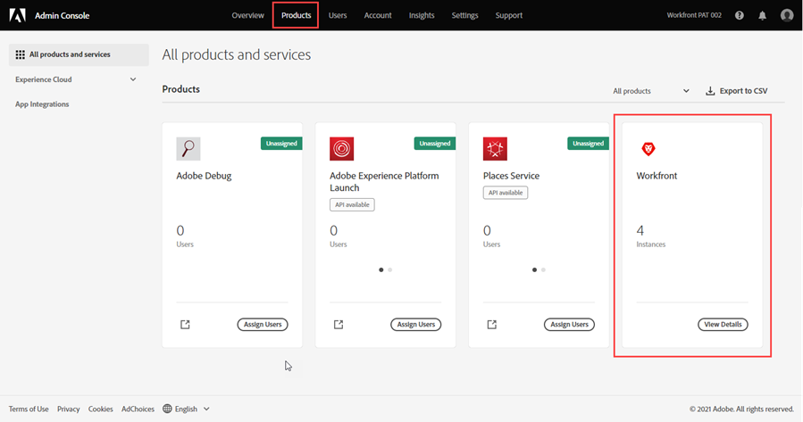
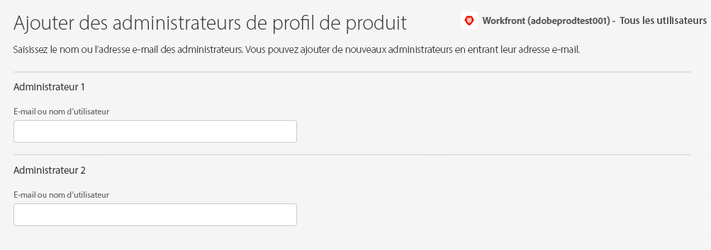

# Gestion des administrateurs système dans Adobe Admin Console

>[!IMPORTANT]
>
>La fonctionnalité de cet article n’est disponible que si l’instance de Workfront de votre entreprise a été intégrée à Adobe Business Platform.
>
>Pour obtenir une liste des procédures qui diffèrent selon que votre organisation a été intégrée à Adobe Business Platform, voir [Différences d’administration en fonction de la plateforme (Adobe Workfront Fusion/Adobe Business Platform)](../../../administration-and-setup/get-started-wf-administration/actions-in-admin-console.md).

En tant qu’administrateur d’Adobe, vous pouvez créer des administrateurs système Adobe Workfront à l’aide de Adobe Admin Console. La console est un emplacement central pour la gestion des droits d’Adobe dans l’ensemble de votre organisation. Pour plus d’informations, consultez la [présentation de l’Admin Console](https://helpx.adobe.com/fr/enterprise/using/admin-console.html).

>[!NOTE]
>
>Nous vous recommandons d’ajouter des utilisateurs qui ne sont pas administrateurs système directement dans Workfront. Il est possible d’ajouter des utilisateurs dans Adobe Admin Console, mais de les ajouter dans Workfront permet de définir leur niveau d’accès lors de leur création, ce qui peut vous faire gagner du temps.

## Conditions d’accès

+++ Développez pour afficher les exigences d’accès aux fonctionnalités de cet article.

Vous devez disposer des accès suivants pour effectuer les étapes de cet article :

<table style="table-layout:auto"> 
 <col> 
 </col> 
 <col> 
 </col> 
 <tbody> 
  <tr> 
   <td role="rowheader">Forfait Adobe Workfront</td> 
   <td>N’importe quelle</td> 
  </tr> 
  <tr> 
   <td role="rowheader">Droits d’administrateur Adobe</td> 
   <td> 
Vous devez être un administrateur de configuration de produit des produits Adobe pour votre entreprise.
 </td> 
  </tr> 
 </tbody> 
</table>

+++

## Conditions préalables

Avant d’utiliser l’Admin Console pour Workfront, vous devriez recevoir un courrier électronique vous invitant à accéder à la console.

1. Si vous êtes nouveau en Adobe et que vous avez reçu un courrier électronique vous indiquant que vous disposez désormais des droits d’administration pour gérer les logiciels et services d’Adobe pour votre entreprise, cliquez sur le bouton de l’e-mail pour créer un compte d’Adobe et ouvrir l’Admin Console.

   Ou

   Si vous disposez déjà d’un compte d’Adobe, accédez à la [page Adobe Admin Console](https://adminconsole.adobe.com/).

## Informations supplémentaires sur Adobe Admin Console

* Les administrateurs système de Workfront peuvent désactiver un utilisateur Workfront depuis Workfront, mais cela ne désactive pas l’utilisateur dans l’Admin Console.

  <!--
  
For information about deactivating a user in Workfront, see 

  -->

* L’utilisateur **Home Group** est déterminé en fonction de l’utilisateur qui l’a créé. Il n’est pas personnalisable dans l’Admin Console.
* Le niveau d’accès Administrateur système Workfront ne peut être modifié que depuis Adobe Admin Console.

  <!--
  DRAFTED IN FLARE:
  How is this done?
  
  -->

* La modification de l’accès d’un utilisateur de l’administrateur système à tout autre niveau d’accès doit d’abord être effectuée par l’Admin Console.

  <!--
   This is not clear
  -->

* Pour supprimer l’accès Administrateur système d’un utilisateur dans Workfront, vous devez utiliser Adobe Admin Console pour supprimer l’utilisateur en tant qu’administrateur de profil de produit. Cela modifie le niveau d’accès Workfront de l’utilisateur, de l’administrateur système à Requestor.

  >[!IMPORTANT]
  >
  >N’apportez aucune modification au profil de produit lui-même.

## Accès à la zone utilisateur et d’administration de votre instance de production de Workfront {#access-the-user-and-admin-area-for-your-production-instance-of-workfront}

1. Sur la [page Adobe Admin Console](https://adminconsole.adobe.com/), sélectionnez l’onglet **Produits** dans la barre de navigation supérieure, puis sélectionnez **Workfront**.

   <!---->

1. Dans la liste qui s’affiche, sélectionnez le lien en haut.

   Il s’agit de votre instance de production où travaillent vos utilisateurs.

   <!---->

   >[!TIP]
   >
   >Le deuxième lien de la liste, votre instance Aperçu, est un environnement de test qui reproduit votre environnement de production actif. Pour plus d’informations, voir [L’environnement Sandbox d’aperçu Adobe Workfront](../../../administration-and-setup/set-up-workfront/workfront-testing-environments/wf-preview-sandbox-environment.md).
   >
   >
   >Vous pouvez également voir des liens vers des environnements de test dans la liste. Pour plus d’informations, voir [L’environnement Sandbox d’aperçu Adobe Workfront](../../../administration-and-setup/set-up-workfront/workfront-testing-environments/wf-preview-sandbox-environment.md).

1. Dans la liste qui s’affiche, avec l’onglet **Profils de produit** sélectionné, cliquez sur le lien Nom du profil de produit Workfront.

   

   Cette liste comprend tous les utilisateurs déjà affectés à votre instance de production de Workfront.

   >[!IMPORTANT]
   >
   >N’apportez aucune modification au profil de produit lui-même.

1. Passez à l’une des sections suivantes de cet article :

   * [Création d’utilisateurs dans Workfront avec Adobe Admin Console](#create-users-in-workfront-with-the-adobe-admin-console)
   * [Création d’administrateurs système dans Workfront avec Adobe Admin Console](#create-system-administrators-in-workfront-with-the-adobe-admin-console)

## Création d’administrateurs système dans Workfront avec Adobe Admin Console {#create-system-administrators-in-workfront-with-the-adobe-admin-console}

<!--Audited: 12/2023-->

Le niveau d’accès Administrateur système n’est accordé que sur Adobe Admin Console. Vous ne pouvez pas accorder ou supprimer l’accès administrateur dans Workfront.

Vous devez ajouter un utilisateur à votre instance de production de Workfront avant de pouvoir en faire un administrateur système Workfront.

1. Accédez à la zone utilisateur et administrateur de l’Admin Console, comme décrit dans la section [Accès à l’utilisateur et à la zone d’administration de votre instance de production de Workfront](#access-the-user-and-admin-area-for-your-production-instance-of-workfront) de cet article.
1. Sélectionnez l’onglet **Admins** situé au-dessus de la liste des utilisateurs.
1. Sélectionnez **Ajouter un administrateur**.
1. Dans la zone **Ajouter les administrateurs de profil de produit**, saisissez les adresses électroniques ou les noms des administrateurs que vous souhaitez ajouter, puis sélectionnez **Enregistrer**.

   

   Les administrateurs système sont créés dans Workfront.

   >[!IMPORTANT]
   >
   >N’apportez aucune modification au profil de produit lui-même.

## Création d’utilisateurs dans Workfront avec Adobe Admin Console {#create-users-in-workfront-with-the-adobe-admin-console}

>[!NOTE]
>
>Nous vous recommandons d’ajouter des utilisateurs qui ne sont pas administrateurs système directement dans Workfront. Il est possible d’ajouter des utilisateurs dans Adobe Admin Console, mais de les ajouter dans Workfront permet de définir leur niveau d’accès lors de leur création, ce qui peut vous faire gagner du temps.

* [Création d’utilisateurs dans Workfront directement dans Adobe Admin Console](#create-users-in-workfront-directly-in-the-adobe-admin-console)
* [Créer des utilisateurs dans Workfront et les approuver pour Adobe Admin Console](#create-users-in-workfront-and-approve-them-for-the-adobe-admin-console)

### Création d’utilisateurs dans Workfront directement dans Adobe Admin Console

1. Accédez à la zone utilisateur et administrateur de l’Admin Console, comme décrit dans la section [Accès à l’utilisateur et à la zone d’administration de votre instance de production de Workfront](#access-the-user-and-admin-area-for-your-production-instance-of-workfront) de cet article.
1. Avec l’onglet **Utilisateurs** sélectionné au-dessus de la liste, sélectionnez **Ajouter un utilisateur**.
1. Dans la zone **Ajouter des utilisateurs à ce profil de produit**, saisissez l’adresse électronique ou le nom d’un utilisateur que vous souhaitez ajouter, puis sélectionnez **Enregistrer**.

   L’utilisateur est créé dans Workfront avec le niveau d’accès du demandeur.

   >[!IMPORTANT]
   >
   >N’apportez aucune modification au profil de produit lui-même.

1. Dans Workfront, modifiez le niveau d’accès de l’utilisateur.

   Pour plus d’informations sur la façon dont un administrateur Workfront peut modifier le niveau d’accès de l’utilisateur, voir [Modification du profil d’un utilisateur](../../../administration-and-setup/add-users/create-and-manage-users/edit-a-users-profile.md).

1. Répétez les étapes 3 et 4 pour ajouter d’autres utilisateurs.

   >[!NOTE]
   >
   >Pour les nouveaux utilisateurs d’Adobe, l’Admin Console envoie un courrier électronique les invitant à terminer le processus d’enregistrement. Tous les utilisateurs doivent terminer le processus d’enregistrement pour accéder à toute application d’Adobe.
   >
   >Pour les utilisateurs et les utilisatrices d’Adobe existants, l’utilisateur ou l’utilisatrice peut recevoir ou non un e-mail sur la disponibilité de Workfront. Il s’agit d’une préférence contrôlée par l’administrateur d’Adobe pour le produit. L’administrateur de votre Adobe peut être une personne différente de votre administrateur Workfront.

### Créer des utilisateurs dans Workfront et les approuver pour Adobe Admin Console

Ce workflow permet aux administrateurs de groupe qui n’ont pas accès à Adobe Admin Console de créer des utilisateurs.

Tout d’abord, l’administrateur de groupe crée l’utilisateur dans Workfront. L’utilisateur est ainsi créé avec les états Désactivé et Autorisation en attente .

Ensuite, un administrateur Workfront approuve l’utilisateur. L’utilisateur est ainsi activé dans Workfront et ajouté à Adobe Admin Console.

#### Création de l’utilisateur dans Workfront (administrateur de groupe)

Pour plus d&#39;informations sur la création d&#39;un utilisateur dans Workfront, voir [Ajout d&#39;utilisateurs](/help/quicksilver/administration-and-setup/add-users/create-and-manage-users/add-users.md).

#### Approuver l’utilisateur (administrateur Workfront)

Pour approuver un utilisateur :

{{step-1-to-users}}

1. Sélectionnez l’utilisateur, puis cliquez sur l’icône **Plus** .

1. Pour approuver l’utilisateur, cliquez sur **Approve**, puis sur **Submit**.

   Ou

   Pour rejeter l’utilisateur et le supprimer de Workfront, cliquez sur **Rejeter**, puis sur **Envoyer**.

   Les utilisateurs approuvés sont automatiquement ajoutés à Adobe Admin Console.

   Les utilisateurs rejetés sont automatiquement supprimés de Workfront.

<!--

&nbsp;

&nbsp;

&nbsp;

You can create Adobe Workfront users and system administrators with the <a href="https://adminconsole.adobe.com/" alt="Admin Console link">Adobe Admin Console</a>. The console is a central location for managing the Adobe entitlements across your organization. For more information, see the <a href="https://helpx.adobe.com/enterprise/using/admin-console.html" alt="Admin Console Overview">Admin Console Overview</a>.

Before using the Admin Console for Workfront, you should receive a receive an email inviting you to the console. Click in the invitation to accept it and create an account. You can also use an existing account, if already available.

<h2>Create users</h2>

Create users in WF with the Adobe admin console

-->

<!--

May need to add something about oging throug WF -- check with Jonah

To create users in Workfront with the Admin Console:

<ol>
<li value="1"> 
From the <a href="https://adminconsole.adobe.com/">Admin Console page</a>, select the <b>Products</b> tab and then select the <b>Workfront</b> product tile.
 </li>
<li value="2"> 
Select the link to the Workfront instance you want to change.
 </li>
<li value="3"> 
Select the Product profile link. This shows a list of the currently-assigned users. If the list is very long, you can also search for users in the search field above the list.
 </li>
<li value="4"> 
Select the <b>Add User</b> button.
 </li>
<li value="5"> 
In the <b>Add users</b> box, enter the email address or name of the user you want to add. Select <b>Save</b>. The administrator is created in Workfront with <b>Requestor</b> access level.
 </li>
</ol>
<h2>Create system administrators</h2>

To create system administrators:

<ol>
<li value="1"> 
Make product profile assignments first. To be a Workfront System Administrator, the user must be assigned the Workfront product profile and be an admin for that product profile.
 </li>
<li value="2"> 
From the console, select the <b>Products</b> tab and then select the <b>Admins</b> tab. 
 </li>
<li value="3"> 
Select <b>Add Admin</b>.
 </li>
<li value="4"> 
In the <b>Add product profile administrators</b> box, enter the email address or name of the administrator you want to add. Select <b>Save</b>. The user is created in Workfront with <b>Requestor</b> access level.
 </li>
</ol>
<h2>Additional details for the Admin Console</h2>
<ul>
<li> 
System Administrator access level is granted only on the Admin Console. You cannot grant or remove admin access from within Workfront.
 </li>
</ul>
<ul>
<li> 
Creating and deleting users inside Workfront is only possible through the Admin Console.
 </li>
<li> 
Workfront System Administrators can deactivate Workfront users from within Workfront, but this does not deactivate the user in the Admin Console.
 </li>
<li> 
All new users are are assigned <b>Requestor</b> access level upon creation. Also, the user <b>Home Group</b> is determined based on the user who created them. This is currently not customizable from within the Admin Console.
 </li>
<li> 
The Workfront System Administrator access level can only be edited from within the Adobe Admin Console.
 </li>
<li> 
Editing a user who is a system admin to any other access level must be done through the Admin Console first.
 </li>
<li> 
To remove Workfront system admin access, remove users as Product Profile Administrators. This action changes the user access level in Workfront from a system admin to a <b>Requestor</b>.
 </li>
</ul>

-->
