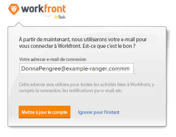

# Modification du mot de passe d’un utilisateur muni d’un profil d’approvisionnement automatique

Lorsque vous créez des utilisateurs par le biais de l’attribution automatique, Adobe Workfront leur attribue un GUID (Globally Unique Identifier) pour un nom d’utilisateur. Un GUID est une chaîne unique de nombres et de lettres aléatoires, par exemple : *5489cb430012526e1ea635e8c29f377f*.

Souvent, lorsqu’un nouvel utilisateur tente de modifier son mot de passe temporaire, il saisit son adresse électronique pour son nom d’utilisateur et reçoit une erreur pour un nom d’utilisateur incorrect. Pour que l’utilisateur puisse modifier son mot de passe, il doit saisir son nom d’utilisateur attribué par le système, qui est un GUID.

Comme les noms d’utilisateur du GUID peuvent être difficiles à utiliser, nous vous recommandons d’abord de remplacer le nom d’utilisateur par son adresse électronique Workfront, puis de leur permettre de modifier leur mot de passe.

>[!TIP]
>
>Le GUID d’un utilisateur se présente comme suit :
>
>* Accédez au profil de l’utilisateur et copiez le GUID à partir de l’URL de votre navigateur.
>
>  Par exemple, dans l’URL `https://acme.workfront.com/user/61941ab1000af22d7104628efa1c738b/details`, vous copiez la chaîne de nombres et de lettres entre les deux dernières barres obliques : `61941ab1000af22d7104628efa1c738b`.
>
>  Pour plus d’informations, voir [Modification du profil d’un utilisateur](../../../administration-and-setup/add-users/create-and-manage-users/edit-a-users-profile.md).
>
>* Créez un rapport utilisateur avec une colonne Utilisateur > GUID . Pour plus d’informations, voir [Créer un rapport](../../../reports-and-dashboards/reports/creating-and-managing-reports/create-report.md).
>
>* Interrogez l’API Workfront.
>


## Exigences d’accès

Vous devez disposer des accès suivants pour effectuer les étapes de cet article :

<table style="table-layout:auto"> 
 <col> 
 <col> 
 <tbody> 
  <tr> 
   <td role="rowheader">Formule Adobe Workfront</td> 
   <td>Tous</td> 
  </tr> 
  <tr> 
   <td role="rowheader">Licence Adobe Workfront</td> 
   <td>Plan</td> 
  </tr> 
  <tr> 
   <td role="rowheader">Paramétrages du niveau d'accès</td> 
   <td> <p>Vous devez être un administrateur Workfront.</p> <p><b>REMARQUE</b>: Si vous n’avez toujours pas accès à , demandez à votre administrateur Workfront s’il définit des restrictions supplémentaires à votre niveau d’accès. Pour plus d’informations sur la façon dont un administrateur Workfront peut modifier votre niveau d’accès, voir <a href="../../../administration-and-setup/add-users/configure-and-grant-access/create-modify-access-levels.md" class="MCXref xref">Création ou modification de niveaux d’accès personnalisés</a>.</p> </td> 
  </tr> 
 </tbody> 
</table>

## Modification du mot de passe d’un utilisateur muni d’un profil d’approvisionnement automatique

1. Déterminez le nom d’utilisateur du GUID d’un utilisateur en transmettant une requête API, comme illustré dans l’exemple suivant :

   https://`<domain>`.my.workfront.com/attask/api/v14.0/USER/search?fields=username&amp;ID=`<ID of User>` Où *`<domain>`* correspond au domaine de votre société et *`<ID of User>`* est l’Workfront ID de l’utilisateur.

   Vous recevez une réponse similaire à celle-ci :

   

   Le retour de &quot;nom d’utilisateur&quot; est le GUID de l’utilisateur.

1. En utilisant leur GUID comme nom d’utilisateur, modifiez le mot de passe de l’utilisateur.

   Pour plus d’informations sur la modification de votre mot de passe, voir [Réinitialisation de votre mot de passe](../../../workfront-basics/manage-your-account-and-profile/managing-your-workfront-account/reset-your-password.md).

   Si votre entreprise utilise un système d’authentification unique, seul un administrateur système Workfront peut modifier le mot de passe d’un utilisateur. Pour plus d’informations, voir [Présentation de l’authentification unique dans Adobe Workfront](../../../administration-and-setup/add-users/single-sign-on/sso-in-workfront.md)

1. Une fois l’utilisateur connecté à Workfront, accédez à :

```
   https://<your domain>.my.workfront.com/login/convertUsername
```

1. Dans le **Adresse électronique de connexion** , vérifiez que l’adresse électronique de l’utilisateur est correcte, puis cliquez sur **Mettre à jour le compte**.

   

   Le nom d’utilisateur de l’utilisateur est remplacé par son adresse électronique Workfront.

>[!TIP]
>
>Pour rechercher l’identifiant d’un utilisateur :
>
>1. Cliquez sur le bouton **Menu Principal** icon  dans le coin supérieur droit d’Adobe Workfront, puis cliquez sur **Utilisateurs** .
>
>1. Sélectionnez l’utilisateur.
>
>   La page de profil de l’utilisateur s’ouvre et son identifiant s’affiche dans l’URL.
