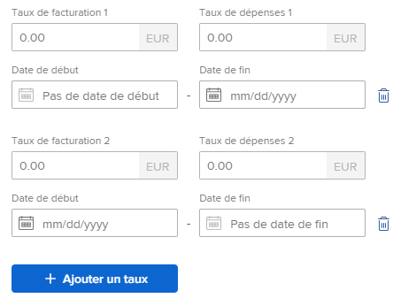

# Modifier le profil d’un utilisateur ou d’une utilisatrice

{{highlighted-preview}}

<!--

>[!IMPORTANT]
>
>The procedure described on this page applies only to organizations that have not yet been onboarded to the Admin Console. If your organization has been onboarded to the Adobe Admin Console, you must perform this action through the Adobe Admin Console.
>
>For instructions on editing a user's profile in the Adobe Admin Console, see the section "Edit user details" in the article [Manage users individually](https://helpx.adobe.com/enterprise/using/manage-users-individually.html) or contact your Adobe Admin Console Administrator.
>
>For a list of procedures that differ based on whether your organization has been onboarded to the Adobe Admin Console, see [Platform-based administration differences (Adobe Workfront/Adobe Business Platform)](../../../administration-and-setup/get-started-wf-administration/actions-in-admin-console.md).
-->

En tant qu’administrateur ou administratrice Adobe Workfront, vous pouvez créer des utilisateurs et utilisatrices et gérer les profils existants. Pour plus d’informations sur la création d’utilisateurs et utilisatrices, voir [Ajouter des utilisateurs et utilisatrices](../../../administration-and-setup/add-users/create-and-manage-users/add-users.md).

Pour plus d’informations sur les utilisateurs qui mettent à jour leur propre profil, voir [Configurer mes paramètres](/help/quicksilver/workfront-basics/manage-your-account-and-profile/configuring-your-user-profile/configure-my-settings.md).

## Conditions d’accès

+++ Développez pour afficher les exigences d’accès aux fonctionnalités de cet article.

Vous devez disposer des accès suivants pour effectuer les étapes décrites dans cet article :

<table style="table-layout:auto"> 
 <col> 
 <col> 
 <tbody> 
  <tr> 
   <td role="rowheader">Formule Adobe Workfront</td> 
   <td>Tous</td> 
  </tr> 
  <tr> 
   <td role="rowheader">Licence Adobe Workfront</td> 
   <td>
Nouveau : Standard

Ou

Actuel : formule
</td> 
  </tr> 
  <tr> 
   <td role="rowheader">Configurations des niveaux d’accès</td> 
   <td> 
Vous devez disposer de l’une des autorisations suivantes :
 
    <ul> 
     <li> 
Niveau d’accès de l’administrateur système. </li> 
     <li> 
Le paramètre <b>Utilisateurs et utilisatrices</b> de votre niveau d’accès doit être configuré sur l’accès <b>Modifier</b>, avec l’option <b>Créer</b> et au moins l’une des deux options d’<b>Administration des utilisateurs et utilisatrices</b> activées dans <b>Ajuster vos paramètres</b> . 
 
De ces deux options, si l’option <b>Administration des utilisateurs (utilisateurs du groupe)</b> est activée, vous devez être un administrateur de groupe d’un groupe dont l’utilisateur est membre.
 </li> 
    </ul> </td> 
  </tr> 
 </tbody> 
</table>

Pour plus de détails sur les informations contenues dans ce tableau, consultez [Conditions d’accès préalables dans la documentation Workfront](/help/quicksilver/administration-and-setup/add-users/access-levels-and-object-permissions/access-level-requirements-in-documentation.md).

+++

## Modifier un profil utilisateur

{{step-1-to-users}}

1. Sélectionnez l’utilisateur, puis cliquez sur l’icône **Modifier** .

   La zone Modifier l’utilisateur ou l’utilisatrice s’affiche.

1. Dans la zone **Modifier l’utilisateur**, modifiez les informations de l’une des sections, puis cliquez sur **Enregistrer** à tout moment.

### Infos personnelles

* **Prénom**
* **Nom**

  >[!NOTE]
  >
  >La modification du nom d’un utilisateur dans Workfront ne modifie pas son nom dans Adobe Admin Console.

* **Adresse e-mail** : l’adresse e-mail d’un utilisateur est également son nom d’utilisateur dans Workfront. Ce champ est sensible à la casse et doit être unique. Si un utilisateur ou une utilisatrice tente d’ajouter une adresse e-mail non unique trois fois en moins de 10 minutes, une réponse reCAPTCHA s’affiche.

  Sélectionnez **Je ne suis pas un robot** pour pouvoir continuer.

  Si vous utilisez la liste autorisée d’e-mails et que vous saisissez un domaine d’e-mail qui ne figure pas dans la liste, l’utilisateur ou l’utilisatrice ne recevra pas de notifications par e-mail. Pour plus d’informations sur la liste autorisée, voir [Configurer votre liste autorisée d’e-mails](/help/quicksilver/administration-and-setup/get-started-wf-administration/configure-your-email-allowlist.md).

  Si votre organisation a été migrée vers Adobe Admin Console, vous ne pouvez pas modifier l’adresse e-mail d’un utilisateur dans Workfront. L’adresse e-mail de l’utilisateur est définie dans le Adobe Admin Console.

* **Modifier le mot de passe** : cliquez sur ce bouton pour réinitialiser le mot de passe de l’utilisateur. Vous devez saisir votre propre mot de passe avant de pouvoir réinitialiser le mot de passe d’un autre utilisateur ou d’une autre utilisatrice.

  Pour réinitialiser le mot de passe d’une autre personne, vous devez être administrateur ou administratrice Workfront ou de groupes.

  Si vous êtes administrateur ou administratrice de groupes, vous ne pouvez réinitialiser les mots de passe que des personnes membres des groupes que vous administrez. En outre, l’autorisation Administration des utilisateurs et utilisatrices (utilisateurs et utilisatrices de groupe) doit être activée dans votre niveau d’accès :

  

  Ce paramètre est désactivé par défaut. Pour plus d’informations, voir [Créer ou modifier des niveaux d’accès personnalisés](/help/quicksilver/administration-and-setup/add-users/configure-and-grant-access/create-modify-access-levels.md).

  Vous ne pouvez pas réinitialiser le mot de passe d’un administrateur ou d’une administratrice Workfront.

* **&lt;SSO Configuration> Nom d’utilisateur ou d’utilisatrice** : si votre équipe d’administration Workfront a activé une intégration SSO avec Workfront, le nom d’utilisateur ou d’utilisatrice SSO s’affiche dans ce champ. Le type de configuration SSO activé pour votre instance Workfront apparaît dans ce champ.
* **Autoriser l’authentification &lt;SSO Configuration> uniquement** : si votre équipe d’aministration Workfront a activé une intégration SSO avec Workfront et mis à jour tous les utilisateurs et utilisatrices pour la SSO, ce champ est sélectionné par défaut. Le type de configuration SSO activé pour votre instance Workfront apparaît dans ce champ.

  Lorsque ce champ est sélectionné, l’utilisateur ou l’utilisatrice doit se connecter à Workfront avec ses informations d’identification SSO. Si vous la décochez, les utilisateurs et utilisatrices pourront se connecter à Workfront avec leurs informations d’identification Workfront.

  Pour plus d’informations sur la configuration de Workfront avec une solution SSO, voir [Présentation de l’authentification unique dans Adobe Workfront](/help/quicksilver/administration-and-setup/add-users/single-sign-on/sso-in-workfront.md).

  Pour plus d’informations sur la mise à jour des utilisateurs et utilisatrices pour SSO, voir [Mettre à jour des utilisateurs et utilisatrices pour l’authentification unique](/help/quicksilver/administration-and-setup/add-users/single-sign-on/update-users-sso.md).

  >[!NOTE]
  >
  >Si vous êtes administrateur ou administratrice de groupes, vous pouvez modifier les champs &lt;SSO Configuration> uniquement pour les utilisateurs et utilisatrices des groupes que vous administrez. En outre, l’autorisation Administration des utilisateurs et utilisatrices (utilisateurs et utilisatrices du groupe) doit être activée dans votre niveau d’accès.
  >
  >Si vous êtes administrateur ou administratrice de groupes et que l’autorisation Administration des utilisateurs et utilisatrices (tous les utilisateurs et utilisatrices) est activée dans votre niveau d’accès, vous pouvez modifier les champs &lt;SSO Configuration> pour tous les utilisateurs et toutes les utilisatrices.

* **Photo de profil** : cliquez sur **Charger nouveau** pour charger la photo de profil de l’utilisateur. Vous pouvez charger un fichier JPG, GIF ou PNG. La limite de taille de fichier est de 4 Mo.

  L’image de profil devient l’avatar de l’utilisateur et elle est visible dans tout le système Workfront, quel que soit l’endroit où le nom d’utilisateur est affiché.

* **Informations sur le poste** : informations sur le poste, comme le titre du poste (dans le champ **Titre**) et le domaine d’expertise dont l’utilisateur est responsable (dans le champ **Me parler de**).
* **Informations de contact** : numéro de téléphone de l’utilisateur (dans la zone **Numéro de téléphone**, **Ext.** et **Champs du numéro de mobile**) et l’adresse (dans les champs **Adresse**, **Ville**, **État**, **Code postal** et **Pays**).

  Si Unified User Management (UUM) ou Adobe Identity Management System (IMS) sont activés pour l’utilisateur ou l’utilisatrice, le champ **Pays** dans la section Coordonnées accepte uniquement les valeurs de code de pays (par exemple, US, GB, IN).

### Préférences

* **Fuseau horaire** : fuseau horaire de l’utilisateur.

  Pour plus d’informations sur l’aide apportée aux utilisateurs et utilisatrices par le biais de Workfront dans les différents fuseaux horaires, voir [Utilisation des fuseaux horaires](/help/quicksilver/workfront-basics/tips-tricks-and-troubleshooting/working-across-timezones.md).

* **Locale d’e-mail** : paramètres régionaux d’e-mails préférés des utilisateurs et utilisatrices. Cela affecte le format des nombres et des dates dans les e-mails envoyés par Workfront à cet utilisateur ou cette utilisatrice.

  >[!NOTE]
  >
  >Lorsque votre organisation utilise l’expérience unifiée Adobe, les préférences linguistiques de l’utilisateur sont stockées dans son profil Adobe et les paramètres régionaux des e-mails ne sont pas utilisés. Pour plus d’informations sur l’accès à ces préférences, voir [Expérience unifiée Adobe pour Workfront](/help/quicksilver/workfront-basics/navigate-workfront/workfront-navigation/adobe-unified-experience.md).

* **Recevoir des e-mails de cet environnement de test** : cochez cette option si vous souhaitez recevoir des notifications par e-mail de l’environnement actuellement connecté.

  >[!NOTE]
  >
  >Cette option n’est actuellement disponible que dans les environnements Prévisualisation et Sandbox. Par défaut, les notifications par e-mail sont activées dans l’environnement de production.

* **Définir automatiquement la tâche sur En cours lorsque les tâches sont auto-affectées** : lorsque cette option est sélectionnée, le travail que l’utilisateur auto-affecte est automatiquement défini sur le statut En cours au lieu de Nouveau.

* **Générer automatiquement des épreuves lors du chargement de documents** : cochez cette option si vous souhaitez que les documents que l’utilisateur ou l’utilisatrice charge génèrent immédiatement une épreuve.

### Notifications

Sélectionnez les notifications par e-mail qui doivent être activées pour le nouvel utilisateur.

Vous pouvez sélectionner des notifications instantanées ou une synthèse des notifications quotidienne.

Pour plus d’informations, voir [Configurer les notifications d’événements pour tous les utilisateurs et utilisatrices du système](/help/quicksilver/administration-and-setup/manage-workfront/emails/configure-event-notifications-for-everyone-in-the-system.md).

### Accès

* **L’utilisateur est actif** : activez cette option pour indiquer que l’utilisateur est actif. Les utilisateurs et utilisatrices actifs utilisent une licence Workfront. La désactivation du champ désactive l’utilisateur et l’empêche de se connecter à Workfront.

* **Niveau d’accès** : sélectionnez le niveau d’accès à affecter à cet utilisateur.

  Lorsque vous attribuez un niveau d’accès à un utilisateur, vous pouvez attribuer un niveau égal ou inférieur à votre propre niveau d’accès. (Par exemple, si votre niveau d&#39;accès est Standard, vous ne pouvez pas attribuer le niveau d&#39;accès Administrateur.)

  Cependant, vous ne pouvez pas attribuer un niveau d’accès inférieur par défaut à votre propre niveau d’accès si l’administrateur ou l’administratrice Workfront a activé des autorisations autres que les autorisations par défaut au niveau d’accès qui ne sont pas également activées dans votre propre niveau d’accès.

  Par exemple, si vous possédez une licence Standard sans accès pour supprimer des tâches, vous ne pouvez pas attribuer à quelqu&#39;un une licence light avec accès pour supprimer des tâches, bien que la licence light soit inférieure à la licence standard. Pour plus d’informations, voir la section [Créer ou modifier des niveaux d’accès personnalisés](/help/quicksilver/administration-and-setup/add-users/configure-and-grant-access/create-modify-access-levels.md).

  Pour plus d’informations sur les niveaux d’accès, voir [Configurer l’accès à Adobe Workfront](/help/quicksilver/administration-and-setup/add-users/configure-and-grant-access/configure-access.md).

  >[!NOTE]
  >
  >Si votre entreprise utilise le nouveau modèle d’accès (Standard/Light/Contributeur ou Contributrice), vous ne pouvez pas réaffecter un utilisateur Standard ou Light à un niveau d’accès Contributeur ou Contributrice si cet utilisateur ou cette utilisatrice a déjà atteint sa limite de décision pour le mois.
  >
  >Pour plus d’informations sur le nouveau modèle d’accès, voir [Vue d’ensemble des nouveaux niveaux d’accès](/help/quicksilver/administration-and-setup/add-users/how-access-levels-work/access-level-overview.md).
  >
  >Pour plus d’informations sur les limites de décision, voir [Vue d’ensemble du statut de décision limitée des documents et de l’épreuve pour les utilisateurs et utilisatrices non payants](/help/quicksilver/review-and-approve-work/proof-doc-decision-limits.md).

* **Modèle de mise en page** : sélectionnez un modèle de mise en page pour l’utilisateur. ce modèle de mise en page est prioritaire sur tout modèle de mise en page affecté au groupe principal, à l’équipe interne ou au rôle de Principal de l’utilisateur. Pour plus d’informations sur la priorité d’affectation des modèles de mise en page, voir [Création et gestion des modèles de mise en page](/help/quicksilver/administration-and-setup/customize-workfront/use-layout-templates/create-and-manage-layout-templates.md).

  La liste suivante décrit la manière dont la liste des modèles disponibles dans ce champ dépend de votre accès :

   * En tant qu’administrateur ou administratrice Workfront, vous pouvez consulter tous les modèles de mise en page au niveau du système et du groupe.
   * En tant qu’administrateur ou administratrice de groupes, vous pouvez voir le modèle de mise en page au niveau du système, ainsi que ceux associés aux groupes que vous gérez.
   * Les utilisateurs disposant d’une licence Standard ou Plan et ayant accès à la modification d’utilisateurs ne peuvent afficher que des modèles de mise en page au niveau du système.

     Pour plus d’informations sur les modèles de mise en page au niveau du groupe, voir [Création et modification de modèles de mise en page d’un groupe](/help/quicksilver/administration-and-setup/manage-groups/work-with-group-objects/create-and-modify-a-groups-layout-templates.md).

### Organisation

* **Entreprise** : entreprise des utilisateurs et utilisatrices. Les personnes ne peuvent être associées qu’à une seule entreprise. Vous devez créer une entreprise avant de pouvoir l’associer à une personne. Seules les entreprises actives sont affichées dans la liste. Pour plus d’informations sur la création d’entreprises, voir [Créer et modifier des entreprises](/help/quicksilver/administration-and-setup/set-up-workfront/organizational-setup/create-and-edit-companies.md).
* **Rend compte à** : si vous avez spécifié une société pour l’utilisateur, vous pouvez également spécifier le responsable direct de l’utilisateur dans ce champ. Un utilisateur ou une utilisatrice ne peut avoir qu’une seule personne responsable. Ce champ ne s’affiche pas si l’utilisateur ou utilisatrice n’est pas d’abord associé à une entreprise.
* **Rapports directs** : si vous avez spécifié une société pour l’utilisateur, vous pouvez également spécifier les rapports directs de l’utilisateur. Un utilisateur ou une utilisatrice peut avoir plusieurs rapports directs. Ce champ ne s’affiche pas si l’utilisateur ou utilisatrice n’est pas d’abord associé à une entreprise.
* **Équipe principale** : indiquez l’équipe principale de l’utilisateur ou utilisatrice. Les personnes ne peuvent avoir qu’une seule équipe principale. L’équipe principale est importante lors de l’attribution d’un modèle de mise en page ou de la définition du bouton Travailler sur ce projet pour les tâches et les problèmes affectés à l’utilisateur ou à l’utilisatrice.
* **Autres équipes** : les personnes peuvent appartenir à plusieurs équipes. Un utilisateur ou une utilisatrice peut afficher les éléments de travail affectés à l’une de ses équipes dans sa zone d’accueil.
* **Groupe principal actuel** : sélectionnez un groupe approprié pour affecter l’utilisateur. La personne peut ainsi accéder aux objets partagés avec le groupe. Vous pouvez également partager des modèles de mise en page avec le groupe principal de l’utilisateur ou de l’utilisatrice.

  Champ obligatoire. Chaque utilisateur et utilisatrice doit être associé à un groupe principal. Si vous n’en sélectionnez pas un, votre groupe principal est affecté comme groupe principal du nouvel utilisateur.

  Vous ne pouvez affecter un groupe à une personne que si l’une des conditions suivantes est vraie :

   * Vous êtes un administrateur ou une administratrice Workfront.
   * Vous êtes l’administrateur ou l’administratrice du groupe.
   * le groupe est public

* **Autres groupes** : les personnes peuvent appartenir à plusieurs groupes. Vous ne pouvez affecter un groupe à un utilisateur ou une utilisatrice que si vous êtes un administrateur ou une administratrice Workfront, que si vous êtes administrateur ou administratrice du groupe ou que si le groupe est public.

  >[!IMPORTANT]
  >
  >L’ajout d’une personne à plus de 100 groupes peut entraîner des problèmes de performances dans n’importe quelle zone de Workfront qui charge la liste des groupes.

  Pour plus d’informations sur les groupes publics, voir [Créer un groupe](/help/quicksilver/administration-and-setup/manage-groups/create-and-manage-groups/create-a-group.md).

  Pour plus d’informations sur les groupes, voir [Vue d’ensemble des groupes](/help/quicksilver/administration-and-setup/manage-groups/groups-overview/groups.md).

### Planification des ressources

* **Temps de travail** : représente le pourcentage du temps équivalent temps plein (FTE) que la personne peut consacrer au travail effectif, hors durée supplémentaire. Le temps de travail doit être un nombre décimal inférieur ou égal à 1 et ne peut pas être égal à 0. Par exemple, une disponibilité de 20 % pour le travail effectif serait de 0,2.

  La valeur par défaut de ce champ est 1, ce qui indique que la personne consacre la totalité de son équivalent temps complet au travail réel lié au projet.

  Le système utilise ce nombre pour calculer la disponibilité de la personne quant au travail réel lié au projet.

  Pour plus d’informations sur la création de plannings dans Workfront, voir [Créer un planning](/help/quicksilver/administration-and-setup/set-up-workfront/configure-timesheets-schedules/create-schedules.md).

  Les exceptions au planning et les congés peuvent également affecter la capacité de la personne.

  Workfront calcule la disponibilité d’une personne en fonction des préférences de gestion des ressources dans votre zone de configuration. Pour plus d’informations, voir [Configurer les préférences de gestion des ressources](/help/quicksilver/administration-and-setup/set-up-workfront/configure-system-defaults/configure-resource-mgmt-preferences.md).

  >[!TIP]
  >
  >Définissez la valeur Temps de travail sur 1 pour indiquer que la personne est disponible pour effectuer le travail lié au projet pendant la totalité de son équivalent temps plein.

* **Définir la date de désactivation** : cliquez sur ce bouton si vous souhaitez planifier la désactivation de cet utilisateur à une certaine date et à une certaine heure.
* **Date de désactivation** : date et heure auxquelles l’utilisateur ou l’utilisatrice est désactivé(e). Pour plus d’informations sur la planification de la désactivation d’utilisateurs, voir [ Planification de la désactivation d’utilisateurs ](/help/quicksilver/administration-and-setup/add-users/create-and-manage-users/deactivate-a-user.md#schedule-users-for-deactivation) dans [ Désactiver ou réactiver un utilisateur ](/help/quicksilver/administration-and-setup/add-users/create-and-manage-users/deactivate-a-user.md).
* **Rôle principal** : le rôle principal de tâche que l’utilisateur ou l’utilisatrice peut remplir dans Workfront. Chaque tâche et chaque problème affecté à un utilisateur ou à une utilisatrice est également affecté à cette fonction. Les fonctions sont essentielles à la gestion des ressources. Vous ne pouvez mettre à jour ce champ que si vous disposez d’une licence Standard ou Plan avec un accès utilisateur administratif ou si vous êtes un administrateur Workfront. Pour plus d’informations sur la configuration des utilisateurs et des utilisatrices disposant d’un accès d’administration, consultez la section [Accorder un accès aux utilisateurs et aux utilisatrices](/help/quicksilver/administration-and-setup/add-users/configure-and-grant-access/grant-access-other-users.md).

  Seules les fonctions actives s’affichent dans la liste.

* (Facultatif) Si vous avez sélectionné un **Rôle principal**, le champ **Pourcentage de disponibilité équivalent temps complet** s’affiche. Indiquez le pourcentage de temps du planning de l’utilisateur ou de l’utilisatrice affecté à cette fonction. La valeur par défaut du pourcentage de disponibilité équivalent temps complet pour le rôle principal est de 100 %.
* **Autres fonctions** : un utilisateur ou une utilisatrice peut avoir plusieurs fonctions dans Workfront. Les fonctions sont essentielles à la gestion des ressources. Une personne peut remplir un nombre illimité de fonctions. Toutefois, nous recommandons de ne pas affecter un nombre excessivement élevé de fonctions à une personne, car la gestion des ressources pourrait devenir trop complexe pour ces personnes.

  Seules les fonctions actives s’affichent dans la liste. Pour plus d’informations sur les fonctions, consultez la section [Créer et gérer des fonctions](/help/quicksilver/administration-and-setup/set-up-workfront/organizational-setup/create-manage-job-roles.md).

  Vous ne pouvez mettre à jour ce champ que si vous disposez d’une licence Standard ou Plan avec un accès utilisateur administratif ou si vous êtes un administrateur Workfront.

  Pour plus d’informations sur la configuration des utilisateurs et utilisatrices disposant d’un accès administratif, consultez la section [Accorder l’accès aux utilisateurs et utilisatrices](/help/quicksilver/administration-and-setup/add-users/configure-and-grant-access/grant-access-other-users.md).

* (Le cas échéant) Si vous avez sélectionné une ou plusieurs **Autres fonctions**, le champ **Pourcentage de disponibilité de temps complet** s’affiche pour chaque fonction. Indiquez le pourcentage de temps du planning de l’utilisateur ou de l’utilisatrice affecté à chaque fonction. La valeur par défaut du pourcentage de disponibilité équivalent temps complet pour les autres rôles est de 0 %.

  si d’autres rôles ont une disponibilité équivalent temps complet de 0 %, ils ne s’affichent pas dans le planificateur de ressources, sauf si ces rôles comprennent des tâches affectées à la personne.

  

  La somme de tous les **pourcentages de disponibilité de l’équivalent temps complet** pour toutes les fonctions, doit être égale à 100 %. Chaque pourcentage de disponibilité équivalent temps complet calcule les heures disponibles pour chaque rôle par personne dans le planificateur de ressources. Les heures disponibles pour chaque rôle par personne dépendent du temps disponible pour la personne.

  Le temps disponible pour la personne est calculé par Workfront en fonction de la méthode sélectionnée par l’administration Workfront pour calculer l’équivalent temps complet dans les préférences de gestion des ressources.

  Pour plus d’informations sur le calcul de la disponibilité de l’utilisateur ou de l’utilisatrice, consultez la section [Vue d’ensemble du calcul des heures et de l’équivalent temps complet pour les utilisateurs et les utilisatrices et les fonctions dans le planificateur de ressources](/help/quicksilver/resource-mgmt/resource-planning/calculate-hours-fte-for-users-roles-resource-planner.md).

  Pour plus d’informations sur la configuration des préférences de gestion des ressources, consultez la section [Configurer les préférences de gestion des ressources](/help/quicksilver/administration-and-setup/set-up-workfront/configure-system-defaults/configure-resource-mgmt-preferences.md).

  (Facultatif) Date à laquelle les affectations de fonction effectives sont utilisées dans les calculs financiers si la fonction de l&#39;utilisateur change au cours d&#39;un projet.

  Cliquez sur **Définir les rôles par date**, sélectionnez le **rôle de Principal** et **autres rôles**, puis saisissez le pourcentage d’affectation pour chaque rôle. Les fonctions peuvent être les mêmes que les fonctions existantes (en utilisant des pourcentages différents), ou de nouvelles fonctions. Sélectionnez la Date de début à laquelle ces rôles deviennent actifs. Il peut s’agir d’une date future. Lorsque les nouveaux rôles deviennent actifs, vous pouvez cliquer sur **Afficher les rôles précédents** pour afficher les rôles précédents inactifs.

* **Planning** : associer un planning à l’utilisateur ou à l’utilisatrice. Le planning de l’utilisateur ou de l’utilisatrice calcule la chronologie des tâches qui lui sont affectées.

  Vous devez créer un planning avant de pouvoir l’associer à un utilisateur ou à une utilisatrice. Pour plus d’informations sur la création de plannings, consultez la section [Créer un planning](/help/quicksilver/administration-and-setup/set-up-workfront/configure-timesheets-schedules/create-schedules.md).

  >[!NOTE]
  >
  >Il est recommandé que la planification que vous associez à l&#39;utilisateur corresponde à son fuseau horaire.

  >[!IMPORTANT]
  >
  >Workfront utilise la planification d’un utilisateur uniquement lorsque le paramètre **Calculer la disponibilité des ressources à l’aide de** est défini sur **Planification de l’utilisateur**. Pour plus d&#39;informations sur l&#39;impact de ce paramètre sur la planification utilisée pour la gestion des ressources, voir [Configurer les préférences de gestion des ressources](/help/quicksilver/administration-and-setup/set-up-workfront/configure-system-defaults/configure-resource-mgmt-preferences.md).

* **Profil de feuille de temps** : pour vous assurer que les feuilles de temps sont générées automatiquement pour l’utilisateur ou l’utilisatrice, associez lui un profil de feuille de temps.

  La liste des profils disponibles dans ce champ dépend de votre accès :

   * En tant que membre de l’équipe d’administration de Workfront, vous pouvez consulter tous les profils de feuille de temps au niveau du système et de tous les groupes.
   * En tant qu’administrateur ou administratrice de groupes, vous pouvez voir les profils de feuille de temps au niveau du système, ainsi que ceux associés aux groupes que vous gérez.
   * Les utilisateurs disposant d&#39;une licence Standard ou Plan et ayant accès à la modification d&#39;utilisateurs ne peuvent afficher que les profils de feuilles de temps au niveau du système. Pour plus d’informations sur les profils de feuille de temps au niveau du groupe, consultez la section [Créer, modifier et affecter des profils de feuille de temps](/help/quicksilver/timesheets/create-and-manage-timesheets/create-timesheet-profiles.md).

* **Type d’heure par défaut** : sélectionner le type d’heure par défaut pour l’utilisateur ou l’utilisatrice. Il s’agit du type d’heure utilisé par défaut lorsque l’utilisateur ou l’utilisatrice consigne les heures.
* **Types d’heure disponibles** : sélectionner les types d’heures qui doivent être disponibles pour l’utilisateur ou l’utilisatrice. Ces types d’heures sont visibles dans tous les emplacements Workfront où l’utilisateur ou l’utilisatrice peut consigner des heures. Une personne ne peut voir que les types d’heures qui sont activés au niveau du projet et au niveau de la personne. Pour plus d’informations sur les types d’heures disponibles pour les utilisateurs, voir [ Définir les types d’heures et la disponibilité ](/help/quicksilver/timesheets/create-and-manage-timesheets/define-hour-types-and-availability.md).
* **Enregistrer le temps dans** : indiquez si l’utilisateur doit enregistrer le temps passé sur des tâches en heures ou en jours. Pour plus d’informations, consultez la section [Configurer si le temps est enregistré en heures ou en jours](/help/quicksilver/timesheets/config-timesheet-prefs/config-time-logged-hrs-days.md).
* **Équivalent temps complet** : il s’agit de l’équivalent temps complet de l’utilisateur ou de l’utilisatrice. Workfront utilise ce nombre pour calculer la disponibilité de la personne en fonction du planning par défaut uniquement lorsque les préférences de gestion des ressources au niveau du système sont définies sur « Le planning par défaut ».

  L’équivalent temps complet indique le temps que la personne peut consacrer au travail. Cela comprend les durées supplémentaires, ainsi que le temps consacré au travail sur les projets. Par exemple, le temps passé en réunion ou en formation est également inclus dans l’équivalent temps complet.

  L’équivalent temps complet doit être un nombre décimal inférieur ou égal à 1 et ne peut pas être égal à 0. Par exemple, si la valeur de l’équivalent temps complet est de 0,5 et que l’horaire par défaut dans Workfront est de 40 heures, la personne est disponible 20 heures par semaine.

  La valeur par défaut de ce champ est 1.

  Les exceptions d&#39;horaire, les congés et la valeur du temps de travail peuvent affecter la disponibilité de l&#39;utilisateur.

  Workfront calcule la disponibilité d’une personne en fonction des préférences de gestion des ressources dans votre zone de configuration.

  Si les préférences de gestion des ressources au niveau du système sont définies sur le planning de la personne, la valeur que vous spécifiez ici est ignorée et la personne est considérée comme étant disponible selon ce qui est spécifié dans son planning.

  Pour plus d’informations, consultez la section [Configurer les préférences de gestion des ressources](/help/quicksilver/administration-and-setup/set-up-workfront/configure-system-defaults/configure-resource-mgmt-preferences.md).

  Pour plus d’informations sur la création de plannings dans Workfront, consultez la section [Créer un planning](/help/quicksilver/administration-and-setup/set-up-workfront/configure-timesheets-schedules/create-schedules.md).

* **Groupes de ressources** : associer l’utilisateur ou l’utilisatrice aux groupes de ressources. Pour plus d’informations, voir [Associer des pools de ressources à des utilisateurs](/help/quicksilver/resource-mgmt/resource-planning/resource-pools/associate-resource-pools-with-users.md).
* **Taux de dépenses** : montant des dépenses par heure pour l’utilisateur ou l’utilisatrice.

  Pour connaitre les taux de dépenses effectifs par date, cliquez sur **Ajouter un taux**. Saisissez la valeur du taux de dépenses pour la période et affectez une date de début et une date de fin, le cas échéant. Le taux de dépenses 1 n’aura pas de date de début et le dernier taux de dépenses n’aura pas de date de fin.

  Certaines dates sont ajoutées automatiquement. Par exemple, si le taux de dépenses 1 n’a pas de date de fin et que vous ajoutez le taux de dépenses 2 avec une date de début au 1er mai 2023, une date de fin au 30 avril 2023 est ajoutée au taux de dépenses 1 afin qu’il n’y ait aucune différence.

* **Taux de facturation** : le montant de la facturation par heure pour l’utilisateur ou l’utilisatrice.

  Pour connaître les taux de facturation effectifs par date, cliquez sur **Ajouter un taux**. Saisissez la valeur du taux de facturation pour la période et affectez une date de début et une date de fin, le cas échéant. Le taux de facturation 1 ne comporte pas de date de début de validité et le dernier taux de facturation n’a pas de date de fin de validité.

  Certaines dates sont ajoutées automatiquement. Par exemple, si le taux de facturation 1 ne comporte pas de date de fin et que vous en ajoutez une seconde avec une date de début au 1er mai 2023, une date de fin au 30 avril 2023 est ajoutée au taux de facturation 1 afin qu’il n’y ait aucun trou.

  

### Formulaires personnalisés

Associez un formulaire personnalisé existant à cet utilisateur ou cette utilisatrice. Vous devez créer un formulaire personnalisé avant de pouvoir l’associer à un utilisateur ou une utilisatrice. Seuls les formulaires personnalisés actifs sont affichés dans la liste. Les champs que vous ne pouvez pas modifier ne s’affichent pas dans un formulaire personnalisé individuel.

>[!NOTE]
>
>Les fonctionnalités avancées des formulaires personnalisés, telles que les champs de recherche externe et les champs natifs de Workfront, ne sont disponibles que lorsque vous ouvrez l’enregistrement de l’utilisateur ou de l’utilisatrice sur la page de détails, et non dans la boîte de dialogue Modifier l’utilisateur . (Dans la liste des personnes, cliquez sur un nom pour ouvrir les détails.)

Pour plus d’informations sur la création de formulaires personnalisés, voir [Créer un formulaire personnalisé](/help/quicksilver/administration-and-setup/customize-workfront/create-manage-custom-forms/form-designer/design-a-form/design-a-form.md).

### Commentaire

Saisissez le commentaire que vous souhaitez envoyer à l’utilisateur et à la zone Mises à jour de son profil utilisateur.

<!--
   <table style="table-layout:auto"> 
    <col> 
    <col> 
    <tbody> 
     <tr> 
      <td role="rowheader">Personal Info </td> 
      <td> 
       <ul> 
        <li>
<b>First Name</b>
</li>
        <li>
<b>Last Name</b>

<b>NOTE:</b>

Editing a user's name in Workfront does not edit the user's name in the Adobe Admin Console.
</li> 
        <li> 
<b>Email Address:</b> The email address for a user is also their username in Workfront. This field is case-sensitive and must be unique. If any user attempts to add a non-unique email address 3 times within a 10-minute window, a reCAPTCHA response appears.
 
 Select the <b>I am not a robot</b> setting before you can proceed.

If you use the email allowlist and enter an email domain not on the list, the user will not receive email notifications. For more information about the allowlist, see <a href="../../../administration-and-setup/get-started-wf-administration/configure-your-email-allowlist.md" class="MCXref xref">Configure your email allowlist</a>.

If your organization has been migrated to the Adobe Admin Console, you cannot edit a user's email address in Workfront. The user's email address is set in the Adobe Admin Console. </li> 
        <li> 
<b>Reset Password</b>: Click this link to reset the user's password. You must enter your own password before you can reset another user's password.
 
To reset another user's password, you must be a Workfront administrator, or a group administrator.
 
<b>NOTE</b>:  
          <ul> 
           <li> 
If you are a group administrator, you can reset passwords only for users in the groups where you are designated as an administrator. Also, the User Admin (Group Users) permission must be enabled in your access level:
 
  
 
This setting is disabled by default. For more information, see <a href="../../../administration-and-setup/add-users/configure-and-grant-access/create-modify-access-levels.md" class="MCXref xref">Create or modify custom access levels</a>.
 </li> 
           <li> 
You cannot reset the password of a Workfront administrator.
 </li> 
          </ul> 
 </li> 
        <li><b>&lt;SSO Configuration&gt; Username</b>: If your Workfront administrator enabled an SSO integration with Workfront, the SSO Username displays in this field. The type of SSO configuration enabled for your Workfront instance is visible in this field. </li> 
        <li> 
<b>OnlyAllow &lt;SSO Configuration&gt; Authentication</b>: If your Workfront administrator enabled an SSO integration with Workfront and has updated all users for SSO, this field is selected by default. The type of SSO configuration enabled for your Workfront instance is visible in this field.
 
When this field is selected, the user is required to log into Workfront with their SSO credentials. Unchecking it will allow them to log in to Workfront with their Workfront credentials.
 
For more information about configuring Workfront with an SSO solution, see <a href="../../../administration-and-setup/add-users/single-sign-on/sso-in-workfront.md" class="MCXref xref">Overview of single sign-on in Adobe Workfront</a>
 
For more information about updating users for SSO, see <a href="../../../administration-and-setup/add-users/single-sign-on/update-users-sso.md" class="MCXref xref">Update users for single sign-on</a>.
 
        
<b>NOTE</b>:
 
        
 If you are a group administrator, you can edit the &lt;SSO Configuration&gt; fields only for users in the groups where you are designated as such. Also, the User Admin (Group Users) permission must be enabled in your access level.
        
If you are a group administrator and you have the User Admin (All Users) permission enabled in your access level, you can edit the &lt;SSO Configuration&gt; fields for all users.
 </li> 
        <li><b>Job Info:</b> Information about the job, like the job title (in the <b>Title</b> field), and what area of expertise the user is responsible for (in the <b>Talk to Me About</b> field).</li> 
        <li>
<b>Contact Info</b>: The user's phone number (in the <b>Phone number, Ext.</b>, and <b>Mobile number</b> fields) and address (in the <b>Address, City, State, Postal Code, Country</b> fields ).

        
If the user is enabled for Unified User Management (UUM) or Adobe Identity Management System (IMS), the <b>Country</b> field in the Contact Info section only accepts country code values (for example, US, GB, IN).
</li>
       </ul> </td> 
     </tr> 
     <tr> 
      <td role="rowheader">Preferences </td> 
      <td> 
       <ul> 
      <li> 
<b>Time Zone:</b> The user's time zone.
 
For information about helping users collaborate in Workfront across time zones, see <a href="../../../workfront-basics/tips-tricks-and-troubleshooting/working-across-timezones.md" class="MCXref xref">Working across time zones</a>.
 </li>

      <li>
<b>Email Locale</b>: The user's preferred email locale. This affects the format of numbers and dates in the emails that come from Workfront to this user.

      
<b>NOTE:</b> When your organization is on the Adobe Unified Experience, the user's language preferences are stored in their Adobe profile and the email locale is not used. For information about accessing these preferences, see <a href="/help/quicksilver/workfront-basics/navigate-workfront/workfront-navigation/adobe-unified-experience.md">Adobe Unified Experience for Workfront</a>.
</li> 
      
      <li><b>Receive emails from this test environment</b>: Check this option if you want to receive email notifications from the environment that you are currently logged in.
      
<b>NOTE</b>

      
This option is available only in the Preview and Sandbox environments. Email notifications are enabled in the Production environment by default. 

      </li> 
      
      </li> 
       <li><b>Send work I assign to myself to my Working On tab</b>: This setting refers to a deprecated feature that has been removed from Workfront.</li> 
       <li><b>Automatically generate proofs when uploading documents</b>: Check this option if you want the documents that the user uploads to immediately generate a proof. </li>
       </ul> </td> 
     </tr> 
     <tr> 
      <td role="rowheader">Notifications</td> 
      <td> 
Select the email notifications which should be enabled for the new user.
 
You can select instant as well as daily digest notifications.
 
For more information, see <a href="../../../administration-and-setup/manage-workfront/emails/configure-event-notifications-for-everyone-in-the-system.md" class="MCXref xref">Configure event notifications for everyone in the system</a>.
 </td> 
     </tr> 
     <tr> 
      <td role="rowheader">Access</td> 
      <td> 
       <ul> 
      <li><b>Is Active:</b> Select this box to indicate that the user is active. Active users use a Workfront license. Clearing the box deactivates the user and prevents them from logging in to Workfront.</li> 
       <li> 
<b>Access Level:</b> Select the access level to assign to this user.
 
       
When you assign an access level to a user, you can assign a level equal to or lower than your own access level.

       
For example, if your access level is Plan, you cannot assign the Administrator access level. However, you cannot assign an access level that by default is lower than your own access level if the Workfront administrator has enabled non-default permissions on the access level that are not also enabled in your own access level. 

       
For example, if you have a Plan license with no access to delete tasks, you cannot assign someone a Work license with access to delete tasks, although the Work license is lower than the Plan license. For more information, see  <a href="../../../administration-and-setup/add-users/configure-and-grant-access/create-modify-access-levels.md" class="MCXref xref">Create or modify custom access levels</a>. 
 
       
For more information about access levels, see <a href="../../../administration-and-setup/add-users/configure-and-grant-access/configure-access.md" class="MCXref xref">Configure access to Adobe Workfront</a>.

       
 <b>NOTE:</b>
 
       
 If your organization uses the new access model (Standard/Light/Contributor), you cannot reassign a Standard or Light user to a Contributor access level if that user has already reached their decision limit for the month. 

For more information on the new access model, see <a href="../how-access-levels-work/access-level-overview.md" class="MCXref xref">New access levels overview</a>. 

For information on decision limits, see <a href="/help/quicksilver/review-and-approve-work/proof-doc-decision-limits.md" class="MCXref xref">Limited document and proof decision for non-paid users overview</a>.
</li> 
       <li> 
<b>Layout Template</b>: Choose a Layout Template for the user. This Layout Template takes precedence over any Layout Template assigned to the user's Home Group, Home Team or Primary Role. For more information about the assignment priority of Layout Templates, see <a href="../../../administration-and-setup/customize-workfront/use-layout-templates/create-and-manage-layout-templates.md" class="MCXref xref">Create and manage layout templates</a>.
 
<b>NOTE</b>:  
The following list describes how the list of templates you have available in this field depends on your access:
 
       <ul> 
       <li>As a Workfront administrator, you can see all system-level and group-level Layout Templates.</li> 
       <li>As a group administrator, you can see system-level layout template, as well as those associated with the groups that you manage.</li> 
       <li>As a user with a Plan license and access to edit users, you can see only system-level Layout Templates.</li> 
       </ul> 
For more information about group-level Layout Templates, see <a href="../../../administration-and-setup/customize-workfront/use-layout-templates/create-and-manage-layout-templates.md" class="MCXref xref">Create and manage layout templates</a>.
 
 </li> 
       </ul> </td> 
     </tr> 
     <tr> 
      <td role="rowheader">Organization </td> 
      <td> 
       <ul> 
      <li><b>Company</b>: The company of the user. Users can be associated only with one company. You must create a company before you can associate it with a user. Only active companies display in the list. For information about creating companies, see <a href="../../../administration-and-setup/set-up-workfront/organizational-setup/create-and-edit-companies.md" class="MCXref xref">Create and edit companies</a>.</li> 
      <li><b>Reports to:</b> If you specified a company for the user, you can also specify the direct manager of the user in this field. A user can have only one manager. This field does not display if the user is not associated with a company first. </li> 
      <li><b>Direct Reports:</b> If you specified a company for the user, you can also specify the direct reports of the user. A user can have multiple direct reports. This field does not display if the user is not associated with a company first.</li> 
      <li><b>Home Team</b>: Specify the home team for the user. Users can only have one home team. The Home Team is important when assigning a layout template or when defining the Work On It button for the tasks and issues assigned to the user. </li> 
      <li><b>Other Teams</b>: Users can belong to multiple teams. A user can view work items assigned to any of their teams in their Home area. </li> 
      <li> 
<b>Home Group:</b> Select an appropriate group to assign the user. This gives the user the ability to access objects that are shared with the group. You can also share layout templates with the user's Home Group.
 
This is a required field. Every user must be associated with a home group. If you don't select one, your Home Group is assigned as the new user's Home Group.
 
<b>NOTE</b>:
 
      
 You can assign a group to a user only if one of the following is true:

      <ul><li>you are a Workfront administrator</li>
      <li>you are the administrator of the group</li>
      <li>the group is public.</li></ul> 
      <li> 
<b>Other Groups</b>: Users can belong to multiple groups. You can assign a group to a user only if you are a Workfront administrator, you are the administrator of the group, or the group is public.
 
<b>IMPORTANT</b>:
 
      
Adding a user to more than 100 groups may cause performance issues in any area of Workfront that loads the list of groups.
 
For more information about public groups, see <a href="../../../administration-and-setup/manage-groups/create-and-manage-groups/create-a-group.md" class="MCXref xref">Create a group</a>.
 
For more information about groups, see <a href="../../../administration-and-setup/manage-groups/groups-overview/groups.md" class="MCXref xref">Groups overview</a>.
 </li> 
       </ul> </td> 
     </tr> 
     <tr> 
      <td role="rowheader">Resource Planning </td> 
      <td> 
       <ul>
       <li>
       <b>Work Time</b>: Represents the percentage of the Full Time Equivalent (FTE) time that the user is available for actual work, not including overhead. Work Time must be a decimal number up to 1, and it cannot be 0. For example, a 20% availability for actual work would be 0.2.

      The field's default is 1, indicating that a user spends their entire FTE on actual, project-related work.  

      The system uses this number to calculate the availability of the user for actual, project-related work. 

      For more information about creating schedules in Workfront, see <a href="../../set-up-workfront/configure-timesheets-schedules/create-schedules.md">Create a schedule</a>.

      Schedule exceptions and time off might also affect the user's capacity. 

      Workfront calculates a user's availability depending on the Resource Management preferences in your Setup area. For more information, see <a href="../../set-up-workfront/configure-system-defaults/configure-resource-mgmt-preferences.md">Configure Resource Management preferences</a>. 

      <b>TIP</b>

      Set the Work Time value to 1 to indicate that the user is available for project-related work their entire full-time equivalent.
      </li> 
      <li> <b>Schedule Deactivation</b>: Check this box if you want to schedule this user to be deactivated on a certain date and at a certain time. </li> 
       <li><b>Scheduled Deactivation Date</b>: The date and time on which the user becomes deactivated. For information about scheduling users for deactivation, see the <a href="../../../administration-and-setup/add-users/create-and-manage-users/deactivate-a-user.md#scheduling-users-for-deactivation" class="MCXref xref">Schedule users for deactivation</a> in <a href="../../../administration-and-setup/add-users/create-and-manage-users/deactivate-a-user.md" class="MCXref xref">Deactivate or reactivate a user</a>.</li> 
       <li> 
<b>Primary Role</b>: This is the primary job role that the user can fulfill in Workfront. Every task and issue that the user is assigned to is also assigned to this job role. Job roles are essential in resource management. You can update this field only if you have a Plan license with administrative user access, or if you are a Workfront administrator. For more information about setting up users with administrative user access, see <a href="../../../administration-and-setup/add-users/configure-and-grant-access/grant-access-other-users.md" class="MCXref xref">Grant access to users</a>.
 
Only active job roles display in the list. 
 </li> 
       <li>If you selected a <b>Primary Role</b>, the <b>Percentage of FTE Availability</b> field displays. Specify what percentage of time of the user's schedule is allocated to this job role. The default value for the Percentage of FTE Availability for the Primary Role is 100%. </li> 
       <li> 
<b>Other Roles</b>: A user can have multiple job roles in Workfront. Job roles are essential in resource management. There is no limit for how many job roles a user can fulfill. However, we recommend to not assign one user to an excessively large number of job roles, because resource management might become too complex for these users.
Only active job roles display in the list. For more information about job roles, see <a href="../../../administration-and-setup/set-up-workfront/organizational-setup/create-manage-job-roles.md" class="MCXref xref">Create and manage job roles</a>.
 
You can update this field only if you have a Plan license with administrative user access, or if you are a Workfront administrator.  For more information about setting up users with administrative user access, see <a href="../../../administration-and-setup/add-users/configure-and-grant-access/grant-access-other-users.md" class="MCXref xref">Grant access to users</a>.
 </li> 
       <li> 
(Conditional) If you selected one or multiple <b>Other Roles</b>, the <b>Percentage of FTE Availability</b> field displays for each role. Specify what percentage of time of the user's schedule is allocated to each job role. The default value for the Percentage of FTE Availability for the Other Roles is 0%.
 
<b>NOTE</b>:  If Other Roles have a 0% FTE Availability, they do not display in the Resource Planner, unless the users are assigned to tasks in these roles.
 
  
 
<b>NOTE</b>: 
The sum of all <b>Percentages of FTE Availability</b> for all roles must equal 100%. Each Percentage of FTE Availability calculates the Available Hours for each role per user in the Resource Planner. The Available Hours for each role per user depends on the available time for the user.
 
The available time for the user is calculated by Workfront depending on the method that has been selected by the Workfront administrator to calculate the FTE in the Resource Management Preferences.
 
For information about calculating availability for the user, see <a href="../../../resource-mgmt/resource-planning/calculate-hours-fte-for-users-roles-resource-planner.md" class="MCXref xref">Overview of calculating hours and FTE for users and roles in the Resource Planner</a>.
 
For information about configuring Resource Management preferences, see <a href="../../../administration-and-setup/set-up-workfront/configure-system-defaults/configure-resource-mgmt-preferences.md" class="MCXref xref">Configure Resource Management preferences</a>.
 

       
(Optional) Date effective job role assignments are used in financial calculations if the user's job role changes during a project.

Click <b>Define roles by date</b>, select the <b>Primary Role</b> and <b>Other Roles</b>, and enter the allocation percentage for each role. The roles could be the same as the existing roles (using different percentages), or new roles. Select the <b>Start date</b> when these roles become active. This can be a future date. When the newest roles become active, you can click <b>Show previous roles</b> to see the previous, inactive roles.
 </li>
       <li> 
<b>Schedule</b>: Associate a schedule with the user. The schedule of the user calculates the timeline of the tasks the user is assigned to.
 
You must create a schedule before you can associate it with a user. For more information about creating schedules, see <a href="../../../administration-and-setup/set-up-workfront/configure-timesheets-schedules/create-schedules.md" class="MCXref xref">Create a schedule</a>.
 
<b>NOTE</b>: We recommend that the schedule you associate with the user matches the user's Time Zone.
 </li> 
       <li> 
<b>Timesheet Profile</b>: Associate a Timesheet Profile with the user to ensure that timesheets generate automatically for the user.
 
<b>NOTE</b>:  The list of profiles you have available in this field depends on your access:
       <ul>
       <li>As a Workfront administrator, you can see all system-level and all group-level Timesheet Profiles.</li>
       <li>As a group administrator, you can see system-level Timesheet Profiles, as well as those associated with the groups that you manage.</li>
       <li>As a user with a Plan license and access to edit users, you can see only system-level Timesheet Profiles. For more information about group-level Timesheet Profiles, see <a href="../../../timesheets/create-and-manage-timesheets/create-timesheet-profiles.md" class="MCXref xref">Create, edit, and assign timesheet profiles</a>.</li>
      </ul>
 </li> 
       <li><b>Default Hour Type</b>: Select the default hour type for the user. This is the hour type that is used by default when the user logs time.</li> 
       <li><b>Available Hour Types</b>: Select the hour types that should be available to the user. These hour types are visible everywhere in Workfront where the user can log time. A user can only see the hour types that are enabled at the project level as well as the user level. For more information about what hour types are available to users, see <a href="../../../timesheets/create-and-manage-timesheets/define-hour-types-and-availability.md" class="MCXref xref">Define hour types and availability</a>.</li> 
       <li><b>Log Time in:</b> Select whether the user should log time on work items in hours or days. For more information, see <a href="../../../timesheets/config-timesheet-prefs/config-time-logged-hrs-days.md" class="MCXref xref">Configure whether time is logged in hours or days</a>.</li>
       
      <li> <b>FTE</b>: This is the Full Time Equivalent of the user. Workfront uses this number to calculate the availability of the user based on the Default Schedule only when the Resource Management Preferences at the system level are set to The Default Schedule. 

      
The FTE indicates the amount of time that the user can spend at work. This includes overhead, as well as time spent on project work. For example, time that is spent in meetings, or training is also included in the FTE.
 

      The FTE must be a decimal number up to 1, and it cannot be 0. For example, if the FTE value is 0.5 and the Default Schedule in Workfront is 40 hours, the user is available for 20 hours a week. 

      The field's default is 1.

      Schedule exceptions, time off might, and the value of Work Time may affect the availability of the user. 

      Workfront calculates a user's availability depending on the Resource Management preferences in your Setup area.

      If the Resource Management Preferences at the system level are set to The User's Schedule, the value you specify here is ignored and the user is considered to be available according to what is specified in their schedule. 

      For more information, see <a href="../../set-up-workfront/configure-system-defaults/configure-resource-mgmt-preferences.md">Configure Resource Management preferences</a>. 

      For more information about creating schedules in Workfront, see <a href="../../set-up-workfront/configure-timesheets-schedules/create-schedules.md">Create a schedule</a>.
      </li> 
      
      <li><b>Resource Pools</b>: Associate the user with Resource Pools. For more information, see <a href="../../../resource-mgmt/resource-planning/resource-pools/associate-resource-pools-with-users.md" class="MCXref xref">Associate resource pools with users </a>.</li> 
      
      <li><b>Cost Rate</b>: The amount of cost per hour for the user.
      
For date effective cost rates, click <strong>Add Rate</strong>. Enter the value of the cost rate for the time period, and assign a Start Date and End Date as needed. Cost Rate 1 will not have a start date and the last cost rate will not have an end date.

Some dates are added automatically. For example, if Cost Rate 1 does not have an end date, and you add Cost Rate 2 with a start date of May 1, 2023, an end date of April 30, 2023 is added to Cost Rate 1 so that no gaps exist.
</li> 
      
      <li><b>Billing Rate</b>: The amount of billing per hour for the user.
      
For date effective billing rates, click <strong>Add Rate</strong>. Enter the value of the billing rate for the time period, and assign a Start Date and End Date as needed. Billing Rate 1 will not have a start date and the last billing rate will not have an end date.
 
Some dates are added automatically. For example, if Billing Rate 1 does not have an end date, and you add a second with a start date of May 1, 2023, an end date of April 30, 2023 is added to Billing Rate 1 so that no gaps exist.

  
</li>

      </ul> </td> 
     </tr> 
     <tr> 
      <td role="rowheader">Custom Forms</td> 
      <td>
Associate an existing user custom form with this user. You must create a custom form before you can associate it with a user. Only active custom forms display in the list. Fields you do not have access to edit are not displayed in an individual custom form.
 
<strong>Note:</strong> Advanced custom form features such as External lookup fields and Workfront native fields are only available when you open the user record on the details page, not on the Edit User dialog. (From the list of users, click the user name to open the details.)
 
For information about creating custom forms, see <a href="/help/quicksilver/administration-and-setup/customize-workfront/create-manage-custom-forms/form-designer/design-a-form/design-a-form.md" class="MCXref xref">Create a custom form</a>.
</td> 
     </tr> 
     <tr> 
      <td role="rowheader">Comment</td> 
      <td>Type the comment you want to send to the users and to the Updates area of their user profiles.</td> 
     </tr> 
    </tbody> 
   </table>
-->
