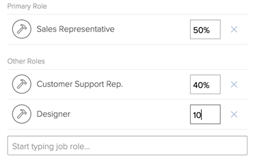

# Modification du profil d’un utilisateur

>[!IMPORTANT]
>
>La procédure décrite sur cette page s’applique uniquement aux organisations qui n’ont pas encore été intégrées au Admin Console. Si votre organisation a été intégrée à Adobe Admin Console, vous devez effectuer cette action via Adobe Admin Console.
>
>Pour obtenir des instructions sur la modification du profil d’un utilisateur dans Adobe Admin Console, reportez-vous à la section &quot;Modifier les détails de l’utilisateur&quot; de l’article. [Gérer les utilisateurs individuellement](https://helpx.adobe.com/enterprise/using/manage-users-individually.html) ou contactez votre administrateur Adobe Admin Console.
>
>Pour obtenir une liste des procédures différentes selon que votre organisation a été intégrée à Adobe Admin Console, reportez-vous à la section [Différences d’administration basées sur les plateformes (Adobe Workfront/Adobe Business Platform)](../../../administration-and-setup/get-started-wf-administration/actions-in-admin-console.md).

En tant qu’administrateur Adobe Workfront, vous pouvez créer de nouveaux utilisateurs et gérer les profils des utilisateurs existants. Pour plus d’informations sur la création d’utilisateurs, voir [Ajout d’utilisateurs](../../../administration-and-setup/add-users/create-and-manage-users/add-users.md).

Les utilisateurs disposant d’une licence Plan peuvent également créer et gérer des utilisateurs. Pour plus d’informations sur l’accès nécessaire à la modification des utilisateurs, voir [Accorder l’accès aux utilisateurs](../../../administration-and-setup/add-users/configure-and-grant-access/grant-access-other-users.md).

## Exigences d’accès

Les étapes de cet article doivent être les suivantes :

<table style="table-layout:auto"> 
 <col> 
 <col> 
 <tbody> 
  <tr> 
   <td role="rowheader">Formule Adobe Workfront</td> 
   <td>Tous</td> 
  </tr> 
  <tr> 
   <td role="rowheader">Licence Adobe Workfront</td> 
   <td>Plan</td> 
  </tr> 
  <tr> 
   <td role="rowheader">Paramétrages du niveau d'accès</td> 
   <td> 
Vous devez disposer de l’une des options suivantes :
 
    <ul> 
     <li> 
Niveau d’accès Administrateur système. Pour plus d’informations, voir <a href="../../../administration-and-setup/add-users/configure-and-grant-access/grant-a-user-full-administrative-access.md" class="MCXref xref">Octroi d’un accès administratif complet à un utilisateur</a>. 
 </li> 
     <li> 
<b>Utilisateurs</b> paramètre de votre niveau d’accès configuré sur <b>Modifier</b> accès, avec <b>Créer</b> et au moins l’une des deux <b>Administration des utilisateurs</b> options activées sous <b>Ajuster vos paramètres</b> . 
 
de ces deux options, si Utilisateur <b>Administration (utilisateurs de groupe)</b> est activé, vous devez être administrateur de groupe d’un groupe dont l’utilisateur est membre.
 
Pour plus d’informations sur la variable <b>Utilisateurs</b> paramétrer un niveau d’accès, voir <a href="../../../administration-and-setup/add-users/configure-and-grant-access/grant-access-other-users.md" class="MCXref xref">Accorder l’accès aux utilisateurs</a>.
 </li> 
    </ul> </td> 
  </tr> 
 </tbody> 
</table>

## Modification d’un profil utilisateur

1. Cliquez sur le bouton **Menu Principal** icon  dans le coin supérieur droit d’Adobe Workfront, puis cliquez sur **Utilisateurs** .
1. Sélectionnez l’utilisateur, puis cliquez sur l’icône Modifier .

1. Dans le **Modifier l’utilisateur** qui s’affiche, modifiez les informations suivantes, puis cliquez sur **Enregistrer les modifications**:

   <table style="table-layout:auto"> 
    <col> 
    <col> 
    <tbody> 
     <tr> 
      <td role="rowheader">Infos personnelles </td> 
      <td> 
       <ul> 
        <li><b>Prénom</b>, <b>Nom</b></li> 
        <li> 
<b>Adresse électronique :</b> L’adresse électronique d’un utilisateur est également son nom d’utilisateur dans Workfront. Ce champ est sensible à la casse et doit être unique. Si un utilisateur tente d’ajouter une adresse électronique non unique trois fois dans une fenêtre de 10 minutes, une réponse reCAPTCHA s’affiche.
 
Si vous utilisez la liste autorisée d’email et que vous saisissez un domaine d’email qui ne figure pas dans la liste, l’utilisateur ne recevra pas de notifications par email. Pour plus d’informations sur la liste autorisée, voir <a href="../../../administration-and-setup/get-started-wf-administration/configure-your-email-allowlist.md" class="MCXref xref">Configuration de votre liste autorisée de messagerie</a>.
 </li> 
        <li> 
<b>Réinitialiser le mot de passe</b>: Cliquez sur ce lien pour réinitialiser le mot de passe de l’utilisateur. Vous êtes invité à saisir votre propre mot de passe avant de pouvoir réinitialiser le mot de passe d’un utilisateur.
 
Pour réinitialiser le mot de passe d’un autre utilisateur, vous devez être un administrateur Workfront ou un administrateur de groupe.
 
<b>NOTE</b>:  
          <ul> 
           <li> 
Si vous êtes administrateur de groupe, vous ne pouvez réinitialiser les mots de passe que pour les utilisateurs des groupes où vous êtes désigné comme tel. En outre, l’autorisation Administrateur utilisateur (utilisateurs de groupe) doit être activée dans votre niveau d’accès :
 
  
 
Ce paramètre est désactivé par défaut. Pour plus d’informations, voir <a href="../../../administration-and-setup/add-users/configure-and-grant-access/create-modify-access-levels.md" class="MCXref xref">Création ou modification de niveaux d’accès personnalisés</a>.
 </li> 
           <li> 
Vous ne pouvez pas réinitialiser le mot de passe d’un administrateur Workfront.
 </li> 
          </ul> 
 </li> 
        <li><b>&lt;sso configuration=""&gt; Nom d’utilisateur</b>: Si votre administrateur Workfront a activé une intégration SSO avec Workfront, le nom d’utilisateur SSO s’affiche dans ce champ. Le type de configuration SSO activé pour votre instance Workfront est visible dans ce champ. </li> 
        <li> 
<b>OnlyAllow &lt;sso configuration=""&gt; Authentification</b>: Si votre administrateur Workfront a activé une intégration SSO avec Workfront et mis à jour tous les utilisateurs pour SSO, ce champ est sélectionné par défaut. Le type de configuration SSO activé pour votre instance Workfront est visible dans ce champ.
 
Lorsque ce champ est sélectionné, l’utilisateur doit se connecter à Workfront à l’aide de ses informations d’identification d’authentification unique. Si vous la décochez, ils pourront se connecter à Workfront avec leurs informations d’identification Workfront.
 
Pour plus d’informations sur la configuration de Workfront avec une solution d’authentification unique, voir <a href="../../../administration-and-setup/add-users/single-sign-on/sso-in-workfront.md" class="MCXref xref">Présentation de l’authentification unique dans Adobe Workfront</a>
 
Pour plus d’informations sur la mise à jour des utilisateurs pour SSO, voir <a href="../../../administration-and-setup/add-users/single-sign-on/update-users-sso.md" class="MCXref xref">Mise à jour des utilisateurs pour l’authentification unique</a>.
 
<b>REMARQUE</b>: Si vous êtes administrateur de groupe, vous pouvez modifier la variable &lt;sso configuration=""&gt; uniquement pour les utilisateurs des groupes dans lesquels vous êtes désigné comme tel. En outre, l’autorisation Administration des utilisateurs (utilisateurs du groupe) doit être activée dans votre niveau d’accès.
        
Si vous êtes administrateur de groupe et que l’autorisation Administrateur utilisateur (Tous les utilisateurs) est activée dans votre niveau d’accès, vous pouvez modifier la variable &lt;sso configuration=""&gt; pour tous les utilisateurs.
 </li> 
        <li><b>Job Info :</b> Informations sur la tâche, comme le titre de la tâche et le domaine d’expertise dont l’utilisateur est responsable.</li> 
        <li>
<b>Coordonnées</b>: Numéro de téléphone et adresse de l’utilisateur.

        
Si l’utilisateur est activé pour Unified User Management (UUM) ou Adobe Identity Management System (IMS), la variable <b>Pays</b> dans la section Coordonnées de contact , accepte uniquement les valeurs de code de pays (par exemple, US, GB, IN).
</li>
       </ul> </td> 
     </tr> 
     <tr> 
      <td role="rowheader">Préférences </td> 
      <td> 
       <ul> 
        <li> 
<b>Fuseau horaire :</b> Fuseau horaire de l’utilisateur.
 
Pour plus d’informations sur l’aide apportée aux utilisateurs par le biais de Workfront dans les fuseaux horaires, voir <a href="../../../workfront-basics/tips-tricks-and-troubleshooting/working-across-timezones.md" class="MCXref xref">Utilisation des fuseaux horaires</a>.
 </li> 
        <li><b>Paramètres régionaux des emails</b>: Paramètres régionaux de messagerie préférés de l’utilisateur. Cela affecte le format des nombres et des dates dans les emails provenant de Workfront.</li> 
        <li><b>Afficher le pourcentage terminé à l’état de mise à jour</b>: Cochez cette option si vous souhaitez afficher une barre de pourcentage dans la zone Mise à jour des tâches de cet utilisateur.</li> 
        <li><b>Envoyer le travail que je m’assigne à mon onglet Travail</b>: Cochez cette option si vous souhaitez que tout ce que l’utilisateur se donne à lui-même apparaisse directement sur l’onglet Travail . La valeur par défaut est de répertorier tous les éléments affectés à un utilisateur dans son onglet Demande de travail .</li> 
       </ul> </td> 
     </tr> 
     <tr> 
      <td role="rowheader">Notifications</td> 
      <td> 
Sélectionnez les notifications électroniques qui doivent être activées pour le nouvel utilisateur.
 
Vous pouvez sélectionner des notifications instantanées ainsi que des notifications de résumé quotidiennes.
 
Pour plus d’informations, voir <a href="../../../administration-and-setup/manage-workfront/emails/configure-event-notifications-for-everyone-in-the-system.md" class="MCXref xref">Configuration des notifications d’événement pour tous les membres du système</a>.
 </td> 
     </tr> 
     <tr> 
      <td role="rowheader">Accès</td> 
      <td> 
       <ul> 
      <li><b>Est Principal :</b> Cochez cette case pour indiquer que l’utilisateur est principal. Les utilisateurs principaux utilisent une licence Workfront. L’effacement de la case désactive l’utilisateur.</li> 
       <li> 
<b>Niveau d’accès :</b> Sélectionnez le niveau d’accès à affecter à cet utilisateur.
 
       
Lorsque vous attribuez un niveau d’accès à un utilisateur, vous pouvez attribuer un niveau égal ou inférieur à votre propre niveau d’accès. (Par exemple, si votre niveau d’accès est Planificateur, vous ne pouvez pas attribuer le niveau d’accès Administrateur.) Cependant, vous ne pouvez pas attribuer un niveau d’accès qui, par défaut, est inférieur à votre propre niveau d’accès si l’administrateur Workfront a activé des autorisations autres que les autorisations par défaut sur le niveau d’accès qui ne sont pas également activées dans votre propre niveau d’accès (via les paramètres d’optimisation, comme décrit dans la section <a href="../../../administration-and-setup/add-users/configure-and-grant-access/create-modify-access-levels.md" class="MCXref xref">Création ou modification de niveaux d’accès personnalisés</a>). 
 
       
Pour plus d’informations sur les niveaux d’accès, voir <a href="../../../administration-and-setup/add-users/configure-and-grant-access/configure-access.md" class="MCXref xref">Configurer l’accès à Adobe Workfront</a>.
 </li> 
       <li> 
<b>Modèle de mise en page</b>: Sélectionnez un modèle de mise en page pour l’utilisateur. Ce modèle de mise en page a la priorité sur tout modèle de mise en page affecté au groupe d’accueil, à l’équipe d’accueil ou au rôle de tâche Principal de l’utilisateur. Pour plus d’informations sur la priorité d’affectation des modèles de mise en page, voir <a href="../../../administration-and-setup/customize-workfront/use-layout-templates/create-and-manage-layout-templates.md" class="MCXref xref">Création et gestion des modèles de mise en page</a>.
 
<b>NOTE</b>:  
La liste des modèles disponibles dans ce champ dépend de votre accès :
 
       <ul> 
       <li>En tant qu’administrateur Workfront, vous pouvez consulter tous les modèles de mise en page au niveau du système et du groupe.</li> 
       <li>En tant qu’administrateur de groupe, vous pouvez voir un modèle de mise en page au niveau du système, ainsi que les modèles associés aux groupes que vous gérez.</li> 
       <li>En tant qu’utilisateur disposant d’une licence Plan et d’un accès pour modifier les utilisateurs, vous ne pouvez afficher que les modèles de mise en page au niveau du système.</li> 
       </ul> 
Pour plus d’informations sur les modèles de mise en page au niveau du groupe, voir <a href="../../../administration-and-setup/customize-workfront/use-layout-templates/create-and-manage-layout-templates.md" class="MCXref xref">Création et gestion des modèles de mise en page</a>.
 
 </li> 
       </ul> </td> 
     </tr> 
     <tr> 
      <td role="rowheader">Organisation </td> 
      <td> 
       <ul> 
      <li><b>Société</b>: Société de l’utilisateur. Les utilisateurs ne peuvent être associés qu’à une seule entreprise. Vous devez créer une société avant de pouvoir l’associer à un utilisateur. Seules les principales entreprises apparaissent dans la liste. Pour plus d’informations sur la création d’entreprises, voir <a href="../../../administration-and-setup/set-up-workfront/organizational-setup/create-and-edit-companies.md" class="MCXref xref">Création et modification d’entreprises</a>.</li> 
      <li><b>Rapports à :</b> Si vous avez spécifié une société pour l’utilisateur, vous pouvez également spécifier le responsable direct de l’utilisateur dans ce champ. Un utilisateur ne peut avoir qu’un seul gestionnaire.</li> 
      <li><b>Rapports directs :</b> Si vous avez spécifié une société pour l’utilisateur, vous pouvez également spécifier les rapports directs de l’utilisateur. Un utilisateur peut avoir plusieurs rapports directs.</li> 
      <li><b>Équipe Accueil</b>: Indiquez l’équipe d’accueil de l’utilisateur. Les utilisateurs ne peuvent avoir qu’une seule équipe d’accueil.</li> 
      <li><b>Autres équipes</b>: Les utilisateurs peuvent appartenir à plusieurs équipes.</li> 
      <li> 
<b>Home Group :</b> Sélectionnez un groupe approprié pour affecter l’utilisateur. Cela permet à l’utilisateur d’accéder aux objets partagés avec le groupe.
 
Champ obligatoire. Chaque utilisateur doit être associé à un groupe d’accueil. Si vous n’en sélectionnez pas un, votre groupe est désigné comme groupe d’accueil du nouvel utilisateur.
 
<b>REMARQUE</b>: Vous ne pouvez affecter un groupe à un utilisateur que si vous êtes administrateur de Workfront, que vous êtes administrateur du groupe ou que le groupe est public.
 </li> 
      <li> 
<b>Autres groupes</b>: Les utilisateurs peuvent appartenir à plusieurs groupes. Vous ne pouvez affecter un groupe à un utilisateur que si vous êtes administrateur de Workfront, que vous êtes administrateur du groupe ou que le groupe est public.
 
<b>IMPORTANT</b>: L’ajout d’un utilisateur à plus de 100 groupes peut entraîner des problèmes de performances dans n’importe quelle zone de Workfront qui charge la liste des groupes.
 
Pour plus d’informations sur les groupes publics, voir <a href="../../../administration-and-setup/manage-groups/create-and-manage-groups/create-a-group.md" class="MCXref xref">Création d’un groupe</a>.
 
Pour plus d’informations sur les groupes, voir <a href="../../../administration-and-setup/manage-groups/groups-overview/groups.md" class="MCXref xref">Présentation des groupes</a>.
 </li> 
       </ul> </td> 
     </tr> 
     <tr> 
      <td role="rowheader">Planification des ressources </td> 
      <td> 
       <ul>
       <li>
       <b>Temps de travail</b>: Représente le pourcentage du temps équivalent à temps plein (FTE) disponible pour le travail réel de l’utilisateur, sans compter les frais généraux. Le temps de travail doit être un nombre décimal maximum de 1 et ne peut pas être égal à 0. Par exemple, une disponibilité de 20 % pour le travail réel serait de 0,2.

   La valeur par défaut du champ est 1, ce qui indique qu’un utilisateur passe l’intégralité de son éditeur de texte enrichi sur le travail réel lié au projet.

   Le système utilise ce nombre pour calculer la disponibilité de l’utilisateur pour le travail réel lié au projet.

   Pour plus d’informations sur la création de plannings dans Workfront, voir <a href="../../set-up-workfront/configure-timesheets-schedules/create-schedules.md">Création d’un planning</a>.

   La planification d’exceptions et de congés peut également affecter la capacité de l’utilisateur.

   Workfront calcule la disponibilité d’un utilisateur en fonction des préférences de gestion des ressources de votre zone Configuration. Pour plus d’informations, voir <a href="../../set-up-workfront/configure-system-defaults/configure-resource-mgmt-preferences.md">Configuration des préférences de gestion des ressources</a>.

   <b>CONSEIL</b>

   Définissez la valeur Durée du travail sur 1 pour indiquer que l’utilisateur est disponible pour le travail lié au projet et qu’il dispose de son équivalent à temps plein.
   </li> 
      <li> <b>Planifier la désactivation</b>: Cochez cette case si vous souhaitez que cet utilisateur soit désactivé au bout d’un certain temps. </li> 
       <li><b>Date planifiée de désactivation</b>: Date à laquelle l’utilisateur est désactivé. Pour plus d’informations sur la planification de la désactivation des utilisateurs, voir <a href="../../../administration-and-setup/add-users/create-and-manage-users/deactivate-a-user.md#scheduling-users-for-deactivation" class="MCXref xref">Planification de la désactivation pour les utilisateurs</a> in <a href="../../../administration-and-setup/add-users/create-and-manage-users/deactivate-a-user.md" class="MCXref xref">Désactivation ou réactivation d’un utilisateur</a>.</li> 
       <li> 
<b>Rôle Principal</b>: Il s’agit du rôle de tâche Principal que l’utilisateur peut remplir dans Workfront. Chaque tâche et problème auquel l’utilisateur est affecté est également affecté à ce rôle de tâche. Les rôles de tâche sont essentiels dans la gestion des ressources. Vous ne pouvez mettre à jour ce champ que si vous disposez d’une licence Plan avec accès administrateur ou si vous êtes administrateur Workfront. Pour plus d’informations sur la configuration des utilisateurs disposant d’un accès administrateur, voir <a href="../../../administration-and-setup/add-users/configure-and-grant-access/grant-access-other-users.md" class="MCXref xref">Accorder l’accès aux utilisateurs</a>.
 
Seuls les rôles de tâche principaux s’affichent dans la liste. 
 </li> 
       <li>Si vous avez sélectionné une <b>Rôle Principal</b>, la variable <b>Pourcentage de disponibilité de l’éditeur de texte enrichi</b> s’affiche. Indiquez le pourcentage de temps du planning de l’utilisateur attribué à ce rôle de tâche. La valeur par défaut du pourcentage de disponibilité de l’éditeur de texte enrichi pour le rôle Principal est de 100 %. </li> 
       <li> 
<b>Autres rôles</b>: Un utilisateur peut avoir plusieurs rôles de tâche dans Workfront. Les rôles de tâche sont essentiels dans la gestion des ressources. Le nombre de rôles de tâche qu’un utilisateur peut remplir n’est pas limité. Cependant, nous vous recommandons de ne pas affecter un utilisateur à un trop grand nombre de rôles de tâche, car la gestion des ressources peut devenir trop complexe pour ces utilisateurs.
Seuls les rôles de tâche principaux s’affichent dans la liste. Pour plus d’informations sur les rôles de tâche, voir <a href="../../../administration-and-setup/set-up-workfront/organizational-setup/create-manage-job-roles.md" class="MCXref xref">Création et gestion des rôles de tâche</a>.
 
Vous ne pouvez mettre à jour ce champ que si vous disposez d’une licence Plan avec accès administrateur ou si vous êtes administrateur Workfront.  Pour plus d’informations sur la configuration des utilisateurs disposant d’un accès administrateur, voir <a href="../../../administration-and-setup/add-users/configure-and-grant-access/grant-access-other-users.md" class="MCXref xref">Accorder l’accès aux utilisateurs</a>.
 </li> 
       <li> 
(Conditionnel) Si vous avez sélectionné une ou plusieurs <b>Autres rôles</b>, la variable <b>Pourcentage de disponibilité de l’éditeur de texte enrichi</b> s’affiche pour chaque rôle. Indiquez le pourcentage de temps du planning de l’utilisateur attribué à chaque rôle de tâche. La valeur par défaut du pourcentage de disponibilité de l’éditeur de texte enrichi pour les autres rôles est de 0 %.
 
<b>REMARQUE</b>: Si d’autres rôles ont une disponibilité de l’éditeur de texte enrichi de 0 %, ils ne s’affichent pas dans le planificateur de ressources, sauf si les utilisateurs sont affectés à des tâches dans ces rôles.
 
  
 
<b>NOTE</b>: 
La somme de tous les <b>Pourcentages de disponibilité de l’éditeur de texte enrichi</b> pour tous les rôles, doit être égal à 100 %. Chaque pourcentage de disponibilité de l’éditeur de texte enrichi calcule les heures disponibles pour chaque rôle par utilisateur dans le planificateur de ressources. Les Heures disponibles pour chaque rôle par utilisateur dépendent de l’heure disponible pour l’utilisateur.
 
L’heure disponible pour l’utilisateur est calculée par Workfront selon la méthode sélectionnée par l’administrateur Workfront pour calculer l’éditeur de texte enrichi dans les préférences de gestion des ressources.
 
Pour plus d’informations sur le calcul de la disponibilité de l’utilisateur, voir <a href="../../../resource-mgmt/resource-planning/calculate-hours-fte-for-users-roles-resource-planner.md" class="MCXref xref">Présentation du calcul des heures et de l’éditeur de texte enrichi pour les utilisateurs et les rôles dans le planificateur de ressources</a>.
 
Pour plus d’informations sur la configuration des préférences de gestion des ressources, voir <a href="../../../administration-and-setup/set-up-workfront/configure-system-defaults/configure-resource-mgmt-preferences.md" class="MCXref xref">Configuration des préférences de gestion des ressources</a>.
 
 </li> 
       <li> 
<b>Planification</b>: Associez une planification à l’utilisateur. Le planning de l’utilisateur calcule la chronologie des tâches auxquelles l’utilisateur est affecté.
 
Vous devez créer une planification avant de pouvoir l’associer à un utilisateur. Pour plus d’informations sur la création de plannings, voir <a href="../../../administration-and-setup/set-up-workfront/configure-timesheets-schedules/create-schedules.md" class="MCXref xref">Création d’un planning</a>.
 
<b>REMARQUE</b>: Il est recommandé que le planning que vous associez à l’utilisateur corresponde au fuseau horaire de l’utilisateur.
 </li> 
       <li> 
<b>Profil de feuille de calcul</b>: Associez un profil de feuille de temps à l’utilisateur pour vous assurer que les feuilles de temps sont générées automatiquement pour l’utilisateur.
 
<b>REMARQUE</b>: La liste des profils disponibles dans ce champ dépend de votre accès :
       <ul>
       <li>En tant qu’administrateur Workfront, vous pouvez consulter tous les profils de feuille de calcul au niveau du système et de tous les groupes.</li>
       <li>En tant qu’administrateur de groupe, vous pouvez consulter les profils de feuille de temps au niveau du système, ainsi que ceux associés aux groupes que vous gérez.</li>
       <li>En tant qu’utilisateur disposant d’une licence Plan et d’un accès pour modifier les utilisateurs, vous ne pouvez afficher que les profils de feuille de temps au niveau du système. Pour plus d’informations sur les profils de feuille de calcul au niveau du groupe, voir <a href="../../../timesheets/create-and-manage-timesheets/create-timesheet-profiles.md" class="MCXref xref">Création, modification et affectation de profils de feuille de temps</a>.</li>
      </ul>
 </li> 
       <li><b>Type d’heure par défaut</b>: Sélectionnez le type d’heure par défaut pour l’utilisateur. Il s’agit du type d’heure utilisé par défaut lorsque l’utilisateur consigne l’heure.</li> 
       <li><b>Types d’heure disponibles</b>: Sélectionnez les types d’heures qui doivent être disponibles pour l’utilisateur. Ces types d’heure sont visibles partout dans Workfront, où l’utilisateur peut consigner l’heure. Un utilisateur peut uniquement afficher les types d’heures activés au niveau du projet ainsi qu’au niveau de l’utilisateur. Pour plus d’informations sur les types d’heures disponibles pour les utilisateurs, voir <a href="../../../timesheets/create-and-manage-timesheets/define-hour-types-and-availability.md" class="MCXref xref">Définition des types d’heures et de la disponibilité des feuilles de temps</a>.</li> 
       <li><b>Temps de connexion :</b> Indiquez si l’utilisateur doit se connecter à l’heure des tâches en heures ou en jours. Pour plus d’informations, voir <a href="../../../timesheets/config-timesheet-prefs/config-time-logged-hrs-days.md" class="MCXref xref">Configurer si l’heure est connectée en heures ou en jours</a>.</li>

   <li> <b>FTE</b>: Il s’agit de l’équivalent temps plein de l’utilisateur. Workfront utilise ce nombre pour calculer la disponibilité de l’utilisateur en fonction de la planification par défaut uniquement lorsque les préférences de gestion des ressources au niveau du système sont définies sur la planification par défaut.

   
L’éditeur de texte enrichi indique le temps que l’utilisateur peut consacrer à son travail. Cela inclut les frais généraux et le temps passé sur le projet. Par exemple, le temps passé dans les réunions ou la formation est également inclus dans l’éditeur de texte enrichi.

   L’éditeur de texte enrichi doit être un nombre décimal maximum de 1 et ne peut pas être égal à 0. Par exemple, si la valeur de l’éditeur de texte enrichi est 0,5 et que la planification par défaut dans Workfront est de 40 heures, l’utilisateur est disponible pendant 20 heures par semaine.

   La valeur par défaut du champ est 1.

   Planifiez des exceptions, des heures de congé et la valeur du temps de travail peut affecter la disponibilité de l’utilisateur.

   Workfront calcule la disponibilité d’un utilisateur en fonction des préférences de gestion des ressources de votre zone Configuration.

   Si les préférences de gestion des ressources au niveau du système sont définies sur la planification de l’utilisateur, la valeur que vous indiquez ici est ignorée et l’utilisateur est considéré comme disponible selon ce qui est spécifié dans sa planification.

   Pour plus d’informations, voir <a href="../../set-up-workfront/configure-system-defaults/configure-resource-mgmt-preferences.md">Configuration des préférences de gestion des ressources</a>.

   Pour plus d’informations sur la création de plannings dans Workfront, voir <a href="../../set-up-workfront/configure-timesheets-schedules/create-schedules.md">Création d’un planning</a>.
   </li>

   <li><b>Groupes de ressources</b>: Associez l’utilisateur aux pools de ressources. Pour plus d’informations, voir <a href="../../../resource-mgmt/resource-planning/resource-pools/associate-resource-pools-with-users.md" class="MCXref xref">Association des pools de ressources aux utilisateurs </a>.</li> 
        <li><b>Coût par heure</b>: Montant du coût par heure pour l’utilisateur. </li> 
        <li><b>Facturation par heure</b>: Montant de la facturation par heure pour l’utilisateur.</li> 
       </ul> </td> 
     </tr> 
     <tr> 
      <td role="rowheader">Formulaires personnalisés</td> 
      <td>Associez un formulaire personnalisé d’utilisateur existant à cet utilisateur. Vous devez créer un formulaire personnalisé pour pouvoir l’associer à un utilisateur. Seuls les principaux formulaires personnalisés s’affichent dans la liste. Pour plus d’informations sur la création de formulaires personnalisés, voir <a href="../../../administration-and-setup/customize-workfront/create-manage-custom-forms/create-or-edit-a-custom-form.md" class="MCXref xref">Création ou modification d’un formulaire personnalisé</a>.</td> 
     </tr> 
     <tr> 
      <td role="rowheader">Commentaire</td> 
      <td> 
Saisissez le commentaire à envoyer aux utilisateurs et à la zone Mises à jour de leurs profils utilisateur.
 </td> 
     </tr> 
    </tbody> 
   </table>
