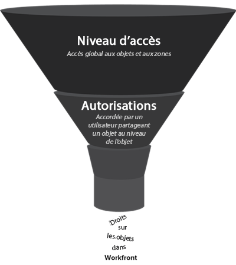

# Vue d’ensemble des nouveaux niveaux d’accès

En tant qu’administrateur Adobe Workfront, vous attribuez un niveau d’accès à un utilisateur à deux fins :

* Chaque utilisateur doit disposer d’un niveau d’accès pour se connecter et travailler dans Workfront.
* Vous utilisez le niveau d’accès pour contrôler ce qu’un utilisateur peut voir et faire avec certains objets et zones Workfront.

## Nouveaux niveaux d’accès intégrés dans Adobe Workfront {#built-in-access}

Workfront dispose de 5 nouveaux niveaux d’accès intégrés :

* Administrateur ou administratrice système
* Standard
* Léger
* Contributeur
* Externe

Selon le niveau d’accès, jusqu’à 3 autorisations sont disponibles pour la plupart des types d’objets Workfront :

<table style="table-layout:auto">
    <tr>
        <td>Modifier</td>
        <td>Les utilisateurs peuvent créer, modifier, supprimer et partager l’objet Workfront.</td>
    </tr>
    <tr>
        <td>Afficher</td>
        <td>Les utilisateurs peuvent examiner et partager l’objet Workfront</td>
    </tr>
    <tr>
        <td>Pas d’accès
</td>
        <td>Les utilisateurs ne peuvent pas accéder à l’objet Workfront</td>
    </tr>
</table>

Si vous avez besoin d’un niveau d’accès personnalisé, vous pouvez copier le niveau d’accès intégré et ajuster la quantité d’accès que vous souhaitez qu’il autorise pour les différents types d’objets Workfront. Pour plus d’informations sur la création d’un niveau d’accès personnalisé, voir [Création ou modification de niveaux d’accès personnalisés](../../../administration-and-setup/add-users/configure-and-grant-access/create-modify-access-levels.md).

>[!IMPORTANT]
>
>Nous vous recommandons vivement de ne pas modifier les niveaux d’accès intégrés afin que vous puissiez y faire référence après avoir configuré vos utilisateurs.

### Niveau d’accès administrateur système

Associé à la licence Standard, ce niveau d’accès intégré est conçu pour un utilisateur chargé de l’administration du système Adobe Workfront. Vous ne pouvez pas modifier ce niveau d’accès intégré.

Les utilisateurs disposant du niveau d’accès Administrateur système peuvent tout faire dans Workfront. Ils peuvent afficher et modifier tous les objets et informations Workfront saisis dans Workfront par tous les autres utilisateurs.

Ils ont également accès à la zone Configuration complète, dans laquelle ils peuvent modifier n’importe quel paramètre au niveau du système, et ils peuvent accéder à toutes les zones du menu principal.

Pour plus d’informations, voir [Octroyer un accès administratif intégral pour les utilisateurs et utilisatrices](../../../administration-and-setup/add-users/configure-and-grant-access/grant-a-user-full-administrative-access.md).

### Niveau d’accès standard

Également joint à la licence Standard, ce niveau d&#39;accès est conçu pour les utilisateurs qui :

* Planification, création et suivi de tous les projets au même endroit
* Automatiser les processus de routine
* Gérer des ressources
* Suivi et collaboration sur les requêtes
* Tracker et générer des rapports sur les finances du projet
* Démarrage des requêtes de travail entrantes
* Collaboration sur les projets, les tâches et les problèmes

>[!NOTE]
>
>Vous pouvez créer une version personnalisée du niveau d’accès standard intégré et ajuster la quantité d’accès qu’il permet aux différents types d’objets Workfront. Pour plus d’informations sur la création d’un niveau d’accès personnalisé, voir [Création ou modification de niveaux d’accès personnalisés](../../../administration-and-setup/add-users/configure-and-grant-access/create-modify-access-levels.md).

#### **Accéder aux détails**

Voici les paramètres d’accès les plus élevés disponibles pour les objets de niveau d’accès standard :

| Type d’objet Workfront | Pas d’accès | Accès aux vues | Modifier l’accès |
|---|---|---|---|
| Projets |   |   | ✓ |
| Tâches |   |   | ✓ |
| Problèmes |   |   | ✓ |
| Portefeuilles |   |   | ✓ |
| Programmes |   |   | ✓ |
| Rapports (y compris les tableaux de bord et les rapports de calendrier) |   |   | ✓ |
| Filtres, vues et regroupements |   |   | ✓ |
| Documents |   |   | ✓ |
| Utilisateurs |   |   | ✓ |
| Modèles |   |   | ✓ |
| Données financières |   |   | ✓ |
| Gestion des ressources |   |   | ✓ |
| Planificateur de scénarios |   |   | ✓ (Le paramètre par défaut est No Access.) |
| Panneaux |   |   | ✓ |
| Page d’accueil |   |   | ✓ |
| Objectifs |   |   | ✓ |

{style="table-layout:auto"}

### Niveau d&#39;accès faible

Attaché à la licence Light, ce niveau d&#39;accès est conçu pour les utilisateurs qui :

* Afficher tous les éléments et mises à jour liés au travail
* Approbation de projets, de tâches et de problèmes
* Affichage des tableaux de bord et des rapports
* Tracker l’heure et approuver les feuilles de temps
* Création et gestion des problèmes
* Mise à jour sur le travail

Utilisateurs avec le niveau d’accès Clair :

* Peut se voir attribuer des tâches, mais ne peut pas les terminer.
* Peuvent accéder aux requêtes et aux documents dans le menu principal.
* La possibilité de créer des objets est limitée : ils ne peuvent pas créer de projets, de portefeuilles, de programmes ou de rapports.

>[!NOTE]
>
>Vous pouvez créer une version personnalisée du niveau d’accès intégré à Light et ajuster la quantité d’accès qu’il permet aux différents types d’objets Workfront. Pour plus d’informations sur la création d’un niveau d’accès personnalisé, voir [Création ou modification de niveaux d’accès personnalisés](../../../administration-and-setup/add-users/configure-and-grant-access/create-modify-access-levels.md).

#### **Accéder aux détails**

Voici les paramètres d’accès les plus élevés disponibles pour les objets de niveau d’accès Clair :

<table style="table-layout:auto"> 
 <col> 
 <col> 
 <col> 
 <col> 
 <thead> 
  <tr> 
   <th>Type d’objet Workfront</th> 
   <th>Pas d’accès</th> 
   <th>Accès aux vues</th> 
   <th>Modifier l’accès</th> 
  </tr> 
 </thead> 
 <tbody> 
  <tr> 
   <td>Projets</td> 
   <td> </td> 
   <td>✓</td> 
   <td> </td> 
  </tr> 
  <tr> 
   <td>Tâches</td> 
   <td> </td> 
   <td>✓</td> 
   <td> </td> 
  </tr> 
  <tr> 
   <td>Problèmes</td> 
   <td> </td> 
   <td> </td> 
   <td>✓</td> 
  </tr> 
  <tr> 
   <td>Portefeuilles</td> 
   <td> </td> 
   <td>✓ (Le paramètre par défaut est No Access.)</td> 
   <td> </td> 
  </tr> 
  <tr> 
   <td>Programmes</td> 
   <td> </td> 
   <td>✓ (Le paramètre par défaut est No Access.)</td> 
   <td> </td> 
  </tr> 
  <tr> 
   <td>Rapports (y compris les tableaux de bord et les rapports de calendrier)</td> 
   <td> </td> 
   <td>✓</td> 
   <td> </td> 
  </tr> 
  <tr> 
   <td>Filtres, vues et regroupements</td> 
   <td> </td> 
   <td> </td> 
   <td>✓</td> 
  </tr> 
  <tr> 
   <td>Documents</td> 
   <td> </td> 
   <td> </td> 
   <td>✓</td> 
  </tr> 
  <tr> 
   <td>Utilisateurs</td> 
   <td> </td> 
   <td>✓</td> 
   <td> </td> 
  </tr> 
    <tr> 
   <td>Équipes</td> 
   <td> </td> 
   <td>✓</td> 
   <td> </td> 
  </tr>
  <tr> 
   <td>Modèles</td> 
   <td>✓</td> 
   <td> </td> 
   <td> </td> 
  </tr> 
  <tr> 
   <td>Données financières</td> 
   <td></td> 
   <td> 
✓
 </td> 
   <td> </td> 
  </tr> 
  <tr> 
   <td>Gestion des ressources</td> 
   <td> </td> 
   <td>✓</td> 
   <td> </td> 
  </tr> 
  <tr> 
   <td>Planificateur de scénarios </td> 
   <td> </td> 
   <td> </td> 
   <td>✓ (Le paramètre par défaut est No Access.)</td> 
  </tr> 
  <tr> 
   <td>Panneaux </td> 
   <td> </td> 
   <td> </td> 
   <td>✓</td> 
     <tr> 
   <td>Page d’accueil </td> 
   <td> </td> 
   <td> </td> 
   <td>✓</td> 
  </tr> 
  <tr>   
   <td>Objectifs </td> 
   <td> </td> 
   <td> </td> 
   <td>✓</td> 
 </tbody> 
</table>

### Niveau d’accès du contributeur

Attaché à la licence du contributeur, ce niveau d’accès est conçu pour les utilisateurs qui :

* Soumettre des demandes
* Suivi des requêtes
* Mise à jour et révision des requêtes
* Approbation des requêtes

Utilisateurs disposant de ce niveau d’accès intégré :

* Peut effectuer des requêtes et les mettre à jour
* Peut télécharger et approuver des documents
* Peut approuver des projets, des tâches et des problèmes
* Peuvent examiner l’état des problèmes qu’ils ont envoyés.
* Peut être affecté à des tâches, mais ne peut pas les terminer
* Ne peuvent accéder aux requêtes que depuis le menu principal. Pour plus d’informations sur les files d’attente de requête, voir [Création d’une file d’attente de requête](../../../manage-work/requests/create-and-manage-request-queues/create-request-queue.md).

>[!NOTE]
>
>Vous pouvez créer une version personnalisée du niveau d’accès intégré du contributeur et ajuster la quantité d’accès qu’il permet pour les différents types d’objets Workfront. Pour plus d’informations sur la création d’un niveau d’accès personnalisé, voir [Création ou modification de niveaux d’accès personnalisés](../../../administration-and-setup/add-users/configure-and-grant-access/create-modify-access-levels.md).

#### **Accéder aux détails**

Voici les paramètres d’accès les plus élevés disponibles pour les objets du niveau d’accès Contributeur :

| Type d’objet Workfront | Pas d’accès | Accès aux vues | Modifier l’accès |
|---|---|---|---|
| Projet |   | ✓ |   |
| Tâche |   | ✓ |   |
| Problème |   |   | ✓ |
| Portefeuilles |   | ✓ |   |
| Programmes |   | ✓ |   |
| Rapports (y compris les tableaux de bord et les rapports de calendrier) |   | ✓ (onglet Détails uniquement) |   |
| Filtres, vues et regroupements |   |   | ✓ |
| Document |   |   | ✓ |
| l’utilisateur ou de l’utilisatrice |   | ✓ |   |
| Équipes |   | ✓ |   |
| Modèle | ✓ |   |   |
| Données financières | ✓ |   |   |
| Gestion des ressources | ✓ |   |   |
| Planificateur de scénarios | ✓ |   |   |
| Panneaux |   |   | ✓ (cartes simples) |
| Page d’accueil |   | ✓ (Mes mises à jour) |   |
| Objectifs |   |   | ✓ |

{style="table-layout:auto"}

>[!IMPORTANT]
>
>À compter de la version 24.7, les contributeurs disposent par défaut d’un accès en vue aux programmes et aux Portfolios.
>
> 
>Les contributeurs intégrés avant la version 24.7 continueront par défaut à ne pas avoir accès aux programmes et aux Portfolios. Vous pouvez mettre à jour leur accès pour afficher manuellement, si nécessaire.

### Niveau d’accès des utilisateurs externes

Ce niveau d’accès n’est pas associé à une licence Workfront payante. Il s’agit du niveau d’accès le plus restrictif, conçu principalement pour les collaborateurs comme les consultants externes qui ne se connectent pas à Workfront, mais qui doivent parfois consulter, télécharger ou afficher des documents.

Les utilisateurs de Workfront peuvent affecter des tâches à des utilisateurs externes, même s’ils ne peuvent pas se connecter au système. Mais nous vous déconseillons parce que ce travail ne serait pas résolu dans le système.

Utilisateurs disposant du niveau d’accès Utilisateur externe :

* Peuvent afficher uniquement les documents et les rapports de calendrier partagés avec eux.
* Afficher les utilisateurs qui partagent des documents et des rapports de calendrier avec eux
* Approuver les documents partagés avec eux

Vous ne pouvez pas modifier ce niveau d&#39;accès.

>[!IMPORTANT]
>
>L’option Utilisateur externe n’est disponible que si l’option &quot;Collaborer avec des personnes sans compte Workfront à l’aide de leur adresse électronique&quot; est activée dans la zone Préférences système de la section Configuration. Pour plus d’informations, voir [Configuration des préférences de sécurité du système](/help/quicksilver/administration-and-setup/manage-workfront/security/configure-security-preferences.md).

#### **Accéder aux détails**

Voici les paramètres d’accès les plus élevés disponibles pour les objets du niveau d’accès Utilisateur externe .

| Type d’objet Workfront | Pas d’accès | Accès aux vues | Modifier l’accès |
|---|---|---|---|
| Projet | ✓ |   |   |
| Tâche | ✓ |   |   |
| Problème | ✓ |   |   |
| Portefeuilles | ✓ |   |   |
| Programmes | ✓ |   |   |
| Rapports (y compris les tableaux de bord et les rapports de calendrier) |   | ✓ (Uniquement pour les rapports de calendrier ; impossible de partager les rapports) |   |
| Filtres, vues et regroupements | ✓ |   |   |
| Document |   | ✓ (impossible de partager des documents) |   |
| l’utilisateur ou de l’utilisatrice |   | ✓ |   |
| Équipes | ✓ |   |   |
| Modèle | ✓ |   |   |
| Données financières | ✓ |   |   |
| Gestion des ressources | ✓ |   |   |
| Planificateur de scénarios | ✓ |   |   |
| Panneaux | ✓ |   |   |
| Page d’accueil | ✓ |   |   |
| Objectifs | ✓ |   |   |

## Fonctionnement des niveaux d’accès et des autorisations

Les niveaux d’accès définissent ce que les utilisateurs peuvent voir et faire avec les types d’objets généraux et les zones du système, tels que les projets, les tâches et les problèmes. Les autorisations définissent ce à quoi vous avez accès sur des objets spécifiques créés par d’autres personnes dans le système, comme un projet créé pour exécuter une campagne marketing.

Le tableau suivant compare l’accès général d’un utilisateur aux objets (défini par le niveau d’accès de l’utilisateur) aux autorisations d’un objet partagé spécifique :

<table style="table-layout:auto"> 
 <col> 
 <col> 
 <col> 
 <thead> 
  <tr> 
   <th> </th> 
   <th>Niveau d’accès </th> 
   <th>Autorisations </th> 
  </tr> 
 </thead> 
 <tbody> 
  <tr> 
   <td>Accordée par un administrateur Workfront au niveau d’accès d’un utilisateur</td> 
   <td>✓</td> 
   <td> </td> 
  </tr> 
  <tr> 
   <td>Accordée par un utilisateur partageant un objet au niveau de l’objet</td> 
   <td> </td> 
   <td>✓</td> 
  </tr> 
  <tr> 
   <td> 
Hérité d’un objet partagé de rang supérieur 
   </td> 
   <td> </td> 
   <td>✓</td> 
  </tr> 
 </tbody> 
</table>

Les activités qu’un utilisateur peut réaliser avec un objet sont définies par une combinaison de leur niveau d’accès et des autorisations qui leur sont accordées.

### Octroi d’autorisations via le partage d’objets

Les utilisateurs accèdent à des objets individuels lorsque d’autres utilisateurs partagent et accordent certaines autorisations sur ces objets.

>[!NOTE]
>
>* Si un utilisateur partage un objet avec certaines autorisations et que cet objet a des objets enfants en dessous, le destinataire hérite des mêmes autorisations pour ces objets enfants.
>* Si un niveau d’accès limite la suppression de certains objets par les utilisateurs, cela ne les empêche pas de supprimer les objets enfants qu’ils contiennent.

Un utilisateur peut accorder au destinataire l’une des autorisations suivantes à l’objet individuel :

* **Vue** : ce niveau d’autorisation permet au destinataire de partager l’objet de l’une des manières suivantes :

   * à l’échelle du système afin que tous les utilisateurs puissent le voir (non disponible pour tous les objets) ;
   * Avec les utilisateurs externes qui n’ont pas de licence Workfront (non disponible pour tous les objets)
   * Avec une adresse électronique (disponible uniquement pour les documents et les calendriers)

* **Contribute** : (non disponible pour tous les objets)
* **Gérer** : lorsque quelqu’un partage un objet, les droits du destinataire sur l’objet sont déterminés par une combinaison du niveau d’accès du destinataire et des autorisations sur l’objet qui ont été accordées par le responsable du partage. Le niveau d’accès le plus bas disponible dans cette combinaison détermine ce que le destinataire peut faire avec l’objet.

### Exemples de scénarios

#### **Scénario 1**

Si le niveau d’accès du destinataire n’autorise pas la modification de projet, cette personne ne peut pas modifier ni supprimer un projet, même si le responsable du partage lui a accordé des autorisations pour le gérer.

Ou, si le niveau d’accès du destinataire autorise la modification de projet, mais que le responsable accorde des autorisations d’affichage uniquement à un projet, l’utilisateur ne peut pas modifier ou supprimer le projet.

#### **Scénario 2**

Quand Olivia partage un projet Workfront avec Tony, l&#39;accès de Tony à ce projet est déterminé par une combinaison de deux éléments :

* Niveau d’accès de Tony, attribué par l’administrateur Workfront
* Autorisations de Tony pour le projet, spécifiées par Olivia

Les actions de Tony sur le projet peuvent être limitées davantage au projet, mais elles ne peuvent pas être illimitées au-delà de ce qui est autorisé à son niveau d&#39;accès :

* Si le niveau d&#39;accès de Tony ne lui permet pas de créer des tâches, il ne peut pas ajouter de tâches au projet, même si Olivia lui a donné l&#39;autorisation d&#39;y ajouter des tâches.
* Si le niveau d’accès de Tony lui permet de créer des tâches, mais qu’Olivia n’a pas accordé d’autorisation pour ajouter des tâches au projet, il ne peut pas ajouter de tâches à ce projet, mais il peut ajouter des tâches à d’autres projets pour lesquels il a reçu l’autorisation de le faire.
