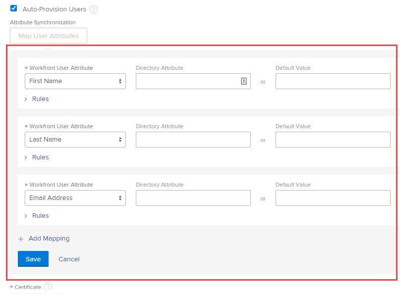

# Configurer Adobe Workfront avec SAML 2.0

<!--
**DON'T DELETE, DRAFT OR HIDE THIS ARTICLE. IT IS LINKED TO THE PRODUCT, THROUGH THE CONTEXT SENSITIVE HELP LINKS.** 

-->

<!-- Audited: 12/2023 -->

>[!IMPORTANT]
>
>La procédure décrite sur cette page s’applique uniquement aux organisations qui ne sont pas encore intégrées à Adobe Admin Console.
>
>Pour mapper les attributs utilisateur dans les organisations qui ont été intégrées à Adobe Admin Console, consultez [Mappage des attributs utilisateur dans l’expérience unifiée Adobe](/help/quicksilver/administration-and-setup/add-users/create-and-manage-users/map-user-attributes.md#map-user-attributes-in-the-adobe-unified-experience) dans l’article Mappage des attributs utilisateur.

En tant qu’administrateur ou administratrice d’Adobe Workfront, vous pouvez configurer les applications web et mobile de Workfront afin de les intégrer à une solution SAML 2.0 (Security Assertion Markup Language) pour l’authentification unique (SSO).

Après avoir configuré SAML 2.0 dans Workfront, comme décrit dans les sections suivantes, vous pouvez conserver la configuration, comme décrit dans [Mettre à jour des métadonnées SAML 2.0 dans votre fournisseur d’identité](../../../administration-and-setup/add-users/single-sign-on/update-saml-2-metadata-ip.md).

## Conditions d’accès

+++ Développez pour afficher les exigences d’accès aux fonctionnalités de cet article.

<table style="table-layout:auto"> 
 <col> 
 <col> 
 <tbody> 
  <tr> 
   <td role="rowheader">Package Adobe Workfront</td> 
   <td>
Tous
</td> 
  </tr> 
  <tr> 
   <td role="rowheader">Licence Adobe Workfront</td> 
   <td>
Standard

Plan
</td> 
  </tr> 
  <tr> 
   <td role="rowheader">Configurations des niveaux d’accès</td> 
   <td> 
Vous devez être un administrateur ou une administratrice Workfront.
 
 </td> 
  </tr> 
 </tbody> 
</table>

Pour plus d’informations, voir [Conditions d’accès requises dans la documentation Workfront](/help/quicksilver/administration-and-setup/add-users/access-levels-and-object-permissions/access-level-requirements-in-documentation.md).

+++

## Activer l’authentification à Workfront avec SAML 2.0

{{step-1-to-setup}}

1. Cliquez sur **Système** > **Authentification unique (SSO).**

1. Dans la liste déroulante **Type**, sélectionnez **SAML 2.0.**

1. Dans la partie supérieure des options qui s’affichent, cliquez sur **Télécharger des métadonnées SAML 2.0** pour télécharger le fichier sur votre ordinateur.

   Votre fournisseur d’identité SAML 2.0 requiert un fichier XML avec les informations générées dans votre instance Workfront. Après avoir téléchargé le fichier, vous devez accéder à votre serveur de fournisseur d’identité SAML 2.0 et y charger le fichier XML de métadonnées SAML 2.0 de Workfront.

1. Spécifiez les informations suivantes dans Workfront :

   <table style="table-layout:auto">
    <col>
    <col>
    <tbody>
     <tr>
      <td role="rowheader">ID de fournisseur de services </td>
      <td> Cette URL, déjà renseignée pour vous, identifie Workfront auprès de votre fournisseur d’identité. Par exemple, <code>&lt;yourcompany&gt;.com/SAML2</code>.</td>
     </tr>
     <tr>
      <td role="rowheader">Type de liaison </td>
      <td> 
Sélectionnez la méthode prise en charge par votre serveur IDP pour envoyer les informations d’authentification :

       <ul>
       <li>POST</li>
       <li>REDIRECT</li>
       </ul> </td>
     </tr>
     <tr>
      <td role="rowheader">Champs remplis à partir des métadonnées de fournisseurs d'identité </td> 
      <td>Dans votre solution de fournisseur d’identité SAML 2.0, exportez un fichier XML de métadonnées du fournisseur de services et enregistrez-le dans un emplacement temporaire sur votre ordinateur. Sélectionnez <strong>Choisir un fichier</strong>, puis recherchez et sélectionnez le fichier que vous avez enregistré pour l’ajouter à votre configuration Workfront.</td> 
     </tr> 
     <tr> 
      <td role="rowheader">URL du portail de connexion </td> 
      <td>Saisissez le portail de connexion commun de votre entreprise. Il s’agit de l’URL à laquelle les utilisateurs et utilisatrices se connectent pour accéder à Workfront et à toutes les autres applications intégrées à SAML 2.0.</td> 
     </tr>
     <tr>
      <td role="rowheader">URL de déconnexion </td> 
      <td> 
Saisissez l’URL de déconnexion du serveur IDP. Workfront envoie une requête HTTP à cette URL avant de se déconnecter de Workfront. La session de l’utilisateur ou de l’utilisatrice se ferme sur le serveur distant à la fermeture de la session Workfront.
 
<b>NOTE</b> : le système ne vous redirige vers l’URL de déconnexion que si vous avez l’option <strong>Autoriser l’authentification SAML 2.0 uniquement</strong> activée dans votre profil d’utilisateur ou d’utilisatrice.
 </td>
     </tr>
     <tr>
      <td role="rowheader">Modifier l'URL de mot de passe </td> 
      <td> 
 Spécifiez l’URL vers laquelle les utilisateurs et utilisatrices seront redirigés pour modifier leurs mots de passe. 
 
Dans la mesure où les informations d’identification SAML 2.0 sont utilisées pour accéder à Workfront, les utilisateurs et utilisatrices doivent être redirigés vers une page où ils peuvent modifier leur mot de passe SAML 2.0 au lieu de terminer cette activité via Workfront.
 </td> 
     </tr> 
     <tr> 
      <td role="rowheader">Algorithme de hachage sécurisé </td> 
      <td> 
Sélectionnez l’algorithme de hachage sécurisé (SHA) pris en charge par votre IDP :
 
       <ul> 
       <li>SHA-1</li> 
       <li>SHA-256</li> 
       </ul> </td> 
     </tr> 
     <tr> 
      <td role="rowheader">Provisionnement automatique des utilisateurs et utilisatrices </td> 
      <td> 
Cette option crée automatiquement un utilisateur ou une utilisatrice dans le système lorsqu’une personne avec un nom d’utilisateur ou d’utilisatrice de répertoire et un mot de passe tente de se connecter à Workfront pour la première fois.
 
Pour créer des utilisateurs et des utilisatrices dans Workfront, vous devez mapper les attributs de données Workfront avec les attributs de données d’utilisateur et d’utilisatrice suivants dans votre fournisseur de répertoire :
 
       <ul> 
       <li>Prénom</li> 
       <li>Nom de famille</li> 
       <li>Adresse e-mail</li> 
       </ul> 
       
Lorsque vous cochez la case, les options suivantes s’affichent :
 
       
  
 
       
Sélectionnez l’attribut d’utilisateur ou d’utilisatrice Workfront que vous souhaitez mapper dans la liste déroulante, puis spécifiez l’attribut de répertoire correspondant dans le répertoire d’utilisateurs et d’utilisatrices.
 
       
Le champ <strong>Attribut de répertoire</strong> doit contenir le nom d’attribut de répertoire du tableau d’attributs d’utilisateur ou d’utilisatrice que vous avez enregistré lors du test de votre configuration SAML 2.0.
 
       
Vous pouvez définir une valeur Workfront par défaut dans le champ <strong>Valeur par défaut</strong>. Vous pouvez également définir des règles en fonction des valeurs de votre fournisseur d’identité SAML 2.0.
 
       
<b>AVERTISSEMENT</b> : Workfront tente de mapper les attributs répertoriés ci-dessous chaque fois qu’un utilisateur ou une utilisatrice se connecte au système. Pour cette raison, nous vous déconseillons de mapper les niveaux d’accès. Vous pouvez facilement supprimer l’accès administratif si un attribut n’est pas mappé correctement. Cliquez sur <strong>Ajouter un mappage</strong> pour ajouter des règles supplémentaires.
       
 
       
Vous pouvez mapper les attributs Workfront suivants :
 
      <ul> 
      <li> 
Niveau d’accès
 </li> 
      <li> 
Adresse
 </li> 
      <li> 
Adresse2
 </li> 
      <li> 
Facturation par heure
 </li> 
      <li> 
Ville
 </li> 
      <li> 
Entreprise
 </li> 
      <li> 
Coût par heure
 </li> 
      <li> 
Adresse e-mail
 </li> 
      <li> 
Extension
 </li> 
      <li> 
Prénom
 </li> 
      <li> 
Groupe principal
 </li> 
      <li> 
Équipe interne
 </li> 
      <li> 
Fonction
 </li> 
      <li> 
Nom de famille
 </li> 
      <li> 
Modèle de mise en page
 </li> 
      <li> 
Gestionnaire
 </li> 
      <li> 
Téléphone portable
 </li> 
      <li> 
Numéro de téléphone
 </li> 
      <li> 
Code postal
 </li> 
      <li> 
Planning
 </li> 
      <li> 
Département
 </li> 
      <li> 
Profil de feuille de temps
 </li> 
      <li> 
Titre
 </li> 
      </ul>
      
Cliquez sur <strong>Enregistrer</strong> lorsque vous avez terminé de mapper les attributs d’utilisation.
 </td> 
     </tr> 
     <tr> 
      <td role="rowheader">Certificat </td> 
      <td> 
Chargez un certificat SSL valide pour garantir une connexion sécurisée entre le service d’authentification et Workfront. Pour les comptes OnDemand, un certificat est toujours requis. Vous pouvez obtenir ce certificat auprès de l’administration de votre système SAML 2.0.
 </td> 
     </tr> 
     <tr> 
      <td role="rowheader">Exemption admin </td> 
      <td> 
Permet aux administrateurs et administratrices Workfront d’accéder à Workfront à l’aide de leur connexion Workfront. Si cette option n’est pas sélectionnée, les administrateurs et administratrices Workfront doivent utiliser leur nom d’utilisateur ou d’utilisatrice et leur mot de passe SAML 2.0.
 
      
Workfront tente d’abord de se connecter à Workfront via SAML 2.0 pour les utilisateurs et les utilisatrices disposant du niveau d’accès d’administration du système Workfront. Si l’authentification SAML 2.0 échoue, Workfront utilise l’authentification locale pour les administrateurs et les administratrices Workfront.
 
      
Nous vous recommandons de toujours sélectionner cette option afin que votre administrateur ou administratrice Workfront puisse se connecter à Workfront si votre fournisseur SAML 2.0 est temporairement hors service.
 </td> 
     </tr> 
     <tr> 
      <td role="rowheader">Activer </td> 
      <td> 
Active SSO dans le système Workfront. Assurez-vous que vous avez communiqué les instructions de connexion à vos utilisateurs et à vos utilisatrices.
 
Après avoir activé votre configuration SSO dans Workfront, vous devez activer la fonction <strong>Autoriser l’authentification SAML 2.0 uniquement</strong> pour que l’ensemble des utilisateurs et des utilisatrices puissent utiliser SSO.
 
Pour plus d’informations sur la mise à jour des utilisateurs et des utilisatrices pour SSO, consultez la section <a href="../../../administration-and-setup/add-users/single-sign-on/update-users-sso.md" class="MCXref xref">Mettre à jour les utilisateurs et les utilisatrices pour l’authentification unique</a>.
 
Pour plus d’informations sur les paramètres d’utilisation, consultez la section <a href="../../../administration-and-setup/add-users/create-and-manage-users/edit-a-users-profile.md" class="MCXref xref">Modifier le profil d’un utilisateur ou d’une utilisatrice</a>.
 </td> 
     </tr> 
     <tr> 
      <td role="rowheader">Confirmer la configuration </td> 
      <td> 
      
Cliquez sur <strong>Tester la connexion</strong> pour vérifier que Workfront et le fournisseur d’identité SAML 2.0 peuvent communiquer entre eux. Cette connexion n’est réussie que si vous avez échangé les fichiers XML.
      
 
      
Après avoir testé avec succès le lien entre votre fournisseur d’identités SAML 2.0 et Workfront, vous verrez un écran similaire à l’image ci-dessous.

      
<b>NOTE</b> : cet écran s’affiche dans un pop-up de navigateur. Veillez donc à désactiver le blocage des pop-ups dans votre navigateur.

      
Enregistrez les informations affichées dans le tableau en vue d’une utilisation ultérieure.

      

</td> 
     </tr> 
    </tbody> 
   </table>

1. Cliquez sur **Enregistrer** pour enregistrer la configuration SAML 2.0.
