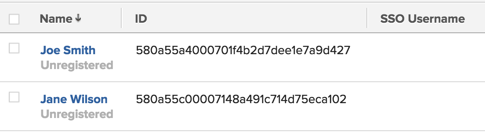

# Mettre à jour les utilisateurs et utilisatrices pour l’authentification unique

<!-- Audited: 1/2024 -->

{{important-admin-console-onboard}}

Lorsque l’authentification unique (SSO) est activée dans votre instance Adobe Workfront, vos utilisateurs et utilisatrices peuvent se connecter à Workfront à l’aide de leurs informations d’identification SSO.

Si vous avez un système existant qui est déjà rempli d’utilisateurs et d’utilisatrices associés à des informations d’identification SSO, vous pouvez importer les identifiants des utilisateurs et utilisatrices dans Workfront en important un fichier de valeurs séparées par une virgule (CSV) dans Workfront.

Pour plus d’informations sur l’intégration de Workfront avec un système SSO, voir [Vue d’ensemble de l’authentification unique dans Adobe Workfront](../../../administration-and-setup/add-users/single-sign-on/sso-in-workfront.md).

## Conditions d’accès

+++ Développez pour afficher les exigences d’accès aux fonctionnalités de cet article.

Vous devez disposer des accès suivants pour effectuer les étapes décrites dans cet article :

<table style="table-layout:auto"> 
 <col> 
 <col> 
 <tbody> 
  <tr> 
   <td role="rowheader">Formule Adobe Workfront</td> 
   <td>Tous</td> 
  </tr> 
  <tr> 
   <td role="rowheader">Licence Adobe Workfront</td> 
   <td>
Nouveau : Standard

Ou

Actuel : formule
</td> 
  </tr> 
  <tr> 
   <td role="rowheader">Configurations des niveaux d’accès</td> 
   <td> 
Vous devez être un administrateur ou une administratrice Workfront.
  </td> 
  </tr> 
 </tbody> 
</table>

Pour plus d’informations sur le contenu de ce tableau, voir [Conditions d’accès requises dans la documentation Workfront](/help/quicksilver/administration-and-setup/add-users/access-levels-and-object-permissions/access-level-requirements-in-documentation.md).

+++

## Noms d’utilisateur ou d’utilisatrice SSO

En fonction de la solution SSO que vous utilisez, le nom d’utilisateur ou d’utilisatrice dans votre environnement SSO peut être appelé de l’une des manières suivantes :

* Nom d’utilisateur SSO
* ID de fédération
* Nom d’utilisateur ou d’utilisatrice de fédération

Quel que soit le nom du nom d’utilisateur ou d’utilisatrice dans votre environnement SSO, la valeur du champ est stockée dans le champ Nom d’utilisateur ou d’utilisatrice SSO, sur l’objet Utilisateur ou utilisatrice.

Pour que vos utilisateurs et utilisatrices puissent utiliser leurs identifiants SSO pour se connecter à Workfront, vous devez mettre à jour leur profil pour inclure leur nom d’utilisateur ou d’utilisatrice SSO, en plus de leur nom d’utilisateur ou d’utilisatrice Workfront.

En tant qu’administrateur ou administratrice Workfront, vous pouvez mettre à jour en masse le champ Nom d’utilisateur ou d’utilisatrice SSO pour vos utilisateurs et utilisatrices Workfront en important une liste de noms d’utilisateur ou d’utilisatrice dans Workfront. Cette liste doit respecter les exigences suivantes :

* Contenir l’identifiant de l’utilisateur ou de l’utilisatrice Workfront (GUID) ainsi que le nom d’utilisateur ou d’utilisatrice SSO correspondant pour chaque utilisateur ou utilisatrice.
* Être enregistrée sous forme de fichier CSV ou TSV.

Ce processus met à jour les noms d’utilisateur ou d’utilisatrice SSO existants dans Workfront, ou ajoute un nouveau nom d’utilisateur ou d’utilisatrice SSO, s’il en manque un pour les utilisateurs et utilisatrices.

## Préparer le fichier d’import {#prepare-the-import-file}

Vous pouvez commencer à préparer votre fichier d’import en créant un rapport de tous les utilisateurs et utilisatrices de Workfront dont les champs Nom d’utilisateur ou d’utilisatrice SSO doivent être mis à jour.

1. Créez un rapport d’utilisateur ou d’utilisatrice dans Workfront.

   Pour obtenir des instructions sur la création de rapports des utilisateurs et utilisatrices dans Workfront, voir [Créer un rapport personnalisé](../../../reports-and-dashboards/reports/creating-and-managing-reports/create-custom-report.md).

1. Sélectionnez les champs suivants dans votre rapport :

   | champ | Explication |
   |---|---|
   | Nom | Nom complet de l’utilisateur ou de l’utilisatrice Workfront. |
   | ID | L’ID est le GUID alphanumérique de Workfront. |
   | Nom d’utilisateur SSO | L’ajout du champ Nom d’utilisateur ou d’utilisatrice SSO permet de s’assurer qu’il n’y a pas de nom d’utilisateur ou d’utilisatrice écrasé lors de l’import. Ce champ doit être vide pour tous les utilisateurs et utilisatrices, si ceux-ci n’ont pas encore été mis à jour pour la SSO. |

   

1. Enregistrez le rapport.
1. Cliquez sur **Exporter** en haut du rapport et exportez le rapport vers un fichier Excel.
1. Ouvrez le fichier Excel exporté et ajoutez vos noms d’utilisateur ou d’utilisatrice SSO pour chaque utilisateur ou utilisatrice du rapport dans la colonne Nom d’utilisateur ou d’utilisatrice SSO.

   >[!IMPORTANT]
   >
   >Les noms d’utilisateur ou d’utilisatrice SSO sont sensibles à la casse.

1. Supprimez toutes les colonnes du fichier Excel, à l’exception des colonnes **ID** et **Nom d’utilisateur ou d’utilisatrice SSO**.

1. Supprimez les en-têtes de colonne et assurez-vous qu’il n’y a pas de lignes vides en haut du rapport.

   Le fichier que vous utilisez pour mettre à jour vos utilisateurs et utilisatrices Workfront avec les noms d’utilisateur ou d’utilisatrice SSO **doit** ne contenir que 2 colonnes, et dans l’ordre suivant :

   * La première colonne doit afficher l’ID d’utilisateur ou d’utilisatrice Workfront (son GUID tel qu’il se trouve dans Workfront).
   * La deuxième colonne doit contenir le nom d’utilisateur ou d’utilisatrice SSO, tel qu’il s’affiche dans votre système SSO.
   * Les colonnes ne doivent pas avoir d’en-tête et il ne doit pas y avoir de lignes vides en haut de la liste des noms.

     

1. Enregistrez le rapport en tant que fichier CSV ou TSV sur votre ordinateur.

## Mettre à jour les utilisateurs et utilisatrices pour la SSO {#update-your-users-for-sso}

Le processus de mise à jour des utilisateurs et utilisatrices pour la SSO ajoute le champ Nom d’utilisateur ou d’utilisatrice SSO à vos utilisateurs et utilisatrices Workfront s’il n’existe pas, ou met à jour la valeur de ce champ s’il existe déjà une valeur associée aux utilisateurs et utilisatrices.

{{step-1-to-setup}}

1. Cliquez sur **Système**, puis sélectionnez **Mettre à jour les utilisateurs pour SSO**.

1. Cliquez sur **Choisir un fichier** pour rechercher le fichier que vous avez préparé.

   Pour plus d’informations sur la préparation de ce fichier, voir [Préparer le fichier d’import](#prepare-the-import-file).

1. Sélectionnez le fichier à partir de l’endroit où il est enregistré sur votre ordinateur, puis cliquez sur **Ouvrir**.

   Cette opération insère les identifiants SSO dans Workfront, ce qui permet à tous les utilisateurs et utilisatrices de se connecter à Workfront à l’aide de leurs informations d’identification SSO.

   Le paramètre **Autoriser uniquement l’authentification `<SSO Configuration>`** est activé pour tous les utilisateurs et utilisatrices inclus dans le fichier CSV. Cela garantit que les utilisateurs et utilisatrices doivent se connecter via la SSO.

## Vérifier la SSO par rapport aux noms de vos utilisateurs et utilisatrices Workfront

Pour obtenir des instructions sur la création d’un rapport sur les utilisateurs et utilisatrices contenant des informations sur le nom d’utilisateur ou d’utilisatrice SSO, voir [Préparer le fichier d’import](#prepare-the-import-file).

1. Exécutez un rapport sur les utilisateurs et utilisatrices contenant des informations sur le nom d’utilisateur ou d’utilisatrice SSO.

   Notez que la colonne Nom d’utilisateur ou d’utilisatrice SSO est remplie pour chaque utilisateur ou utilisatrice.

1. Assurez-vous que les valeurs de la colonne de Nom d’utilisateur ou d’utilisatrice SSO correspondent à celui sur votre serveur SSO.
1. Si la colonne Nom d’utilisateur SSO est vide, mettez à jour les noms de vos utilisateurs et utilisatrices.

   

   Pour obtenir des instructions sur la mise à jour de vos utilisateurs et utilisatrices pour la SSO, voir [Mettre à jour vos utilisateurs et utilisatrices pour la SSO](#update-your-users-for-sso).
