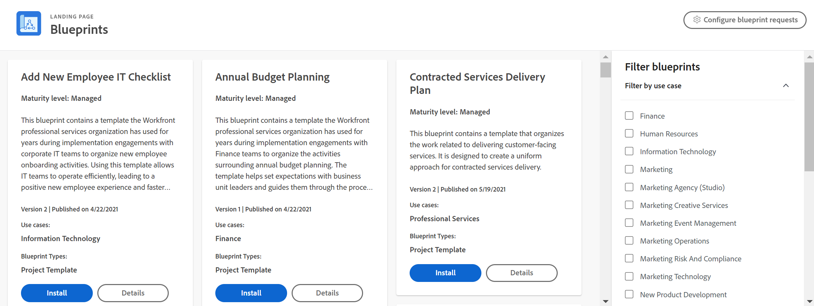

# Vue d’ensemble des plans directeurs

<!--Audited: 01/2024-->

Les plans directeurs sont des ensembles d’objets Workfront qui répondent à des cas d’utilisation communs dans Workfront. Vous pouvez télécharger et installer un plan directeur, puis configurer les objets en fonction de votre cas d’utilisation spécifique.

>[!INFO]
>
>Exemples :
>
>* **Configuration de l’organisation des ressources humaines**
>
>   Ce plan directeur contient la configuration des structures organisationnelles pour le développement d’un service des ressources humaines.
>
>* **Liste de contrôle informatique pour l’ajout d’une nouvelle personne employée**
>
>   Ce plan directeur contient un modèle pour organiser les activités d’intégration des nouvelles personnes employées. L’utilisation de ce modèle permet aux équipes informatiques de travailler efficacement, ce qui se traduit par une expérience positive pour les nouvelles personnes employées et un accès plus rapide à la productivité.
>
>* **Bases de l’instance héritée - Liste de contrôle**
>
>    Ce plan directeur contient un modèle de projet (ou liste de contrôle) que vous pouvez consulter avec une courte liste de questions, de ressources et de liens pour bien comprendre comment votre instance Workfront a été configurée. Utilisez-le lorsque vous avez récemment hérité d’une instance de Workfront et que vous avez besoin de conseils pour savoir par où commencer.
>
>Pour consulter les plans directeurs actuels, voir [Liste des plans directeurs disponibles](/help/quicksilver/administration-and-setup/blueprints/list-of-available-blueprints.md).

Les plans directeurs fournissent des éléments de base pour vous aider à créer un système de gestion du travail qui évolue avec vous. Les administrateurs et administratrices système peuvent parcourir le catalogue de plans directeurs et installer des modèles de projet, des tableaux de bord et des structures organisationnelles prêts à l’emploi. Les autres personnes peuvent parcourir le catalogue et demander l’installation d’un plan directeur. Pour plus d’informations, voir [Parcourir le catalogue des plans directeurs et demander l’installation des plans](../../administration-and-setup/blueprints/browse-catalog.md).

Chaque plan directeur est destiné à un service et à un niveau de maturité spécifique afin de vous aider à mettre en œuvre plus rapidement les meilleures pratiques éprouvées dans votre système. Les niveaux de maturité détaillés ci-dessous sont indiqués dans la carte de catalogue des plans directeurs et dans les détails.

* **[!UICONTROL Géré] :** les modèles de projets gérés aident à soutenir l’adoption d’une nouvelle gestion commerciale avant que les activités et les livrables ne soient pleinement acceptés comme procédure standard. Ils contiennent des tâches permettant de s’assurer que chaque étape du nouveau processus est respectée.

* **[!UICONTROL Intégré] :** les modèles de projets intégrés partent du principe que les fonctions commerciales sont soutenues par une procédure opérationnelle standard. Les personnes participant au processus connaissent les étapes et les tâches qu’elles doivent accomplir pour suivre le processus. Les modèles de projet destinés à soutenir ce processus contiennent moins de tâches pour ne suivre que les étapes et autres résultats clés nécessaires à la création de rapports.

## Trouver le bon plan directeur

Vous pouvez parcourir les plans directeurs par cas d’utilisation, niveau de maturité, statut d’installation et type à l’aide des filtres situés à droite du catalogue. Une fois que vous avez trouvé un plan directeur qui vous intéresse, vous pouvez afficher les détails sur la page des détails.

### Types de plan directeur

Le type de plan directeur indique ce qui est inclus dans le plan. Le type est indiqué au bas de la carte du plan directeur dans le catalogue. Notez qu’un plan directeur peut avoir plus d’un type.

Les types de plans directeurs suivants sont disponibles :

* **Modèles de projet** : ce type comprend les objets standard associés à un modèle de projet (tâches, problèmes, rôles et équipes), ainsi que certaines préférences liées à ces objets. Pour plus d’informations, voir [Configurer un plan directeur](../../administration-and-setup/blueprints/configure-template-package.md).
* **Structures organisationnelles** : ce type inclut les objets associés à la structure d’une organisation (entreprises, groupes, rôles et équipes). Pour plus d’informations, voir [Configurer un plan directeur](../../administration-and-setup/blueprints/configure-template-package.md).
* **Tableaux de bord** : ce type comprend un ou plusieurs tableaux de bord pour un cas d’utilisation spécifique, tel que les services de mise en œuvre.
<!--
* Request queues: Includes one or more projects configured as request queues.
* Custom forms: Includes custom forms attached to another object type, such as a project or portfolio.
* Setup features: Includes one or more elements that are configured in the Setup area of Workfront, such as layout templates.
-->

Pour consulter les plans directeurs actuels, voir [Liste des plans directeurs disponibles](/help/quicksilver/administration-and-setup/blueprints/list-of-available-blueprints.md).

### Afficher les détails

Chaque plan directeur contient une page de détails. À partir de cette page, vous pouvez effectuer les opérations suivantes :

* Afficher un résumé du contenu du workflow
* Lire un bref résumé du plan directeur
* Afficher l’historique de l’installation (cliquez sur **[!UICONTROL Voir les détails]** pour voir la liste intégrale des objets installés avec le plan directeur)
* Voir les descriptions des rôles, des équipes, des entreprises et des groupes
* Voir un exemple visuel du plan directeur spécifique, tel qu’un modèle de projet (vous pouvez prévisualiser l’image intégrale dans le navigateur ou la télécharger).

![[!UICONTROL Page Détails du plan directeur]](assets/blueprint-details-page-2022.png)

## Installer un plan directeur

Un administrateur ou une administratrice Workfront peut installer un plan directeur directement dans n’importe quel environnement (Production, Prévisualisation ou Sandbox). Pour en savoir plus, voir [Installer un plan directeur](../../administration-and-setup/blueprints/blueprints-install.md) ou [Configurer un plan directeur](../../administration-and-setup/blueprints/configure-template-package.md).

Après l’installation, il se peut que vous ne sachiez pas quelles sont les meilleures actions à entreprendre. Pour plus d’informations, voir [Actions à entreprendre après l’installation d’un plan directeur](../../administration-and-setup/blueprints/best-next-actions-after-install.md).

## Notes supplémentaires sur les plans directeurs et les modèles

Les plans directeurs ne remplacent pas la fonctionnalité des modèles de projet dans [!DNL Adobe Workfront]. Les plans directeurs sont un moyen pour vous de créer des modèles plus rapidement afin d’organiser davantage votre travail dans [!DNL Workfront].

Vous ne pouvez pas copier ou modifier un plan directeur. Cependant, une fois que vous avez installé la solution à partir d’un plan directeur, vous pouvez modifier le modèle de projet, les fonctions ou les équipes créés à partir du plan directeur de la même manière que vous mettez à jour ces enregistrements dans l’interface [!DNL Workfront]. En outre, lorsque vous installez un plan directeur, le modèle est stocké dans la zone [!UICONTROL Modèles] de [!DNL Workfront] et le plan directeur original reste dans la zone [!UICONTROL Plans directeurs]. Il n’est pas nécessaire de faire une copie du modèle avant de commencer à l’adapter à vos besoins.

Les plans directeurs ne suppriment ni ne remplacent aucun élément configuré dans votre environnement. Si vous avez l’intention de remplacer un modèle existant en installant un plan directeur qui crée un nouveau modèle, nous vous recommandons de désactiver la version précédente afin d’éviter toute confusion parmi vos planificateurs et planificatrices qui créent des projets à partir de modèles.
