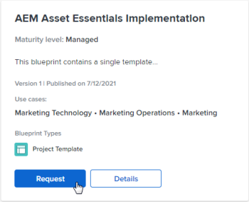

# Consulter le catalogue de plans directeurs et demander l’installation de plans directeurs

Les plans directeurs fournissent des éléments de base pour vous aider à créer un système de gestion du travail qui se développe avec vous. Tous les utilisateurs de [!DNL Adobe Workfront] peuvent parcourir le catalogue de plans directeurs. Vous pouvez également envoyer une requête pour que votre administrateur [!DNL Workfront] installe un plan directeur spécifique si votre administrateur a activé les demandes de plan directeur.

Seul l’administrateur système peut installer les plans directeurs. Pour plus d’informations, voir [Installation d’un plan directeur](../../administration-and-setup/blueprints/blueprints-install.md).

## Conditions d’accès

Vous devez disposer des accès suivants pour effectuer les étapes de cet article :

<table style="table-layout:auto"> 
 <col> 
 <col> 
 <tbody> 
  <tr> 
   <td role="rowheader"><strong>[!DNL Adobe Workfront] plan</strong></td> 
   <td> 
 N’importe quelle
 </td> 
  </tr> 
  <tr> 
   <td role="rowheader"><strong>Adobe de la licence [!DNL Workfront]</strong></td> 
   <td> 
[!UICONTROL Request] ou version ultérieure
 </td> 
  </tr>
 </tbody> 
</table>

## Parcourir le catalogue des plans directeurs

Le catalogue affiche tous les plans directeurs disponibles pour votre organisation. Pour plus d’informations sur les plans directeurs, tels que les types de plan directeur et les niveaux de maturité, consultez la [présentation des plans directeurs](../../administration-and-setup/blueprints/blueprints-overview.md).

1. Cliquez sur l’icône **[!UICONTROL Menu principal]**  dans le coin supérieur droit de [!DNL Adobe Workfront], puis cliquez sur **[!UICONTROL Blueprints]**.
1. Parcourez le catalogue de plans directeurs.
1. Utilisez le panneau de filtrage à droite pour filtrer le catalogue selon les options suivantes :

   * Cas pratique (par exemple, [!UICONTROL Ressources humaines] ou [!UICONTROL Marketing])
   * Niveau de maturité ([!UICONTROL managed] ou [!UICONTROL integrated])
   * État d’installation ([!UICONTROL installé] ou non [!UICONTROL installé])
   * Type de plan directeur (<!--Custom Form, -->[!UICONTROL Tableau de bord], [!UICONTROL Structure organisationnelle], [!UICONTROL Modèle de projet]<!--, Request Queue, Setup Feature-->)

1. (Facultatif) Cliquez sur **[!UICONTROL Details]** sur un plan directeur pour découvrir son fonctionnement.

   Pour plus d&#39;informations sur le contenu disponible sur la page [!UICONTROL Détails], consultez la [présentation des plans directeurs](../../administration-and-setup/blueprints/blueprints-overview.md).

## Demande d’installation d’un plan directeur

Vous pouvez demander l’installation d’un plan directeur si votre administrateur système autorise les demandes de plan directeur. Pour plus d’informations, voir [Configurer l’accès aux plans directeurs](../../administration-and-setup/blueprints/configure-access-to-blueprints.md).

Lorsque vous demandez l’installation d’un plan directeur, la demande est envoyée à l’administrateur système. Une fois la demande terminée, vous en êtes informé en fonction de vos préférences de notification.

1. Cliquez sur l’icône **[!UICONTROL Menu principal]**  dans le coin supérieur droit de [!DNL Adobe Workfront], puis cliquez sur **[!UICONTROL Blueprints]**.
1. Recherchez le plan directeur que vous souhaitez installer. Vous pouvez filtrer par cas d’utilisation, niveau de maturité, état d’installation et saisir à l’aide des filtres du panneau de droite.
1. Cliquez sur **[!UICONTROL Demander]** sur le plan directeur.

   Si le bouton **[!UICONTROL Demander]** n’apparaît pas sur le plan directeur, votre administrateur système n’a pas activé les requêtes.

   
