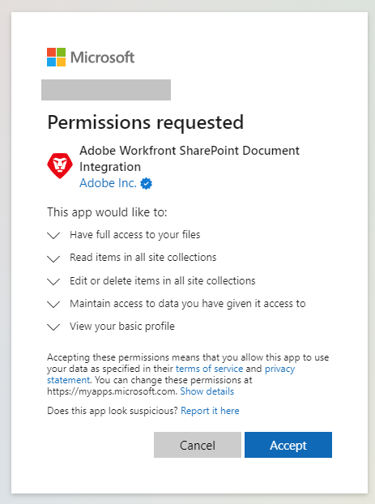

# Configurer l’intégration [!DNL SharePoint]

<!--Audited: 12/2023-->

<!--
<p data-mc-conditions="QuicksilverOrClassic.Draft mode">**DON'T DELETE, DRAFT OR HIDE THIS ARTICLE. IT IS LINKED TO THE PRODUCT, THROUGH THE CONTEXT SENSITIVE HELP LINKS. **</p>
-->

>[!IMPORTANT]
>
>La nouvelle intégration [!DNL SharePoint] a été mise en production avec la version 22.3 (juillet 2022).
>
>* Bien que vos utilisateurs puissent toujours accéder aux documents liés par l’intégration [!DNL SharePoint] héritée, ils ne peuvent pas lier de documents par celle-ci. ils doivent utiliser la nouvelle intégration [!DNL SharePoint] pour lier des documents depuis SharePoint.
>
>* Si aucune intégration SharePoint héritée n’est configurée, vous ne pouvez pas l’ajouter. Vous devez utiliser la nouvelle intégration de SharePoint pour lier des documents à SharePoint.
>
>* La nouvelle intégration SharePoint peut ne pas nécessiter une configuration par un administrateur ou une administratrice et peut être configurée par des personnes individuelles. Toutefois, pour garantir une transition en douceur vers la nouvelle intégration de SharePoint, un administrateur ou une administratrice Workfront doit apporter quelques modifications mineures aux paramètres dans la zone Configuration de Workfront.
>
>    Pour plus d’informations et des instructions, voir [Configuration de l’intégration SharePoint héritée pour un accès continu aux documents](#configure-the-legacy-sharepoint-integration-for-continued-access-to-documents) dans cet article.
>    
>* Nous recommandons aux personnes de lier des documents qui sont actuellement liés par l’intermédiaire de l’intégration [!DNL SharePoint] héritée par le biais de la nouvelle intégration.
>    
>    Pour plus d’informations sur la liaison de documents, voir [Lier des documents provenant d’applications externes](../../documents/adding-documents-to-workfront/link-documents-from-external-apps.md).

Vous pouvez intégrer [!DNL Workfront] avec [!DNL SharePoint Online], ce qui permet aux personnes de naviguer, de lier et d’ajouter des documents [!DNL SharePoint] dans Workfront. La fonctionnalité fournie est similaire à celle d’autres intégrations [!DNL Workfront], telles que [!DNL Google Drive], [!DNL Box] et [!DNL Dropbox].

Cette intégration est compatible uniquement avec [!DNL SharePoint Online]. Les instances on-premise de [!DNL SharePoint] ne sont pas prises en charge.

## Conditions d’accès

+++ Développez pour afficher les exigences d’accès aux fonctionnalités de cet article.

<table style="table-layout:auto"> 
 <col> 
 <col> 
 <tbody> 
  <tr> 
   <td role="rowheader">Package Workfront</td> 
   <td><p>Tous</p></td> 
  </tr> 
  <tr> 
   <td role="rowheader">Licence Adobe Workfront</td> 
   <td><p>Standard</p> <p>Plan</p></td> 
  </tr> 
  <tr> 
   <td role="rowheader">Configurations des niveaux d’accès</td> 
   <td>Vous devez être un administrateur ou une administratrice Workfront. </td> 
  </tr> 
 </tbody> 
</table>

Pour plus d’informations, voir [Conditions d’accès requises dans la documentation Workfront](/help/quicksilver/administration-and-setup/add-users/access-levels-and-object-permissions/access-level-requirements-in-documentation.md).

+++

## Conditions préalables

Vous devez disposer des autorisations ou d’accès nécessaires dans [!DNL SharePoint] pour modifier ou configurer votre intégration [!DNL SharePoint].

## Lier des documents par le biais de la nouvelle intégration SharePoint

Les personnes individuelles peuvent lier des documents par le biais de la nouvelle intégration [!DNL SharePoint]. L’intégration ne nécessite pas de configuration par un administrateur ou une administratrice. À la place, la personne se connecte à son compte [!DNL Microsoft] lors de la liaison d’un document, ce qui permet à l’intégration d’accéder aux documents disponibles dans son [!DNL SharePoint].

La première fois qu’une personne connecte l’intégration [!DNL Workfront] [!DNL SharePoint] à son compte [!DNL SharePoint], elle verra et acceptera toutes les autorisations que [!DNL Workfront] utilise lors de l’interaction avec son compte [!UICONTROL SharePoint] ou elle sera en mesure de demander des autorisations à son administrateur ou administratrice Microsoft. Les autorisations de lecture permettent à [!DNL Workfront] d’afficher les fichiers et d’y accéder sur [!DNL SharePoint], et les autorisations d’écriture permettent à la personne de charger des fichiers dans [!DNL SharePoint].



Pour obtenir des instructions sur la liaison de documents par le biais de la nouvelle intégration [!DNL SharePoint], voir [Lier un document externe à  [!DNL Workfront]](../../documents/adding-documents-to-workfront/link-documents-from-external-apps.md#link-an-external-document-to-workfront).

>[!NOTE]
>
>* Selon la configuration Microsoft de l’entreprise, les personnes peuvent voir une page « Approbation requise » au lieu d’une page « Autorisations demandées ». Dans ce cas, les personnes peuvent utiliser cette page pour demander à l’administrateur ou administratrice Microsoft de l’entreprise d’accorder des autorisations sur l’intégration SharePoint.
>
>* Une intégration [!DNL SharePoint] peut se connecter à une seule instance [!DNL SharePoint]. Par conséquent, une personne peut configurer une intégration pour un [!DNL SharePoint], mais ne peut pas configurer une intégration sur un second [!DNL SharePoint], même si elle dispose d’autorisations sur des documents du deuxième [!DNL SharePoint].
>
>* Une personne a accès aux mêmes sites, collections, dossiers, sous-dossiers et fichiers par l’intermédiaire de l’intégration [!DNL Workfront] [!DNL SharePoint] que dans son compte [!DNL SharePoint].

### Lier des documents provenant de SharePoint

Pour obtenir des instructions sur la liaison de documents provenant de SharePoint par le biais de la nouvelle intégration [!DNL SharePoint], voir [Lier un document externe à  [!DNL Workfront]](../../documents/adding-documents-to-workfront/link-documents-from-external-apps.md#link-an-external-document-to-workfront).

### Envoyer des documents à SharePoint

Pour envoyer un document à SharePoint, procédez comme suit :

1. Cliquez sur l’icône **Envoyer à**  et sélectionnez SharePoint (API graphique).
1. (Facultatif) Recherchez dans la barre de recherche le site ou le dossier dans lequel vous souhaitez envoyer le document.
1. Sélectionnez le site ou le dossier dans la liste.

   * Les sites sont marqués par .

   * Les dossiers sont marqués par .

   * Les fichiers ne sont pas marqués par une icône.

1. Cliquer sur **Enregistrer**.


## Informations sur la sécurité, l’accès et l’autorisation pour l’intégration [!DNL SharePoint]

### Authentification et autorisation

[!DNL Workfront] utilise OAuth2 pour récupérer un jeton d’accès et un jeton d’actualisation. Ce jeton d’accès est utilisé pour l’autorisation avec tous les zones [!DNL SharePoint].

### Accès et autorisations

La première fois qu’une personne ajoute un document à [!DNL Workfront] à partir de [!DNL SharePoint], elle est redirigée vers la page Autorisations demandées où elle peut accorder des autorisations pour son intégration SharePoint.

>[!NOTE]
>
>Selon la configuration Microsoft de l’entreprise, les personnes peuvent voir une page « Approbation requise » au lieu d’une page « Autorisations demandées ». Dans ce cas, les personnes peuvent utiliser cette page pour demander à l’administrateur ou administratrice Microsoft de l’entreprise d’accorder des autorisations sur l’intégration SharePoint.

Les autorisations suivantes sont demandées :

| Accès | Raison |
|---|---|
| Disposer d’un accès intégral à vos fichiers | Permet à [!DNL Workfront] d’accéder aux fichiers d’un utilisateur ou d’une utilisatrice afin de lier des ressources. Lorsque des documents sont envoyés à partir de [!DNL Workfront] vers [!DNL SharePoint], [!DNL Workfront] nécessite l’accès pour créer la ressource. |
| Lire des éléments dans toutes les collections du site | Permet à [!DNL Workfront] de lire les ressources afin d’activer la navigation des personnes. |
| Modifier ou supprimer des éléments dans toutes les collections du site | Permet à [!DNL Workfront] de créer des ressources dans des sites et des collections de sites. La suppression n’est utilisée que lors du nettoyage après des tentatives de lien infructueuses. |
| Maintenir l’accès aux données auxquelles vous lui avez donné accès. | Permet à [!DNL Workfront] de générer un jeton d’actualisation. |
| Se connecter et lire le profil d’utilisateur ou d’utilisatrice | Permet à [!DNL Workfront] d’utiliser le jeton d’accès pour agir au nom de la personne, via le flux de connexion OAuth2. |

* Cet accès est accordé par la personne la première fois qu’elle utilise l’intégration et peut être révoqué à tout moment.
* Les autorisations demandées pour cette intégration sont des autorisations **déléguées**.
* [!DNL Workfront] demande l’accès minimal requis pour effectuer des opérations dans l’intégration.
* L’accès à l’affichage, à la modification ou la suppression d’un document [!DNL Adobe Workfront] lié à [!DNL SharePoint] repose sur l’accès de la personne dans [!DNL Workfront]. Cependant, toute navigation, tout téléchargement ou modification d’un fichier ou dossier [!DNL SharePoint] requiert l’accès à [!DNL SharePoint] et l’accès à ces actions est contrôlé par [!DNL SharePoint].
* Les personnes peuvent afficher des miniatures et prévisualiser des images provenant de [!DNL SharePoint], et peuvent afficher les noms de fichiers et de dossiers dans [!DNL SharePoint], sans se connecter à [!DNL SharePoint].
* Le jeton d’accès d’une personne est utilisé uniquement lorsque cette dernière est hors ligne et qu’une autre personne affiche le contenu d’un dossier lié à [!DNL Workfront]. Le jeton d’accès permet de savoir si des documents du dossier ont été ajoutés, supprimés ou modifiés.

### Sécurité

Toutes les communications entre [!DNL Workfront] et [!DNL SharePoint] sont effectuées par HTTPS, qui chiffre l’information.

[!DNL Workfront] ne stocke pas, ne copie pas et ne duplique pas les données de [!DNL SharePoint]. La seule exception est que [!DNL Workfront] stocke les miniatures de [!DNL SharePoint] pour afficher la vue Liste dans l’Aperçu.

Si une ressource a été chargée pour la première fois dans [!DNL Workfront], puis envoyée à [!DNL SharePoint], [!DNL Workfront] conserve les données du premier fichier, car les personnes peuvent télécharger une version précédente d’un document [!DNL Workfront]. Si un document a été créé dans [!DNL SharePoint], [!DNL Workfront] ne stocke pas ces données de fichier.

## Configurer l’intégration [!DNL SharePoint] héritée pour maintenir l’accès aux documents

Pour vous assurer que vos utilisateurs et utilisatrices continuent d’accéder aux documents liés à Workfront par le biais de l’intégration [!DNL SharePoint] héritée, vous devez reconfigurer l’accès à l’intégration [!DNL SharePoint] héritée et tenir le secret client SharePoint à jour.

* [Reconfigurer l’accès à l’intégration  [!DNL SharePoint]  héritée](#reconfigure-access-to-the-legacy-sharepoint-integration)
* [Configurer le secret client pour maintenir l’accès à l’intégration  [!DNL SharePoint]  héritée](#configure-the-client-secret-for-continued-access-to-the-legacy-sharepoint-integration)

### Reconfigurer l’accès à l’intégration [!DNL SharePoint] héritée

La reconfiguration de l’intégration [!DNL SharePoint] héritée permet à vos utilisateurs et utilisatrices d’accéder aux documents liés par l’intermédiaire de l’intégration [!DNL SharePoint] héritée, tout en veillant à ce que vos utilisateurs et utilisatrices ne puissent pas lier de nouveaux documents par le biais de cette intégration.

>[!NOTE]
>
> * L’intégration [!DNL SharePoint] héritée est étiquetée « [!DNL SharePoint] ».
> * La nouvelle intégration [!DNL SharePoint] est étiquetée « [!UICONTROL [!DNL SharePoint] (API graphique)] ».

1. Cliquez sur l’icône **[!UICONTROL Menu principal]**  dans le coin supérieur droit d’Adobe Workfront, ou (le cas échéant), cliquez sur l’icône **[!UICONTROL Menu principal]**  dans le coin supérieur gauche, puis cliquez sur **[!UICONTROL Configuration]** .
1. Sélectionnez **[!UICONTROL Documents]** dans le volet de navigation de gauche, puis sélectionnez **[!UICONTROL Fournisseurs de services cloud]**.
1. Assurez-vous que l’option **[!DNL SharePoint]** et l’option **[!UICONTROL [!DNL SharePoint](API graphique)]** sont toutes les deux activées.
1. Cliquer sur **[!UICONTROL Enregistrer]**.
1. Sélectionnez **[!UICONTROL Documents]** dans le volet de navigation de gauche, puis sélectionnez Intégration **[!UICONTROL [!DNL SharePoint]]**.
1. Cochez la case à gauche de la liste pour toutes les intégrations existantes, puis sélectionnez **[!UICONTROL Désactiver]**.


### Configurer le secret client pour maintenir l’accès à l’intégration [!DNL SharePoint] héritée

Votre secret client [!DNL SharePoint] expire une fois par an. Pour garantir le maintient de l’accès aux documents dans votre intégration [!DNL SharePoint], vous devez conserver son secret client [!DNL SharePoint] à jour.

>[!IMPORTANT]
>
> Parce que les secrets clients [!DNL SharePoint] sont gérés par [!DNL Microsoft], leurs fonctionnalités et procédures peuvent changer en fonction des mises à jour apportées à [!DNL SharePoint] par [!DNL Microsoft]. Consultez toujours la documentation [!DNL Microsoft] pour obtenir les informations les plus récentes sur les procédures et les fonctionnalités dans [!DNL SharePoint].

<!--1. Go to the site that your [!DNL SharePoint] integration uses. This may be a site that you created when setting up the integrations, or it may be your organization's root site.

1. Add `/_layouts/15/appregnew.aspx` to the end of the URL in the search bar at the top of your browser window.-->

1. Générez un nouveau secret client, comme décrit dans la section [Remplacer un secret client arrivant à expiration dans un module complémentaire  [!DNL SharePoint] ](https://docs.microsoft.com/en-us/sharepoint/dev/sp-add-ins/replace-an-expiring-client-secret-in-a-sharepoint-add-in#generate-a-new-secret).
1. Copiez ce secret client vers un emplacement sécurisé.
1. Connectez-vous à [!DNL Workfront] en tant qu’administrateur ou administratrice.
1. Dans Workfront, cliquez sur l’icône **[!UICONTROL Menu principal]**  dans le coin supérieur droit d’Adobe Workfront, ou (le cas échéant), cliquez sur l’icône **[!UICONTROL Menu principal]**  dans le coin supérieur gauche, puis cliquez sur **[!UICONTROL Configuration]** .
1. Dans le panneau de gauche, cliquez sur **[!UICONTROL Documents]** > **[!UICONTROL [!DNL SharePoint]Intégration]**.
1. Cliquez sur l’intégration [!DNL SharePoint] à mettre à jour, puis cliquez sur **[!UICONTROL Modifier]**.
1. Accéder à la section **Inforamtions de connexion** dans la fenêtre de modification, puis saisissez le nouveau secret client dans le champ **[!UICONTROL Secret client SharePoint]**.
1. Cliquer sur **[!UICONTROL Enregistrer]**.

<!--

## Instructions for setting up the legacy SharePoint integration

>[!IMPORTANT]
>
>This integration has been deprecated. The instructions here are for information only and will be removed in the near future.


Workfront connects to [!DNL SharePoint] Online using OAuth 2.0, a standard used by most web-based integrations for the authentication and authorization of users.

To configure OAuth, you need to create a [!DNL SharePoint] site and a Site App within [!DNL SharePoint]. This process is described in the following sections.

For more information about OAuth, see [http://oauth.net](http://oauth.net/).

>[!TIP]
>
>To make it easy to copy and paste information between [!DNL Workfront] and [!DNL SharePoint] in these steps, we recommend keeping both applications open in separate tabs.

* [Create and configure a [!DNL SharePoint] site](#create-and-configure-a-sharepoint-site) 
* [Grant write permissions to the site app](#grant-write-permissions-to-the-site-app) 
* [Create a [!DNL Workfront] [!DNL SharePoint] integration instance](#create-a-workfront-sharepoint-integration-instance) 
* [Complete your integration](#complete-your-integration) 
* [Add documents](#add-documents)

### Create and configure a [!DNL SharePoint] site  {#create-and-configure-a-sharepoint-site}

In order for [!DNL Workfront] to authenticate with [!DNL SharePoint], [!DNL Workfront] ca use a master site where users have the [!UICONTROL Full Control] permission level or specific Manage permissions. This master site acts as an Authentication Entry Point for [!DNL Workfront].

To create and configure a [!DNL SharePoint] Site:

1. (Optional) If you do not want to use your organization's root site, you can create a master site in [!DNL SharePoint].

   For instructions, visit [Create a site](https://docs.microsoft.com/en-us/sharepoint/create-site-collection) in the [!DNL Microsoft] Documentation.

   * Select the **[!UICONTROL Team Site]** option when creating the site.

1. (Conditional) If you created a site in step 1, go to the site you just created.

   Or

   If you did not create a site in step 1, go to your organization's root site.

1. Add `/_layouts/15/appregnew.aspx` to the end of the URL in the search bar at the top of your browser window.
1. Configure the following fields:

   <table style="table-layout:auto"> 
    <col> 
    <col> 
    <tbody> 
     <tr> 
      <td role="rowheader"> <p>[!UICONTROL Client ID]</p> </td> 
      <td> <p>Click <strong>[!UICONTROL Generate]</strong> to generate a Client ID. Copy this ID to a secure location. You will use it later when you set up the [!DNL SharePoint] integration in [!DNL Workfront].</p> </td> 
     </tr> 
     <tr> 
      <td role="rowheader"> <p>[!UICONTROL Client Secret]</p> </td> 
      <td> <p>Click <strong>[!UICONTROL Generate]</strong> to generate a Client Secret. Copy this Secret to a secure location. You will use it later when you set up the [!DNL SharePoint] integration in [!DNL Workfront].</p> </td> 
     </tr> 
     <tr> 
      <td role="rowheader"> <p>Title</p> </td> 
      <td> <p>Enter a title, such as [!DNL Workfront] Site App. Users see this title when adding documents..</p> </td> 
     </tr> 
     <tr> 
      <td role="rowheader"> <p>[!UICONTROL App Domain]</p> </td> 
      <td> <p><code>my.workfront.com</code> </p> </td> 
     </tr> 
     <tr> 
      <td role="rowheader"> <p>[!UICONTROL Redirect URI]</p> </td> 
      <td> <p><code>https://oauth.my.workfront.com/oauth2/redirect</code> </p> </td> 
     </tr> 
    </tbody> 
   </table>

1. Click **[!UICONTROL Create]**
1. Continue to [Grant write permissions to the site app](#grant-write-permissions-to-the-site-app).

### Grant write permissions to the site app  {#grant-write-permissions-to-the-site-app}

At this point, you have successfully created a Site App and registered it within [!DNL Workfront]. This site app is also known as an app principal in [!DNL SharePoint]. It resides within your tenant. New site apps do not automatically have access to site collections within the tenant. Permissions must be granted explicitly, for each site collection. The steps below will show you how to grant Write permission to the new Site App a site collection. Repeat these steps for each of the site collections you added under [!UICONTROL Visible Site Collections] in the steps above.

This site app must have [!UICONTROL Write] permission to any site collections that users need to access through [!DNL Workfront].

1. Add '/_layouts/15/appinv.aspx' to the URL in [!DNL Sharepoint].

   **Example:**

   ```
   https://mycompany.sharepoint.com/sites/mysite/_layouts/15/appinv.aspx
   ```

1. Configure the following fields

   <table style="table-layout:auto"> 
    <col> 
    <col> 
    <tbody> 
     <tr> 
      <td role="rowheader">[!UICONTROL App ID]</td> 
      <td> <p>Add the Client ID that you created in <a href="#create-and-configure-a-sharepoint-site" class="MCXref xref">Create and configure a [!DNL SharePoint] site </a>and click <strong>[!UICONTROL Lookup]</strong>.</p> </td> 
     </tr> 
     <tr> 
      <td role="rowheader"> <p>[!UICONTROL Client] / [!UICONTROL App Domain] / [!UICONTROL Redirect URL]</p> </td> 
      <td> <p>These automatically fill when you click [!UICONTROL Lookup].</p> </td> 
     </tr> 
     <tr> 
      <td role="rowheader">[!UICONTROL Permission Request XML]</td> 
      <td> <p>Copy the following XML to the [!UICONTROL Permission Request XML] field. Make sure that it is added exactly as shown without additional spaces etc. in order to avoid errors.</p> 
      <div></a> 
      <div style="mc-code-lang: XML;" class="codeSnippetBody" data-mc-continue="False" data-mc-line-number-start="1" data-mc-use-line-numbers="False"> 
       <pre><code><span style="color: #63a35c; ">&lt;AppPermissionRequests&gt;</span><br><span style="color: #63a35c; ">&lt;AppPermissionRequest <span style="color: #795da3; ">Scope</span><span style="color: #df5000; ">="http://sharepoint/content/sitecollection/web"</span> <span style="color: #795da3; ">Right</span><span style="color: #df5000; ">="Write"</span>/&gt;</span><br><span style="color: #63a35c; ">&lt;/AppPermissionRequests&gt;</span></code></pre> 
      </div> 
      </div> </td> 
     </tr> 
    </tbody> 
   </table>

1. Click **[!UICONTROL Create]**. 
1. In the dialog that appears, click **[!UICONTROL Trust it]**.
1. Verify that the site app has access to the site collection by clicking the **[!UICONTROL Site collection app permissions]** link in [!UICONTROL Site Settings].
1. Repeat the steps above for the remaining site collections, then continue with [Create a [!DNL Workfront] [!DNL SharePoint] integration instance](#create-a-workfront-sharepoint-integration-instance).

### Create a [!DNL Workfront] [!DNL SharePoint] integration instance {#create-a-workfront-sharepoint-integration-instance}

When you have created a site app in [!DNL SharePoint], you can now copy information from the site app into [!DNL Workfront]. The site app is an app principal and acts as the conduit through which OAuth requests are made to access documents within site collections.

1. Log into [!DNL Workfront] as an administrator.
1. Click the **[!UICONTROL Main Menu]** icon  in the upper-right corner of Adobe Workfront, then click **[!UICONTROL Setup]** .

1. In the left panel, click **[!UICONTROL Documents]** > **[!UICONTROL [!DNL SharePoint] Integration]**.
1. Click **[!UICONTROL Add [!DNL SharePoint]]**.
1. Configure the following fields:

   <table style="table-layout:auto"> 
    <col> 
    <col> 
    <tbody> 
     <tr> 
      <td role="rowheader"> <p>[!UICONTROL Name]</p> </td> 
      <td> <p>Enter a name for the [!DNL SharePoint] integration. Users see this name when they click [!UICONTROL Add] &gt; [!UICONTROL From] 'name of integration'. </p> </td> 
     </tr> 
     <tr> 
      <td role="rowheader"> <p>[!UICONTROL [!DNL SharePoint] Host Instance]</p> </td> 
      <td> <p><code>&lt;YourDomain&gt;.sharepoint.com</code> </p> </td> 
     </tr> 
     <tr> 
      <td role="rowheader"> <p>[!UICONTROL [!DNL Azure] Access Domain]</p> </td> 
      <td> <p><code>&lt;YourDomain&gt;.onmicrosoft.com</code> </p> <p>This refers to the Master Site that users will use to authenticate through. It is likely the same domain as the [!UICONTROL [!DNL SharePoint] Host Instance].</p> </td> 
     </tr> 
     <tr> 
      <td role="rowheader"> <p>
      </p> </td> 
      <td> <b>Important</b> Site collections are used only in the Legacy [!DNL SharePoint] Integration.
       <ul> 
        <li> <p><b>If you are using your organization's root site</b><b>:</b> </p> <p>Enter <code>/</code></p> </li> 
        <li> <p><b>If you are using a master site and subsites:</b> </p> <p><b>IMPORTANT</b>: [!DNL Microsoft SharePoint] no longer recommends the use of subsites.</p> <p>Enter the URL stem for the site collection that you created in the section above.</p> <p>This is the section of the URL after .com.</p> <p>Example: for the URL <code>https://mycompany.sharepoint.com/sites/mysite</code>, the stem would be <code>/sites/mysite</code>.</p> </li> 
       </ul> </td> 
     </tr> 
     <tr> 
      <td role="rowheader">[!UICONTROL [!DNL SharePoint] Client ID]</td> 
      <td>Enter the Client ID that you generated in <a href="#create-and-configure-a-sharepoint-site" class="MCXref xref">Create and configure a [!DNL SharePoint] site </a>.</td> 
     </tr> 
     <tr> 
      <td role="rowheader">[!UICONTROL [!DNL SharePoint] Client Secret]</td> 
      <td>Enter the Client Secret that you generated in <a href="#create-and-configure-a-sharepoint-site" class="MCXref xref">Create and configure a [!DNL SharePoint] site </a>.</td> 
     </tr> 
     <tr> 
      <td role="rowheader">[!UICONTROL Visible Site Collections]</td> 
      <td> <b>Important</b> Site collections are used only in the Legacy [!DNL SharePoint] integration.
       <ul> 
        <li> <p><b> If you are using your organization's root site</b><b>:</b> </p> <p>Enter <code>/</code></p> </li> 
        <li> <p><b>If you are using a master site and subsites:</b> </p> <p><b>IMPORTANT</b>: [!DNL Microsoft SharePoint] no longer recommends the use of subsites.</p> <p>For each subsite you want to add to your [!DNL SharePoint] integration, enter the stem of the subsite.</p> <p>Example: for the URL<code>https://mycompany.sharepoint.com/sites/mysite/mysubsite</code>, the stem would be <code>/sites/mysite/mysubsite</code>.</p> <p><b>NOTE</b>:   <p>If you want to test your configuration only (no subsites), enter the stem of the master site. </p> <p>Example: for the URL <code> https://mycompany.sharepoint.com/sites/mysite</code>, the stem would be <code>/sites/mysite</code>.</p> <p>When you have tested your configuration as described in <a href="#complete-your-integration" class="MCXref xref">Complete your integration</a>, you must remove the master site and enter the subsites.</p> 
          <ol> 
           <li value="1">Click the <strong>[!UICONTROL Main Menu]</strong> icon  in the upper-right corner of [!DNL Adobe Workfront], then click <strong>[!UICONTROL Setup]</strong> .<li><p>In the left panel, click <strong>[!UICONTROL Documents]</strong> &gt; <strong>[!UICONTROL [!DNL SharePoint] Integration]</strong>.</p></li><li><p>Click the [!DNL SharePoint] integration you are setting up, then click Edit.</p></li><li><p>Delete the stem for the master site from the [!UICONTROL Visible Site Collections] field.</p></li><li><p>For each subsite you want to add to your [!DNL SharePoint] integration, enter the stem of the subsite.</p></li><p>Example: for the URL<code>https://mycompany.sharepoint.com/sites/mysite/mysubsite</code>, the stem would be <code>/sites/mysite/mysubsite</code>.</p></li> 
          </ol> </p> </li> 
       </ul> <p> </p> <p> </p> </td> 
     </tr> 
    </tbody> 
   </table>

1. Click **[!UICONTROL Save]**
1. Continue to [Complete your integration](#complete-your-integration).

### Complete your integration {#complete-your-integration}

The basic configuration is almost complete.

1. In Workfront, Click the **[!UICONTROL Main Menu]** icon  in the upper-right corner of Adobe Workfront, then click **[!UICONTROL Documents]** .
1. Click **[!UICONTROL Add new]**.
1. Click **[!UICONTROL From] `<title of your [!DNL SharePoint] site>`** in the dropdown.

   A dialog that invites you to Trust this site appears.

   >[!NOTE]
   >
   >If this dialog does not appear, your [!DNL SharePoint] integration is not configured correctly.

1. Click **[!UICONTROL Trust it]**.

### Add documents {#add-documents}

You can now add documents from your [!DNL SharePoint] site.

For instructions, see [Link an external document to [!DNL Workfront]](../../documents/adding-documents-to-workfront/link-documents-from-external-apps.md#linking-existing-documents) in [Link documents from external applications](../../documents/adding-documents-to-workfront/link-documents-from-external-apps.md)

>[!IMPORTANT]
>
>If the user who linked a folder no longer has access to the external application, [!DNL Workfront] can no longer access the contents of the folder. This may happen, for example, if the user who originally linked the folder leaves the company. To ensure continued access, a user with access to the folder must re-link the folder.
> 

-->

## Dépannage

* [Problème : les personnes rencontrent des erreurs d’authentification lors de l’utilisation de l’intégration  [!DNL SharePoint] .](#problem-users-experience-authentication-based-errors-when-using-the-sharepoint-integration)
* [Problème : lorsque j’essaie de parcourir les fichiers  [!DNL SharePoint]  dans  [!DNL Workfront], je ne vois aucune de mes collections de sites ou je ne les vois pas toutes.](#problem-when-attempting-to-browse-sharepoint-files-in-workfront-i-do-not-see-any-or-all-of-my-site-collections)
* [Problème : je ne peux pas accéder aux dossiers et documents précédemment liés dans  [!DNL SharePoint].](#problem-i-cannot-access-previously-linked-folders-and-documents-in-sharepoint)

### Problème : les personnes rencontrent des erreurs d’authentification lors de l’utilisation de l’intégration [!DNL SharePoint]. {#problem-users-experience-authentication-based-errors-when-using-the-sharepoint-integration}

Solutions :

Les personnes doivent disposer des autorisations appropriées pour le site [!DNL SharePoint].

Les personnes disposant d’un accès avec [!UICONTROL contrôle intégral] ont toutes les autorisations nécessaires pour votre intégration [!DNL SharePoint]. Si vous ne souhaitez pas accorder l’accès Contrôle intégral à vos utilisateurs et utilisatrices, vous devez accorder les autorisations suivantes :

<table style="table-layout:auto"> 
 <col> 
 <col> 
 <tbody> 
  <tr> 
   <td role="rowheader"> <p>[!UICONTROL Design]</p> </td> 
   <td> <p>Peut afficher, ajouter, mettre à jour, supprimer, approuver et personnaliser.</p> </td> 
  </tr> 
  <tr> 
   <td role="rowheader"> <p>[!UICONTROL Edit]</p> </td> 
   <td> <p>Peut ajouter, modifier et supprimer des listes ; peut afficher, ajouter, mettre à jour et supprimer des éléments et des documents de liste.</p> </td> 
  </tr> 
  <tr> 
   <td role="rowheader"> <p>[!UICONTROL Contribute]</p> </td> 
   <td> <p>Peut afficher, ajouter, mettre à jour et supprimer des éléments et des documents de liste.</p> </td> 
  </tr> 
  <tr> 
   <td role="rowheader"> <p>[!UICONTROL View only]</p> </td> 
   <td> <p>Peut afficher des pages, des éléments de liste et des documents (les types de document avec des gestionnaires de fichiers côté serveur peuvent être affichés dans le navigateur, mais pas téléchargés).</p> </td> 
  </tr> 
 </tbody> 
</table>

Pour plus d’informations sur la création et la modification des niveaux d’autorisation, voir [Comment créer et modifier des niveaux d’autorisation](https://docs.microsoft.com/en-us/sharepoint/how-to-create-and-edit-permission-levels) dans la documentation de Microsoft.

<!--

### Problem: As a [!DNL Workfront] user, I am unable to provision a new [!DNL SharePoint] instance. When I attempt to do I see an error. {#problem-as-a-workfront-user-i-am-unable-to-provision-a-new-sharepoint-instance-when-i-attempt-to-do-i-see-an-error}

Solutions:

This can be caused by a number of things, originating in either [!DNL Workfront] or [!DNL SharePoint]'s configuration. Verify that:

* The Client ID, Client Secret, return URL and other configuration fields are correctly mapped between the [!DNL Workfront] [!DNL SharePoint] Integration instance and the [!DNL SharePoint] Site App.
* The user has [!UICONTROL Full Control] permission to the Site Collection used for authentication.
* The Site App is listed under [!UICONTROL Site App Permissions] for the [!UICONTROL Site Collection] used for authentication.

-->

### Problème : lorsque j’essaie de parcourir des fichiers [!DNL SharePoint] dans [!DNL Workfront], je ne vois aucune de mes collections de sites ou je ne les vois pas toutes. {#problem-when-attempting-to-browse-sharepoint-files-in-workfront-i-do-not-see-any-or-all-of-my-site-collections}

Solutions :

Pour afficher une collection de sites dans [!DNL Workfront], les conditions suivantes doivent être remplies :

<!--

* The site collection must be registered in the [!DNL Workfront] [!DNL SharePoint] Integration instance.

  To verify this in [!DNL Workfront]:

   1. Go to [!UICONTROL Setup] > [!UICONTROL Documents] > [!UICONTROL [!DNL SharePoint] Integration].
   1. Edit the [!DNL SharePoint] Integration instance information.
   1. Verify that the site collection is listed under [!UICONTROL Visible Site Collections].
   -->

* La personne doit avoir un accès Afficher à la collection de sites dans [!DNL SharePoint].

  Pour vérifier cela dans [!DNL SharePoint], vérifiez les autorisations de la collection de sites dans SharePoint.

<!--* The [!DNL SharePoint] Site App must have access to the site collection.

  To verify this in [!DNL SharePoint]:

   1. Go to the site collection > [!UICONTROL Settings] > [!UICONTROL Site app permissions].
   1. Ensure that the [!UICONTROL Site App] used by [!DNL Workfront] is listed here.
   1. (Conditional) If the Site App is not listed, add to the site collection using _layouts/15/appinv.aspx.

      For information about adding the site collection, see Granting Write Permissions To The Site App.
      
-->

### Problème : je ne peux pas accéder aux dossiers et documents précédemment liés dans [!DNL SharePoint]. {#problem-i-cannot-access-previously-linked-folders-and-documents-in-sharepoint}

Solution :

Si la personne qui a lié un dossier [!DNL SharePoint] ne peut plus s’authentifier, [!DNL Workfront] ne peut plus accéder au contenu du dossier. Cela peut se produire, par exemple, si la personne qui avait initialement lié le dossier quitte l’entreprise.

Pour garantir un maintien de l’accès, une personne ayant accès au dossier doit lier à nouveau le dossier.

Pour plus d’informations sur la liaison de dossiers provenant de fournisseurs externes, voir [Lier des documents provenant d’applications externes](../../documents/adding-documents-to-workfront/link-documents-from-external-apps.md).

<!--

### Problem: I see a "404 not found" error when attempting to add a document from [!DNL Sharepoint]

#### Solution:

This error might occur if one of the sites configured in the [!UICONTROL Visible Site Collections] list has been deleted in Sharepoint. Check the [!UICONTROL Visible Site Collections] list, and remove any sites that have been deleted in Sharepoint.-->
