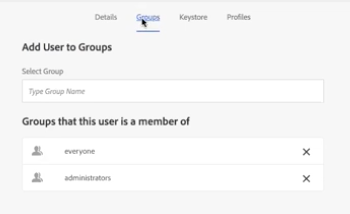

# Configurer [!DNL Workfront] avec un connecteur hérité [!DNL Adobe Experience Manager]

<!-- Audited: 4/2025 -->

En tant qu’administrateur ou administratrice [!DNL Adobe Workfront], vous pouvez intégrer [!DNL Workfront] avec [!UICONTROL Adobe Experience Manager (AEM) Assets] et fournir à votre organisation une solution de gestion de contenu complète pour la création, le partage et la maintenance des ressources dans votre workflow.

## Conditions d’accès

+++ Développez pour afficher les exigences d’accès aux fonctionnalités de cet article.

<table>
  <tr>
   <td>Package Adobe Workfront
   </td>
   <td> <p>Prime ou Ultimate</p>
    <p>Workflow Ultimate</p>
   </td>
  </tr>
  <tr>
   <td>Licences Adobe Workfront
   </td>
   <td><p>Standard</p>
   <p>Plan</p>
   </td>
  </tr>
   <tr>
   <td>Configurations des niveaux d’accès
   </td>
   <td>Vous devez être administrateur ou administratrice [!DNL Workfront].
   </td>
  </tr>
</table>

Pour plus d’informations, voir [Conditions d’accès requises dans la documentation Workfront](/help/quicksilver/administration-and-setup/add-users/access-levels-and-object-permissions/access-level-requirements-in-documentation.md).

## [!DNL Workfront for AEM Assets]

Le [!DNL Workfront for AEM Assets connector] permet à votre organisation d’effectuer les opérations suivantes :

* Collaborez et gérez le contenu créatif en liant des ressources et dossiers AEM aux projets, tâches, problèmes et demandes dans [!DNL Workfront].

  Pour plus d’informations sur la configuration des intégrations de documentation avec des applications tierces, voir [Configurer les intégrations de documents](../../administration-and-setup/configure-integrations/configure-document-integrations.md).

* Intégrez le référentiel [!DNL AEM Digital Asset Managemen]t (DAM), ce qui vous permet d’utiliser [!DNL Workfront] pour gérer et partager des ressources numériques stockées dans la gestion des ressources numériques.

  Pour plus d’informations sur la liaison de documents et de dossiers de ressources, voir [Lier des documents à partir d’applications externes](../../documents/adding-documents-to-workfront/link-documents-from-external-apps.md).

* Combinez et appliquez des métadonnées des deux applications à une ressource.
* Affichez un flux de communication global pour une ressource. Les mises à jour et commentaires effectués sur une ressource dans [!DNL Workfront] ou [!UICONTROL AEM Assets] sont synchronisés avec l’autre application, ce qui permet d’établir un historique complet des communications effectuées sur la ressource.

  Pour plus d’informations sur la création de commentaires dans [!DNL Workfront], voir [Ajouter une mise à jour à un document](../../documents/managing-documents/add-update-documents.md).

## Conditions préalables à l’installation du connecteur [!DNL AEM Assets]

Avant de pouvoir installer le connecteur [!DNL Workfront] pour [!UICONTROL AEM Assets], vérifiez que les conditions préalables suivantes sont remplies :

* [!UICONTROL AEM Assets] est installé et configuré, version 6.5 ou ultérieure. Pour plus d’informations sur l’installation d’[!UICONTROL AEM Assets], voir la [[!DNL Adobe Experience Manager] documentation](https://experienceleague.adobe.com/en/docs/experience-manager).
* (Le cas échéant) Si les règles de pare-feu n’autorisent pas le trafic comme prévu, ajoutez l’adresse IP et/ou le domaine de votre cluster à votre liste autorisée. Pour plus d’informations, voir [Configurer la liste autorisée de votre pare-feu](../../administration-and-setup/get-started-wf-administration/configure-your-firewall.md).

## Installer le package connecteur [!DNL Workfront for AEM Assets] {#install-the-workfront-for-aem-assets-connector-package}

>[!IMPORTANT]
>
>Les instructions suivantes concernent un connecteur hérité [!DNL Workfront with AEM Assets], qui a été remplacé par le [[!DNL Workfront for Experience Manager] connecteur amélioré](../../documents/workfront-and-experience-manager-integrations/workfront-for-experience-manager-enhanced-connector/workfront-for-aem-enhanced-connector.md). Contactez votre représentant ou représentante de compte pour plus d’informations.

Pour installer le connecteur [!DNL Workfront for AEM Assets], vous devez importer le connecteur dans AEM sous la forme d’un package à l’aide du [!UICONTROL gestionnaire de modules CRX].

1. Sur un poste de travail où vous avez déjà installé AEM, téléchargez le fichier d’installation du connecteur [!DNL Workfront for AEM Assets].

   Vous pouvez obtenir le connecteur [!DNL Workfront for AEM Assets] auprès de votre personne représentante [!DNL Workfront].

1. Connectez-vous à AEM à l’aide d’un compte d’administrateur ou d’administratrice.
1. Cliquez sur **[!UICONTROL Outils]** > **[!UICONTROL Déploiement]** > **[!UICONTROL Packages]**. Le [!UICONTROL gestionnaire de modules CRX] s’ouvre.

1. Cliquez sur **[!UICONTROL Charger le package].**

1. Dans la boîte de dialogue **[!UICONTROL Télécharger le package]**, recherchez et sélectionnez le package **[!UICONTROL Connecteur Workfront]**, puis cliquez sur **[!UICONTROL OK]**. Le package s’affiche dans le [!UICONTROL gestionnaire de modules CRX].

1. Cliquez sur **[!UICONTROL Installer].**

1. Dans la boîte de dialogue **[!UICONTROL Package]**, ignorez les paramètres avancés et cliquez sur **[!UICONTROL Installer]**.
1. (Facultatif) Pour confirmer l’installation du connecteur, vérifiez que l’instruction suivante s’affiche dans le [!UICONTROL journal d’activité] :

   ```
   Package installed in <time>
   ```

1. Fermez le [!UICONTROL Gestionnaire de packages CRX]. Le connecteur est installé et vous pouvez maintenant configurer l’intégration d’[!DNL AEM Assets] à [!DNL Workfront].

1. Passez à [Configurer  [!DNL AEM Assets]  pour l’intégrer à  [!DNL Workfront]](#configure-aem-assets-to-integrate-with-workfront).

## Configurer [!DNL AEM Assets] pour l’intégrer à [!DNL Workfront] {#configure-aem-assets-to-integrate-with-workfront}

Après avoir installé le connecteur, importez le package connecteur vers AEM et configurez l’application pour lier les documents dans [!DNL Workfront].

Pour plus d’informations sur l’installation du connecteur, voir [Installer le package du connecteur  [!DNL Workfront for AEM Assets] &#x200B;](#install-the-workfront-for-aem-assets-connector-package).

* [Conditions préalables](#prerequisites)
* [Intégrer AEM à  [!DNL Workfront]](#integrate-aem-with-workfront)
* [Configurer l’[!UICONTROL Externalizer d’AEM]](#configure-the-aem-externalizer)

### Conditions préalables {#prerequisites}

Avant de commencer, vous devez activer les autorisations pour workfront-service :

1. Dans AEM, accédez à **[!UICONTROL Outils]** > **[!UICONTROL Sécurité]** > **[!UICONTROL Autorisations]**.
1. Dans le coin supérieur gauche, choisissez **[!UICONTROL Utilisateurs]**&#x200B; dans le menu déroulant, puis saisissez *[!UICONTROL workfront-service]* dans le champ **[!UICONTROL Rechercher]**&#x200B;. Sélectionnez l’utilisateur ou l’utilisatrice [!UICONTROL workfront-service].
1. Dans la partie droite de l’écran, sélectionnez **[!UICONTROL Ajouter ACE]** pour créer des entrées.
1. Dans la fenêtre &#x200B;**[!UICONTROL Ajouter une nouvelle entrée]**&#x200B;, cochez l&#39;icône de case dans le champ **[!UICONTROL Chemin]**&#x200B; et choisissez le dossier : */conf*
1. Dans le champ **Privilèges**, saisissez : *jcr:read*
1. Dans le coin supérieur droit, sélectionnez **Ajouter**.
1. (Facultatif) Répétez les étapes ci-dessus pour créer d’autres entrées.

### Intégrer AEM à [!DNL Workfront] {#integrate-aem-with-workfront}

1. Connectez-vous à AEM Assets en tant qu’administrateur ou administratrice.
1. Cliquez sur **[!UICONTROL Outils]** > **[!UICONTROL Services cloud]** > **[!UICONTROL Configuration de l’intégration de Workfront]** > **[!UICONTROL Global-Workfront].**&#x200B;**&#x200B;**

1. (Conditionnel) Si vous ne l’avez pas encore fait, créez un fichier de configuration cloud [!DNL Workfront] :

   1. Dans l’angle supérieur droit de la page [!DNL Global-Workfront], cliquez sur **[!UICONTROL Créer]**.
   1. Dans la zone **[!UICONTROL URL Workfront]**, spécifiez l’URL de votre instance [!DNL Workfront].

      Par exemple : [!DNL https]://`<account>`.my.workfront.com, où `<account>` est le compte que vous utilisez pour les intégrations avec AEM.

   1. Dans le champ&#x200B;Dossier **[!UICONTROL base]**, cochez l’icône en forme de case.
   1. Dans le menu déroulant, sélectionnez le chemin d’accès où sont stockés les documents liés à [!DNL Workfront] objets .
   1. Dans le modal d’AEM qui s’affiche, suivez le chemin d’accès au dossier contenant les documents connectés aux objets [!DNL Workfront]. Choisissez le dossier, puis appuyez sur **[!UICONTROL Sélectionner]**&#x200B; dans le coin supérieur droit.

      Vous pouvez créer un lien vers n’importe quel dossier sous la racine /content/dam/.

   1. Dans la **[!UICONTROL Clé API Workfront]**, spécifiez votre clé API [!UICONTROL Workfront].

      Pour récupérer votre clé API [!DNL Workfront] :

      1. Ouvrez un onglet de navigateur et connectez-vous à votre compte [!DNL Workfront] en tant qu’administrateur ou administratrice [!DNL Workfront].

      {{step-1-to-setup}}

      1. Cliquez sur **[!UICONTROL Système]** > **[!UICONTROL Infos client]**.

         Si vous avez déjà généré une clé API, votre clé API [!DNL Workfront] s’affiche sous le libellé **Votre clé API d’utilisateur**.

      1. (Le cas échéant) Si vous n’avez pas encore généré de clé API, vous devez en générer une :

         1. Dans la section **[!UICONTROL Paramètres de clé API]**, assurez-vous que l’option **[!UICONTROL Après création, les clés API expirent dans]** est définie sur **Aucune**.

            Si vous sélectionnez une période d’expiration, le connecteur cesse de fonctionner après l’expiration de la clé API. Vous devrez ensuite générer à nouveau une clé API et mettre à jour votre configuration [!DNL Workfront].

         1. Sous le libellé **[!UICONTROL Votre clé API d’utilisateur]**, cliquez sur **[!UICONTROL Générer la clé API]**. Une clé API pour [!DNL Workfront] est générée et s’affiche.
      1. Copiez la clé API dans le presse-papiers.
      1. Ouvrez l’onglet du navigateur pour Connecteur AEM et dans la zone **[!DNL Workfront API Key]** , puis collez la clé API que vous avez copiée.
   1. (Le cas échéant) Cliquez sur l’onglet **[!UICONTROL Avancé]** dans le coin supérieur gauche de la page Configuration de l’intégration [!UICONTROL [!DNL Workfront]] et sélectionnez les options suivantes, le cas échéant :

      **[!UICONTROL Autoriser la navigation dans les collections] :** sélectionnez cette option si votre entreprise autorise les utilisateurs et utilisatrices [!DNL Workfront] à lier des collections AEM Assets à des objets [!DNL Workfront].

      **[!UICONTROL Federated ID utilisateur] :** sélectionnez cette option si votre organisation utilise des Federated ID ou l’authentification unique (SSO) lors de la connexion à Workfront.

      **[!UICONTROL Ignorer le domaine de messagerie] :** sélectionnez cette option si vos utilisateurs et utilisatrices AEM n’utilisent pas le nom de domaine dans leur ID d’utilisateur ou d’utilisatrice.

      **[!UICONTROL Limiter l’accès] :** sélectionnez cette option pour spécifier les adresses IP [!DNL Workfront] appropriées à ajouter à la liste autorisée. Pour plus d’informations sur la liste autorisée, voir [Configurer la liste autorisée de votre pare-feu](../../administration-and-setup/get-started-wf-administration/configure-your-firewall.md).

   1. Dans le coin supérieur gauche de la page Configuration de l’intégration de Workfront, cliquez sur l’onglet **[!UICONTROL De base]**, puis sur **[!UICONTROL Connexion]**.

      >[!NOTE]
      >
      >L’application des modifications peut prendre un certain temps. Un redémarrage du lot peut accélérer le processus.


1. (Le cas échéant) Si vous avez déjà créé un fichier de configuration cloud [!DNL Workfront], sélectionnez **[!UICONTROL Global-[!DNL Workfront]]** puis, dans le coin supérieur gauche, cliquez sur **[!UICONTROL Propriétés]**.

1. Générez la clé API AEM en cliquant sur **[!UICONTROL Générer la clé],** puis copiez la clé API AEM dans le presse-papiers.

   Vous aurez besoin de la clé API AEM ultérieurement lorsque vous configurerez [!UICONTROL Workfront] pour l’intégrer à [!UICONTROL AEM Assets]. Pour plus d’informations, voir [Configurer Workfront pour l’intégrer à AEM Assets](#configure-workfront-to-integrate-with-aem-assets).

1. Dans le coin supérieur droit, cliquez sur **[!UICONTROL Enregistrer]**. La fenêtre [!UICONTROL Global-[!DNL Workfront]] s’affiche.

   

1. (Facultatif) Synchronisez la communication bidirectionnelle entre AEM et [!DNL Workfront] :

   1. Cliquez sur **[!UICONTROL Global-[!DNL Workfront]].**
   1. Dans le coin supérieur gauche de la fenêtre, cliquez sur **[!UICONTROL Propriétés]**. La page Configuration de l’intégration **[!UICONTROL [!DNL Workfront]]** s’affiche.

      

   1. (Facultatif) Pour activer la synchronisation des commentaires entre [!UICONTROL AEM Assets] et [!DNL Workfront], cliquez sur **[!UICONTROL Activater la synchronisation des commentaires]**.

      >[!IMPORTANT]
      >
      >Vous devez activer [!UICONTROL Synchronisation des documents] pour synchroniser les ressources.

   1. (Facultatif) Pour désactiver la synchronisation des commentaires, cliquez sur **[!UICONTROL Désactiver la synchronisation des commentaires].**

      Ou

      Supprimez l’abonnement aux événements [!UICONTROL NOTE CREATE] enregistré sur votre instance AEM.

      Pour plus d’informations sur les abonnements aux événements, voir [API d’abonnement aux événements](../../wf-api/general/event-subs-api.md).

1. Continuez avec [Configurer l’[!UICONTROL Externalizer AEM]](#configure-the-aem-externalizer).

### Configurer l’[!UICONTROL Externalizer AEM] {#configure-the-aem-externalizer}

L’[!UICONTROL Externalizer AEM] permet à AEM de transmettre des URL dans un format pouvant être utilisé dans [!DNL Workfront]. Si elle n’est pas correctement configurée, [!DNL Workfront] ne pouvez pas effectuer d’appels vers l’API AEM et les URL liant les documents AEM dans Workfront ne fonctionneront pas.

1. Dans AEM, cliquez sur **[!UICONTROL Outils]** > **[!UICONTROL Opérations]** > **[!UICONTROL Console web]**.

1. Cliquez sur **[!UICONTROL OSGI]**, puis cliquez sur **[!UICONTROL Configuration]** dans le menu déroulant.

1. Dans la liste de configuration, sélectionnez &#x200B;’Externaliseur **[!UICONTROL lien Day CQ &#x200B;].** La page **[!UICONTROL Externalizer]** s’affiche.

1. Dans la section **[!UICONTROL Domaines]**, assurez-vous que le domaine répertorié dans le champ **[!UICONTROL Création]** est le nom de domaine accessible de l’extérieur aux utilisateurs et utilisatrices AEM.

   Le nom de domaine dans le champ [!UICONTROL Création] doit correspondre au domaine répertorié dans la ligne URL de votre instance AEM.

   ![[!DNL Extenalizer].png](assets/extenalizer-350x128.png)

1. (Le cas échéant) Si nécessaire, mettez à jour le domaine dans le champ **[!UICONTROL Création]**.
1. Cliquer sur **[!UICONTROL Enregistrer]**. [!UICONTROL AEM Assets] est maintenant configuré pour lier des documents à des [!DNL Workfront].

1. Passez à [Configurer  [!DNL Workfront]  pour l’intégrer à  [!DNL AEM assets]](#configure-workfront-to-integrate-with-aem-assets).

## Configurer [!DNL Workfront] pour l’intégrer à [!DNL AEM assets] {#configure-workfront-to-integrate-with-aem-assets}

Après avoir installé le connecteur [!UICONTROL Workfront pour AEM Assets] (comme décrit dans [Installer le package de connecteur [!UICONTROL Workfront pour AEM Assets]](#install-the-workfront-for-aem-assets-connector-package)) et configuré [!UICONTROL AEM Assets] (comme décrit dans [Configurer [!UICONTROL AEM Assets] pour l’intégration à [!DNL Workfront]](#configure-aem-assets-to-integrate-with-workfront)), vous devez configurer [!DNL Workfront] pour lier les documents entre [!DNL Workfront] et [!DNL AEM Assets].

1. Connectez-vous à Workfront en tant qu’administrateur.

   >[!TIP]
   >
   >[!UICONTROL Workfront] recommande de créer une personne chargée de l’administration [!UICONTROL Workfront] dédiée uniquement à votre intégration AEM. Pour plus d’informations sur l’attribution du niveau d’accès d’administration [!UICONTROL Workfront] à une personne, voir [Accorder aux utilisateurs et aux utilisatrices un accès d’administration à certaines zones](../../administration-and-setup/add-users/configure-and-grant-access/grant-users-admin-access-certain-areas.md).

{{step-1-to-setup}}

1. Cliquez sur **[!UICONTROL Documents]** > **[!UICONTROL Intégration personnalisée].**

1. Cliquez sur **[!UICONTROL Ajouter une intégration personnalisée]**.
1. Dans la zone **[!UICONTROL Nom]**, saisissez le nom de l’intégration personnalisée.

   Il s’agit du nom que voient les utilisateurs lorsqu’ils utilisent l’intégration dans [!UICONTROL Workfront].

1. Dans la zone **[!UICONTROL URL de l’API de base]**, saisissez l’URL de votre instance AEM.

   L’URL API de base se compose de l’URL de votre instance AEM suivie du chemin d’accès : /bin/webhooks/api/

   

1. Dans le menu déroulant **[!UICONTROL Type d’authentification]**, sélectionnez **[!UICONTROL ApiKey].**

1. Dans la zone **[!UICONTROL Clé API]**, collez la clé API AEM que vous avez copiée lors de la configuration d’[!UICONTROL AEM Assets].
1. Cliquer sur **[!UICONTROL Enregistrer]**.
1. (Facultatif) Vérifiez que l’intégration est marquée comme [!UICONTROL Active].\
   

   [!DNL Workfront] est maintenant configuré pour fonctionner avec [!DNL AEM Assets].

   Pour accéder aux ressources dans AEM, chaque personne de [!DNL Workfront] qui doit utiliser le connecteur doit être configurée en tant qu’utilisateur ou utilisatrice dans AEM. Pour plus d’informations sur la création d’utilisateurs et d’utilisatrices, voir [Configurer l’accès des utilisateurs et utilisatrices au connecteur](#set-up-users-to-use-the-connector).

## Configurer l’accès des utilisateurs et utilisatrices au connecteur {#set-up-users-to-use-the-connector}

Pour que les utilisateurs et utilisatrices puissent accéder au connecteur, ils doivent disposer d’un profil d’utilisateur ou d’utilisatrice dans AEM et appartenir à un groupe [!DNL Workfront] ayant des niveaux d’accès qui incluent les autorisations [!UICONTROL Créer] et [!UICONTROL Supprimer].

Pour plus d’informations sur les autorisations [!DNL Workfront], voir [Créer ou modifier des niveaux d’accès personnalisés](../../administration-and-setup/add-users/configure-and-grant-access/create-modify-access-levels.md).

* [Configurer des utilisateurs et utilisatrices dans  [!DNL AEM assets]](#set-up-users-in-aem-assets)

### Configurer des utilisateurs et utilisatrices dans [!DNL AEM assets] {#set-up-users-in-aem-assets}

1. Connectez-vous à [!DNL AEM Assets] en tant qu’administrateur ou administratrice de Workfront.
1. Cliquez sur **[!UICONTROL Outils]** > **&#x200B;**&#x200B;**[!UICONTROL Sécurité]** > **[!UICONTROL Utilisateurs]**.

1. (Le cas échéant) Si l’utilisateur ou l’utilisatrice n’a pas de profil d’utilisateur ou d’utilisatrice dans AEM, créez-en un.

   1. Cliquez sur **[!UICONTROL Créer un utilisateur ou une utilisatrice].**
   1. Saisissez les informations personnelles de l’utilisateur ou de l’utilisatrice.

      

      Le seul champ obligatoire est le champ **ID**. L’identifiant AEM de l’utilisateur ou de l’utilisatrice doit correspondre à son ID [!DNL Workfront], qui est l’adresse e-mail [!DNL Workfront] de l’utilisateur ou de l’utilisatrice.

      Si vous avez sélectionné l’option **[!UICONTROL Ignorer le domaine de messagerie]** lorsque vous avez configuré AEM pour l’intégration avec [!DNL Workfront], alors l’identifiant AEM ne correspondra pas à l’adresse e-mail [!DNL Workfront].

1. (Conditionnel) Si l’utilisateur possède un profil AEM, ouvrez son profil AEM :

   1. Cliquez sur&#x200B;**[!UICONTROL Utilisateur]**. La page **[!UICONTROL Gestion des utilisateurs et utilisatrices]** s’affiche.

   1. Cliquez sur l’utilisateur à ajouter, puis sur **[!UICONTROL Propriétés]**. La page des paramètres de l’utilisateur ou de l’utilisatrice s’affiche.

1. Cliquez sur l’onglet **[!UICONTROL Groupes]**.

   

1. Assurez-vous que l’utilisateur ou l’utilisatrice appartient à au moins un groupe [!DNL Workfront] ayant des niveaux d’accès qui incluent les autorisations **[!UICONTROL Créer]** et **[!UICONTROL Supprimer]**.

   1. Pour ajouter l’utilisateur ou l’utilisatrice à un groupe existant, commencez à saisir le nom du groupe dans la zone **[!UICONTROL Saisir le nom du groupe]**, puis sélectionnez le groupe lorsqu’il apparaît dans le menu déroulant.

      Ou

      Pour sélectionner un groupe dont l’utilisateur ou l’utilisatrice est membre, sélectionnez un groupe dans la section **[!UICONTROL Groupes dont cet utilisateur ou cette utilisatrice est membre]**.

1. Cliquez sur **[!UICONTROL Enregistrer].**
