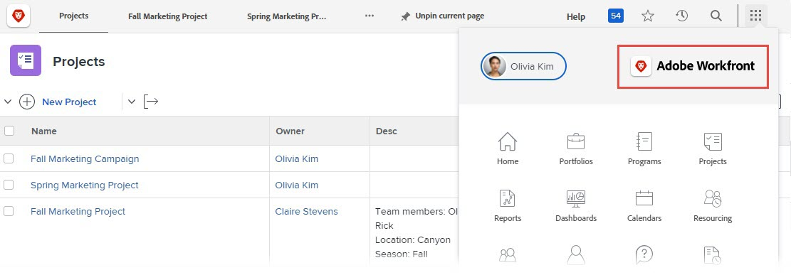

# Personnaliser votre instance Adobe Workfront

<!--
**DON'T DELETE, DRAFT OR HIDE THIS ARTICLE. IT IS LINKED TO THE PRODUCT, THROUGH THE CONTEXT SENSITIVE HELP LINKS. **
-->

>[!IMPORTANT]
>
>La procédure décrite sur cette page s’applique uniquement aux organisations qui ne sont pas encore intégrées à [!DNL Adobe Experience Cloud].
>
> Si votre entreprise a été intégrée à [!DNL Adobe Experience Cloud], le branding n’est pas disponible.

En tant qu’administrateur ou administratrice Workfront, vous pouvez personnaliser Workfront à l’aide de logos aux emplacements suivants :

* Écran de connexion

  

* Zone de navigation supérieure

  

* Menu principal

  

Vous pouvez également modifier l’image d’arrière-plan et la couleur de l’écran de connexion :

>[!NOTE]
>
>* La modification de l’image d’arrière-plan et de la couleur de connexion n’est pas disponible si l’instance Workfront de votre entreprise utilise un portail d’authentification unique personnalisé. Consultez votre administrateur ou administratrice réseau ou informatique si vous avez besoin de plus d’informations.
><!--
>or is enabled with Adobe IMS  >
>  >
>-->
>
>* Un administrateur ou administratrice Workfront ou un administrateur ou administratrice de groupes peut également personnaliser Workfront pour certains groupes et personnes utilisant un modèle de mise en page. Le branding dans un modèle de mise en page remplace le branding au niveau du système décrit dans cet article. Pour obtenir des instructions sur le branding dans un modèle de mise en page, voir [Personnaliser Adobe Workfront avec un modèle de mise en page](../../../administration-and-setup/customize-workfront/use-layout-templates/brand-wf-using-a-layout-template.md).

## Conditions d’accès

+++ Développez pour afficher les exigences d’accès aux fonctionnalités de cet article.

Vous devez disposer des accès suivants pour effectuer les étapes décrites dans cet article :

<table style="table-layout:auto"> 
 <col> 
 <col> 
 <tbody> 
  <tr> 
   <td role="rowheader">Formule Adobe Workfront</td> 
   <td>Tous</td> 
  </tr> 
  <tr> 
  <tr> 
   <td role="rowheader">Licence Adobe Workfront</td> 
   <td>
Nouveau : Standard

       
Ou

       
Actuel : formule
</td>
  </tr> 
  </tr> 
  <tr> 
   <td role="rowheader">Configurations des niveaux d’accès</td> 
   <td>[!UICONTROL System Administrator]</td>
  </tr> 
 </tbody> 
</table>

Pour plus de détails sur les informations contenues dans ce tableau, consultez [Conditions d’accès préalables dans la documentation Workfront](/help/quicksilver/administration-and-setup/add-users/access-levels-and-object-permissions/access-level-requirements-in-documentation.md).

+++

## Personnaliser l’écran de connexion

{{step-1-to-setup}}

1. Cliquez sur **Système** > **Branding**.

1. Apportez l’une des modifications suivantes pour personnaliser Workfront avec vos images de marque.

   <table style="table-layout:auto"> 
    <col> 
    <col> 
    <tbody> 
     <tr> 
      <td role="rowheader"> 
Personnaliser l’icône Accueil (s’affiche à l’extrémité gauche de la zone de navigation supérieure)
 </td> 
      <td> 
Dans la <strong>zone de navigation supérieure</strong>, dans l’<strong>icône Accueil</strong>, cliquez n’importe où dans la zone, puis recherchez et sélectionnez l’image de votre logo. Vous pouvez également faire glisser une image sur la zone.
 
Pour recadrer l’image, utilisez les commandes de défilement et faites-la glisser jusqu’à la position voulue dans l’espace prévu à cet effet.
 
Nous vous recommandons d’utiliser une image de 120 x 120 pixels. Elle peut être dans l’un des formats suivants : GIF, JPG, PNG, SVG.
 
Cette icône s’affiche également dans les rapports, les listes, les tableaux de bord et les rapports distribués que les utilisateurs et utilisatrices exportent en tant que fichiers PDF.
 </td> 
     </tr> 
     <tr> 
      <td role="rowheader"> 
Personnaliser le  logo  du menu principal (qui s’affiche dans le coin supérieur droit du menu principal)
 </td> 
      <td> 
Dans la <strong>zone de navigation supérieure</strong> dans le <strong>Logo du menu principal</strong>, cliquez n’importe où dans la zone, puis recherchez et sélectionnez l’image de votre logo. Vous pouvez également faire glisser une image sur la zone.
 
Pour recadrer l’image, utilisez les commandes de défilement et faites-la glisser jusqu’à la position voulue dans l’espace prévu à cet effet.
 
Nous vous recommandons d’utiliser une image de 300 x 120 pixels. Elle peut être dans l’un des formats suivants : GIF, JPG, PNG, SVG.
 </td> 
     </tr> 
     <tr> 
      <td role="rowheader">Personnaliser le logo de l’écran de connexion (qui s’affiche dans le coin supérieur gauche de la zone où les utilisateurs et utilisatrices saisissent les informations de connexion)</td> 
      <td> 
Dans l’<strong>écran de connexion</strong>, cliquez n’importe où dans la zone, puis recherchez et sélectionnez l’image de votre logo. Pour recadrer l’image, utilisez les commandes de défilement et faites-la glisser jusqu’à la position voulue dans l’espace prévu à cet effet.
 
Nous vous recommandons d’utiliser une image de 300 x 120 pixels. Elle peut être dans l’un des formats suivants : GIF, JPG, PNG, SVG.
 </td> 
     </tr> 
     <tr> 
      <td role="rowheader">Personnaliser la couleur d’arrière-plan de l’écran (s’affiche derrière la zone dans laquelle les utilisateurs et utilisatrices saisissent les informations de connexion)</td> 
      <td> 
Dans l’<strong>écran de connexion</strong>, définissez une <strong>couleur d’arrière-plan</strong>. 
 
Vous pouvez utiliser des codes couleur RGB ou HEX.
 
La couleur d’arrière-plan n’est visible que si l’arrière-plan de l’écran de connexion est plus grand que l’image d’arrière-plan de l’écran de connexion (voir la ligne suivante dans ce tableau) ou si l’image est transparente.
 </td> 
     </tr> 
     <tr> 
      <td role="rowheader">Afficher la marque sur l’image d’arrière-plan de l’écran de connexion (s’affiche derrière la zone dans laquelle les utilisateurs et utilisatrices saisissent leurs informations de connexion)</td> 
      <td> 
       <ol style="list-style-type: lower-alpha;"> 
        <li value="1"> 
 Dans la zone <strong>Écran de connexion</strong>, sous <strong>Image d’arrière-plan</strong>, cliquez sur la zone, puis recherchez et sélectionnez votre image ou vos images JPG ou PNG (jusqu’à 20). 
 
Plusieurs images d’arrière-plan s’affichent dans un ordre aléatoire, et changent chaque fois que les utilisateurs ou utilisatrices actualisent leur page de connexion. Il est recommandé d’utiliser des images qui ne dépassent pas 2 Mo.
 </li> 
        <li value="2"> 
Pointez sur chaque image d’arrière-plan que vous avez chargée, cliquez sur l’icône Paramètres (engrenage), puis utilisez l’une des options suivantes pour spécifier où et comment l’image doit apparaître en arrière-plan de l’écran de connexion :
 
         <ul> 
          <li> 
<strong>Plein écran</strong> : ajuste l’image à l’arrière-plan de l’écran de connexion, ce qui peut l’agrandir. Utilisez une image haute résolution (jusqu’à 2 Mo) pour obtenir des résultats optimaux.
 
Lorsque vous utilisez cette option, la bannière Workfront, qui n’est pas personnalisable, obscurcit une partie de votre image.
 </li> 
          <li> 
<strong>Mosaïque</strong> : affiche votre image en mosaïque dans la zone d’arrière-plan de l’écran de connexion, dans sa taille d’origine. Cela s’avère utile pour créer un modèle. Sélectionnez une option d’alignement en bleu pour commencer la mosaïque dans le coin supérieur gauche, en haut au centre ou dans le coin supérieur droit de la zone d’arrière-plan.
 </li> 
          <li> 
<strong>Position</strong> : place l’image dans sa taille d’origine à l’emplacement de votre choix à l’aide de l’une des options d’alignement en bleu : en haut à gauche, en haut au centre ou en haut à droite de la zone d’arrière-plan de l’écran de connexion.
 
La couleur d’arrière-plan remplit le reste de la zone d’arrière-plan de l’écran de connexion. Pour plus d’informations sur la couleur d’arrière-plan, voir la ligne précédente dans ce tableau.
 </li> 
         </ul> </li> 
       </ol> </td> 
     </tr> 
     <tr> 
      <td role="rowheader">Réinitialiser sur la marque par défaut</td> 
      <td> 
La réinitialisation de la marque par défaut supprime toutes les photos et images que vous avez chargées.
 
Cliquez sur <strong>Réinitialiser tous les paramètres de marque sur les paramètres par défaut Workfront</strong> dans le coin inférieur droit de l’écran, puis sur <strong>Oui</strong>.
 </td> 
     </tr> 
    </tbody> 
   </table>

   >[!NOTE]
   >
   >Cette option n’est pas disponible si l’instance Workfront de votre organisation utilise un portail SSO personnalisé.
   ><!--   >
   >or is enabled with Adobe IMS   >
   >   >
   >-->
   >
   >Consultez votre administrateur ou administratrice réseau ou informatique si vous avez besoin de plus d’informations.

1. Cliquer sur **Enregistrer**.
