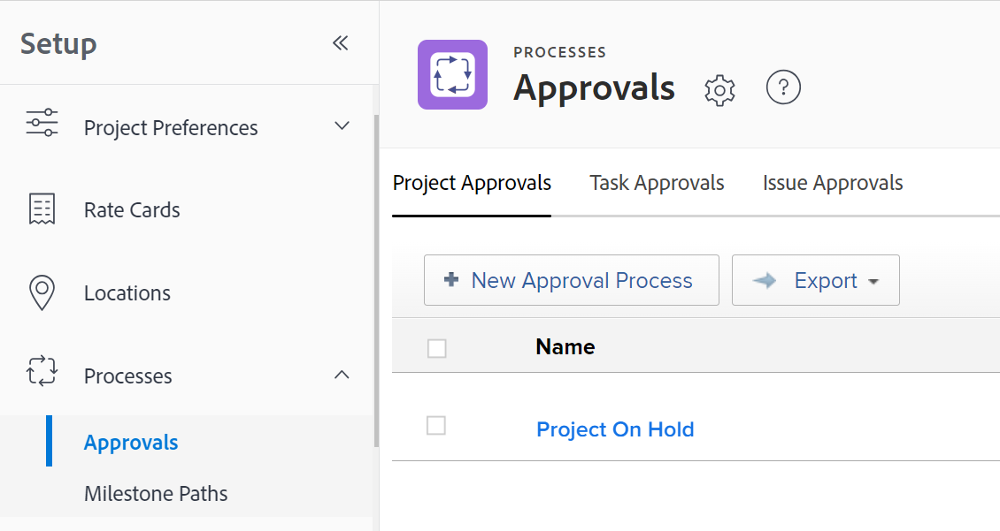

# Créer un processus d’approbation pour les tâches

<!--see below the "hidden" content for the redesigned tabs - August 2023-->

Vous pouvez créer un processus d’approbation que les utilisateurs peuvent joindre à un élément de travail (projet, tâche, problème, modèle ou tâche de modèle), un document ou un BAT. Un processus d’approbation garantit que les personnes désignées sur l’objet révisent certaines modifications avant que l’objet ne progresse dans le système.

Cet article décrit comment créer des processus d’approbation globale au niveau du système ou du groupe pour des tâches (projet, tâche, problème, modèle ou tâche de modèle).

Pour plus d&#39;informations sur les validations associées aux documents ou BAT, consultez les articles suivants :

* [Demande d’approbation de documents](../../../review-and-approve-work/manage-approvals/request-document-approvals.md)
* [Présentation des processus automatisés](../../../review-and-approve-work/proofing/proofing-overview/automated-workflow.md)

>[!NOTE]
>
>Les utilisateurs peuvent également créer un processus d’approbation à usage unique pour un projet, une tâche, un problème, un modèle ou une tâche de modèle pour laquelle ils disposent des autorisations de gestion.
>
>Cet article utilise le terme &quot;processus d’approbation globale&quot; pour différencier le processus d’approbation à usage unique. Un processus d’approbation globale peut être utilisé à plusieurs reprises.
>
>Au niveau du groupe, un processus d’approbation globale est limité aux tâches et aux états qui appartiennent au groupe.
>
>Pour plus d’informations sur les processus de validation à usage unique, voir [Présentation du processus de validation](../../../review-and-approve-work/manage-approvals/approval-process-in-workfront.md) et [Associer un processus d’approbation nouveau ou existant au travail](../../../review-and-approve-work/manage-approvals/associate-approval-with-work.md).

## Exigences d’accès

Vous devez disposer des éléments suivants :

<table style="table-layout:auto"> 
 <col> 
 <col> 
 <tbody> 
  <tr> 
   <td role="rowheader">Formule Adobe Workfront*</td> 
   <td>Tous</td> 
  </tr> 
  <tr> 
   <td role="rowheader">Licence Adobe Workfront*</td> 
   <td>Plan</td> 
  </tr> 
  <tr> 
   <td role="rowheader">Paramétrages du niveau d'accès*</td> 
   <td> 
Si vous êtes administrateur de Workfront ou si vous avez un accès administratif aux processus d’approbation, vous pouvez créer un processus d’approbation au niveau du système ou un processus d’approbation au niveau du groupe pour un groupe particulier.
 
   
Si vous êtes administrateur de groupe, vous pouvez créer des processus d’approbation au niveau du groupe pour les groupes que vous gérez.
 
<b>REMARQUE</b>: si vous n’avez toujours pas accès à , demandez à votre administrateur Workfront s’il définit des restrictions supplémentaires à votre niveau d’accès. Pour plus d’informations sur la façon dont un administrateur Workfront peut modifier votre niveau d’accès, voir <a href="../../../administration-and-setup/add-users/configure-and-grant-access/create-modify-access-levels.md" class="MCXref xref">Création ou modification de niveaux d’accès personnalisés</a>.
 </td> 
  </tr> 
 </tbody> 
</table>

&#42;Pour connaître le plan, le type de licence ou l’accès dont vous disposez, contactez votre administrateur Workfront.

## Créer un processus d’approbation globale au niveau du système ou du groupe pour les éléments de travail

1. Cliquez sur le bouton **Menu Principal** icon  dans le coin supérieur droit d’Adobe Workfront, puis cliquez sur **Configuration** .

1. (Conditionnel) Si vous créez un processus d’approbation au niveau du système, cliquez sur **Processus** > **Approbations** dans le panneau de gauche.

   Ou

   Si vous créez un processus d’approbation au niveau du groupe, cliquez sur **Groupes** , cliquez sur le nom du groupe, puis sur **Approbations**.

   <!--hidden for the new tab redesign - August 2023: 
   
   -->

1. Cliquez sur le bouton **Approbations de projet**, **Approbations de tâches**, ou **Approbations des problèmes** selon le type de processus de validation que vous souhaitez créer.

1. Cliquez sur **Nouveau processus d’approbation**.
1. Indiquez les informations suivantes dans la zone qui s’affiche :

   <table style="table-layout:auto"> 
    <col> 
    <col> 
    <tbody> 
     <tr> 
      <td role="rowheader">Nom du processus d'approbation</td> 
      <td>Saisissez un nom explicite pour le processus de validation. Ce nom est visible par les utilisateurs lors de l’application du processus d’approbation à un objet, comme décrit dans la section <a href="../../../review-and-approve-work/manage-approvals/associate-approval-with-work.md" class="MCXref xref">Associer un processus d’approbation nouveau ou existant au travail</a>.</td> 
     </tr> 
     <tr> 
      <td role="rowheader">Description</td> 
      <td>Saisissez une description du processus de validation. Cela s’affiche dans la variable <b>Approbations</b> dans la section <b>Configuration</b> en regard du nom du processus d’approbation.</td> 
     </tr> 
     <tr> 
      <td role="rowheader">Est active</td> 
      <td> 
Laissez cette option activée si vous souhaitez que d’autres utilisateurs puissent joindre le processus d’approbation aux projets, tâches et problèmes qu’ils créent. 
 
Cette option est activée par défaut.
 
 Le fait de marquer un processus d’approbation comme inactif s’avère utile lorsque votre entreprise n’a plus besoin de l’utiliser, mais que vous souhaitez conserver des informations historiques sur son utilisation.
 </td> 
     </tr> 
     <tr data-mc-conditions=""> 
      <td role="rowheader">Ce processus d’approbation peut être utilisé par </td> 
      <td> 
Si vous souhaitez que le processus d’approbation soit disponible pour les projets, tâches, problèmes et modèles appartenant uniquement à un groupe particulier, commencez à saisir le nom du groupe, puis sélectionnez le nom qui s’affiche :
 
       <ul> 
       <li>Si vous êtes administrateur système ou que vous avez un accès administratif aux processus d’approbation, n’importe quel groupe du système apparaît lorsque vous saisissez son nom. <b>Tous les groupes</b> est sélectionné par défaut. </li> 
       <li>Si vous êtes un administrateur de groupe sans accès administratif aux processus de validation, vous pouvez attribuer le processus de validation à n'importe quel groupe que vous gérez lorsque vous saisissez son nom. La variable <b>Tous les groupes</b> n’est pas disponible.</li> 
       </ul> 
       
Cette option n’est pas disponible pour les processus de validation à usage unique.
 
       
<b>Avertissement</b>: lorsque vous apportez des modifications au processus d’approbation spécifique au groupe, les processus d’approbation existants qui ont déjà été associés à des tâches peuvent changer. Pour plus d’informations sur ces modifications, voir <a href="../../../administration-and-setup/customize-workfront/configure-approval-milestone-processes/how-changes-affect-group-approvals.md" class="MCXref xref">Comment les modifications du processus d’approbation et de groupe affectent-elles les processus d’approbation affectés ?</a>.
 
       
Pour plus d’informations sur la liste et la gestion des processus d’approbation de votre groupe à partir de la page de votre groupe, voir <a href="../../../administration-and-setup/manage-groups/work-with-group-objects/create-and-modify-groups-approval-processes.md" class="MCXref xref">Processus de validation au niveau du groupe</a>. 
 
       
Pour plus d’informations sur l’accès administratif aux processus de validation, voir <a href="../../../administration-and-setup/add-users/configure-and-grant-access/grant-users-admin-access-certain-areas.md" class="MCXref xref">Octroi aux utilisateurs un accès administratif à certaines zones</a>.
 </td> 
     </tr> 
    </tbody> 
   </table>

1. Configurez un chemin pour le processus de validation à l’aide des options suivantes.

   Un chemin d’accès permet de spécifier ce qui doit se produire dans le processus d’approbation. Vous créez des étapes dans un chemin pour indiquer qui doit effectuer le travail d’approbation et dans quel ordre.

   <table style="table-layout:auto"> 
    <col> 
    <col> 
    <tbody> 
     <tr> 
      <td role="rowheader"> 
Démarrer un processus d’approbation lorsque le statut est défini sur
 </td> 
      <td> 
Sélectionnez l’état qui déclenchera le processus d’approbation sur les tâches. Lorsqu’une personne met à jour un élément de travail à cet état, son processus d’approbation commence. 
 
Le même état ne peut pas être sélectionné pour plusieurs chemins de processus d’approbation.
 
Les états disponibles dépendent de ce qui est sélectionné sous l’option . <b>Cette validation peut être utilisée par</b> (comme expliqué dans le tableau ci-dessus) :
 
       <ul> 
       <li> If <b>Tous les groupes</b> est sélectionné, seuls les états à l’échelle du système sont disponibles.
       <li> 
Si un groupe spécifique est sélectionné, seuls les états disponibles pour ce groupe sont disponibles.
 </li> 
       </ul> 
Pour plus d’informations sur le fonctionnement du processus d’approbation avec les états, voir la section <a href="../../../review-and-approve-work/manage-approvals/approval-process-in-workfront.md#how2" class="MCXref xref">Comment les processus d’approbation reposent sur les états</a> dans l’article <a href="../../../review-and-approve-work/manage-approvals/approval-process-in-workfront.md" class="MCXref xref">Présentation du processus de validation</a>.
 </td> 
     </tr> 
     <tr> 
      <td role="rowheader">Nom de l'étape</td> 
      <td>(Facultatif) Saisissez un nom décrivant la première étape du chemin. Si vous n’indiquez pas de nom d’étape, le nom par défaut est <b>Phase 1</b>.</td> 
     </tr> 
     <tr> 
      <td role="rowheader">Approbateurs</td> 
      <td> 
Commencez à saisir le nom de l’utilisateur, de l’équipe ou du rôle de tâche que vous souhaitez désigner comme approbateur pour cette étape, puis cliquez sur le nom lorsqu’il apparaît dans la liste déroulante. Vous ne pouvez ajouter que des utilisateurs principaux, rôles de tâcheet les équipes. 

   
<b>CONSEIL</b>:

   
Lors de l’ajout d’un utilisateur en tant qu’approbateur, notez l’avatar, le rôle Principal de l’utilisateur ou son adresse électronique pour distinguer les utilisateurs portant des noms identiques. Les utilisateurs doivent être associés à au moins un rôle de tâche pour l’afficher à mesure que vous les ajoutez.

      
Pour que les utilisateurs puissent afficher les courriers électroniques de leurs utilisateurs, le paramètre Afficher les coordonnées doit être activé dans votre niveau d’accès. Pour plus d’informations, voir <a href="../../add-users/configure-and-grant-access/grant-access-other-users.md">Accorder l’accès aux utilisateurs</a>. 

   
<b>NOTE</b>:

   L’ajout d’un utilisateur, d’une équipe ou d’un rôle en tant qu’approbateur ne leur accorde pas automatiquement des autorisations sur l’objet associé à cette approbation. Ils reçoivent des autorisations sur l’objet lorsque l’étape d’approbation est déclenchée. Dans le cas contraire, les objets doivent être partagés avec eux avant de pouvoir prendre une décision concernant la validation. 
 
Vous pouvez également désigner une personne comme approbateur en spécifiant son rôle. Vous pouvez, par exemple, désigner comme approbateur un propriétaire de projet, un parrain de projet, un propriétaire de Portfolio, un propriétaire de programme ou un responsable de projet. Ces options s’affichent automatiquement lorsque vous commencez à saisir du texte.

   
<b>IMPORTANT</b>:  
       <ul> 
       <li> 
Lorsque vous affectez une approbation au parrain du projet et qu’aucune personne n’est désignée comme parrain d’un projet, l’approbation est réaffectée au propriétaire du projet. Si personne n’est désigné comme propriétaire du projet, l’approbation est attribuée à l’administrateur Workfront. 
 </li> 
      </ul> 
       <ul> 
       <li> 
Lorsque vous affectez une approbation à un rôle et à la variable <b>L’approbateur ne doit pas appartenir à l’équipe du projet (pour les processus d’approbation qui incluent un rôle).</b> est désactivé, mais aucun rôle de l’équipe de projet ne correspond au rôle lors de l’approbation. L’approbation est réaffectée au propriétaire du projet. Pour plus d’informations sur les paramètres d’approbation, voir <a href="../../../administration-and-setup/customize-workfront/configure-approval-milestone-processes/establish-approval-settings.md" class="MCXref xref">Configuration des paramètres d’approbation globaux</a>.
 </li> 
       </ul> 
       <ul> 
       <li> 
Lorsque vous affectez une approbation au propriétaire du projet et qu’aucune personne n’est désignée comme propriétaire d’un projet, l’approbation est réaffectée à l’administrateur Workfront principal, comme indiqué dans la section Informations sur le client de la zone Configuration. Pour plus d’informations, voir <a href="../../../administration-and-setup/get-started-wf-administration/configure-basic-info.md" class="MCXref xref">Configuration des informations de base pour votre système</a>.  
 </li> 
       </ul> 
  
 
 
Vous pouvez répéter ce processus pour ajouter plusieurs approbateurs à l’étape. Une seule étape peut inclure une combinaison d’utilisateurs, d’équipes et de rôles de tâche en tant qu’approbateurs. Le nombre d’approbateurs que vous pouvez ajouter à une étape n’est pas limité.
 
<b>IMPORTANT</b>:  
Lorsque vous attribuez des rôles de tâche en tant qu’approbateurs, tous les utilisateurs associés à ce rôle de tâche qui font également partie de l’équipe de projet peuvent prendre une décision concernant l’approbation. 
 
Lorsque vous attribuez une équipe comme approbateur, tout utilisateur de cette équipe peut prendre une décision sur l’approbation. 
 
Pour plus d’informations sur l’équipe de projet, voir <a href="../../../manage-work/projects/planning-a-project/project-team-overview.md" class="MCXref xref">Présentation de l’équipe de projet</a>. Pour plus d’informations sur la validation d’un travail, voir <a href="../../../review-and-approve-work/manage-approvals/approving-work.md" class="MCXref xref">Valider le travail </a>.
 
 </td> 
     </tr> 
     <tr> 
      <td role="rowheader">Une seule décision est requise.</td> 
      <td> 
(S’affiche uniquement si vous ajoutez plusieurs approbateurs à l’étape) Sélectionnez cette option si l’un des approbateurs de l’étape peut approuver ou rejeter l’élément de travail au cours de cette étape. Cette action permet à l’élément de travail de quitter l’étape. 
 
Lorsque cette option n’est pas sélectionnée, tous les approbateurs identifiés doivent approuver ou rejeter l’étape (dans n’importe quel ordre) avant que l’élément ne quitte l’étape. Si l’un des approbateurs rejette l’étape, le processus interrompt et recommence afin que les modifications requises puissent être apportées. Ensuite, les approbateurs peuvent valider ou rejeter à nouveau l’étape.
 
Lorsqu’une équipe est désignée comme approbateur, tout membre de l’équipe peut accorder ou refuser une étape.
 </td> 
     </tr> 
     <tr> 
      <td role="rowheader"> 
Ajouter une étape
 </td> 
      <td>(Facultatif) Ajoutez une autre étape au chemin à l’aide des options expliquées dans les trois lignes ci-dessus. Vous pouvez ajouter autant d’étapes que nécessaire au chemin.</td> 
     </tr> 
     <tr> 
      <td role="rowheader">Choisissez ce qui se passe lorsque la validation est rejetée.
 </td> 
      <td> 
Sélectionnez l’action que vous souhaitez entreprendre si l’élément de travail est rejeté à n’importe quelle étape du chemin :
 
       <ul> 
       <li><b>Création d’un problème</b>: (disponible uniquement pour les processus d’approbation de projet et de tâche) un problème est créé dans le projet ou la tâche où le processus d’approbation est en cours d’exécution. La ressource affectée par défaut sur la tâche ou le propriétaire du projet est affecté au problème. Par défaut, le nom du problème créé est <b>Validation Rejetée (&lt;project or="" task="" name=""&gt;)</b>. Il s’agit d’un problème de rejet, saisi sous la tâche ou le projet, selon le processus d’approbation au cours duquel le rejet s’est produit.</li> 
       <li> 
<b>Définir l’état sur</b>: sélectionnez l’une des options suivantes :
 
       <ul> 
       <li><b>État précédent</b>: le projet, la tâche ou le problème rejeté revient à l’état avant l’état qui active le processus d’approbation.</li> 
       <li>
<b>Tout autre état de la liste</b>: l’objet rejeté passe à l’état que vous choisissez, comme En attente. Vous pouvez choisir l’un des états par défaut ou un état personnalisé que vous avez ajouté à votre système Workfront.

       
Si vous sélectionnez comme statut de rejet un statut associé à un processus de validation, l'objet rejeté passe au statut sélectionné et sera marqué comme "En attente de validation".
 
       
 Par exemple, si vous sélectionnez En attente pour le statut de rejet et que le statut En attente est associé à un processus de validation, l'objet rejeté est placé dans le statut "En attente - En attente de validation", ce qui nécessite la validation.

   </tr> 
    </tbody> 
   </table>

1. (Facultatif) Cliquez sur **Ajouter un chemin** pour ajouter un autre chemin au processus d’approbation, en faisant référence à la liste des options de l’étape précédente.

   Le nouveau chemin doit être associé à un autre état. Le chemin se déclenche lorsque l’élément est mis à jour pour afficher cet état. Vous ne pouvez pas avoir deux chemins pour le même état.

1. Cliquer sur **Enregistrer**.
1. Maintenant que le processus d’approbation est créé, procédez comme suit :

   * Associez le processus d’approbation à des projets, tâches ou problèmes spécifiques sur votre système, comme décrit dans la section [Associer un processus d’approbation nouveau ou existant au travail](../../../review-and-approve-work/manage-approvals/associate-approval-with-work.md).
   * En dehors de Workfront, informez les utilisateurs que le processus d’approbation est disponible pour qu’ils puissent l’associer à leurs projets, tâches ou problèmes, comme décrit dans la section [Associer un processus d’approbation nouveau ou existant au travail](../../../review-and-approve-work/manage-approvals/associate-approval-with-work.md).
   * Créez un autre processus de validation qui sera déclenché si ce processus de validation est rejeté et que l’élément prend un autre statut. Vous pouvez ainsi associer les processus de validation.

Pour plus d’informations sur la modification d’un processus d’approbation, voir [Modifier un processus de validation](../../../administration-and-setup/customize-workfront/configure-approval-milestone-processes/edit-an-approval-process.md).

## Associer un processus d’approbation à un élément de travail

Lorsque vous souhaitez créer un processus d’approbation pour un élément de travail (projet, tâche ou problème), vous créez d’abord le processus d’approbation, puis vous créez l’élément de travail, puis vous et vos utilisateurs pouvez associer le processus d’approbation à l’élément de travail.

Pour obtenir des instructions sur l’association d’un processus d’approbation à un élément de travail, voir [Associer un processus d’approbation nouveau ou existant au travail](../../../review-and-approve-work/manage-approvals/associate-approval-with-work.md).

>[!NOTE]
>
>Tout utilisateur de Workfront disposant d’autorisations de gestion pour un projet, une tâche ou un problème peut créer des processus d’approbation à usage unique à utiliser uniquement sur l’objet dans lequel ils sont créés. Pour plus d’informations, voir [Associer un processus d’approbation nouveau ou existant au travail](../../../review-and-approve-work/manage-approvals/associate-approval-with-work.md).

## Permettre aux utilisateurs de modifier les processus d’approbation globaux pour une seule tâche

Par défaut, les utilisateurs qui disposent d’autorisations de gestion pour les projets, tâches et problèmes peuvent créer des processus d’approbation à usage unique. Pour plus d’informations sur l’ajout de processus d’approbation à usage unique aux projets, tâches et problèmes, voir la section [Associer un processus d’approbation à usage unique à une tâche de projet, de tâche, de problème, de modèle ou de modèle](../../../review-and-approve-work/manage-approvals/associate-approval-with-work.md#creating-a-single-use-approval-process) dans l’article [Associer un processus d’approbation nouveau ou existant au travail](../../../review-and-approve-work/manage-approvals/associate-approval-with-work.md).

Les utilisateurs peuvent également modifier les paramètres d’un processus d’approbation globale associé à un élément de travail. Ces modifications affectent uniquement le projet, la tâche ou le problème associé au processus d’approbation au niveau du système. Pour plus d’informations, voir la section [Modification d’un processus d’approbation global en vue d’une utilisation sur un objet spécifique](../../../review-and-approve-work/manage-approvals/associate-approval-with-work.md#modifying-a-global-approval-process) dans l’article [Associer un processus d’approbation nouveau ou existant au travail](../../../review-and-approve-work/manage-approvals/associate-approval-with-work.md)).
