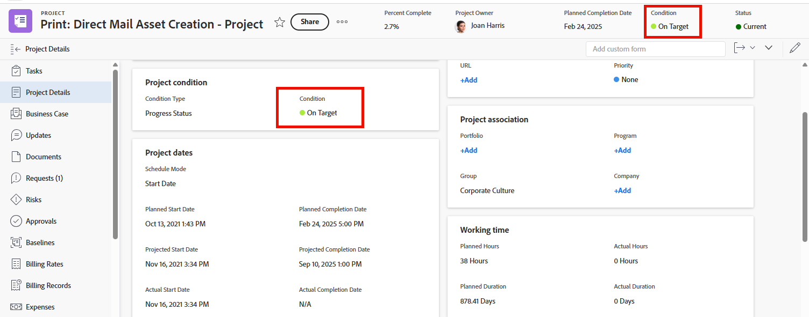

# Définir une condition personnalisée par défaut pour les projets

Si le type de condition d’un projet est défini sur Statut de la progression au lieu de Manuel, Adobe Workfront affiche automatiquement l’une des trois conditions par défaut intégrées au projet (Dans les temps, À risque ou En difficulté) au fur et à mesure de sa progression, comme expliqué dans [Vue d’ensemble de la condition du projet et du type de condition](../../../manage-work/projects/manage-projects/project-condition-and-condition-type.md).

Vous pouvez définir vos conditions personnalisées comme conditions par défaut au lieu d’utiliser ces trois conditions par défaut intégrées. Par exemple, vous pouvez modifier la condition par défaut Dans les temps pour qu’elle s’affiche comme Bon suivi dans tous les projets.

## Conditions d’accès

+++ Développez pour afficher les exigences d’accès aux fonctionnalités de cet article.

<table style="table-layout:auto"> 
 <col> 
 <col> 
 <tbody> 
  <tr> 
   <td>Package Adobe Workfront</td> 
   <td>
Tous
</td> 
  </tr> 
  <tr> 
   <td>Licence Adobe Workfront</td> 
   <td>
Standard

       
Plan
</td>
  </tr> 
  <tr> 
   <td>Configurations des niveaux d’accès</td> 
   <td>Administrateur ou administratrice système</td> 
  </tr> 
 </tbody> 
</table>

Pour plus d’informations, voir [Conditions d’accès requises dans la documentation Workfront](/help/quicksilver/administration-and-setup/add-users/access-levels-and-object-permissions/access-level-requirements-in-documentation.md).

+++

## Définir une condition personnalisée comme condition par défaut pour tous les projets :

{{step-1-to-setup}}

1. Cliquez sur **Préférences du projet** > **Conditions**.

1. Cliquez sur l’onglet **Projets**.
1. Cliquez sur **Définir les conditions par défaut**.
1. Dans le menu déroulant de la condition par défaut que vous souhaitez modifier, cliquez sur la condition personnalisée que vous souhaitez utiliser à la place.
1. Répétez l’étape précédente pour toute autre condition par défaut que vous souhaitez modifier.
1. Cliquer sur **Enregistrer**.

Pour plus d’informations sur la définition d’une condition personnalisée comme condition par défaut pour les tâches et les problèmes, voir [Définir une condition personnalisée par défaut pour les tâches et les problèmes](../../../administration-and-setup/customize-workfront/create-manage-custom-conditions/set-custom-condition-default-tasks-issues.md).

Pour plus d&#39;informations sur la configuration d&#39;un projet afin que les utilisateurs puissent mettre à jour manuellement sa condition, voir [Mettre à jour la condition pour les tâches et les événements](../../../manage-work/projects/updating-work-in-a-project/update-condition-for-tasks-and-issues.md).
