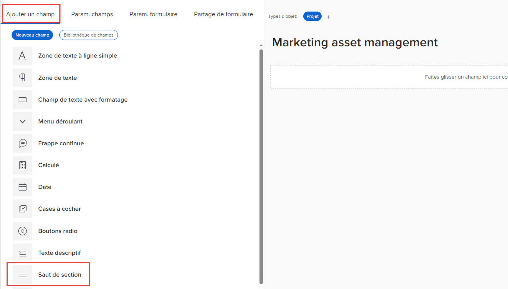

# Ajout d’un saut de section à un formulaire personnalisé à l’aide de l’ancien créateur de formulaires

Vous pouvez regrouper les champs personnalisés et les widgets d’un formulaire personnalisé en sections avec des en-têtes. Cela s’avère utile pour présenter une expérience organisée aux utilisateurs qui remplissent le formulaire. En outre, si vous devez limiter l’accès à certains champs et widgets personnalisés à certains utilisateurs, vous pouvez les placer dans une section, puis accorder l’accès à la section à ces utilisateurs uniquement.

Par exemple, si vous devez suivre des informations sensibles que seuls les administrateurs système doivent être en mesure d’afficher ou de modifier, vous pouvez créer un saut de section avec les autorisations Admin uniquement et placer les champs sensibles dans cette section.

Les paramètres d’accès que vous sélectionnez pour une section sont directement liés aux autorisations dont disposent les utilisateurs sur l’objet Workfront auquel est associé le formulaire personnalisé. Vous pouvez masquer ou afficher une section selon que l’utilisateur a accès à l’affichage, à la contribution ou à la gestion de cet objet. Vous pouvez également définir une section sur Administrateur uniquement afin que seuls les utilisateurs disposant d’un niveau d’accès administrateur système puissent y accéder.

Pour plus d’informations sur les autorisations relatives aux objets, voir [Présentation des autorisations de partage sur les objets](../../../workfront-basics/grant-and-request-access-to-objects/sharing-permissions-on-objects-overview.md).

Pour plus d’informations sur les champs personnalisés et les widgets dans les formulaires personnalisés, voir [Ajouter un champ personnalisé à un formulaire personnalisé](../../../administration-and-setup/customize-workfront/create-manage-custom-forms/add-a-custom-field-to-a-custom-form.md) et [Ajout ou modification d’un widget de ressource dans un formulaire personnalisé](../../../administration-and-setup/customize-workfront/create-manage-custom-forms/add-widget-or-edit-its-properties-in-a-custom-form.md).

<!--
>[!TIP]
>
>Section breaks that you add to custom forms are saved in your system for re-use. For information about listing them, see [List and edit custom forms and widgets added to custom forms](../../../administration-and-setup/customize-workfront/create-manage-custom-forms/list-edit-share-custom-forms-and-custom-fields.md).
-->

## Exigences d’accès

Les étapes de cet article doivent être les suivantes :

<table style="table-layout:auto"> 
 <col> 
 <col> 
 <tbody> 
  <tr data-mc-conditions=""> 
   <td role="rowheader"> 
Formule Adobe Workfront*
 </td> 
   <td>Tous</td> 
  </tr> 
  <tr> 
   <td role="rowheader">Licence Adobe Workfront*</td> 
   <td>Plan</td> 
  </tr> 
  <tr data-mc-conditions=""> 
   <td role="rowheader">Paramétrages du niveau d'accès*</td> 
   <td> 
Accès administratif aux formulaires personnalisés
 
Pour plus d’informations sur la manière dont les administrateurs de Workfront accordent cet accès, voir <a href="../../../administration-and-setup/add-users/configure-and-grant-access/grant-users-admin-access-certain-areas.md" class="MCXref xref">Octroi aux utilisateurs un accès administratif à certaines zones</a>.
 </td> 
  </tr>  
 </tbody> 
</table>

&#42;Pour connaître le plan, le type de licence ou les configurations de niveau d’accès dont vous disposez, contactez votre administrateur Workfront.

## Création et configuration de l’accès à une section dans un formulaire personnalisé

1. Commencez à créer ou modifier un formulaire personnalisé, comme décrit dans la section [Création ou modification d’un formulaire personnalisé](../../../administration-and-setup/customize-workfront/create-manage-custom-forms/create-or-edit-a-custom-form.md).
1. Ajoutez des champs et des widgets personnalisés au formulaire, comme décrit dans la section [Ajouter un champ personnalisé à un formulaire personnalisé](../../../administration-and-setup/customize-workfront/create-manage-custom-forms/add-a-custom-field-to-a-custom-form.md) et [Ajout ou modification d’un widget de ressource dans un formulaire personnalisé](../../../administration-and-setup/customize-workfront/create-manage-custom-forms/add-widget-or-edit-its-properties-in-a-custom-form.md).

1. Lors de la création ou de la modification du formulaire personnalisé, sur la page **Ajouter un champ** , cliquez sur **Saut de section**.

   

1. Sur le **Paramètres des champs** , configurez les options de votre choix pour la section :

   <table style="table-layout:auto"> 
    <col> 
    </col> 
    <col> 
    </col> 
    <tbody> 
     <tr> 
      <td role="rowheader">Étiquette</td> 
      <td> 
(Obligatoire) Saisissez un libellé descriptif à afficher au-dessus de la section. Vous pouvez modifier le libellé à tout moment.
 
<b>IMPORTANT</b>: évitez d’utiliser des caractères spéciaux dans ce libellé. Elles ne s’affichent pas correctement dans les rapports.
 </td> 
     </tr> 
     <tr> 
      <td role="rowheader">Description</td> 
      <td>Saisissez du texte si vous souhaitez expliquer aux utilisateurs à quoi sert la section . Celui-ci s’affiche sous le libellé de la section sur le formulaire personnalisé.</td> 
     </tr> 
     <tr> 
      <td role="rowheader">Ajouter une logique</td> 
      <td>Utilisez la logique d’affichage pour spécifier si la section doit s’afficher sur le formulaire, en fonction des sélections que les utilisateurs font dans des champs personnalisés à choix multiples lorsqu’ils remplissent le formulaire. Pour plus d’informations, voir <a href="../../../administration-and-setup/customize-workfront/create-manage-custom-forms/display-or-skip-logic-custom-form.md" class="MCXref xref">Ajouter une logique d’affichage et ignorer une logique dans un formulaire personnalisé</a>.</td> 
     </tr> 
     <tr> 
      <td role="rowheader"> 
Accorder l’accès
 </td> 
      <td> 
 Sélectionnez les autorisations dont les utilisateurs ont besoin sur un objet où le formulaire personnalisé est joint afin d’afficher cette section et de modifier ses valeurs de champ. 
       
Les autorisations suivantes sont disponibles sous <b>Les utilisateurs disposant de cet accès à l’objet peuvent afficher les valeurs de champ.</b>:
 
         <ul>
          <li><strong>Affichage</strong>: affichage des autorisations sur l’objet</li>
          <li>
<b>Modification limitée</b>: (disponible uniquement si l’objet est un projet, une tâche, un problème ou un utilisateur) :
 
          
Permet aux utilisateurs de contribuer à l’objet s’il s’agit d’un projet, d’une tâche ou d’un problème.

          
Permet aux utilisateurs de modifier le profil ou de posséder l’autorisation de profil pour l’objet s’il s’agit d’un utilisateur.
</li> 
          <li><b>Modifier</b>: gestion des autorisations pour l’objet </li> 
          <li><b>Administrateur uniquement</b>: niveau d’accès administrateur système</li> 
         </ul> </li> 
        
Les autorisations suivantes sont disponibles sous <b>Les utilisateurs disposant de cet accès à l’objet peuvent modifier les valeurs de champ.</b>: 
 
         <ul> 
          <li> 
<b>Modification limitée</b>: (disponible uniquement si l’objet est un projet, une tâche, un problème ou un utilisateur) :
 
           
Si l’objet est un projet, une tâche ou un problème, cette autorisation permet aux utilisateurs de contribuer à l’objet

          
Si l’objet est un utilisateur, cette autorisation permet aux utilisateurs de modifier le profil ou de posséder l’autorisation de profil pour l’objet.
 
          <li><b>Modifier</b>: gestion des autorisations pour l’objet </li> 
          <li><b>Administrateur uniquement</b>: niveau d’accès administrateur système</li> 
         </ul> </li> 
       </ul> 
       
Pour plus d’informations sur les autorisations relatives aux objets, voir <a href="../../../workfront-basics/grant-and-request-access-to-objects/sharing-permissions-on-objects-overview.md" class="MCXref xref">Présentation des autorisations de partage sur les objets</a>.
 
       
<b>NOTE</b>:  
       <ul> 
       <li> 
Les utilisateurs ne disposant pas des autorisations que vous indiquez ici ne peuvent pas voir les champs personnalisés et les widgets dans la section . 
 
C’est également le cas si vous affichez les valeurs des champs dans les rapports ou si vous les utilisez dans les champs calculés dans les rapports de mode texte.
 </li> 
       <li> 
L’association de plusieurs types d’objets à votre formulaire peut modifier les autorisations d’affichage et de modification disponibles au cours de ces étapes. Pour plus d’informations, voir <a href="#how-multiple-object-types-can-affect-section-break-permissions-in-a-custom-form" class="MCXref xref">Comment plusieurs types d’objets peuvent affecter les autorisations de saut de section dans un formulaire personnalisé</a> dans cet article.
 </li> 
        </ul> 
 </td> 
     </tr> 
    </tbody> 
   </table>

1. Faites glisser ou ajoutez au moins un champ ou un widget personnalisé à la nouvelle section.

   Cela est nécessaire avant d’enregistrer la section .

1. Cliquez sur **Terminé**.

   >[!TIP]
   >
   >Cliquez sur **Appliquer** lorsque vous créez un formulaire personnalisé pour enregistrer vos modifications et garder le formulaire ouvert.

1. Si vous souhaitez continuer à créer votre formulaire personnalisé d’une autre manière, passez à l’un des articles suivants :

   * [Ajouter un champ personnalisé à un formulaire personnalisé](../../../administration-and-setup/customize-workfront/create-manage-custom-forms/add-a-custom-field-to-a-custom-form.md#add2)
   * [Ajout ou modification d’un widget de ressource dans un formulaire personnalisé](../../../administration-and-setup/customize-workfront/create-manage-custom-forms/add-widget-or-edit-its-properties-in-a-custom-form.md)
   * [Ajout de données calculées à un formulaire personnalisé](../../../administration-and-setup/customize-workfront/create-manage-custom-forms/add-calculated-data-to-custom-form.md)
   * [Placement de champs et de widgets personnalisés dans un formulaire personnalisé](../../../administration-and-setup/customize-workfront/create-manage-custom-forms/position-fields-in-a-custom-form.md)
   * [Ajouter une logique d’affichage et ignorer une logique dans un formulaire personnalisé](../../../administration-and-setup/customize-workfront/create-manage-custom-forms/display-or-skip-logic-custom-form.md)
   * [Aperçu et remplissage d’un formulaire personnalisé](../../../administration-and-setup/customize-workfront/create-manage-custom-forms/preview-and-complete-a-custom-form.md)

<!--
DRAFTED IN FLARE:
<h2>Configure access for fields without section breaks</h2>

************This section might get added later. Team decided not to implement.

In a custom form, you can also control users' access to custom fields
and image widgets that are not placed inside a defined section.

<ol>
<li value="1">Begin creating or editing a custom form, as described in <a href="../../../administration-and-setup/customize-workfront/create-manage-custom-forms/create-or-edit-a-custom-form.md" class="MCXref xref">Create or edit a custom form</a>.</li>
<li value="2">Add custom fields

and widgets

to the form, as described in <a href="../../../administration-and-setup/customize-workfront/create-manage-custom-forms/add-a-custom-field-to-a-custom-form.md" class="MCXref xref">Add a custom field to a custom form</a>.</li>
<li value="3"> 
While still creating or editing the custom form, open the <b>Form settings</b> tab.
 
SHOW THIS 
 </li>
<li value="4"> 
Under <b>Grant access</b>, configure the permissions that users need on an object where the custom form is attached, in order to view and edit values in fields not placed under a section break. 
 
If you need information about permissions on objects, see <a href="../../../workfront-basics/grant-and-request-access-to-objects/sharing-permissions-on-objects-overview.md" class="MCXref xref">Overview of sharing permissions on objects</a>.
 <note type="note">
<ul>
<li> 
Users without the permissions you specify here can't see the values of the fields
and image widgets that are not placed in a defined section in the custom form. This is also true if you display the values in reports or use them in calculated fields in text mode reporting.
 </li>
<li> 
Associating multiple object types with your form can change the viewing and editing permissions that are available in these steps. For more information, see <a href="#how-multiple-object-types-can-affect-section-break-permissions-in-a-custom-form" class="MCXref xref">How multiple object types can affect section break permissions in a custom form</a> in this article.
 </li>
</ul>
</note>
<table style="table-layout:auto">
<col>
<col>
<tbody>
<tr>
<td role="rowheader"><b>Users with this access to the object can view field values</b> </td>
<td>
<ul>  
<li> 
<b>Limited Edit</b>: (Available only if the object is a project, task, issue, or user):

<ul>
<li> 
Contribute permission to the object if it's a project, task, or issue
 </li>
<li> 
Edit the profile or own the profile permission to the object if it's a user (profile)
 </li>
</ul> </li>
<li><b>Edit</b>: Manage permissions to the object </li>
<li><b>Admin only</b>: System Administrator access level</li>
</ul> </td>
</tr>
<tr>
<td role="rowheader">Users with this access to the object can edit field values</td>
<td>
<ul>
<li> 
<b>Limited Edit</b>: (Available only if the object is a project, task, issue, or user):

<ul>
<li> 
Contribute permission to the object if it's a project, task, or issue
 </li>
<li> 
Edit the profile or own the profile permission to the object if it's a user (profile)
 </li>
</ul> </li>
<li><b>Edit</b>: Manage permissions to the object </li>
<li><b>Admin only</b>: System Administrator access level</li>
</ul> </td>
</tr>
</tbody>
</table> </li>
<li value="5"> 
Click Done.
 <note type="tip">
You can click
<strong>Apply</strong> at any point while you are creating a custom form to save your changes and keep the form open.
</note> </li>
<li value="6"> 
If you want to continue building your custom form in other ways, continue on to one of the following articles:

<ul>
<li><a href="../../../administration-and-setup/customize-workfront/create-manage-custom-forms/add-a-custom-field-to-a-custom-form.md#add2" class="MCXref xref">Add a custom field to a custom form</a> </li>
<li><a href="../../../administration-and-setup/customize-workfront/create-manage-custom-forms/add-widget-or-edit-its-properties-in-a-custom-form.md" class="MCXref xref">Add or edit an asset widget in a custom form</a> </li>
<li><a href="../../../administration-and-setup/customize-workfront/create-manage-custom-forms/add-calculated-data-to-custom-form.md" class="MCXref xref">Add calculated data to a custom form</a> </li>
<li><a href="../../../administration-and-setup/customize-workfront/create-manage-custom-forms/position-fields-in-a-custom-form.md" class="MCXref xref">Position custom fields and widgets in a custom form</a> </li>
<li><a href="../../../administration-and-setup/customize-workfront/create-manage-custom-forms/display-or-skip-logic-custom-form.md" class="MCXref xref">Add display logic and skip logic to a custom form</a> </li>
<li><a href="../../../administration-and-setup/customize-workfront/create-manage-custom-forms/preview-and-complete-a-custom-form.md" class="MCXref xref">Preview and complete a custom form</a> </li>
</ul> </li>
</ol>

-->

## Comment plusieurs types d’objets peuvent affecter les autorisations de sauts de section {#how-multiple-object-types-can-affect-section-break-permissions-in-a-custom-form}

L’autorisation Modification limitée pour les sauts de section de formulaire personnalisés est disponible uniquement pour les types d’objets Projet, Tâche, Problème et Utilisateur .

Dans un formulaire personnalisé avec saut de section configuré avec l’autorisation Modifier limité , si vous ajoutez l’un des autres types d’objets au formulaire (Portfolio, Programme, Document, Société, Enregistrement de facturation, Itération, Dépenses ou Groupe), vous serez invité à passer à l’autorisation Modifier, qui est compatible avec ce type d’objet et les types d’objets existants dans le formulaire.

>[!INFO]
>
>**Exemple :** Dans un formulaire personnalisé associé au type d’objet Projet , un saut de section est configuré avec l’autorisation Modification limitée .
>
>Vous ajoutez le type d’objet Portfolio au formulaire, ce qui signifie que l’option d’autorisation Modification limitée n’est plus disponible pour le saut de section dans le formulaire.
>
>Un message à l’écran vous invite à passer à l’autorisation Modifier, qui est l’option la plus similaire à Modifier limité. Elle est compatible avec le type d’objet Projet et le type d’objet Portfolio.
