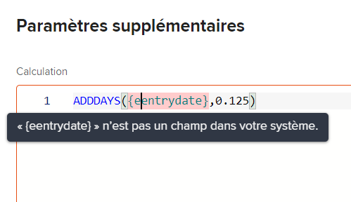
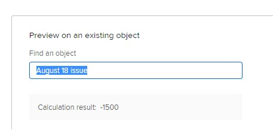

# Ajout de données calculées à un formulaire personnalisé à l’aide de l’ancien créateur de formulaires

<!--Audited: 01/2024-->

Dans un formulaire personnalisé, vous pouvez ajouter un champ personnalisé calculé qui utilise les données existantes pour générer de nouvelles données lorsque le formulaire personnalisé est joint à un objet.

Pour ce faire, vous créez une instruction qui utilise les expressions de données et les noms des champs existants, qui peuvent être des champs personnalisés, des champs de données personnalisés calculés et des champs Adobe Workfront intégrés.

Cette instruction calcule les données saisies et affiche le résultat dans le nouveau champ personnalisé calculé.

Un champ personnalisé calculé peut contenir :

* Référence simple à un seul champ intégré.

  >[!INFO]
  >
  > **Exemple :** Pour calculer les recettes générées par les projets et les tâches, vous pouvez créer un champ personnalisé calculé qui contient le champ intégré Recettes réelles. Lorsqu’une personne joint le formulaire personnalisé à un projet ou à une tâche, les recettes du projet ou de la tâche s’affichent dans le champ .

* Une expression qui fait référence à un ou plusieurs champs. Il peut s’agir de champs personnalisés, d’autres champs personnalisés calculés et de champs intégrés.

  >[!INFO]
  >
  >**Exemple :** Pour calculer le profit généré par les projets et les tâches, vous pouvez créer un champ personnalisé calculé appelé Profit contenant une expression mathématique qui soustrait le coût des recettes.
  >
  >Pour ce faire, vous pouvez utiliser l’expression mathématique SUB (soustraire) avec les champs Workfront intégrés Coût réel et Recettes réelles.
  >
  >Dans les étapes ci-dessous, vous pouvez suivre cet exemple.

Pour plus d’informations sur la création de formulaires personnalisés pour votre organisation et sur le type de champs que vous pouvez associer à ces champs, voir [Création ou modification d’un formulaire personnalisé](../../../administration-and-setup/customize-workfront/create-manage-custom-forms/create-or-edit-a-custom-form.md).

## Exigences d’accès

Les étapes de cet article doivent être les suivantes :

<table style="table-layout:auto"> 
 <col> 
 <col> 
 <tbody> 
  <tr data-mc-conditions=""> 
   <td role="rowheader"> 
Formule Adobe Workfront
 </td> 
   <td>Quelconque</td> 
  </tr> 
  <tr> 
   <td role="rowheader">Licence Adobe Workfront*</td> 
   <td>
Actuel : formule

   Ou
   
Nouveau : Standard

   </td> 
  </tr> 
  <tr> 
   <td role="rowheader">
Configuration du niveau d’accès
</td> 
   <td> 
Accès administratif aux formulaires personnalisés
 
 </td> 
  </tr>  
 </tbody> 
</table>

*Pour connaître le plan, le type de licence ou les configurations de niveau d’accès dont vous disposez, contactez votre administrateur Workfront. Pour plus d’informations sur les exigences d’accès, voir [Conditions d’accès requises dans la documentation Workfront](/help/quicksilver/administration-and-setup/add-users/access-levels-and-object-permissions/access-level-requirements-in-documentation.md).

## Ajouter un champ calculé à un formulaire personnalisé {#add-a-calculated-field-to-a-custom-form}

Vous pouvez utiliser à la fois les champs Workfront intégrés et les champs personnalisés que vous avez déjà créés dans l’expression d’un champ personnalisé calculé.

>[!IMPORTANT]
>
>Avant de créer un champ personnalisé calculé, identifiez les champs existants que vous souhaitez inclure afin de vous assurer que les données nécessaires au calcul sont présentes dans Workfront.

1. Commencez à créer ou modifier un formulaire personnalisé, comme décrit dans la section [Création ou modification d’un formulaire personnalisé](../../../administration-and-setup/customize-workfront/create-manage-custom-forms/create-or-edit-a-custom-form.md).

1. Sur le **Ajouter un champ** , cliquez sur **Calculé**.

   Dans la zone d’affichage de droite, le champ affiche une valeur de remplissage de 12345. Il s’agit d’un indicateur qui vous rappelle que le champ est un champ personnalisé calculé lorsque vous créez ou modifiez le formulaire personnalisé. Lorsque le formulaire est joint à un objet et que les utilisateurs le remplissent, le résultat du calcul s’affiche dans le champ et non dans la valeur 12345.

1. Indiquez les informations suivantes pour le champ calculé :

   <table style="table-layout:auto"> 
    <col> 
    </col> 
    <col> 
    </col> 
    <tbody> 
     <tr> 
      <td role="rowheader">Étiquette</td> 
      <td>Saisissez le libellé du champ. Voici ce que voient les utilisateurs lorsqu’ils utilisent le formulaire personnalisé. Le champ <b>Nom</b>, qui renseigne automatiquement et correspond au libellé, est référencé par Workfront dans les rapports. Champ obligatoire.</td> 
     </tr>

   <tr> 
   <td role="rowheader">Nom</td> 
   <td>Par défaut, le Nom d'un champ est identique au Libellé. Vous pouvez toutefois modifier le Nom d’un champ pour qu’il soit différent du Libellé d’un champ. Le champ <b>Nom</b> est référencé par Workfront dans les rapports. Champ obligatoire.</td> 
   </tr>

   <tr> 
     <td role="rowheader" id="instructions">Instructions</td> 
      <td> 
Ajoutez du texte pour fournir des informations supplémentaires sur le champ et la formule qu’il contient.

      
Vous pouvez également coller ici la formule utilisée dans le calcul du champ personnalisé. Dans ce cas, nous vous recommandons de mettre à jour d’abord le champ Calcul de la variable personnalisée, puis de copier l’expression finale du champ Calcul et de la coller dans le champ Instructions . 

   Cela peut s’avérer utile dans les cas suivants :
   <ul> 
      <li> 
Pour rappeler ce qu'est la formule et son fonctionnement. Cela s’avère particulièrement utile si vous prévoyez d’utiliser ce champ personnalisé calculé sur plusieurs formulaires.
 </li> 
       <li> 
Les utilisateurs d’info-bulle peuvent voir lorsqu’ils survolent le champ. Vous pouvez ajouter ici le texte que vous souhaitez qu’ils voient dans l’info-bulle.
 </li> 
       </ul>
       
Si vous ne souhaitez pas que les utilisateurs voient la formule dans l’info-bulle, ce qui peut les dérouter, ne l’ajoutez pas au champ Instructions . Utilisez plutôt le paramètre "Afficher la formule dans les instructions" pour afficher ou masquer la formule, comme décrit plus en détail dans cet article. <a href="#build-the-calculation-for-your-calculated-custom-field">Créer le calcul pour votre champ personnalisé calculé</a> dans cet article.

   
Pour plus d’informations sur l’utilisation du même champ personnalisé calculé sur un nouveau formulaire, voir <a href="../../../administration-and-setup/customize-workfront/create-manage-custom-forms/use-existing-calc-field-new-custom-form.md#using-an-existing-calculated-custom-field-on-a-new-form" class="MCXref xref">Réutiliser un champ personnalisé calculé existant dans un formulaire personnalisé</a>.

   </td> 
     </tr> 
     <tr> 
      <td role="rowheader">Format</td> 
      <td> 
Format dans lequel vous souhaitez que les résultats du champ soient stockés et affichés.
 
Si vous prévoyez d’utiliser le champ dans les calculs mathématiques, utilisez toujours un <strong>Nombre</strong> ou <strong>Devise</strong> format. Lorsque vous sélectionnez Nombre ou Devise, le système tronque automatiquement les nombres qui commencent par 0.
 
      
<b>IMPORTANT</b>: 
Avant de choisir un format, tenez compte du format correct pour le nouveau champ. Une fois le formulaire personnalisé enregistré, le champ de format ne peut plus être modifié. Et le choix d’un mauvais format peut avoir une incidence sur les calculs futurs et les valeurs agrégées dans les regroupements de rapports et de listes.

      
<strong>REMARQUE :</strong> Les champs calculés avec un format de devise ne doivent pas inclure de guillemets. (Par exemple, utilisez 800.00 et non "800.00".) L’utilisation de guillemets peut entraîner des conséquences inattendues en raison de nuances liées au formatage de la langue pour les types de devise.
</td> 
     </tr> 
    </tbody> 
   </table>

1. Continuez à mettre à jour les informations de champ personnalisé, comme décrit dans la section . [Créer le calcul pour votre champ personnalisé calculé](#build-the-calculation-for-your-calculated-custom-field) dans cet article.

## Créer le calcul pour votre champ personnalisé calculé {#build-the-calculation-for-your-calculated-custom-field}

1. Commencez à créer le champ personnalisé calculé, comme décrit dans la section [Ajouter un champ calculé à un formulaire personnalisé](#add-a-calculated-field-to-a-custom-form) dans cet article.

1. Cliquez sur **Maximiser** pour ouvrir le **Éditeur de calcul** et construisez votre calcul.

   >[!INFO]
   >
   >**Exemple :** En suivant l’exemple de l’introduction de cet article, vous pouvez créer un champ personnalisé calculé appelé Profit dans un formulaire personnalisé pour les projets et les tâches. Ce champ peut contenir un calcul qui affiche la différence entre les Recettes réelles et le Coût réel :
   >
   >`SUB({actualRevenue},{actualCost})`
   >
   >Dans cet exemple, `SUB` est l’expression et les champs référencés sont `actualRevenue` et `actualCost`.

   Un calcul commence généralement par une expression, suivie de parenthèses contenant les champs que vous souhaitez référencer lorsque le formulaire personnalisé est joint à un objet. Pour plus d’informations sur les expressions disponibles, voir [Présentation des expressions de données calculées](../../../reports-and-dashboards/reports/calc-cstm-data-reports/calculated-data-expressions.md).

   Chaque champ doit être entouré de accolades, comme expliqué dans la section . [Syntaxe requise dans les champs personnalisés calculés](#syntax-required-in-calculated-custom-fields) dans cet article. Lorsque vous commencez à saisir le nom d’un champ, le système fait des suggestions et vous pouvez en sélectionner une pour l’insérer dans votre calcul.

   >[!NOTE]
   >
   >   Dans un calcul, vous ne pouvez pas référencer des champs des types suivants : 
   >   
   >   * Champ de texte avec formatage
   >   * Texte descriptif.
   >   
   >   Pour plus d’informations sur les types de champ personnalisés, voir [Ajouter un champ personnalisé à un formulaire personnalisé](../../../administration-and-setup/customize-workfront/create-manage-custom-forms/add-a-custom-field-to-a-custom-form.md).

1. Cliquez dans la zone de texte de grande taille de la zone Éditeur de calcul, puis cliquez sur Rechercher ou développer et cliquez sur une option dans la **Expressions** et **Champs** à droite de la zone de texte. Elles sont alors ajoutées au calcul.

   Vous pouvez également commencer à saisir une expression ou un champ dans la zone de texte de grande taille, puis le sélectionner lors de son affichage. Chaque élément s’affiche avec un &quot;F&quot; pour le champ ou un &quot;E&quot; pour l’expression.

   Si vous entrez une parenthèse d’ouverture, la parenthèse de fermeture est ajoutée automatiquement.

   >[!TIP]
   >
   >Vous pouvez effectuer l’une des opérations suivantes pour obtenir de l’aide sur votre calcul :
   > 
   >* Passez la souris sur une expression de votre calcul pour afficher une description, un exemple illustrant son utilisation et un lien &quot;En savoir plus&quot; pour plus d’informations dans l’article. [Présentation des expressions de données calculées](../../../reports-and-dashboards/reports/calc-cstm-data-reports/calculated-data-expressions.md).
   >  
   >* Utilisez le codage colorimétrique pour identifier les composants que vous avez ajoutés. Les expressions s’affichent en bleu et les champs en vert.
   >  
   >* Recherchez les erreurs de calcul, surlignées en rose, au fur et à mesure. Vous pouvez pointer sur une erreur mise en surbrillance pour afficher une brève description de sa cause.
   >  
   >* Dans le **Aperçu sur un objet existant** sous votre calcul, commencez à saisir le nom d’un objet Workfront, sélectionnez-le lorsqu’il s’affiche dans la liste. Vous obtenez ainsi un aperçu de l’aspect du champ lorsque le formulaire est joint à l’objet.
   ><!--or by providing test values (NOT READY YET; CHANGE THIS SCREENSHOT WHEN IT IS)-->
   >  
   >* Expressions de référence dans un calcul long à l’aide des numéros de ligne qui s’affichent sur la gauche.

1. Cliquez sur **Réduire** lorsque vous avez terminé de créer le calcul pour le champ personnalisé calculé.

   >[!NOTE]
   >
   >Dans la zone d’affichage de droite, le champ affiche une valeur de remplissage de 12345. Il s’agit d’un indicateur qui vous rappelle que le champ est un champ personnalisé calculé lorsque vous créez ou modifiez le formulaire personnalisé. Lorsque le formulaire est joint à un objet et que les utilisateurs le remplissent, le résultat du calcul s’affiche dans le champ et non dans la valeur 12345.

1. (Facultatif) Utilisez l’une des options suivantes pour configurer davantage votre champ personnalisé calculé :

   <table style="table-layout:auto"> 
    <col> 
    <col> 
    <tbody> 
     <tr> 
      <td role="rowheader">Ajouter une logique</td> 
      <td>Vous pouvez ajouter la logique d’affichage pour déterminer si le champ calculé s’affiche en fonction d’au moins un choix effectué par un utilisateur dans un champ à choix multiples précédent (liste déroulante, cases à cocher ou boutons radio) lors du remplissage du formulaire. Pour plus d’informations, voir <a href="../../../administration-and-setup/customize-workfront/create-manage-custom-forms/display-or-skip-logic-custom-form.md" class="MCXref xref">Ajouter une logique d’affichage et ignorer une logique dans un formulaire personnalisé</a>. 
Cette option est disponible uniquement lorsqu’au moins une case à cocher, un bouton radio ou un champ déroulant précède le champ personnalisé calculé du formulaire. 
 
Ignorer la logique n’est pas disponible pour les champs personnalisés calculés.
 </td> 
     </tr> 
     <tr> 
      <td role="rowheader">Mise à jour des calculs précédents</td> 
      <td>Lorsque vous modifiez un champ personnalisé calculé existant, vous pouvez sélectionner cette option pour déclencher une mise à jour dans le calcul lors de l’enregistrement du formulaire personnalisé. Cela se produit une seule fois lorsque vous enregistrez le formulaire personnalisé. L’option revient alors à son état désactivé.</td> 
     </tr> 
     <tr> 
      <td role="rowheader">Afficher la formule dans les instructions</td> 
      <td>Laissez cette option activée si vous souhaitez que les utilisateurs qui remplissent le formulaire personnalisé voient la formule du champ lorsqu’ils survolent le champ. Pour plus d’informations, voir les informations sur <a href="#instructions" class="MCXref xref">Instructions</a> plus haut dans ce tableau.</td> 
     </tr> 
    </tbody> 
   </table>

1. Cliquez sur **Terminé** lorsque toutes les modifications sont effectuées sur le champ personnalisé calculé.

   Ou cliquez sur **Appliquer** pour appliquer vos modifications au formulaire jusqu’à présent si vous souhaitez continuer à ajouter des champs personnalisés au formulaire.

   Ou cliquez sur **Enregistrer + Fermer** lorsque toutes les modifications sont effectuées sur le formulaire personnalisé.
1. Pour vérifier que votre champ personnalisé calculé fonctionne correctement, joignez le formulaire personnalisé à un objet, puis passez en revue le résultat dans le champ personnalisé calculé.

   Pour plus d’informations sur l’ajout d’un formulaire personnalisé, voir [Ajout d’un formulaire personnalisé à un objet](../../../workfront-basics/work-with-custom-forms/add-a-custom-form-to-an-object.md).

   Si vous souhaitez continuer à créer votre formulaire personnalisé d’une autre manière, vous pouvez passer à l’un des articles suivants :

   * [Ajouter un champ personnalisé à un formulaire personnalisé](../../../administration-and-setup/customize-workfront/create-manage-custom-forms/add-a-custom-field-to-a-custom-form.md)
   * [Placement de champs et de widgets personnalisés dans un formulaire personnalisé](../../../administration-and-setup/customize-workfront/create-manage-custom-forms/position-fields-in-a-custom-form.md)
   * [Ajout ou modification d’un widget de ressource dans un formulaire personnalisé](../../../administration-and-setup/customize-workfront/create-manage-custom-forms/add-widget-or-edit-its-properties-in-a-custom-form.md)
   * [Réutiliser un champ personnalisé calculé existant dans un formulaire personnalisé](../../../administration-and-setup/customize-workfront/create-manage-custom-forms/use-existing-calc-field-new-custom-form.md)
   * [Ajouter une logique d’affichage et ignorer une logique dans un formulaire personnalisé](../../../administration-and-setup/customize-workfront/create-manage-custom-forms/display-or-skip-logic-custom-form.md)
   * [Aperçu et remplissage d’un formulaire personnalisé](../../../administration-and-setup/customize-workfront/create-manage-custom-forms/preview-and-complete-a-custom-form.md)

## Syntaxe requise dans les champs personnalisés calculés

Chaque champ utilisé dans un champ calculé personnalisé doit utiliser la syntaxe expliquée ci-dessous, avec des accolades autour de chaque nom de champ. Lorsque vous commencez à saisir le nom d’un champ, le système fait des suggestions et vous pouvez en sélectionner une pour l’insérer dans votre calcul. Si vous saisissez incorrectement des données dans un calcul, un message d’avertissement vous avertit. Vous ne pouvez pas enregistrer le formulaire à moins de modifier votre calcul pour qu’il contienne des champs valides et une expression calculée valide.

>[!NOTE]
>
>Actuellement, le système ne fait des suggestions que lorsque vous commencez à saisir le nom d’un champ que vous souhaitez référencer sur un objet auquel le formulaire personnalisé sera joint, et non sur le parent de l’objet.

### Noms de champ encadrés avec accolades

* Si vous souhaitez que le calcul référence un champ intégré, le nom du champ doit être entouré de accolades et il doit être formaté tel qu’il apparaît dans la base de données Workfront. Vous ne pouvez pas utiliser le nom des champs tel qu’ils s’affichent dans l’interface de Workfront.

Par exemple : `{actualRevenue}`

Les noms de champ sont sensibles à la casse et doivent apparaître au format de casse mixte, tels qu’ils apparaissent dans le système Workfront.

* Si vous souhaitez que le calcul référence un champ personnalisé, le nom du champ doit être entouré de accolades et précédé de `DE:` entre les crochets. Les champs personnalisés sont sensibles à la casse et doivent être formatés tels qu’ils apparaissent dans l’interface de Workfront.

Par exemple : `{DE:Profit}`

Le système répertorie tous les champs personnalisés que vous pouvez choisir lorsque vous saisissez `DE:`.

* Si vous souhaitez que le calcul référence un champ qui extrait les données de l’objet parent lorsque le formulaire personnalisé est associé à un objet, vous devez précéder le nom du champ du type d’objet de l’objet parent, également entre accolades.

  Par exemple, si le formulaire personnalisé est configuré pour fonctionner avec des tâches et que vous souhaitez que le champ calcule le revenu réel de l’objet parent lorsque le formulaire est joint à une tâche, vous devez indiquer `project` comme type d’objet du champ :

  `{project}.{actualRevenue}`

  Ou, s’il s’agit d’un champ personnalisé :

  `{project}.{DE:profit}`

  Si vous ne savez pas quel type d’objet sera l’objet parent, car le formulaire personnalisé est configuré pour plusieurs types d’objets, vous pouvez utiliser la variable de filtre de caractère générique. `$$OBJCODE` pour permettre au calcul de fonctionner pour chacun des types possibles. Pour plus d’informations, voir [Champs personnalisés calculés dans des formulaires personnalisés à plusieurs objets](#calculated-custom-fields-in-multi-object-custom-forms) dans cet article.

### Séparez les éléments par des points.

Lorsque vous référencez un objet associé dans un champ personnalisé calculé, vous devez séparer les noms et les attributs des objets par des points.

Par exemple, dans un formulaire personnalisé de type tâche, pour afficher le nom du propriétaire du Portfolio dans un champ personnalisé calculé, vous devez saisir ce qui suit :

`{project}.{porfolio}.{owner}`

Ce système récupère les informations dans les étapes suivantes (dans cet ordre) :

1. Dans l’objet du formulaire personnalisé (une tâche), puis
1. Accédez au parent de la tâche ou à un autre objet (projet) associé, puis
1. Accédez au parent ou à un autre objet associé du projet (un portfolio), puis
1. Accédez à l’objet associé suivant au portefeuille (le propriétaire du portefeuille).

### Syntaxe du nom pour référencer un champ personnalisé

Lorsque vous référencez un autre champ personnalisé dans un champ personnalisé calculé, vous devez saisir le nom du champ tel qu’il s’affiche dans l’interface de Workfront.

Par exemple, pour référencer l’option sélectionnée dans un champ personnalisé intitulé Responsable de l’exécution, saisissez ce qui suit :

`{DE:Executive sponsor}`

>[!NOTE]
>
>La syntaxe d’un champ de type anticipé est différente de celle des autres types de champs, car vous devez ajouter `:name` à la fin.
>
>Par exemple, pour référencer l’option sélectionnée dans un champ de type personnalisé nommé &quot;Responsable de l’exécution&quot;, saisissez :
>
>`{DE:Executive sponsor:name}`

## Champs personnalisés calculés dans des formulaires personnalisés à plusieurs objets {#calculated-custom-fields-in-multi-object-custom-forms}

Dans un formulaire personnalisé à plusieurs objets, les types d’objet sélectionnés doivent être compatibles avec tous les champs référencés dans les champs personnalisés calculés du formulaire. En cas d’incompatibilité, un message vous avertit d’effectuer des ajustements.

>[!INFO]
>
>**Exemple :**
>
>Dans un formulaire personnalisé configuré pour fonctionner avec le type d’objet Tâche , vous créez un champ personnalisé calculé nommé En charge. Vous pouvez le configurer pour référencer le champ intégré afin qu’il affiche le nom de la personne désignée principale responsable chaque fois que le formulaire est joint à une tâche :
>
>`{assignedTo}.{name}`
>
>Par la suite, vous ajoutez le type d’objet Projet au formulaire personnalisé. Un message d’avertissement vous indique que le type d’objet Projet est incompatible avec le champ personnalisé calculé.

Dans ce cas, vous pouvez effectuer l’une des opérations suivantes :

* Supprimez l’un des deux éléments incompatibles du formulaire personnalisé : le type d’objet ou le champ personnalisé calculé référencé.
* Conserver les deux éléments et utiliser la variable de filtre de caractères génériques `$$OBJCODE` comme condition dans une expression IF pour créer deux versions différentes du champ En charge . Cela permet au champ de fonctionner correctement, quel que soit le type d’objet auquel le formulaire est associé.

>[!INFO]
>
>**Exemple :** Bien qu’il n’existe pas de champ Attribué à : nom dans les projets, il existe un champ Propriétaire intégré (qui renseigne automatiquement le nom de la personne qui a créé le projet, sauf si quelqu’un modifie manuellement ce champ).
>
>Ainsi, dans votre champ personnalisé En charge , vous pouvez utiliser `$$OBJCODE` comme illustré ci-dessous pour faire référence au champ Propriétaire lorsque le formulaire personnalisé est joint à un projet, et au champ Affecté à : Nom lorsque le formulaire est joint à une tâche :
>
>`IF($$OBJCODE="PROJ",{owner}.{name},{assignedTo}.{name})`

Pour plus d’informations sur les variables telles que `$$OBJCODE,` see [Présentation des variables de filtre de caractères génériques](../../../reports-and-dashboards/reports/reporting-elements/understand-wildcard-filter-variables.md).

## Mises à jour automatiques des champs personnalisés calculés

Les champs personnalisés calculés sur un objet sont automatiquement recalculés lorsque les événements suivants se produisent :

* Un élément de l’objet change, tel qu’un calcul quotidien de la chronologie.
* Quelqu’un modifie un autre champ qui est référencé par un champ personnalisé calculé sur l’objet.
* L’expression calculée est vide et le champ contient une valeur : elle définit la valeur sur null.

  >[!NOTE]
  >
  >Dans un formulaire personnalisé joint à un objet, les instructions de date et d’heure dans les champs personnalisés calculés sont calculées et enregistrées selon l’heure universelle coordonnée (UTC), et non selon les configurations de fuseau horaire définies pour l’instance de votre entreprise et votre profil utilisateur. Cependant, les calculs dans un formulaire personnalisé sont affichés en fonction du fuseau horaire de chaque utilisateur.
