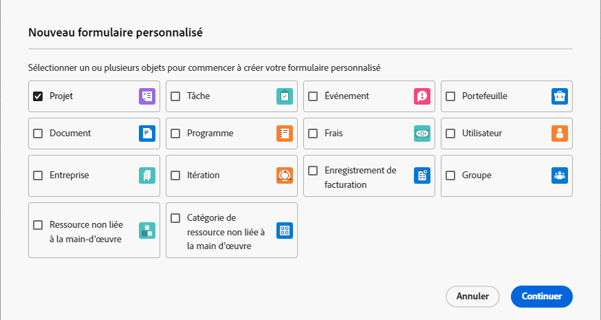

# Création ou modification d’un formulaire personnalisé avec le créateur de formulaires hérité

<!--Audited: 01/2024-->

Vous pouvez créer ou modifier un nouveau formulaire personnalisé. Les deux tâches sont expliquées dans cet article.

Pour plus d’informations sur la création d’un formulaire personnalisé à partir d’un formulaire existant, voir [Copier un formulaire personnalisé pour en créer un nouveau avec l’ancien créateur de formulaires](../../../administration-and-setup/customize-workfront/create-manage-custom-forms/copy-custom-form-to-create-a-new-one.md).

Cet article décrit comment créer un formulaire personnalisé à l’aide de l’ancien créateur de formulaires. Pour plus d’informations sur la création d’un formulaire personnalisé à l’aide du concepteur de formulaire, voir [Concevoir un formulaire avec le concepteur de formulaires](/help/quicksilver/administration-and-setup/customize-workfront/create-manage-custom-forms/form-designer/design-a-form/design-a-form.md).

## Exigences d’accès

Les étapes de cet article doivent être les suivantes :

<table style="table-layout:auto"> 
 <col> 
 <col> 
 <tbody> 
  <tr data-mc-conditions=""> 
   <td role="rowheader"> 
Formule Adobe Workfront*
 </td> 
   <td>Quelconque</td> 
  </tr> 
  <tr> 
   <td role="rowheader">Licence Adobe Workfront*</td> 
   <td>
Nouveau : Standard

   
Actuel : formule
</td> 
  </tr> 
  <tr data-mc-conditions=""> 
   <td role="rowheader">Paramétrages du niveau d'accès*</td> 
   <td> 
Accès administratif aux formulaires personnalisés
 
Pour plus d’informations sur la manière dont les administrateurs de Workfront accordent cet accès, voir <a href="../../../administration-and-setup/add-users/configure-and-grant-access/grant-users-admin-access-certain-areas.md" class="MCXref xref">Octroi aux utilisateurs un accès administratif à certaines zones</a>.
 </td> 
  </tr>  
 </tbody> 
</table>

&#42;Pour connaître le plan, le type de licence ou les configurations de niveau d’accès dont vous disposez, contactez votre administrateur Workfront. Pour plus d’informations sur les exigences d’accès, voir [Conditions d’accès requises dans la documentation Workfront](/help/quicksilver/administration-and-setup/add-users/access-levels-and-object-permissions/access-level-requirements-in-documentation.md).

## Commencer à créer un formulaire personnalisé

{{step-1-to-setup}}

1. Cliquez sur **Forms personnalisée** dans le panneau de gauche.

   Les formulaires personnalisés s’affichent dans une liste. Vous pouvez consulter tous les formulaires et champs personnalisés créés pour votre entreprise. Vous pouvez également voir qui a créé chaque formulaire, les objets qui lui sont associés et s’il est actif.

1. Cliquez sur **Nouveau formulaire personnalisé.**
1. Sélectionnez au moins un type d’objet à associer au formulaire personnalisé, puis cliquez sur **Continuer**.

   

1. Sur le **Paramètres du formulaire** qui s’ouvre, saisissez une **Titre du formulaire** et un **Description** pour le formulaire personnalisé.

1. (Facultatif) Si vous souhaitez ajouter d’autres types d’objets au formulaire afin de pouvoir les joindre à d’autres objets, cliquez sur le bouton **plus** sign **Types d’objet**, puis sélectionnez le type d’objet souhaité dans le menu qui s’affiche.

   Vous pouvez répéter cette opération pour ajouter autant de types d’objet que vous le souhaitez.

1. (Facultatif) Cliquez sur le **X** sur un type d’objet pour le supprimer du formulaire.

   Pour plus d’informations sur la suppression des types d’objet d’un formulaire personnalisé que vous avez déjà enregistré, voir [Suppression de types d’objet sur un formulaire personnalisé](../../../administration-and-setup/customize-workfront/create-manage-custom-forms/delete-object-type-on-a-custom-form.md).

1. Cliquez sur **Terminé** dans le coin inférieur gauche de l’écran.

   >[!TIP]
   >
   >Cliquez sur **Appliquer** lorsque vous créez un formulaire personnalisé pour enregistrer vos modifications et garder le formulaire ouvert.

1. Si vous souhaitez ajouter un nouveau champ personnalisé au formulaire, passez à la [Ajouter un champ personnalisé à un formulaire personnalisé](../../../administration-and-setup/customize-workfront/create-manage-custom-forms/add-a-custom-field-to-a-custom-form.md) ou [Réutilisation d’un champ ou d’un widget personnalisé dans un formulaire personnalisé](../../../administration-and-setup/customize-workfront/create-manage-custom-forms/reuse-an-existing-field.md).

   Ou

   Si vous souhaitez continuer à créer votre formulaire personnalisé d’une autre manière, passez à l’un des articles suivants :

   * [Ajout ou modification d’un widget de ressource dans un formulaire personnalisé](../../../administration-and-setup/customize-workfront/create-manage-custom-forms/add-widget-or-edit-its-properties-in-a-custom-form.md)
   * [Placement de champs et de widgets personnalisés dans un formulaire personnalisé](../../../administration-and-setup/customize-workfront/create-manage-custom-forms/position-fields-in-a-custom-form.md)
   * [Ajout d’un saut de section à un formulaire personnalisé](../../../administration-and-setup/customize-workfront/create-manage-custom-forms/add-a-section-break-to-a-custom-form.md)
   * [Ajout de données calculées à un formulaire personnalisé](../../../administration-and-setup/customize-workfront/create-manage-custom-forms/add-calculated-data-to-custom-form.md)
   * [Réutiliser un champ personnalisé calculé existant dans un formulaire personnalisé](../../../administration-and-setup/customize-workfront/create-manage-custom-forms/use-existing-calc-field-new-custom-form.md)
   * [Ajouter une logique d’affichage et ignorer une logique dans un formulaire personnalisé](../../../administration-and-setup/customize-workfront/create-manage-custom-forms/display-or-skip-logic-custom-form.md)

## Commencer à modifier un formulaire personnalisé

Vous pouvez modifier un formulaire personnalisé à tout moment après sa création.

>[!CAUTION]
>
>Pour plus d’informations sur la suppression de champs d’un formulaire personnalisé sans perdre les données saisies par les utilisateurs dans ces champs, reportez-vous à la section . [Supprimer un champ personnalisé sans perdre les données saisies par les utilisateurs](../../../administration-and-setup/customize-workfront/create-manage-custom-forms/delete-a-custom-field.md#remove) dans l’article [Suppression d’un champ ou d’un widget personnalisé du système](../../../administration-and-setup/customize-workfront/create-manage-custom-forms/delete-a-custom-field.md).
>
>En règle générale, il est recommandé de réduire au minimum le nombre de fois où vous modifiez un formulaire personnalisé déjà utilisé. Il n’existe pas de système de notification pour alerter les personnes qui utilisent le formulaire personnalisé au sujet de vos modifications.

{{step-1-to-setup}}

1. Cliquez sur **Forms personnalisée** dans le panneau de gauche.

   Les formulaires personnalisés s’affichent dans une liste. Vous pouvez consulter tous les formulaires et champs personnalisés créés pour votre entreprise. Vous pouvez également voir qui a créé chaque formulaire, les objets qui lui sont associés et s’il est actif.

1. Sélectionnez le formulaire personnalisé à modifier, puis cliquez sur **Modifier**.
1. (Facultatif) Pour modifier le titre et la description du formulaire personnalisé, cliquez sur le bouton **Paramètres de formulaire** , puis saisissez une **Titre du formulaire** et **Description**.

1. (Facultatif) Si vous souhaitez ajouter d’autres types d’objets au formulaire afin de pouvoir les joindre à d’autres objets, cliquez sur le signe + après **Types d’objet**, puis sélectionnez le type souhaité dans le menu qui s’affiche.

   

   Vous pouvez répéter cette opération pour ajouter autant de types d’objet que vous le souhaitez.

   Vous pouvez également cliquer sur le X d’un type d’objet pour le supprimer du formulaire. Pour ce faire, soyez prudent lorsque vous souhaitez supprimer un type d’objet d’un formulaire personnalisé déjà enregistré. Pour plus d’informations, voir [Suppression de types d’objet sur un formulaire personnalisé](../../../administration-and-setup/customize-workfront/create-manage-custom-forms/delete-object-type-on-a-custom-form.md).

1. Cliquez sur **Terminé**.

   >[!TIP]
   >
   >Cliquez sur **Appliquer** lorsque vous créez un formulaire personnalisé pour enregistrer vos modifications et garder le formulaire ouvert.

1. Si vous souhaitez ajouter un nouveau champ personnalisé au formulaire, passez à la [Ajouter un champ personnalisé à un formulaire personnalisé](../../../administration-and-setup/customize-workfront/create-manage-custom-forms/add-a-custom-field-to-a-custom-form.md) ou [Réutilisation d’un champ ou d’un widget personnalisé dans un formulaire personnalisé](../../../administration-and-setup/customize-workfront/create-manage-custom-forms/reuse-an-existing-field.md).

   Ou

   Si vous souhaitez continuer à créer votre formulaire personnalisé d’une autre manière, passez à l’un des articles suivants :

   * [Ajout ou modification d’un widget de ressource dans un formulaire personnalisé](../../../administration-and-setup/customize-workfront/create-manage-custom-forms/add-widget-or-edit-its-properties-in-a-custom-form.md)
   * [Placement de champs et de widgets personnalisés dans un formulaire personnalisé](../../../administration-and-setup/customize-workfront/create-manage-custom-forms/position-fields-in-a-custom-form.md)
   * [Ajout d’un saut de section à un formulaire personnalisé](../../../administration-and-setup/customize-workfront/create-manage-custom-forms/add-a-section-break-to-a-custom-form.md)
   * [Ajout de données calculées à un formulaire personnalisé](../../../administration-and-setup/customize-workfront/create-manage-custom-forms/add-calculated-data-to-custom-form.md)
   * [Réutiliser un champ personnalisé calculé existant dans un formulaire personnalisé](../../../administration-and-setup/customize-workfront/create-manage-custom-forms/use-existing-calc-field-new-custom-form.md)
   * [Ajouter une logique d’affichage et ignorer une logique dans un formulaire personnalisé](../../../administration-and-setup/customize-workfront/create-manage-custom-forms/display-or-skip-logic-custom-form.md)
