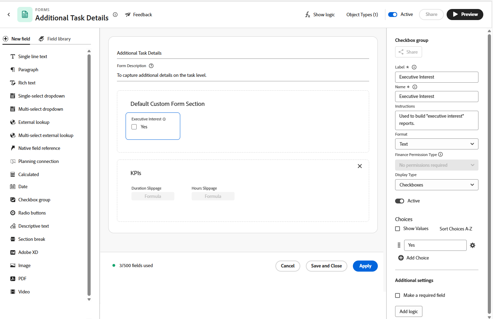

# Vue d’ensemble des formulaires personnalisés

<!--Audited: 12/2023-->

Vous pouvez créer un formulaire personnalisé que les utilisateurs et utilisatrices peuvent attacher à un objet Adobe Workfront. Les utilisateurs et utilisatrices qui travaillent sur l’objet peuvent remplir le formulaire personnalisé pour fournir des informations sur l’objet.

Par exemple, vous pouvez attacher un formulaire personnalisé appelé « Recherche de contenu marketing » à un projet afin que les utilisateurs et les utilisatrices du projet puissent demander du contenu marketing pour le projet :

## Création d’un formulaire personnalisé

Le concepteur de formulaire dispose d’un espace de travail de style zone de travail qui vous permet d’afficher simultanément les champs, la zone de travail et les paramètres des champs. Il vous permet également de faire glisser et de déposer des champs dans les sections lors de la conception de votre formulaire. Vous pouvez redimensionner le côté droit de l’écran pour libérer de l’espace pour les options de champ.

Pour plus d’informations, voir [Créer un formulaire personnalisé](/help/quicksilver/administration-and-setup/customize-workfront/create-manage-custom-forms/form-designer/design-a-form/design-a-form.md).

## Champs personnalisés et widgets

Workfront fournit de nombreux champs intégrés pour chaque type d’objet.

Dans un formulaire personnalisé, vous pouvez créer des champs supplémentaires qui invitent les utilisateurs et les utilisatrices à fournir des informations spécifiques à leurs workflows. Ces champs personnalisés sont les éléments constitutifs d’un formulaire personnalisé.

Vous pouvez ajouter les types de champs personnalisés suivants à un formulaire personnalisé dans Workfront :

* Texte sur une seule ligne
* Paragraphe
* Texte enrichi
* Liste déroulante à sélection unique
* Menu déroulant multi-sélection
* Recherche externe
* Recherche interne
* Référence de champ native
* Connexion au champ Planning
* Calculé
* Date
* Groupe Case à cocher
* Cases d’option
* Texte descriptif
* Saut de section
* Adobe XD
* Image
* PDF
* Vidéo

>[!NOTE]
>
>Pour suivre les modifications de champ dans les flux de mise à jour, accédez à Configuration > Interface > Mettre à jour les flux. Pour plus d’informations, consultez la section [Configurer les mises à jour du système](/help/quicksilver/administration-and-setup/set-up-workfront/system-tracked-update-feeds/configure-system-updates.md).

## Objets auxquels les utilisateurs et les utilisatrices peuvent associer un formulaire personnalisé

Lorsque vous créez un formulaire personnalisé, vous pouvez le configurer pour qu’il soit utilisé avec plusieurs types d’objets.

Les utilisateurs et utilisatrices peuvent associer des formulaires personnalisés aux types d’objets suivants :

* Projet (y compris les Business Cases)
* Tâche
* Problème (y compris la file d’attente des demandes)
* Entreprise
* Document
* l’utilisateur ou de l’utilisatrice
* Programme
* Portfolio
* Frais
* Groupe
* Fonction
* Equipe
* Itération
* Enregistrement de facturation
* Carte tarifaire
* Affectation

Pour plus d’informations sur l’association de formulaires personnalisés à des objets, consultez [Ajouter un formulaire personnalisé à un objet](../../../workfront-basics/work-with-custom-forms/add-a-custom-form-to-an-object.md).

Pour plus d’informations sur ce qui se passe avec les formulaires personnalisés lors de la conversion d’un objet, consultez [Transfert de données de formulaire personnalisé lors de la conversion d’un objet](/help/quicksilver/administration-and-setup/customize-workfront/create-manage-custom-forms/transfer-custom-form-data-larger-item.md).

