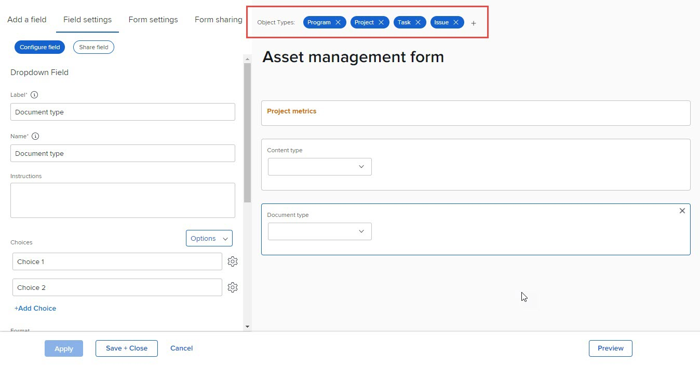

# Suppression de types d’objet sur un formulaire personnalisé

Sur un formulaire personnalisé existant, vous pouvez supprimer les types d’objet associés au formulaire. Après cela, les utilisateurs ne peuvent plus joindre le formulaire à des objets de ce type.

## Exigences d’accès

Les étapes de cet article doivent être les suivantes :

<table style="table-layout:auto"> 
 <col> 
 <col> 
 <tbody> 
  <tr data-mc-conditions=""> 
   <td role="rowheader"> 
Formule Adobe Workfront
 </td> 
   <td>Quelconque</td> 
  </tr> 
  <tr> 
   <td role="rowheader">Licence Adobe Workfront</td> 
   <td>
   
Nouveau : Standard

   
ou

   
Actuel : formule
</td>
  </tr> 
  <tr data-mc-conditions=""> 
   <td role="rowheader">Paramétrages du niveau d'accès</td> 
   <td> 
Accès administratif aux formulaires personnalisés
 </td> 
  </tr>  
 </tbody> 
</table>

Pour plus d’informations sur ce tableau, voir [Conditions d’accès requises dans la documentation Workfront](/help/quicksilver/administration-and-setup/add-users/access-levels-and-object-permissions/access-level-requirements-in-documentation.md).

## Suppression de types d’objet sur un formulaire personnalisé

Vous pouvez supprimer des types d’objet d’un formulaire personnalisé existant.

Un formulaire personnalisé doit comporter au moins un type d’objet.

>[!CAUTION]
>
>Si des personnes ont déjà joint le formulaire personnalisé à des objets du type que vous souhaitez supprimer et y ont ajouté des données, ces données sont définitivement supprimées lorsque vous supprimez ce type d’objet sur le formulaire. Il peut inclure des informations historiques dont les utilisateurs auront besoin ultérieurement.
>
>En règle générale, il est recommandé de réduire au minimum le nombre de fois où vous modifiez un formulaire personnalisé déjà utilisé. Il n’existe pas de système de notification pour alerter les personnes qui utilisent le formulaire personnalisé au sujet de vos modifications.

{{step-1-to-setup}}

1. Cliquez sur **Forms personnalisée** dans le panneau de gauche.
1. Sélectionnez le formulaire personnalisé à modifier, puis cliquez sur .
1. Cliquez sur le X dans l’une des **Types d’objet** à supprimer du formulaire, puis cliquez sur **Supprimer** dans le message d’avertissement qui s’affiche.

   

1. (Facultatif) Répétez l’étape précédente pour tout autre type d’objet que vous souhaitez supprimer du formulaire.
1. Cliquez sur **Terminé**, puis cliquez sur **Enregistrer et fermer**.
