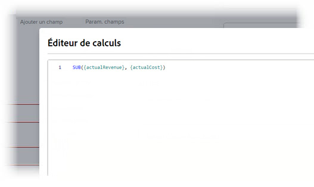
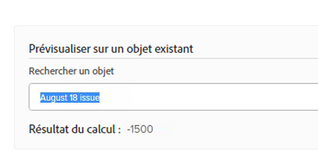

# Ajouter des champs calculés à un formulaire

Vous pouvez ajouter un champ personnalisé calculé qui utilise les données existantes pour générer de nouvelles données lorsque le formulaire personnalisé est joint à un objet.

Un champ personnalisé calculé peut contenir :

* Référence simple à un seul champ intégré.

  >[!INFO]
  >
  > **Exemple :** Pour calculer les recettes générées par les projets et les tâches, vous pouvez créer un champ personnalisé calculé qui contient le champ intégré Recettes réelles. Lorsqu’une personne joint le formulaire personnalisé à un projet ou à une tâche, les recettes du projet ou de la tâche s’affichent dans le champ .

* Une expression qui fait référence à un ou plusieurs champs. Il peut s’agir de champs personnalisés, d’autres champs personnalisés calculés et de champs intégrés.

  >[!INFO]
  >
  >**Exemple :** Pour calculer le profit généré par les projets et les tâches, vous pouvez créer un champ personnalisé calculé appelé Profit contenant une expression mathématique qui soustrait le coût des recettes.
  >
  >Pour ce faire, vous pouvez utiliser l’expression mathématique SUB (soustraire) avec les champs Workfront intégrés Coût réel et Recettes réelles.
  >
  >Dans les étapes ci-dessous, vous pouvez suivre cet exemple.

## Conditions d’accès

Vous devez disposer des éléments suivants pour effectuer les étapes décrites dans cet article :

<table style="table-layout:auto"> 
 <col> 
 <col> 
 <tbody> 
  <tr data-mc-conditions=""> 
   <td role="rowheader"> 
Forfait Adobe Workfront*
 </td> 
   <td>N’importe quelle</td> 
  </tr> 
  <tr> 
   <td role="rowheader">Licence Adobe Workfront*</td> 
   <td>Plan</td> 
  </tr> 
  <tr data-mc-conditions=""> 
   <td role="rowheader">Configurations des niveau d’accès*</td> 
   <td> 
Accès administratif aux formulaires personnalisés
 
Pour plus d’informations sur la manière dont les administrateurs et administratrices de Workfront accordent cet accès, voir <a href="/help/quicksilver/administration-and-setup/add-users/configure-and-grant-access/grant-users-admin-access-certain-areas.md" class="MCXref xref">Octroyer aux utilisateurs et utilisatrices un accès administratif à certaines zones</a>.
 </td> 
  </tr>  
 </tbody> 
</table>

&#42;Pour connaître le plan, le type de licence ou les configurations de niveau d’accès dont vous disposez, contactez votre administrateur Workfront.

## Réutiliser un champ personnalisé calculé existant dans un formulaire personnalisé

Vous pouvez utiliser le même champ personnalisé calculé sur les formulaires personnalisés appartenant à des objets différents. Par exemple, vous pouvez utiliser le champ calculé de profit que vous avez créé pour le formulaire personnalisé du projet sur un formulaire personnalisé de tâche.

Lors de l’utilisation d’un champ personnalisé calculé existant, le calcul n’est pas transféré vers le nouveau formulaire. Vous devez à nouveau ajouter le calcul, sur le même champ, sur le nouveau formulaire personnalisé.

Vous pouvez également avoir un calcul différent pour le même champ, sur le nouveau formulaire. Le fait de conserver le même nom pour le champ personnalisé calculé garantit la cohérence et la cohérence de votre convention d’affectation des noms.

>[!IMPORTANT]
>
>Les modifications apportées aux expressions calculées peuvent rendre la valeur du champ des objets obsolète. Pour vérifier que vous affichez toujours les calculs à jour dans ces champs, effectuez l’une des opérations suivantes :
>
>* Après avoir enregistré un objet pour lequel vous avez modifié des données dans un formulaire personnalisé joint, cliquez sur l’icône Plus  sur la page principale de l’objet, puis sur Recalculer les expressions personnalisées.
>* Sélectionnez l’option Recalculer les expressions personnalisées lors de l’édition d’objets en bloc.
>* Sélectionnez l’option Mettre à jour les calculs précédents lorsque vous modifiez un champ personnalisé calculé sur un formulaire personnalisé.

Pour réutiliser un champ personnalisé calculé existant :

1. Cliquez sur l’icône **Menu principal**  en haut à droite d’Adobe Workfront, puis cliquez sur **Configurer** .

1. Cliquez sur **Formulaires personnalisés** dans le panneau de gauche.

   <!-- >[!TIP]
    >
    >In the view that appears, you can review all custom forms and custom fields that have been created for your organization. You can also see who created each form and the fields that are associated with it. -->

1. Cliquez sur **Nouveau formulaire personnalisé**.
1. Sélectionnez les types d’objets auxquels vous souhaitez joindre le formulaire personnalisé, puis cliquez sur **Continuer**.

1. Dans le coin supérieur gauche de l’écran, cliquez sur **Bibliothèque de champs**.

   

1. Utilisez la zone de recherche ou développez la section **Calculé** pour localiser le champ calculé dont vous avez besoin, puis faites glisser le champ où vous souhaitez qu’il apparaisse dans le formulaire personnalisé.

1. (Facultatif) Répétez l’étape précédente pour ajouter d’autres champs.

   >[!NOTE]
   >
   >Vous pouvez ajouter jusqu’à 500 champs et widgets sur un seul formulaire personnalisé. Cependant, une dégradation des performances peut se produire lorsque le formulaire comporte plus de 100 champs, en fonction de sa complexité.
   >
   >
   >Parmi les exemples de formulaires complexes, citons les formulaires avec des paramètres en cascade, des champs de données personnalisés calculés et plusieurs options de valeur dans un seul champ.

1. Pour enregistrer vos modifications, cliquez sur **Appliquer** et passez à une autre section pour continuer à créer votre formulaire.

   ou

   Cliquez sur **Enregistrer et Fermer**.

## Ajouter un nouveau champ calculé

>[!IMPORTANT]
>
>Avant de créer un nouveau champ personnalisé calculé, identifiez les champs existants que vous souhaitez inclure afin de vous assurer que les données nécessaires au calcul sont présentes dans Workfront.

1. Cliquez sur l’icône **Menu principal**  en haut à droite d’Adobe Workfront, puis cliquez sur **Configurer** .

1. Cliquez sur **Formulaires personnalisés** dans le panneau de gauche.

   <!-- >[!TIP]
    >
    >In the view that appears, you can review all custom forms and custom fields that have been created for your organization. You can also see who created each form and the fields that are associated with it. -->

1. Cliquez sur **Nouveau formulaire personnalisé**.
1. Sélectionnez les types d’objets auxquels vous souhaitez joindre le formulaire personnalisé, puis cliquez sur **Continuer**.

1. Sur le côté gauche de l’écran, recherchez **Calculé** et faites-le glisser vers une section du canevas.

   

1. Dans la partie droite de l’écran, configurez les options disponibles pour le type de champ personnalisé que vous ajoutez :

   <table style="table-layout:auto"> 
    <col> 
    </col> 
    <col> 
    </col> 
    <tbody> 
     <tr> 
      <td role="rowheader">Étiquette</td> 
      <td>Saisissez le libellé du champ. Voici ce que les utilisateurs verront lorsqu’ils utiliseront le formulaire personnalisé. Le champ <b>Nom</b>, qui se remplit automatiquement, est référencé par Workfront dans les rapports.</td> 
     </tr> 
     <tr> 
      <td role="rowheader" id="instructions">Instructions</td> 
      <td> Par défaut, la formule que vous créez pour le champ est stockée ici. Vous pouvez ajouter du texte pour fournir des informations supplémentaires sur le champ et la formule qu’il contient. Cela peut s’avérer utile de deux façons : 
       <ul> 
      <li>
Pour rappeler ce qu'est la formule et son fonctionnement. Cela s’avère particulièrement utile si vous prévoyez d’utiliser ce champ personnalisé calculé sur plusieurs formulaires.
 </li> 
      <li> 
Les utilisateurs d’info-bulle peuvent voir lorsqu’ils survolent le champ. Vous ajoutez ici le texte que vous souhaitez qu’ils voient dans l’info-bulle.
 
Si vous ne souhaitez pas qu’ils voient la formule dans l’info-bulle, ce qui peut les dérouter, vous pouvez la masquer.</li> 
       </ul> </td> 
     </tr> 
     <tr> 
      <td role="rowheader">Format</td> 
      <td> 
Format dans lequel vous souhaitez que les résultats du champ soient stockés et affichés.
 
Si le champ sera utilisé dans les calculs mathématiques, utilisez toujours un format <strong>Number</strong> ou <strong>Currency</strong> (Devise)). Lorsque vous sélectionnez Nombre ou Devise, le système tronque automatiquement les nombres qui commencent par 0.
 
      
<b>IMPORTANT</b> : avant de choisir un format, considérez le format correct pour le nouveau champ. Une fois le formulaire personnalisé enregistré, le champ de format ne peut plus être modifié. Et le choix d’un mauvais format peut avoir une incidence sur les calculs futurs et les valeurs agrégées dans les regroupements de rapports et de listes.

      
<strong>REMARQUE :</strong> Les champs calculés avec un format de devise ne doivent pas inclure de guillemets. (Par exemple, utilisez 800.00 et non "800.00".) L’utilisation de guillemets peut entraîner des conséquences inattendues en raison de nuances liées au formatage de la langue pour les types de devise.
</td>
     </tr> 
    </tbody> 
   </table>

1. Dans la zone **Calcul**, commencez à créer votre calcul :
   1. Cliquez sur **Maximiser** pour ouvrir l’éditeur de calcul et créer votre calcul.

Un calcul commence généralement par une expression, suivie de parenthèses contenant les champs que vous souhaitez référencer lorsque le formulaire personnalisé est joint à un objet.

      Chaque champ doit être entouré de accolades. Lorsque vous commencez à saisir le nom d’un champ, le système fait des suggestions et vous pouvez en sélectionner une pour l’insérer dans votre calcul.

+++ **Développer pour afficher la syntaxe requise dans les champs personnalisés calculés**

      Chaque champ doit utiliser la syntaxe expliquée ci-dessous, avec des accolades autour de chaque nom de champ. Lorsque vous commencez à saisir le nom d’un champ, le système fait des suggestions et vous pouvez en sélectionner une pour l’insérer dans votre calcul. Si vous saisissez incorrectement des données dans un calcul, un message d’avertissement vous en informe. Vous ne pouvez pas enregistrer le formulaire à moins de modifier votre calcul pour qu’il contienne des champs valides et une expression calculée valide.

      >[!NOTE]
      >
      >Actuellement, le système ne fait des suggestions que lorsque vous commencez à saisir le nom d’un champ que vous souhaitez référencer sur un objet auquel le formulaire personnalisé sera joint. Les champs de l’objet parent ne sont pas suggérés.

      **Noms de champ entouré de accolades**

      * Si vous souhaitez que le calcul référence un champ intégré, le nom du champ doit être entouré de accolades.

        Par exemple : `{actualRevenue}`

        Les noms de champ sont sensibles à la casse et doivent apparaître dans le calcul exactement comme ils apparaissent dans le système Workfront.

        Accédez à l’[ explorateur d’API Workfront](https://developer.adobe.com/workfront/api-explorer/) pour identifier les noms de champ qui peuvent être utilisés dans les calculs.

      * Si vous souhaitez que le calcul référence un champ personnalisé, le nom du champ doit être entouré de accolades et précédé de `DE:` entre les crochets.

        Par exemple : `{DE:Profit}`

        Le système répertorie tous les champs personnalisés que vous pouvez choisir lorsque vous tapez `DE:`.

         * Si vous souhaitez que le calcul référence un champ qui extrait les données de l’objet *parent* lorsque le formulaire personnalisé est joint à un objet, vous devez précéder le nom du champ du type d’objet de l’objet parent, également entre accolades.

        Par exemple, si le formulaire personnalisé est configuré pour fonctionner avec des tâches et que vous souhaitez que le champ calcule le revenu réel de l’objet parent lorsque le formulaire est joint à une tâche, vous devez indiquer `Project` comme type d’objet du champ :

        `{project}.{actualRevenue}`

        Ou, s’il s’agit d’un champ personnalisé :

        `{project}.{DE:profit}`

        **Éléments distincts avec des points**

        Lorsque vous référencez un objet associé dans un champ personnalisé calculé, vous devez séparer les noms et les attributs des objets par des points.

        Par exemple, dans un formulaire personnalisé de type tâche, pour afficher le nom du propriétaire du Portfolio dans un champ personnalisé calculé, vous devez saisir ce qui suit :

        `{project}.{porfolio}.{owner}`

        Cela détermine ce qui suit : à partir de l’objet du formulaire personnalisé (une tâche), vous pouvez accéder à l’objet suivant associé à la tâche (un projet). De là, vous pouvez accéder à l’objet associé suivant au projet (un portfolio), puis référencer les champs définis pour l’objet de portfolio (le propriétaire).

        **Syntaxe du nom pour référencer un champ personnalisé**

        Lorsque vous référencez un autre champ personnalisé dans un champ personnalisé calculé, vous devez saisir le nom du champ tel qu’il s’affiche dans l’interface utilisateur de Workfront.

        Par exemple, pour référencer l’option sélectionnée dans un champ personnalisé intitulé Responsable de l’exécution, saisissez ce qui suit :

        `{DE:Executive sponsor}`

        >[!NOTE]
        >
        >La syntaxe d’un champ de type est légèrement différente de celle des autres types de champs, car vous devez ajouter `:name` à la fin.
        >
        >Par exemple, pour référencer l’option sélectionnée dans un champ de type personnalisé nommé &quot;Responsable de l’exécution&quot;, saisissez :
        >
        >`{DE:Executive sponsor:name}`

        **Champs personnalisés calculés dans des formulaires personnalisés à plusieurs objets**

        Dans un formulaire personnalisé à plusieurs objets, les types d’objets sélectionnés doivent être compatibles avec au moins un champ référencé dans les champs personnalisés calculés du formulaire. Les champs non compatibles avec l’objet s’affichent sous la forme N/A.

        Pour vous assurer que le champ calculé affiche un résultat correct pour tous les types d’objets, vous devez utiliser `$$OBJCODE` pour définir un calcul pour chaque type d’objet.

        >[!INFO]
        >
        >**Exemple :**
        >
        >Dans un formulaire personnalisé configuré pour fonctionner avec des projets, des tâches et des problèmes, vous pouvez utiliser la formule suivante pour afficher le type d’objet :
        >
        >`IF($$OBJCODE="PROJ","This is a project",IF($$OBJCODE="TASK","This is a task","This is an issue"))`
        >
        >Sur un projet, le champ affiche &quot;Ceci est un projet&quot;, sur une tâche, &quot;Ceci est une tâche&quot;, et sur un problème, &quot;Ceci est un problème&quot;.

        >[!INFO]
        >
        >**Exemple :** Bien qu’il n’existe pas de champ Attribué à : nom dans les projets, il existe un champ Propriétaire intégré (qui renseigne automatiquement le nom de la personne qui a créé le projet, sauf si quelqu’un le modifie manuellement).
        >
        >Ainsi, dans votre champ personnalisé En charge , vous pouvez utiliser `$$OBJCODE` comme illustré ci-dessous pour référencer le champ Propriétaire lorsque le formulaire personnalisé est joint à un projet, et le champ Affecté à : Nom lorsque le formulaire est joint à une tâche :
        >
        >`IF($$OBJCODE="PROJ",{owner}.{name},{assignedTo}.{name})`

        Pour plus d’informations sur les variables telles que `$$OBJCODE,`, voir [Présentation des variables de filtre générique](/help/quicksilver/reports-and-dashboards/reports/reporting-elements/understand-wildcard-filter-variables.md).

        **Mises à jour automatiques des champs personnalisés calculés**

        Les champs personnalisés calculés sur un objet sont automatiquement recalculés lorsque les événements suivants se produisent :

         * Un élément de l’objet change, tel qu’un calcul quotidien de la chronologie.
         * Quelqu’un modifie un autre champ qui est référencé par un champ personnalisé calculé sur l’objet.
         * L’expression calculée est vide et le champ contient une valeur : elle définit la valeur sur null.

           >[!NOTE]
           >
           >
Dans un formulaire personnalisé joint à un objet, les instructions de date et d’heure dans les champs personnalisés calculés sont traitées et enregistrées en fonction du temps universel coordonné (UTC), et non en fonction des configurations de fuseau horaire définies pour l’instance de votre entreprise et votre profil d’utilisateur ou d’utilisatrice. Les calculs dans un formulaire personnalisé sont générés en fonction des fuseaux horaires individuels de chaque utilisateur.

+++

   1. Cliquez dans la zone de texte de grande taille, puis cliquez sur **Expressions** et **Champs** disponibles pour les ajouter à votre calcul.

      Vous pouvez également commencer à saisir une expression ou un champ dans la zone de texte de grande taille, puis le sélectionner lors de son affichage. Chaque élément s’affiche avec un &quot;F&quot; pour le champ ou un &quot;E&quot; pour l’expression.

      Si vous entrez une parenthèse d’ouverture, la parenthèse de fermeture est ajoutée automatiquement.

+++ **Développer pour afficher des conseils utiles**

      >[!TIP]
      >
      >Vous pouvez effectuer l’une des opérations suivantes pour obtenir de l’aide sur votre calcul :
      > 
      >* Passez la souris sur une expression de votre calcul pour afficher une description, un exemple montrant comment l’utiliser et un lien &quot;En savoir plus&quot; pour plus d’informations dans l’article [Présentation des expressions de données calculées](/help/quicksilver/reports-and-dashboards/reports/calc-cstm-data-reports/calculated-data-expressions.md).
      >  
      >* Utilisez le codage colorimétrique pour identifier les composants que vous avez ajoutés. Les expressions s’affichent en bleu et les champs en vert.
      >  
      >* Recherchez les erreurs de calcul, surlignées en rose, au fur et à mesure. Vous pouvez pointer sur une erreur mise en surbrillance pour afficher une brève description de sa cause.
      >  
      >* Dans la zone située sous votre calcul, prévisualisez les résultats sur un objet Workfront existant.
      ><!--or by providing test values (NOT READY YET; CHANGE THIS SCREENSHOT WHEN IT IS)-->
      >  
      >* Expressions de référence dans un calcul long à l’aide des numéros de ligne qui s’affichent sur la gauche.

+++
   1. Cliquez sur **Réduire** lorsque vous avez terminé de créer le calcul pour le champ personnalisé calculé.

   1. (Facultatif) Utilisez l’une des options suivantes pour configurer davantage votre champ personnalisé calculé :

      <table style="table-layout:auto">
   <col> 
    <col> 
    <tbody> 
     <tr> 
      <td role="rowheader">Ajouter une logique</td> 
      <td>Vous pouvez ajouter la logique d’affichage pour déterminer si le champ calculé s’affiche en fonction d’au moins un choix effectué par un utilisateur dans un champ à choix multiples précédent (liste déroulante, cases à cocher ou boutons radio) lors du remplissage du formulaire. <!-- For more information, see <a href="Need to add link for new article when it's written" class="MCXref xref">Add display logic and skip logic to a custom form</a>.--> 
Cette option est disponible uniquement lorsqu’au moins une case à cocher, un bouton radio ou un champ déroulant précède le champ personnalisé calculé sur le formulaire. 
 
Ignorer la logique n’est pas disponible pour les champs personnalisés calculés.
 </td> 
     </tr> 
     <tr> 
      <td role="rowheader">Mise à jour des calculs précédents</td> 
      <td>Lorsque vous modifiez un champ personnalisé calculé existant, vous pouvez sélectionner cette option pour déclencher une mise à jour dans le calcul lors de l’enregistrement du formulaire personnalisé. Cela se produit une seule fois lorsque vous enregistrez le formulaire personnalisé. L’option revient alors à son état désactivé.</td> 
     </tr> 
     <tr> 
      <td role="rowheader">Afficher la formule dans les instructions</td> 
      <td>Laissez cette option activée si vous souhaitez que les utilisateurs qui remplissent le formulaire personnalisé voient la formule du champ lorsqu’ils survolent le champ. Pour plus d’informations, voir les informations sur <a href="#instructions" class="MCXref xref">Instructions</a> plus tôt dans ce tableau.</td> 
     </tr> 
    </tbody> 
   </table>

1. Pour enregistrer vos modifications, cliquez sur **Appliquer** et passez à une autre section pour continuer à créer votre formulaire.

   ou

   Cliquez sur **Enregistrer et Fermer**.
