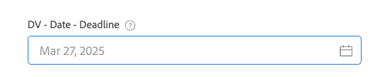

# Exemples de logique avancée dans les formulaires personnalisés

Les règles logiques vous permettent de personnaliser davantage les champs d’un formulaire personnalisé.

Cet article fournit des exemples d’expressions utilisées pour créer une logique avancée sur des champs personnalisés.

Pour plus d’informations sur l’ajout d’une logique à un formulaire personnalisé, voir [Ajouter des règles de logique aux formulaires et champs personnalisés](/help/quicksilver/administration-and-setup/customize-workfront/create-manage-custom-forms/form-designer/design-a-form/display-skip-logic-form-designer.md).

## Conditions d’accès

+++ Développez pour afficher les exigences d’accès aux fonctionnalités de cet article.

<table style="table-layout:auto"> 
 <col> 
 <col> 
 <tbody> 
  <tr> 
   <td>Package Adobe Workfront</td> 
   <td><p>Tous</p></td> 
  </tr> 
  <tr> 
   <td>Licence Adobe Workfront</td> 
   <td><p>Standard</p>
       <p>Plan</p></td>
  </tr> 
  <tr> 
   <td>Configurations des niveaux d’accès</td> 
   <td> <p>Accès administratif aux formulaires personnalisés</p> </td> 
  </tr>  
 </tbody> 
</table>

Pour plus d’informations, voir [Conditions d’accès requises dans la documentation Workfront](/help/quicksilver/administration-and-setup/add-users/access-levels-and-object-permissions/access-level-requirements-in-documentation.md).

+++

## Exemples de logiques de validation

La logique de validation est créée à l’aide de formules et vous pouvez la rendre aussi simple ou complexe que nécessaire. La validation peut être basée sur les valeurs d’autres champs ou l’état d’objets, et vous pouvez fournir un message d’erreur pour lorsque la validation échoue.

Si le champ avec la logique appliquée remplit les conditions de validation définies lorsqu’un utilisateur remplit le formulaire personnalisé, le champ est mis en surbrillance et le message d’erreur s’affiche.

Vous pouvez appliquer la logique de validation aux types de champ suivants : texte monoligne, paragraphe, liste déroulante à sélection unique, liste déroulante à sélection multiple, recherche externe, saisie semi-automatique, date, groupe de cases à cocher et boutons radio.

### Autoriser uniquement le propriétaire du projet à sélectionner le SLA « Précipité »

Dans cet exemple, un champ déroulant à sélection unique comporte des choix pour les SLA suivantes : Standard (14 jours), Priorité (7 jours) et Précipitation (2 jours).

Expression de validation :

```
IF({ownerID}!=$$USER&&{DE:DV - Dropdown - Control Dates}="2",CONCAT("Only ",{owner}.{name}," may select X Rush"))
```

Lorsqu’une personne qui n’est pas le propriétaire du projet (y compris l’administrateur système) tente de sélectionner **X Rush**, une erreur s’affiche :


### Validation de la date en fonction du choix effectué dans le champ précédent

En reprenant l’exemple de SLA, vous pouvez ajouter un champ de date validé en fonction des paramètres du champ déroulant précédent.

Expression de validation :

```
IF(
    DATEDIFF({DE:DV - Date - Dropdown SLA}, 
        ADDDAYS($$TODAY,{DE:DV - Dropdown - Control Dates})) < 0, 
    CONCAT("Earliest: ", 
        ADDDAYS($$TODAY,{DE:DV - Dropdown - Control Dates})))
```

Si l’utilisateur sélectionne une date antérieure à la date autorisée, le message affiche la date au plus tôt qu’il peut sélectionner :


### Nombre minimum de caractères avec option de remplacement

Dans cet exemple, un nombre minimum de caractères est appliqué à un champ de texte, avec le nombre de caractères affiché. En outre, une case à cocher distincte est configurée pour désactiver la validation du nombre de caractères.

Expression de validation :

```
IF({DE:DV - Override}!="Disable Validation"&&LEN({DE:DV - Text - Min Length})<"7",CONCAT(LEN({DE:DV - Text - Min Length})," characters / ",("7"-LEN({DE:DV - Text - Min Length}))," remaining"))
```

L’application de la validation peut être remplacée en cochant la case :


Le champ de texte comprend un nombre de caractères actifs :


### Verrouiller un champ pour que seul le propriétaire puisse le modifier

Dans cet exemple, un champ ne peut être modifié que par le propriétaire du projet. Même l’administrateur système ne peut pas modifier le champ.

Expression de validation :

```
IF({ownerID}!=$$USER,IF(ISBLANK({ownerID}),"Project Owner will provide this.",CONCAT("Only ",{owner}.{name}," can edit this.")))
```

Si l’utilisateur qui n’est pas le propriétaire du projet tente de saisir du texte dans le champ, un message indiquant que seul le propriétaire du projet peut modifier le champ s’affiche.


### La saisie semi-automatique autorise ou rejette les valeurs en fonction d’autres valeurs de champ

Dans cet exemple, un champ de saisie semi-automatique autorise ou rejette dynamiquement les valeurs en fonction de la valeur saisie dans un autre champ du formulaire.

Expression de validation :

```
IF({DE:DV - Text - Budget}>"10000",
   IF({DE:DV - TA User - by Budget}.{role}!="Director","Requires Director Approver")
)
```

Si la valeur du champ Budget est supérieure à 10 000 $, seuls les utilisateurs disposant d’un rôle Directeur peuvent être sélectionnés dans la saisie semi-automatique, même si aucun filtre de rôle n’est activé dans la configuration de saisie semi-automatique.


### Interdire les valeurs inférieures à 10 jours à compter de la date d’entrée

Dans cet exemple, la validation n’autorise que les valeurs comprises dans 10 jours à partir de la date d’entrée. L’option permettant de remplacer la validation (dans un champ de case à cocher distinct) est également incluse dans la formule, tout en permettant au champ de date d’être vide.

Expression de validation :

```
IF({DE:DV - Override}!="Disable Validation"&&ISBLANK({DE:DV - Date - Deadline})!="true"&&{DE:DV - Date - Deadline}<ADDDAYS({entryDate},"10"),CONCAT("Earliest: ",ADDDAYS({entryDate},"10")))
```

Toute valeur inférieure à 10 jours à compter de la date d’entrée déclenche la validation :


Une valeur vide ne déclenche pas le message de validation :



### Appliquer les sélections exactes/minimales/maximales dans un champ à sélection multiple

Dans cet exemple, un champ à sélection multiple tel qu’un groupe de cases à cocher nécessite que l’utilisateur choisisse un certain nombre d’options.

Expression de validation (sélectionnez exactement deux expressions) :

```
IF({DE:DV - Override}!="Disable Validation"&&ARRAYLENGTH(ARRAY({DE:DV - Checkbox - Pick exactly 2},","))!="2","Pick Exactly 2 Options")
```

Expression de validation (choisissez au moins deux expressions) :

```
IF({DE:DV - Override}!="Disable Validation"&&ARRAYLENGTH(ARRAY({DE:DV - Checkbox - Pick at least 2},","))<"2","Pick at least 2 choices")
```

Expression de validation (ne sélectionnez pas plus de deux expressions) :

```
IF({DE:DV - Override}!="Disable Validation"&&ARRAYLENGTH(ARRAY({DE:DV - Checkbox - Pick no more than 2},","))>"2","Pick no more than 2 choices")
```

L’utilisateur voit des erreurs de validation s’il ne sélectionne pas le nombre correct d’options.


