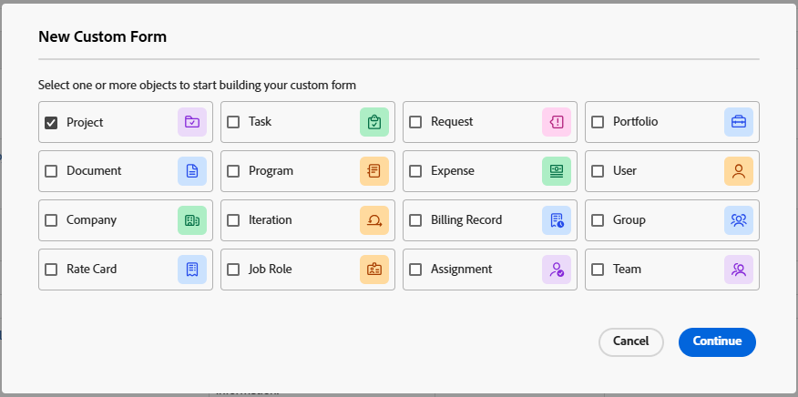
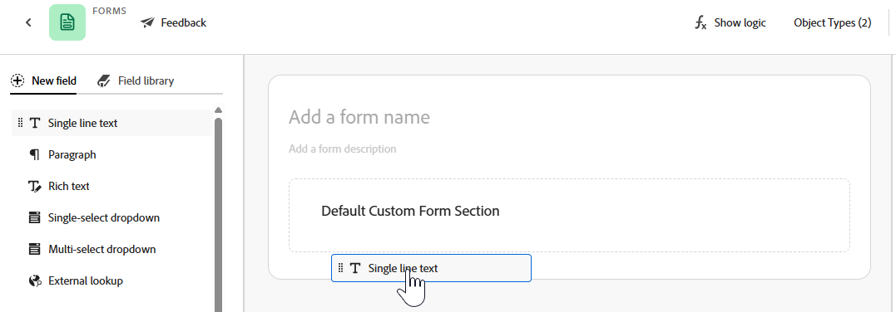
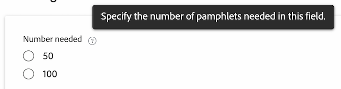

# Créer un formulaire personnalisé

<!-- Audited: 6/2025 -->

Vous pouvez concevoir un formulaire personnalisé à l’aide du concepteur de formulaires dans Adobe Workfront. Vous pouvez joindre des formulaires personnalisés à différents objets Workfront pour capturer des données en rapport avec ces objets.

## Conditions d’accès

+++ Développez pour afficher les exigences d’accès aux fonctionnalités de cet article.

<table style="table-layout:auto"> 
 <col> 
 <col> 
 <tbody> 
  <tr> 
   <td>Package Adobe Workfront</td> 
   <td> 
Pour créer des formulaires personnalisés pour les fonctions, les cartes tarifaires et les affectations : Workflow Ultimate

      
Pour créer des formulaires personnalisés pour tous les autres objets pris en charge : tout Workfront ou package de workflow
 </td> 
  </tr>  
  <tr> 
   <td>Licence Adobe Workfront</td> 
   <td>
Standard

       
Plan
</td>
  </tr> 
  <tr> 
   <td>Configurations des niveaux d’accès</td> 
   <td>Accès administratif aux formulaires personnalisés</td> 
  </tr>  
 </tbody> 
</table>

Pour plus d’informations, voir [Conditions d’accès dans la documentation Workfront](/help/quicksilver/administration-and-setup/add-users/access-levels-and-object-permissions/access-level-requirements-in-documentation.md).

+++

## Commencer à concevoir un formulaire personnalisé

{{step-1-to-setup}}

1. Dans le volet de gauche, cliquez sur **Formulaires personnalisés**, puis sélectionnez **Formulaires**.

1. Cliquez sur **Nouveau formulaire personnalisé**.
1. Sélectionnez les types d’objets auxquels vous souhaitez joindre le formulaire personnalisé, puis cliquez sur **Continuer**.

   

   +++ Développez pour afficher la liste des objets qui prennent en charge les formulaires personnalisés.

   * Projet
   * Tâche
   * Problème/Demande
   * Portfolio
   * Document
   * Programme
   * Frais
   * l’utilisateur ou de l’utilisatrice
   * Entreprise
   * Itération
   * Enregistrement de facturation
   * Groupe
   * Equipe

   Si vous vous trouvez dans le package Workflow Ultimate, vous pouvez également créer des formulaires personnalisés pour ces objets :

   * Fonction
   * Carte tarifaire
   * Affectation

   +++

1. Dans la zone **Ajouter un nom de formulaire**, saisissez le titre personnalisé du formulaire.
1. (Facultatif) Si vous souhaitez ajouter d’autres types d’objets au formulaire afin qu’il puisse être joint à d’autres objets, cliquez sur **Types d’objets** dans l’en-tête du concepteur de formulaire. Sélectionnez les types d’objet à ajouter et désélectionnez tous les types d’objet à supprimer du formulaire.

   >[!CAUTION]
   >
   >La suppression d’un formulaire personnalisé supprime également toutes les données personnalisées sur les objets associés au formulaire. Les données supprimées ne peuvent pas être récupérées. Vous pouvez également désactiver un formulaire personnalisé que vous n’utilisez plus, ce qui conservera toutes les données historiques associées.
   >
   >Pour plus d’informations, voir [Ajouter ou supprimer des types d’objet d’un formulaire personnalisé existant](/help/quicksilver/administration-and-setup/customize-workfront/create-manage-custom-forms/form-designer/manage-a-form/add-or-remove-objects-from-a-form.md) et [Désactiver ou réactiver un formulaire personnalisé](/help/quicksilver/administration-and-setup/customize-workfront/create-manage-custom-forms/form-designer/manage-a-form/activate-deactivate-form.md).

1. Ensuite, vous pouvez commencer à ajouter des champs à votre formulaire personnalisé. Pour plus d’informations, consultez les sections suivantes :
   * [Réutiliser un champ ou un widget existant déjà utilisé dans un autre formulaire personnalisé](#reuse-an-existing-field-or-widget-already-used-in-another-custom-form)
   * [Remarques sur les noms et les libellés des champs](#notes-on-field-names-and-labels)
   * [Ajouter des champs de texte](#add-text-fields)
   * [Ajouter des champs calculés](#add-calculated-fields)
   * [Ajouter des cases d’option, des groupes de cases à cocher et des listes déroulantes](#add-radio-buttons-checkbox-groups-and-drop-downs)
   * [Ajouter des champs de date](#add-date-fields)
   * [Ajouter des champs de recherche externes](#add-external-lookup-fields)
   * [Ajouter des images, des fichiers PDF et des vidéos](#add-images-pdfs-and-videos)
   * [Ajouter des champs natifs Workfront](#add-workfront-native-fields)
   * [Ajouter des fichiers Adobe XD](#add-adobe-xd-files)
   * [Ajouter des champs de connexion Planning](#add-planning-connection-fields)

## Ajouter des champs nouveaux ou existants à votre formulaire personnalisé

Vous pouvez utiliser des champs nouveaux ou existants lors de la conception de votre formulaire personnalisé.

Les formulaires personnalisés sont limités à 500 champs. Un compteur en bas à gauche affiche le nombre de champs utilisés dans le formulaire. Il est toujours visible lorsque vous faites défiler l’écran dans le concepteur de formulaire.

### Réutiliser un champ ou un widget existant déjà utilisé dans un autre formulaire personnalisé

1. En haut à gauche de l’écran, cliquez sur **Bibliothèque de champs**.

1. Faites glisser et déposez le champ ou le widget de votre choix sur la zone de travail. Répétez l’étape précédente pour ajouter d’autres champs ou widgets.

   >[!NOTE]
   >
   >Vous pouvez ajouter jusqu’à 500 champs sur un seul formulaire personnalisé. Cependant, une dégradation des performances peut se produire lorsque le formulaire comporte plus de 100 champs, en fonction de la complexité de votre formulaire personnalisé.
   >
   >
   >Parmi les exemples de formulaires complexes, citons les formulaires avec des paramètres en cascade, des champs de données personnalisées calculés et plusieurs options de valeur dans un même champ.

   >[!NOTE]
   >
   >Marquer un champ existant comme inactif le rend indisponible pour une utilisation dans les éléments de rapports et les formulaires personnalisés à partir de ce moment. Si le champ inactif est actuellement utilisé dans un rapport ou un formulaire, le champ et ses données historiques restent en place.

1. Pour enregistrer vos modifications, cliquez sur **Appliquer** et passez à une autre section pour continuer à créer votre formulaire.

   Ou

   Cliquez sur **Enregistrer et fermer**.

### Notes sur les noms et les libellés des API de champ {#notes-on-field-names-and-labels}

* Le libellé est disponible pour la plupart des champs. Il s’agit d’un libellé descriptif qui s’affiche au-dessus du champ ou du widget sur le formulaire personnalisé. Vous pouvez modifier le libellé à tout moment.

  >[!NOTE]
  >
  >Évitez d’utiliser des caractères spéciaux dans ce libellé, car ils ne s’affichent pas correctement dans les rapports.

* Un nom d’API est requis pour chaque champ. Ce nom est la manière dont le système identifie le champ personnalisé lorsque vous l’ajoutez à différentes zones dans Workfront, telles que les rapports, l’accueil et les interactions avec l’API. Lorsque vous configurez le champ ou le widget pour la première fois et que vous saisissez le libellé, le champ Nom de l’API est automatiquement renseigné pour le faire correspondre. Les champs Libellé et Nom de l’API ne sont pas synchronisés. Vous avez ainsi la possibilité de modifier le libellé visible par vos utilisateurs et utilisatrices sans avoir à modifier le nom visible par le système.

* Chaque nom d’API de champ personnalisé doit être unique dans l’instance Workfront de votre organisation. Ainsi, vous pouvez réutiliser un nom de champ déjà créé pour un autre formulaire personnalisé.

* Bien qu’il soit possible de le faire, nous vous recommandons de ne pas modifier ce nom d’API après que vous ou d’autres utilisateurs avez commencé à utiliser le formulaire personnalisé dans Workfront. Si vous le faites, le système ne reconnaîtra plus le champ personnalisé là où il peut être référencé actuellement dans d’autres zones de Workfront.

  Par exemple, si vous ajoutez le champ personnalisé à un rapport et que vous modifiez ultérieurement son nom d’API, Workfront ne le reconnaît pas dans le rapport et il ne fonctionnera plus correctement à ce moment-là, sauf si vous le rajoutez au rapport avec le nouveau nom.

* Par défaut, les noms d’API sont en lecture seule. Pour rendre le nom de l’API modifiable, cliquez sur l’icône **Modifier** en regard du **Nom de l’API**. Ensuite, saisissez **confirmer** dans la zone de confirmation, puis cliquez sur **Renommer le champ**.

* Nous vous recommandons de ne pas saisir un nom d’API déjà utilisé pour les champs Workfront intégrés.

* Nous vous recommandons de ne pas utiliser le caractère point/point dans le nom de l’API de champ personnalisé pour éviter les erreurs lors de l’utilisation du champ dans différentes zones de Workfront.

* Les caractères spéciaux suivants ne sont pas pris en charge dans les libellés de champ personnalisés et les noms d’API.

   * \t
   * \n
   * \r
   * \f
   * `[`
   * `]`
   * (
   * )
   * :
   * `{`
   * `}`

### Ajouter des champs de texte

Vous pouvez ajouter plusieurs champs de texte différents à un formulaire personnalisé.

+++ Développer pour voir les descriptions des champs de texte disponibles

* **Champ de texte à ligne simple** : permet aux personnes de saisir une seule ligne de texte dans le champ.
* **Champ de paragraphe** : permet de saisir plusieurs lignes de texte dans le champ.
* **Texte enrichi** : permet aux utilisateurs de saisir plusieurs lignes de texte dans le champ et de mettre en forme le texte avec du gras, de l’italique, du soulignement, des puces, de la numérotation, des indices et des exposants, des liens hypertexte, des guillemets, des en-têtes et des tableaux. Une limite de caractères de 15 000 caractères offre un grand espace pour le texte et la mise en forme.

  >[!NOTE]
  >
  >Le type de champ Texte enrichi remplace le texte par un type de champ de mise en forme. Vous pouvez rapidement convertir du texte existant avec des champs de mise en forme en texte enrichi en cliquant sur le bouton **Convertir en texte enrichi** dans les options de champ à droite.

<!--

* **Text field with formatting**: Allows users to type multiple lines of text in the field and format the text with bold, italics, underline, bullets, numbering, hyperlinks, and block quotes. A character limit of 15,000 allows for plenty of text and formatting.

    This custom field type is not supported in filters on lists and reports.

    For information about accessing this field through the API, see [Rich text field storage in the API](/help/quicksilver/administration-and-setup/customize-workfront/create-manage-custom-forms/rich-text-field-storage-in-the-api.md).

-->

* **Texte descriptif** : vous permet d’inclure des instructions et des liens vers des pages extérieures à Workfront.

+++

Pour ajouter un champ de texte, procédez comme suit :

1. Dans l’onglet **Nouveau champ** dans la partie gauche de l’écran, recherchez l’un des champs de texte suivants et faites-le glisser vers une section de la zone de travail :

   * Texte sur une seule ligne
   * Paragraphe
   * Texte enrichi
   * Texte descriptif
     <!--Text with formatting-->

   

1. Dans la partie droite de l’écran, configurez les options disponibles pour le type de champ personnalisé que vous ajoutez :

   <table>
    <tr>
    <td>Entrée dans</td>
    <td>Description</td>
    <td>Disponible pour </td>
    </tr>
    <tr>
    <td>Taille</td>
    <td>
(Facultatif) Modifiez la taille des champs de texte du formulaire.

   </td>
    <td><ul>
    <li>Texte sur une seule ligne</li>
    <li>Paragraphe</li>
    <li>Texte enrichi</li>
    <li>Texte descriptif</li>
    </ul></td>
    </tr>
    <tr>
    <td>Étiquette</td>
    <td>
(Obligatoire) Saisissez un libellé descriptif à afficher au-dessus du champ. Vous pouvez modifier le libellé à tout moment.

    
<b>Important</b> : évitez d’utiliser des caractères spéciaux dans ce libellé, car ils ne s’affichent pas correctement dans les rapports. Pour plus d’informations, voir <a href="design-a-form.md#notes-on-field-names-and-labels">Remarques sur les noms et les libellés des champs</a>.
</td>
    <td><ul>
    <li>Texte sur une seule ligne</li>
    <li>Paragraphe</li>
    <li>Texte enrichi</li>
    </ul></td>
    </tr>
    <tr>
     <td>Nom d’API</td>
    <td>
(Obligatoire) Ce nom est la façon dont le système identifie le champ. Lorsque vous configurez le widget pour la première fois et que vous saisissez le libellé, le champ Nom de l’API est automatiquement renseigné pour le faire correspondre. Les champs Libellé et Nom de l’API ne sont pas synchronisés. Vous avez ainsi la possibilité de modifier le libellé visible par vos utilisateurs et utilisatrices sans avoir à modifier le nom visible par le système.

    
Pour plus d’informations, voir <a href="design-a-form.md#notes-on-field-names-and-labels">Remarques sur les noms et les libellés des champs</a>.

    </td>
    <td><ul>
    <li>Texte sur une seule ligne</li>
    <li>Paragraphe</li>
    <li>Texte enrichi</li>
    <li>Texte descriptif</li>
    </ul></td>
    </tr>
    <tr>
    <td>Instructions</td>
    <td>Saisissez toute information supplémentaire concernant le champ. Lorsque les utilisateurs et utilisatrices remplissent le formulaire personnalisé, ils peuvent pointer sur l’icône de point d’interrogation pour afficher une infobulle contenant les informations saisies ici.
    
    </td>
    <td><ul>
    <li>Texte sur une seule ligne</li>
    <li>Paragraphe</li>
    <li>Texte enrichi</li>
    </ul></td>
    </tr>
    <tr>
    <td>Format</td>
    <td>
Sélectionnez le type de données qui seront capturées dans le champ personnalisé.
 
<b>Note</b> :   
    <ul> 
    <li>Une fois le formulaire enregistré, ce champ ne peut plus être modifié. Pour utiliser votre champ dans des calculs mathématiques, assurez-vous de sélectionner le format « Nombre » ou « Devise ».</li> 
    <li>Lorsque vous sélectionnez Nombre ou Devise, le système tronque automatiquement les nombres qui commencent par 0.</li>
    <li>Les champs au format « Nombre » sont limités à 16 caractères. Vous pouvez également utiliser un champ Texte pour saisir des nombres et éviter la limite.</li>
     </ul>
</td> </td>
    <td><ul>
    <li>Texte sur une seule ligne</li>
    <li>Paragraphe</li>
    </ul></td>
    </tr>
    <tr>
      <td>Type d’autorisation financière</td>
      <td>
Sélectionnez le type d'autorisation finance dont les utilisateurs doivent disposer avant de pouvoir afficher ou modifier ce champ personnalisé. Le format de devise doit être sélectionné.

      <ul>
      <li>
<strong>Aucune autorisation requise :</strong> tous les utilisateurs peuvent voir ce champ
</li>
      <li>
<strong>Général :</strong> les utilisateurs doivent disposer des autorisations de modification ou d’affichage de General Finance
</li>
      <li>
<strong>Facturation :</strong> les utilisateurs doivent disposer des autorisations nécessaires pour modifier ou afficher les taux de facturation
</li>
      <li>
<strong>Coût :</strong> les utilisateurs doivent disposer des autorisations pour modifier ou afficher les taux de coût
</li>
      </ul>
      
Pour plus d’informations, voir <a href="/help/quicksilver/administration-and-setup/customize-workfront/create-manage-custom-forms/form-designer/design-a-form/restrict-access-to-financial-data.md">Limiter l’accès aux données financières dans les champs personnalisés</a>.

      </td>
      <td><ul>
       <li>Texte sur une seule ligne</li>
       <li>Paragraphe</li>
       </ul></td>
    </tr>
    <tr>
    <td>Type d’affichage</td>
    <td>Basculer entre des champs de texte d’une seule ligne et des champs de texte de paragraphe.</td>
    <td><ul>
    <li>Texte sur une seule ligne</li>
    <li>Paragraphe</li>
    </ul></td>
    </tr>
    <tr>
    <td>Lien hypertexte</td>
    <td> Si vous souhaitez appliquer un lien hypertexte au texte descriptif que vous avez saisi, ajoutez-le ici. Le texte descriptif s’affiche sous forme de lien sur les objets auxquels le formulaire est attaché.</td>
    <td><ul><li>Texte descriptif</li></ul></td>
    </tr>
    <tr>
     <td>Actif</td>
     <td>
Cette option est activée par défaut.

Lorsque vous définissez un champ comme Inactif, il est exclu des rapports, filtres et affichages et n’est plus disponible dans la bibliothèque de champs de formulaires personnalisés.
</td>
     <td><ul>
     <li>Texte sur une seule ligne</li>
     <li>Paragraphe</li>
     <li>Texte enrichi</li>
     <li>Texte descriptif</li></ul></td>
    </tr>
    <tr> 
      <td>Créer un champ obligatoire</td>
      <td>
Sélectionnez cette option si vous souhaitez que le champ soit obligatoire pour que l’utilisateur ou l’utilisatrice puisse remplir le formulaire personnalisé.
</td>
    <td><ul>
    <li>Texte sur une seule ligne</li>
    <li>Paragraphe</li>
    <li>Texte enrichi</li>
    </ul></td> 
    </tr> 
   </table>

1. (Facultatif) Répétez l’étape précédente pour ajouter d’autres champs ou widgets.

   Ou

   Pour copier un champ, pointez dessus et cliquez sur l’icône de copie.

   

1. Pour enregistrer vos modifications, cliquez sur **Appliquer** et passez à une autre section pour continuer à créer votre formulaire.

   Ou

   Cliquez sur **Enregistrer et fermer**.

### Ajouter des champs calculés

Dans un formulaire personnalisé, vous pouvez ajouter un champ personnalisé calculé qui utilise les données existantes pour générer de nouvelles données lorsque le formulaire personnalisé est joint à un objet.

Pour ajouter un champ calculé, consultez la section [Ajouter des champs calculés avec le concepteur de formulaires](/help/quicksilver/administration-and-setup/customize-workfront/create-manage-custom-forms/form-designer/design-a-form/add-a-calculated-field.md).

### Ajouter des cases d’option, des groupes de cases à cocher et des listes déroulantes

Vous pouvez ajouter des boutons radio, des groupes de cases à cocher, des listes déroulantes et des listes déroulantes à sélection multiple à un formulaire personnalisé.

+++ Développez pour afficher les descriptions des champs disponibles.

* **Cases d’option** : demande aux utilisateurs et aux utilisatrices de ne sélectionner qu’un seul choix.
* **Groupe de cases à cocher** : permet aux utilisateurs et aux utilisatrices de sélectionner plusieurs choix.
* **Liste déroulante à sélection unique** : fournit une liste déroulante de choix.
* **Liste déroulante à sélection multiple** : permet aux utilisateurs et aux utilisatrices de sélectionner plusieurs choix dans une liste déroulante.

+++

>[!NOTE]
>
>Les champs qui autorisent plusieurs sélections, tels que Groupe de cases à cocher et Menu déroulant à sélection multiple, sont difficiles à représenter sous forme de graphiques et à regrouper dans les rapports. Pour simplifier la création de graphiques et de groupes dans les rapports, vous pouvez créer des champs distincts pour chaque choix (par exemple, un champ de texte d’une seule ligne).

Pour ajouter des boutons radio, des groupes de cases à cocher et des listes déroulantes, procédez comme suit :

1. Dans l’onglet **Nouveau champ** à gauche de l’écran, recherchez l’un des champs suivants et faites-le glisser vers une section de la zone de travail :

   * Boutons radio
   * Groupe de cases à cocher
   * Liste déroulante à sélection unique
   * Liste déroulante à sélection multiple

   

1. Dans la partie droite de l’écran, configurez les options disponibles pour le type de champ personnalisé que vous ajoutez :

   <table style="table-layout:auto"> 
    <tbody> 
    <tr>
    <td>Entrée dans</td>
    <td>Description</td>
    <td>Disponible pour </td>
    </tr>
    <tr> 
     <td role="rowheader">Étiquette</td> 
     <td> 
(Obligatoire) Saisissez un libellé descriptif à afficher au-dessus du champ personnalisé. Vous pouvez modifier le libellé à tout moment.
 
<b>Important</b> : évitez d’utiliser des caractères spéciaux dans ce libellé, car ils ne s’affichent pas correctement dans les rapports. Pour plus d’informations, voir <a href="design-a-form.md#notes-on-field-names-and-labels">Notes sur les noms et libellés de champs</a>.
 </td> 
     <td><ul>
    <li>Boutons radio</li>
    <li>Groupe de cases à cocher</li>
    <li>Liste déroulante à sélection unique</li>
    <li>Liste déroulante à sélection multiple</li>
    </ul></td>
     </tr> 
     <tr> 
    <td role="rowheader">Nom d’API</td> 
     <td> 
(Obligatoire) Ce nom est la façon dont le système identifie le champ. Lorsque vous configurez le widget pour la première fois et que vous saisissez le libellé, le champ Nom de l’API est automatiquement renseigné pour le faire correspondre. Les champs Libellé et Nom de l’API ne sont pas synchronisés. Vous avez ainsi la possibilité de modifier le libellé visible par vos utilisateurs et utilisatrices sans avoir à modifier le nom visible par le système.
 
    
Pour plus d’informations, voir <a href="design-a-form.md#notes-on-field-names-and-labels">Notes sur les noms et libellés de champs</a>.
 </td>
     <td><ul>
    <li>Boutons radio</li>
    <li>Groupe de cases à cocher</li>
    <li>Liste déroulante à sélection unique</li>
    <li>Liste déroulante à sélection multiple</li>
    </ul></td>
    </tr> 
    <tr> 
    <td role="rowheader">Instructions</td> 
    <td> 
Saisissez des informations supplémentaires sur le champ personnalisé. Lorsque les utilisateurs et utilisatrices remplissent le formulaire personnalisé, ils peuvent pointer sur l’icône de point d’interrogation pour afficher une infobulle contenant les informations saisies ici.
 
    
   

    </td> 
    <td><ul>
    <li>Boutons radio</li>
    <li>Groupe de cases à cocher</li>
    <li>Liste déroulante à sélection unique</li>
    <li>Liste déroulante à sélection multiple</li>
    </ul></td>
    </tr> 
    <tr> 
    <td role="rowheader">Format</td> 
    <td> 
Sélectionnez le type de données qui seront capturées dans le champ personnalisé.
 
<b>Note</b> :   
     <ul> 
    <li>Une fois le formulaire enregistré, ce champ ne peut plus être modifié. Pour utiliser votre champ dans des calculs mathématiques, assurez-vous de sélectionner le format « Nombre » ou « Devise ». </li> 
    <li>Lorsque vous sélectionnez Nombre ou Devise, le système tronque automatiquement les nombres qui commencent par 0.</li>
    <li>Les champs au format « Nombre » sont limités à 16 caractères. Vous pouvez également utiliser un champ Texte pour saisir des nombres et éviter la limite.</li>
     </ul>
</td> 
     <td><ul>
    <li>Boutons radio</li>
    <li>Groupe de cases à cocher</li>
    <li>Liste déroulante à sélection unique</li>
    <li>Liste déroulante à sélection multiple</li>
    </ul></td>
    </tr> 
    <tr>
      <td>Type d’autorisation financière</td>
      <td>
Sélectionnez le type d'autorisation finance dont les utilisateurs doivent disposer avant de pouvoir afficher ou modifier ce champ personnalisé. Le format de devise doit être sélectionné.

      <ul>
      <li>
<strong>Aucune autorisation requise :</strong> tous les utilisateurs peuvent voir ce champ
</li>
      <li>
<strong>Général :</strong> les utilisateurs doivent disposer des autorisations de modification ou d’affichage de General Finance
</li>
      <li>
<strong>Facturation :</strong> les utilisateurs doivent disposer des autorisations nécessaires pour modifier ou afficher les taux de facturation
</li>
      <li>
<strong>Coût :</strong> les utilisateurs doivent disposer des autorisations pour modifier ou afficher les taux de coût
</li>
      </ul>
      
Pour plus d’informations, voir <a href="/help/quicksilver/administration-and-setup/customize-workfront/create-manage-custom-forms/form-designer/design-a-form/restrict-access-to-financial-data.md">Limiter l’accès aux données financières dans les champs personnalisés</a>.

      </td>
      <td><ul>
       <li>Boutons radio</li>
       <li>Groupe de cases à cocher</li>
       <li>Liste déroulante à sélection unique</li>
       <li>Liste déroulante à sélection multiple</li>
       </ul></td>
    </tr>
    <tr> 
     <td role="rowheader">Type d’affichage</td> 
    <td>Vous pouvez utiliser des boutons radio, un groupe de cases à cocher, une liste déroulante à sélection unique ou une liste déroulante à sélection multiple pour le champ.</td> 
    <td><ul>
    <li>Boutons radio</li>
    <li>Groupe de cases à cocher</li>
    <li>Liste déroulante à sélection unique</li>
    <li>Liste déroulante à sélection multiple</li>
    </ul></td>
    </tr> 
    <td role="rowheader">Choix </td> 
    <td> 
    
Sélectionnez l’une des options suivantes :
 
    <ul> 
    <li><strong>Afficher les valeurs</strong> : affiche les valeurs de chaque choix dans le champ. Le libellé de chaque choix s’affiche par défaut.</li>
   <li><strong>Trier les choix dans l’ordre alphabétique</strong> : trie par ordre alphabétique les choix que vous ajoutez dans le champ.</li>
    </ul>
     
Pour chaque choix que vous ajoutez à l’utilisateur ou à l’utilisatrice, cliquez sur l’icône d’engrenage , puis sélectionnez l’une des options suivantes :
 
    <ul> 
    <li><strong>Sélectioner par défaut</strong> : sélectionnez le choix par défaut dans le champ.</li> 
    <li> 
<strong>Masquer le choix</strong> : masquez le choix dans le champ. Les choix masqués restent accessibles dans les rapports.
 </li> 
    <li> 
<strong>Supprimer le choix</strong> : supprimez le choix du champ.
 
<b>Avertissement</b> : si ce choix est utilisé par des objets actuels, ne le supprimez pas du champ. Sa suppression entraînera la perte de données historiques. Sélectionnez plutôt l’option pour le masquer, ce qui empêchera les utilisateurs et utilisatrices de le sélectionner à l’avenir.
 </li> 
    </ul>   
    
<b>Note :</b> il n’existe aucune limite au nombre de choix que vous pouvez sélectionner. 
    
    </td> 
    <td><ul>
    <li>Boutons radio</li>
    <li>Groupe de cases à cocher</li>
    <li>Liste déroulante à sélection unique</li>
    <li>Liste déroulante à sélection multiple</li>
    </ul>
    </td>
     </tr>
    <tr>
     <td>Actif</td>
     <td>
Cette option est activée par défaut.

Lorsque vous définissez un champ comme Inactif, il est exclu des rapports, filtres et affichages et n’est plus disponible dans la bibliothèque de champs de formulaires personnalisés.
</td>
     <td><ul>
     <li>Boutons radio</li>
     <li>Groupe de cases à cocher</li>
     <li>Liste déroulante à sélection unique</li>
     <li>Liste déroulante à sélection multiple</li></ul></td>
    </tr>
    <tr> 
    <td role="rowheader">Créer un champ obligatoire</td> 
    <td>Sélectionnez cette option si vous souhaitez que le champ soit obligatoire pour que l’utilisateur ou l’utilisatrice puisse remplir le formulaire personnalisé. </td> 
    <td><ul>
    <li>Boutons radio</li>
    <li>Groupe de cases à cocher</li>
    <li>Liste déroulante à sélection unique</li>
    <li>Liste déroulante à sélection multiple</li>
    </ul></td>
     </tr> 
    <tr> 
    </tbody> 
    </table>

1. (Facultatif) Répétez l’étape précédente pour ajouter d’autres champs ou widgets.

   Ou

   Pour copier un champ, pointez dessus et cliquez sur l’icône de copie.

   

1. Pour enregistrer vos modifications, cliquez sur **Appliquer** et passez à une autre section pour continuer à créer votre formulaire.

   Ou

   Cliquez sur **Enregistrer et fermer**.

<!--

### Add typeahead and date fields

 You can add typeahead and date fields to a custom form.

+++ Expand to see descriptions of available fields.

* **Typeahead**: Allows users to type the name of an object that exists in Workfront. A list of suggestions appears when the user starts typing. This field type supports the following objects:
    * User
    * Group
    * Job Role
    * Portfolio
    * Program
    * Project
    * Team
    * Template
    * Company
* **Date**: Displays a calendar where users can select a date and time.

+++

To add typeahead and date fields:

1. In the **New field** tab on the left side of the screen, find one of the following fields and drag it to a section on the canvas.

    * Typeahead
    * Date

    

1. On the right side of the screen, configure the options that are available for the type of custom field you are adding:

    <table style="table-layout:auto"> 
    <tbody> 
     <tr>
    <td>Field setting</td>
    <td>Description</td>
    <td>Available for </td>
    </tr>
     <tr> 
      <td role="rowheader">Label</td> 
      <td> 
(Required) Type a descriptive label to display above the custom field. You can change the label at any time.
 
<b>Important</b>: Avoid using special characters in this label as they don't display correctly in reports. For more information, see <a href="design-a-form.md#notes-on-field-names-and-labels">Notes on field names and labels</a>.
 </td> 
       <td><ul>
    <li>Typeahead</li>
    <li>Date</li>
    </ul></td>
     </tr> 
     <tr> 
      <td role="rowheader">Name</td> 
      <td> 
(Required) This name is how the system identifies the field. When you are configuring the widget for the first time and you type the label, the Name field populates automatically to match it. The Label and Name fields are not synchronized. This gives you the option to change the label that your users see without having to change the name that the system sees.
 
      
For more information, see <a href="design-a-form.md#notes-on-field-names-and-labels">Notes on field names and labels</a>.
 </td>
    <td><ul>
    <li>Typeahead</li>
    <li>Date</li>
    </ul></td>
     </tr> 
     <tr> 
      <td role="rowheader">Instructions</td> 
      <td> 
Type any additional information about the custom field. When users fill out the custom form, they can hover over the question mark icon to view a tooltip containing the information you type here.
 
      
  

      </td> 
         <td><ul>
    <li>Typeahead</li>
    <li>Date</li>
    </ul></td>
     </tr> 
     <tr> 
      <td role="rowheader">Display Time of Day</td> 
      <td>Select this option if you want to show the time of day along with the date in the field.</td> 
         <td><ul>
    <li>Date</li>
    </ul></td>
     </tr> 
     <tr> 
      <td role="rowheader">Referenced Object Type</td> 
      <td> 
Select the object type that you want to associate with the field.
 
Once you have clicked <b>Apply</b> or <b>Save and Close</b>, you can't change the object type for the field.
 
<b>Note</b>:   
        <ul> 
         <li>If your Workfront administrator customized the name for Portfolios, Programs, or Projects in the Workfront user interface, the default Workfront name for the object appears in this drop-down list, not the customized name. See your Workfront administrator if you need help with this. </li> 
         <li>The following object types are supported in the iOS and Android Workfront Mobile Apps: User, Company, Group, Job Role, Portfolio, Program, Project, and Template.</li> 
        </ul> 
 </td> 
         <td><ul>
    <li>Typeahead</li>
    </ul></td>
     </tr>
     <tr>
      <td role="rowheader">Add Filter</td>
      <td>
Add a filter for an object type to limit the objects users can choose when they are using the field. 
 
For example, you could limit a field so that usernames can be selected only if they meet the following criteria:
 
       <ul> 
        <li>They belong to a group or groups that you specify.</li> 
        <li>They are associated with a role or job title you specify.</li> 
        <li>They belong to the same group as the person using the field.</li> 
       </ul>
       
You must define the filter for the object type you selected using Text Mode syntax. For information about creating a filter using Text Mode, see <a href="/help/quicksilver/reports-and-dashboards/reports/text-mode/edit-text-mode-in-filter.md">Edit a filter using text mode</a>.

       
<b>Tip:</b> You can create a report to test your filter before adding the filter directly to the typeahead field. This will help you verify that the filter returns the correct objects. Then you can switch to text mode in the report, copy the text mode statement, and add it to the typeahead filter.

       
<b>Note</b>:
       <ul> 
        <li>If you are editing an existing custom form, adding a filter to a typeahead field does not remove any objects (outside the scope of the filter) that users have already added using the field.</li> 
        <li>This filter is not available on mobile devices. If you use the filter for a typeahead field, the field will appear on users' mobile devices unaffected by the filter.</li> 
        </ul>

      </td>  
      <td>
       <ul>
       <li>Typeahead</li>
       </ul>
      </td>
     </tr>
     <tr>
      <td>Active</td>
      <td>
This option is turned on by default.

When you set a field as Inactive, it is excluded from reports, filters, and views, and is no longer available in the custom forms field library.
</td>
      <td><ul>
      <li>Typeahead</li>
      <li>Date</li></ul></td>
     </tr>
     <tr> 
      <td role="rowheader">Make a required field</td> 
      <td>Select this option if you want the field to be required in order for the user to complete the custom form. </td> 
       <td><ul>
    <li>Typeahead</li>
    <li>Date</li>
    </ul></td>
     </tr> 
    </tbody> 
   </table>

1. (Optional) Repeat the previous step to add any other fields or widgets. 

    Or

    To copy a field, hover over a field, and click the copy icon.

    

1. To save your changes, click **Apply** and move on to another section to continue building your form.

    Or

    Click **Save and Close**.

-->

### Ajouter des champs de date

Un champ de date affiche un calendrier dans lequel les utilisateurs peuvent sélectionner une date et une heure.

Pour ajouter des champs de date :

1. Dans l’onglet **Nouveau champ** sur le côté gauche de l’écran, recherchez **Date** et faites-la glisser vers une section de la zone de travail.

   

1. Dans la partie droite de l’écran, configurez les options du champ personnalisé :

   <table style="table-layout:auto"> 
    <col> 
    <col> 
    <tbody> 
     <tr> 
      <td role="rowheader">Étiquette</td> 
      <td> 
(Obligatoire) Saisissez un libellé descriptif à afficher au-dessus du widget. Vous pouvez modifier le libellé à tout moment.
 
<b>Important</b> : évitez d’utiliser des caractères spéciaux dans ce libellé, car ils ne s’affichent pas correctement dans les rapports. Pour plus d’informations, voir <a href="design-a-form.md#notes-on-field-names-and-labels">Notes sur les noms et les libellés des champs</a>.
 </td> 
     </tr> 
     <tr> 
      <td role="rowheader">Nom d’API</td> 
      <td> 
(Obligatoire) Ce nom est la façon dont le système identifie le champ. Lorsque vous configurez le widget pour la première fois et que vous saisissez le libellé, le champ Nom de l’API est automatiquement renseigné pour le faire correspondre. Les champs Libellé et Nom de l’API ne sont pas synchronisés. Vous avez ainsi la possibilité de modifier le libellé visible par vos utilisateurs et utilisatrices sans avoir à modifier le nom visible par le système.
 
Pour plus d’informations, voir <a href="design-a-form.md#notes-on-field-names-and-labels">Notes sur les noms et libellés de champs</a>.
 </td> 
     </tr>
     <tr> 
      <td role="rowheader">Instructions</td> 
      <td> 
Saisissez des informations supplémentaires sur le champ personnalisé. Lorsque les utilisateurs et utilisatrices remplissent le formulaire personnalisé, ils peuvent pointer sur l’icône de point d’interrogation pour afficher une infobulle contenant les informations saisies ici.
 </td> 
     </tr>
     <tr> 
      <td role="rowheader">Afficher l'heure</td>
      <td>
Sélectionnez cette option si vous souhaitez afficher l’heure et la date du jour dans le champ.
</td>
     </tr> 
     <tr>
      <td>Actif</td>
      <td>
Cette option est activée par défaut.

Lorsque vous définissez un champ comme Inactif, il est exclu des rapports, filtres et affichages et n’est plus disponible dans la bibliothèque de champs de formulaires personnalisés.
</td>
     </tr>
     <tr> 
      <td role="rowheader">Créer un champ obligatoire</td>
      <td>
Sélectionnez cette option si vous souhaitez que le champ soit obligatoire pour que l’utilisateur ou l’utilisatrice puisse remplir le formulaire personnalisé.
</td>
     </tr> 
    </tbody> 
   </table>

1. (Facultatif) Répétez l’étape précédente pour ajouter d’autres champs ou widgets.

   Ou

   Pour copier un champ, pointez dessus et cliquez sur l’icône de copie.

   

1. Pour enregistrer vos modifications, cliquez sur **Appliquer** et passez à une autre section pour continuer à créer votre formulaire.

   Ou

   Cliquez sur **Enregistrer et fermer**.

### Ajouter des champs de recherche externe

Un champ de recherche externe appelle une API externe et renvoie les valeurs sous forme d’options dans un champ déroulant. Les personnes qui travaillent avec l’objet auquel le formulaire personnalisé est joint peuvent sélectionner une ou plusieurs de ces options dans la liste déroulante, selon que le champ de recherche externe est un champ à sélection unique ou multiple. Les champs de recherche externe sont également disponibles dans les listes et les rapports.

Pour des exemples d’utilisation du champ « Recherche externe » pour appeler la même instance de Workfront ou une API publique, consultez la section [Exemples de champ « Recherche externe » dans un formulaire personnalisé](/help/quicksilver/administration-and-setup/customize-workfront/create-manage-custom-forms/form-designer/design-a-form/external-lookup-examples.md).

>[!NOTE]
>
>* Les champs de recherche externe ne sont pas disponibles dans les listes quand le champ dépend d’un autre champ.

Pour ajouter une recherche externe, procédez comme suit :

1. Dans l’onglet **Nouveau champ** sur le côté gauche de l’écran, recherchez **Recherche externe** ou **Recherche externe à sélection multiple**, puis faites-la glisser vers une section de la zone de travail.
1. Dans la partie droite de l’écran, configurez les options du champ personnalisé :

   <table style="table-layout:auto"> 
    <col> 
    <col> 
    <tbody> 
     <tr> 
      <td role="rowheader">Étiquette</td> 
      <td> 
(Obligatoire) Saisissez un libellé descriptif à afficher au-dessus du champ personnalisé. Vous pouvez modifier le libellé à tout moment.
 
<b>Important</b> : évitez d’utiliser des caractères spéciaux dans ce libellé, car ils ne s’affichent pas correctement dans les rapports. Pour plus d’informations, voir <a href="design-a-form.md#notes-on-field-names-and-labels">Notes sur les noms et les libellés des champs</a>.
 </td> 
     </tr> 
     <tr> 
      <td role="rowheader">Nom d’API</td> 
      <td> 
(Obligatoire) Ce nom est la façon dont le système identifie le champ. Lorsque vous configurez le champ pour la première fois et que vous saisissez le libellé, le champ Nom de l’API est automatiquement renseigné pour le faire correspondre. Toutefois, les champs Libellé et Nom de l’API ne sont pas synchronisés, ce qui vous permet de modifier le libellé visible par vos utilisateurs sans avoir à modifier le nom visible par le système.

      
Pour plus d’informations, voir <a href="design-a-form.md#notes-on-field-names-and-labels">Notes sur les noms et libellés de champs</a>.
 </td>
     </tr> 
      <td role="rowheader">Instructions</td> 
      <td> 
Saisissez des informations supplémentaires sur le champ personnalisé. Lorsque les utilisateurs et utilisatrices remplissent le formulaire personnalisé, ils peuvent pointer sur l’icône de point d’interrogation pour afficher une infobulle contenant les informations saisies ici.
 </td> 
     </tr> 
     <tr> 
      <td role="rowheader">Format</td>
      <td>
Sélectionnez le type de données qui seront capturées dans le champ personnalisé.

      
<strong>Note :</strong>

      <ul><li>Il est possible de modifier le type de format une fois le formulaire enregistré, mais toutes les valeurs existantes sur les objets doivent être convertibles au nouveau type de format. (Par exemple, si le type de format est Texte et qu’un objet stocke la valeur « abc », vous ne pouvez pas convertir le champ et une erreur s’affichera, indiquant que le système ne peut pas convertir « abc » en nombre/devise.) Pour utiliser votre champ dans des calculs mathématiques, assurez-vous de sélectionner le format « Nombre » ou « Devise ».</li>
      <li>Lorsque vous sélectionnez Nombre ou Devise, le système tronque automatiquement les nombres qui commencent par 0.</li>
      <li>Les champs au format « Nombre » sont limités à 16 caractères. Vous pouvez également utiliser un champ Texte pour saisir des nombres et éviter la limite.</li>
      </ul></td>
     </tr> 
     <tr>
      <td>Type d’autorisation financière</td>
      <td>
Sélectionnez le type d'autorisation finance dont les utilisateurs doivent disposer avant de pouvoir afficher ou modifier ce champ personnalisé. Le format de devise doit être sélectionné.

      <ul>
      <li>
<strong>Aucune autorisation requise :</strong> tous les utilisateurs peuvent voir ce champ
</li>
      <li>
<strong>Général :</strong> les utilisateurs doivent disposer des autorisations de modification ou d’affichage de General Finance
</li>
      <li>
<strong>Facturation :</strong> les utilisateurs doivent disposer des autorisations nécessaires pour modifier ou afficher les taux de facturation
</li>
      <li>
<strong>Coût :</strong> les utilisateurs doivent disposer des autorisations pour modifier ou afficher les taux de coût
</li>
      </ul>
      
Pour plus d’informations, voir <a href="/help/quicksilver/administration-and-setup/customize-workfront/create-manage-custom-forms/form-designer/design-a-form/restrict-access-to-financial-data.md">Limiter l’accès aux données financières dans les champs personnalisés</a>.

      </td>
     </tr>
     <tr> 
      <td role="rowheader">URL API de base</td> 
      <td>
Saisissez ou collez l’URL de l’API.

L’URL de l’API doit renvoyer un contenu JSON des options que vous souhaitez afficher dans la liste déroulante. Vous pouvez utiliser le champ Chemin JSON pour sélectionner les valeurs spécifiques du JSON renvoyé en tant qu’options dans la liste déroulante.

Lors de la saisie de l’URL de l’API, vous pouvez éventuellement transmettre les valeurs suivantes dans l’URL :

      <ul>
      <li>$$HOST : représente l’hôte Workfront actuel et peut être utilisé pour effectuer/rechercher des appels à l’API Workfront. Lorsque ce caractère générique est utilisé, l’authentification est prise en charge et les utilisateurs et les utilisatrices n’ont pas besoin d’envoyer des en-têtes d’authentification. (Par exemple, les utilisateurs et les utilisatrices peuvent rechercher des tâches à l’aide de l’URL de base <code>$$HOST/attask/api/task/search</code>, qui permet de rechercher des tâches et de sélectionner des valeurs dans une liste de tâches renvoyée.)</li>
      <li>
$$QUERY : cette valeur représente le texte de recherche que les utilisateurs et utilisatrices finaux saisissent dans le champ et vous permet d’implémenter le filtrage des requêtes pour ces personnes. (L’utilisateur ou l’utilisatrice recherchera la valeur dans la liste déroulante.)

      
Si l’API à laquelle vous faites référence le permet, vous pouvez également inclure des modificateurs dans votre requête de recherche afin d’identifier comment la recherche doit s’effectuer. Par exemple, vous pouvez utiliser l’URL d’API de base suivante pour permettre aux gens de rechercher tous les projets Workfront qui contiennent un texte spécifique : <code>$$HOST/attask/api/v15.0/proj/search?name=$$QUERY&name_Mod=contains</code>.

Pour en savoir plus sur les modificateurs de recherche Workfront, consultez <a href="/help/quicksilver/wf-api/general/api-basics.md">Concepts de base de l’API</a>.

      
<strong>Note</strong> : si vous n’utilisez pas $$QUERY et que l’utilisateur ou l’utilisatrice saisit du texte dans la zone de recherche, les choix déjà disponibles seront filtrés. Toutefois, si vous utilisez $$QUERY et que l’utilisateur ou l’utilisatrice saisit quelque chose, un nouvel appel réseau à votre API est effectué. Par conséquent, si votre API contient plus de 2 000 valeurs et que l’API prend en charge l’interrogation, vous pouvez utiliser $$QUERY pour effectuer une recherche non seulement à partir des 2 000 valeurs existantes, mais aussi à partir de l’API d’origine avec les options restreintes.
</li>
      <li>
{fieldName} - Lorsque fieldName est n’importe quel champ personnalisé ou natif dans Workfront. Vous pouvez ainsi implémenter des filtres d’options de liste déroulante en cascade lorsque vous transmettez la valeur d’un champ déjà sélectionné au champ de recherche externe pour filtrer les options. (Par exemple, le champ Zone géographique existe déjà dans le formulaire et vous réduisez une liste de pays de l’API à ceux qui se trouvent dans une zone géographique spécifique.)

      
Pour un champ de recherche externe dépendant d’autres champs (à l’aide de la syntaxe {fieldName}), les options renvoyées par l’API sont limitées à celles qui correspondent aux chaînes ou aux valeurs saisies dans les autres champs. (Cette fonctionnalité n’est pas prise en charge dans les listes et les rapports.)
</li>
      <li>{referenceObject}.{fieldName} - Où le champ fait partie d’un objet. Cette syntaxe est similaire à celle des expressions personnalisées. (Par exemple, portfolioID={project}.{portfolioID})</li></ul>
      
<strong>Conseil :</strong> consultez la documentation de l’API que vous utilisez pour connaître les requêtes spécifiques que vous pouvez définir.
</td>
     </tr>
     <tr> 
      <td role="rowheader">Méthode HTTP</td> 
      <td>Sélectionnez <strong>Get</strong>, <strong>Post</strong>, ou <strong>Put</strong> pour la méthode.</td> 
     </tr>
     <tr> 
      <td role="rowheader">Chemin JSON</td>
      <td>
Saisissez ou collez le chemin JSON pour l’API.
 
Cette option permet d’extraire des données du JSON renvoyé par l’URL de l’API. Elle permet de sélectionner les valeurs qui, à l’intérieur du JSON, apparaîtront dans les options de liste déroulante.

Par exemple, si l’URL de votre API renvoie le format JSON suivant, vous pouvez utiliser « $.data[*].name » pour sélectionner les États-Unis et le Canada comme options de liste déroulante : 
      <pre>
      &lbrace;
       data : &lbrace;
         { name : « USA »},
         { name : « Canada »}
       &rbrace;
      &rbrace;
      </pre>
      

     
Pour plus d’informations sur le chemin JSON et pour vous assurer que vous écrivez le bon chemin JSON, consultez <a href="https://jsonpath.com/">https://jsonpath.com/</a>.
</td>
     </tr>
     <tr> 
      <td role="rowheader">En-têtes</td>
      <td>
Cliquez sur <strong>Ajouter un en-tête</strong>, et saisissez ou collez la paire clé-valeur requise pour l’authentification avec l’API.

<strong>Note :</strong> il est déconseillé de stocker des informations d’identification dans les champs En-tête, car il ne sont pas sécurisés. Faites preuve de prudence avec ce que vous saisissez ou enregistrez.
</td>
     </tr>
     <tr> 
      <td role="rowheader">Liste déroulante à sélection multiple</td>
      <td>
Choisissez cette option pour permettre à l’utilisateur ou l’utilisatrice de sélectionner plusieurs valeurs dans la liste déroulante.
</td>
     </tr>
     <tr>
      <td>Actif</td>
      <td>
Cette option est activée par défaut.

Lorsque vous définissez un champ comme Inactif, il est exclu des rapports, filtres et affichages et n’est plus disponible dans la bibliothèque de champs de formulaires personnalisés.
</td>
     </tr>
     <tr> 
      <td role="rowheader">Créer un champ obligatoire</td>
      <td>
Sélectionnez cette option si vous souhaitez que le champ soit obligatoire pour que l’utilisateur ou l’utilisatrice puisse remplir le formulaire personnalisé.
</td>
     </tr>       
    </tbody>
   </table>

1. Pour enregistrer vos modifications, cliquez sur **Appliquer** et passez à une autre section pour continuer à créer votre formulaire.

   Ou

   Cliquez sur **Enregistrer et fermer**.

>[!NOTE]
>
>Les éléments suivants sont des limitations techniques de l’appel à l’API externe :
>
>* Nombre maximal d’options : 2 000 (seules les 2 000 premières options uniques du JSON renvoyé sont affichées).
>* Délai d’expiration : 30 secondes
>* Nombre de reprises : 3
>* Durée d’attente entre les reprises : 500 ms
>* Statuts de la réponse attendue : 2xx

### Ajouter des champs de recherche interne

Un champ de recherche interne permet aux utilisateurs de saisir le nom d’un objet qui existe dans Workfront. Une liste de suggestions s’affiche lorsque l’utilisateur ou l’utilisatrice commence à saisir du texte. Par exemple, si l’utilisateur saisit un nom d’utilisateur, une liste de noms correspondants s’affiche. Le type de champ de recherche interne est pris en charge sur les objets suivants :

* l’utilisateur ou de l’utilisatrice
* Groupe
* Fonction
* Portfolio
* Programme
* Projet
* Equipe
* Modèle
* Entreprise
* Tâche
* Problème
* Document
* Emplacement

Pour ajouter une recherche interne :

1. Dans l’onglet **Nouveau champ** sur le côté gauche de l’écran, recherchez **Recherche interne** ou **Recherche interne à sélection multiple** et faites-la glisser vers une section de la zone de travail.
1. Dans la partie droite de l’écran, configurez les options du champ personnalisé :

   <table style="table-layout:auto"> 
    <col> 
    <col> 
    <tbody> 
     <tr> 
      <td role="rowheader">Étiquette</td> 
      <td> 
(Obligatoire) Saisissez un libellé descriptif à afficher au-dessus du champ personnalisé. Vous pouvez modifier le libellé à tout moment.
 
<b>Important</b> : évitez d’utiliser des caractères spéciaux dans ce libellé, car ils ne s’affichent pas correctement dans les rapports. Pour plus d’informations, voir <a href="design-a-form.md#notes-on-field-names-and-labels">Notes sur les noms et les libellés des champs</a>.
 </td> 
     </tr> 
     <tr> 
      <td role="rowheader">Nom d’API</td> 
      <td> 
(Obligatoire) Ce nom est la façon dont le système identifie le champ. Lorsque vous configurez le champ pour la première fois et que vous saisissez le libellé, le champ Nom de l’API est automatiquement renseigné pour le faire correspondre. Toutefois, les champs Libellé et Nom de l’API ne sont pas synchronisés, ce qui vous permet de modifier le libellé visible par vos utilisateurs sans avoir à modifier le nom visible par le système.

      
Pour plus d’informations, voir <a href="design-a-form.md#notes-on-field-names-and-labels">Notes sur les noms et libellés de champs</a>.
 </td>
     </tr> 
      <td role="rowheader">Instructions</td> 
      <td> 
Saisissez des informations supplémentaires sur le champ personnalisé. Lorsque les utilisateurs et utilisatrices remplissent le formulaire personnalisé, ils peuvent pointer sur l’icône de point d’interrogation pour afficher une infobulle contenant les informations saisies ici.
 </td> 
     </tr> 
     <tr> 
      <td role="rowheader">Type d'objet référencé</td>
      <td>
Sélectionnez le type d’objet à associer au champ.
 
Une fois que vous avez cliqué sur <strong>Appliquer</strong> ou sur <strong>Enregistrer et fermer</strong>, vous ne pouvez plus modifier le type d’objet du champ.

      
<strong>Note :</strong>

      <ul><li>Si votre administrateur ou administratrice Workfront a personnalisé le nom des portfolios, programmes ou projets dans l’interface d’utilisation de Workfront, le nom par défaut de l’objet s’affiche dans cette liste déroulante et non dans le nom personnalisé. Contactez l’administration Workfront si vous avez besoin d’aide.</li>
      <li>Les types d’objets suivants sont pris en charge dans les applications mobiles iOS et Android Workfront : « Utilisateur ou utilisatrice », « Société », « Groupe », « Fonction », « Portfolio », « Programme », « Projet » et « Modèle ».</li>
      </ul></td>
     </tr> 
     <tr>
      <td>Ajout d’un filtre</td>
      <td>
Ajoutez un filtre pour un type d’objet afin de limiter les objets que les personnes peuvent sélectionner lorsqu’elles utilisent le champ. 
 
Par exemple, vous pouvez limiter un champ afin que les noms d’utilisateurs ou d’utilisatrices ne puissent être sélectionnés que s’ils répondent aux critères suivants :
 
       <ul> 
        <li>Ils appartiennent à un ou plusieurs groupes que vous spécifiez.</li> 
        <li>Ils sont associés à un rôle ou à une fonction que vous spécifiez.</li> 
        <li>Ils appartiennent au même groupe que la personne qui utilise le champ.</li> 
       </ul>
       
Vous devez définir le filtre correspondant au type d’objet sélectionné à l’aide de la syntaxe mode texte. Pour plus d’informations sur la création d’un filtre à l’aide du mode texte, consultez la section <a href="/help/quicksilver/reports-and-dashboards/reports/text-mode/edit-text-mode-in-filter.md">Modifier un filtre à l’aide du mode texte</a>.

       
<b>Conseil :</b> vous pouvez créer un rapport pour tester votre filtre avant de l’ajouter directement au champ de recherche interne. Cela vous permet de vérifier que le filtre renvoie les bons objets. Vous pouvez ensuite passer en mode texte dans le rapport, copier l’instruction de mode texte et l’ajouter au filtre de recherche interne.

       
<b>Note</b> :
       <ul> 
        <li>Si vous modifiez un formulaire personnalisé existant, l’ajout d’un filtre à un champ de recherche interne ne supprime aucun objet (hors de portée du filtre) que les utilisateurs ont déjà ajouté à l’aide du champ.</li> 
        <li>Ce filtre n’est pas disponible sur les appareils mobiles. Si vous utilisez le filtre pour un champ de recherche interne, le champ s’affiche sur les appareils mobiles des utilisateurs non affectés par le filtre.</li> 
        </ul>

      </td>  
     </tr>
     <tr> 
      <td role="rowheader">Liste déroulante à sélection multiple</td>
      <td>
Choisissez cette option pour permettre à l’utilisateur ou l’utilisatrice de sélectionner plusieurs valeurs dans la liste déroulante.
</td>
     </tr>
     <tr>
      <td>Actif</td>
      <td>
Cette option est activée par défaut.

Lorsque vous définissez un champ comme Inactif, il est exclu des rapports, filtres et affichages et n’est plus disponible dans la bibliothèque de champs de formulaires personnalisés.
</td>
     </tr>
     <tr> 
      <td role="rowheader">Créer un champ obligatoire</td>
      <td>
Sélectionnez cette option si vous souhaitez que le champ soit obligatoire pour que l’utilisateur ou l’utilisatrice puisse remplir le formulaire personnalisé.
</td>
     </tr>       
    </tbody>
   </table>

1. Pour enregistrer vos modifications, cliquez sur **Appliquer** et passez à une autre section pour continuer à créer votre formulaire.

   Ou

   Cliquez sur **Enregistrer et fermer**.

### Ajouter des images, des fichiers PDF et des vidéos

Vous pouvez ajouter des images, des fichiers PDF et des vidéos à un formulaire personnalisé. Les personnes qui travaillent avec l’objet auquel le formulaire personnalisé est attaché ne peuvent voir l’image, le PDF ou la vidéo que dans les zones suivantes :

* Zone Détails de l’objet (par exemple, pour un projet, la zone Détails du projet).
* Zone Modifier de l’objet, si l’aspect de l’expérience Adobe Workfront est nouveau (par exemple, les zones Modifier le projet et Modifier la tâche).

<!--
 Do we need to tell them where they can't see it if we tell them where they can see it?
Currently, users cannot see the widget in the following areas:​
Lists and reports
Home and Summary
The Edit box for the object, if it doesn't have the new Adobe Workfront experience look and feel (for example, the Edit Expense box)
The Workfront Mobile app
-->

+++ Développez pour afficher les descriptions des champs disponibles.

* **Image** : permet aux utilisateurs et utilisatrices d’ajouter des fichiers image.
* **PDF** : permet aux utilisateurs et utilisatrices d’ajouter des fichiers PDF.
* **Vidéos** : permet aux utilisateurs et utilisatrices d’ajouter des fichiers vidéo.

+++

Pour ajouter des images, des PDF ou des vidéos, procédez comme suit :

1. Dans l’onglet **Nouveau champ** de la partie gauche de l’écran, recherchez l’un des champs suivants et faites-le glisser vers une section de la zone de travail.

   * Image
   * PDF
   * Vidéo

   

1. Saisissez ou modifiez l’une des propriétés suivantes du widget :

   <table style="table-layout:auto"> 
    <col> 
    <col> 
    <tbody> 
         <tr> 
      <td role="rowheader">Taille</td> 
      <td>(Facultatif) Modifiez la taille d’affichage du widget selon vos besoins.</td> 
     </tr> 
     <tr> 
      <td role="rowheader">Étiquette</td> 
      <td> 
(Obligatoire) Saisissez un libellé descriptif à afficher au-dessus du widget. Vous pouvez modifier le libellé à tout moment.
 
<b>Important</b> : évitez d’utiliser des caractères spéciaux dans ce libellé, car ils ne s’affichent pas correctement dans les rapports. Pour plus d’informations, voir <a href="design-a-form.md#notes-on-field-names-and-labels">Notes sur les noms et les libellés des champs</a>.
 </td> 
     </tr> 
     <tr> 
      <td role="rowheader">Nom d’API</td> 
      <td> 
(Obligatoire) Ce nom correspond à la manière dont le système identifie le widget. Lorsque vous configurez le widget pour la première fois et que vous saisissez le libellé, le champ Nom de l’API est automatiquement renseigné pour le faire correspondre. Les champs Libellé et Nom de l’API ne sont pas synchronisés. Vous avez ainsi la possibilité de modifier le libellé visible par vos utilisateurs et utilisatrices sans avoir à modifier le nom visible par le système.
 
Pour plus d’informations, voir <a href="design-a-form.md#notes-on-field-names-and-labels">Notes sur les noms et libellés de champs</a>.
 </td> 
     </tr> 
     <tr> 
      <td role="rowheader">URL</td> 
      <td> 
(Obligatoire) Saisissez ou collez l’URL du widget où il est stocké sur Internet.
 
      
Si vous ajoutez un widget vidéo, vous pouvez le faire en ajoutant ce qui suit dans la zone URL :
 
      <ul> 
      <li> 
Lien YouTube ou Vimeo
 </li> 
      <li> 
Lien vidéo Google Drive
 </li> 
      <li> 
Lien vers une vidéo avec les extensions MP4 et MOV
 </li> 
      <li> 
Lien vers une vidéo déjà chargée dans la zone Documents de votre instance Workfront. Pour obtenir des instructions, voir <a href="#add-a-video-widget-to-a-custom-form-from-the-documents-area" class="MCXref xref">Ajouter un widget vidéo à un formulaire personnalisé à partir de la zone Documents</a> dans cet article.
 </li> 
      </ul> 
       </td> 
     </tr> 
     <tr> 
      <td role="rowheader">Instructions</td> 
      <td> 
Saisissez des informations supplémentaires sur le widget. Lorsque les utilisateurs et utilisatrices remplissent le formulaire personnalisé, ils peuvent pointer sur l’icône de point d’interrogation pour afficher une infobulle contenant les informations saisies ici.
 </td> 
     </tr> 
     <tr>
      <td>Actif</td>
      <td>
Cette option est activée par défaut.

Lorsque vous définissez un champ comme Inactif, il est exclu des rapports, filtres et affichages et n’est plus disponible dans la bibliothèque de champs de formulaires personnalisés.
</td>
     </tr>
    </tbody> 
   </table>

   >[!NOTE]
   >Pour les PDF, il est recommandé d’utiliser Grand pour la taille d’affichage du widget.
   >La visionneuse PDF d’un navigateur affecte l’affichage pour les utilisateurs et utilisatrices, qui devront peut-être ajuster la taille de la fenêtre et le pourcentage de zoom du navigateur si l’affichage de PDF n’est pas optimal.

1. (Facultatif) Répétez l’étape précédente pour ajouter d’autres champs ou widgets.

   Ou

   Pour copier un champ, pointez dessus et cliquez sur l’icône de copie.

   

1. Pour enregistrer vos modifications, cliquez sur **Appliquer** et passez à une autre section pour continuer à créer votre formulaire.

   Ou

   Cliquez sur **Enregistrer et fermer**.

#### Ajouter une vidéo à un formulaire personnalisé à partir de la zone Documents{#add-a-video-widget-to-a-custom-form-from-the-documents-area}

>[!IMPORTANT]
>
>Lorsque vous ajoutez ainsi une vidéo à un formulaire personnalisé, les autorisations définies dans la zone Documents s’appliquent à la vidéo quand les personnes accèdent au formulaire sur un objet.

1. Accédez à la vidéo dans la zone Documents et générez une épreuve, comme décrit dans [Créer une épreuve interactive pour un site web ou un autre contenu web](/help/quicksilver/review-and-approve-work/proofing/creating-proofs-within-workfront/generate-interactive-proof-for-website-or-other-web-content.md).
1. Ouvrez l’épreuve.
1. Cliquez avec le bouton droit de la souris n’importe où sur la vidéo, puis sélectionnez **Copier l’adresse de la vidéo**.
1. Dans le formulaire personnalisé où vous ajoutez le widget vidéo, collez l’adresse copiée dans la zone **URL**.
1. Pour enregistrer vos modifications, cliquez sur **Appliquer** et passez à une autre section pour continuer à créer votre formulaire.

   Ou

   Cliquez sur **Enregistrer et fermer**.

### Ajouter des champs natifs Workfront

Vous pouvez ajouter des champs natifs Workfront à vos formulaires personnalisés. Lorsque le formulaire personnalisé est joint à un objet, le champ est renseigné à partir des données de l’objet. Par exemple, le champ Description d’un formulaire personnalisé joint à un projet extrait la description du projet. (Le champ peut afficher « S.O. » si aucune donnée n’est disponible.)

+++ Développez pour afficher la liste des champs natifs pris en charge.

Ce tableau répertorie les champs natifs disponibles pour des objets Workfront spécifiques dans un formulaire personnalisé.

| Nom du champ | Projet | Tâche | Problème | Modèle | Tâche de modèle | Portfolio | Programme | Groupe |
|--------------------------- |-------- |------- |------- |--------- |-------------- | --------- |-------- |------ |
| Bénéfice réel | ✓ |   |   |   |   |   |   |   |
| Date d&#39;achèvement effective | ✓ | ✓ | ✓ |   |   |   |   |   |
| Durée effective | ✓ |   |   |   |   |   |   |   |
| Heures effectives | ✓ |   | ✓ |   |   |   |   |   |
| Date de début effective | ✓ | ✓ | ✓ |   |   |   |   |   |
| Budget | ✓ |   |   | ✓ |   | ✓ |   |   |
| Entreprise | ✓ |   |   | ✓ |   |   |   |   |
| Condition | ✓ | ✓ | ✓ |   |   |   |   |   |
| Type de condition | ✓ |   |   | ✓ |   |   |   |   |
| Devise | ✓ |   |   | ✓ |   |   |   |   |
| Description | ✓ | ✓ | ✓ | ✓ | ✓ | ✓ | ✓ | ✓ |
| Durée |   | ✓ |   |   | ✓ |   |   |   |
| Type de durée |   | ✓ |   |   | ✓ |   |   |   |
| Unité de durée |   | ✓ |   |   | ✓ |   |   |   |
| Saisi par | ✓ | ✓ | ✓ | ✓ | ✓ |   |   | ✓ |
| Date de saisie | ✓ | ✓ | ✓ | ✓ | ✓ |   |   | ✓ |
| Date du taux de change | ✓ |   |   |   |   |   |   |   |
| Coûts fixes | ✓ |   |   | ✓ |   |   |   |   |
| Revenus fixes | ✓ |   |   | ✓ |   |   |   |   |
| Groupe | ✓ |   |   | ✓ |   | ✓ | ✓ |   |
| Dernière mise à jour par | ✓ | ✓ | ✓ | ✓ | ✓ |   |   |   |
| Date de la dernière mise à jour | ✓ | ✓ | ✓ | ✓ | ✓ |   |   |   |
| Nom | ✓ | ✓ | ✓ | ✓ | ✓ | ✓ | ✓ | ✓ |
| Propriétaire | ✓ |   |   | ✓ |   | ✓ | ✓ |   |
| Méthode d&#39;indice de performances | ✓ |   |   | ✓ |   |   |   |   |
| Bénéfice prévu | ✓ |   |   | ✓ |   |   |   |   |
| Date d’achèvement prévue | ✓ | ✓ | ✓ |   |   |   |   |   |
| Durée prévue | ✓ |   |   | ✓ |   |   |   |   |
| Heures prévues | ✓ | ✓ | ✓ |   | ✓ |   |   |   |
| Date de début prévue | ✓ |   |   |   |   |   |   |   |
| Portfolio | ✓ |   |   | ✓ |   |   | ✓ |   |
| Priorité | ✓ | ✓ | ✓ | ✓ | ✓ |   |   |   |
| Programme | ✓ |   |   | ✓ |   |   |   |   |
| Date d’achèvement prévisionnelle | ✓ | ✓ |   |   |   |   |   |   |
| Durée prévisionnelle en minutes |   | ✓ |   |   |   |   |   |   |
| Date de début prévisionnelle | ✓ | ✓ |   |   |   |   |   |   |
| Numéro de référence | ✓ | ✓ | ✓ | ✓ | ✓ |   |   |   |
| Mode horaire | ✓ |   |   | ✓ |   |   |   |   |
| Gravité |   |   | ✓ |   |   |   |   |   |
| Sponsor | ✓ |   |   | ✓ |   |   |   |   |
| Statut | ✓ | ✓ |   |   |   |   |   |   |
| Points de l’histoire |   | ✓ |   |   |   |   |   |   |
| Modèle | ✓ |   |   |   |   |   |   |   |
| Coût total estimé | ✓ |   |   | ✓ |   |   |   |   |
| Total des revenus estimés | ✓ |   |   | ✓ |   |   |   |   |
| URL | ✓ | ✓ |   | ✓ | ✓ |   |   |   |

{style="table-layout:auto"}

Ces types d’objets de formulaire personnalisés supplémentaires prennent également en charge les références de champ natives.

* Enregistrement de facturation : champ Revenu fixe
* Document : champs Nom et Description.
* Société : Nom, Champs du groupe
* Carte tarifaire : nom, description, entreprise, champs de groupe
* Fonction : nom, champs de description

<!--
Non-Labor Resource: Name, Description, Home Group, Non-labor Category, Non-labor Group, Unique Identifier fields
Staffing Plan: Name, Description, Owner, Group, Company, Currency, Schedule, Start Date, End Date, Available Estimated Hours, Total Estimated Hours, Reference Number, Entered By, Entry Date, Last Updated By, Last Updated Date, Total Estimated Cost, Total Estimated Revenue fields
Staffing Plan Resource: Total Estimated Cost, Total Estimated Revenue fields
-->

+++

1. Dans l’onglet **Nouveau champ** de la partie gauche de l’écran, trouvez la **Référence de champ natif** et faites-la glisser vers une section de la zone de travail.
1. Dans la partie droite de l’écran, configurez les options du champ personnalisé :

   <table style="table-layout:auto"> 
    <col> 
    <col> 
    <tbody> 
         <tr> 
      <td role="rowheader">Taille</td> 
      <td>(Facultatif) Modifiez la taille d’affichage du champ selon vos besoins.</td> 
     </tr> 
     <tr> 
      <td role="rowheader">Étiquette</td> 
      <td> 
(Obligatoire) Saisissez un libellé descriptif à afficher au-dessus du champ. Vous pouvez modifier le libellé à tout moment.
 
<b>Important</b> : évitez d’utiliser des caractères spéciaux dans ce libellé, car ils ne s’affichent pas correctement dans les rapports. Pour plus d’informations, voir <a href="design-a-form.md#notes-on-field-names-and-labels">Notes sur les noms et les libellés des champs</a>.
 </td> 
     </tr> 
     <tr> 
      <td role="rowheader">Nom d’API</td>
      <td> 
(Obligatoire) Ce nom est la façon dont le système identifie le champ. Lorsque vous configurez le champ pour la première fois et que vous saisissez le libellé, le champ Nom de l’API est automatiquement renseigné pour le faire correspondre. Les champs Libellé et Nom de l’API ne sont pas synchronisés. Vous avez ainsi la possibilité de modifier le libellé visible par vos utilisateurs et utilisatrices sans avoir à modifier le nom visible par le système.

      
Pour plus d’informations, voir <a href="design-a-form.md#notes-on-field-names-and-labels">Notes sur les noms et libellés de champs</a>.
</td> 
     </tr> 
     <tr> 
      <td role="rowheader">Instructions</td> 
      <td> 
Saisissez toute information supplémentaire concernant le champ. Lorsque les utilisateurs et utilisatrices remplissent le formulaire personnalisé, ils peuvent pointer sur l’icône de point d’interrogation pour afficher une infobulle contenant les informations saisies ici.</td> 
     </tr> 
     <tr> 
      <td role="rowheader">Champ de référence</td> 
      <td>
(Obligatoire) Sélectionnez un champ natif Workfront.

Seuls les champs natifs des objets du formulaire sont disponibles. Par exemple, si la liste des types d’objets en haut du concepteur de formulaires affiche Projet, vous pourrez sélectionner des champs natifs pour les projets, mais pas des champs spécifiques aux tâches.
</td>
     </tr>
     <tr>
      <td role="rowheader">Ajout d’un filtre</td>
      <td>
Ajoutez un filtre pour le champ de référence afin de limiter les éléments que les personnes peuvent sélectionner lorsqu’elles utilisent le champ. 
 
Par exemple, vous pouvez limiter un champ afin que les noms d’utilisateurs ou d’utilisatrices ne puissent être sélectionnés que s’ils répondent aux critères suivants :
 
       <ul>
        <li>Ils appartiennent à un ou plusieurs groupes que vous spécifiez.</li> 
        <li>Ils sont associés à un rôle ou à une fonction que vous spécifiez.</li> 
        <li>Ils appartiennent au même groupe que la personne qui utilise le champ.</li> 
       </ul>
       
Lorsqu’un filtre système existe sur le champ, il est appliqué par défaut si vous n’ajoutez pas de filtre personnalisé. Un filtre personnalisé remplace le filtre système.

       
Vous devez définir le filtre correspondant au champ de référence sélectionné à l’aide de la syntaxe mode texte. Pour plus d’informations, voir <a href="/help/quicksilver/reports-and-dashboards/reports/text-mode/edit-text-mode-in-filter.md">Modifier un filtre en mode texte</a>.

       
Utilisez la syntaxe de filtre dynamique pour limiter la liste des éléments de ce champ en fonction de la valeur d’un autre champ. Par exemple, lorsque vous utilisez <code>?portfolioID={portfolio}.{ID}</code> dans un filtre de champ Projet et qu’un champ natif Portfolio figure dans le formulaire personnalisé, le champ Projet affiche uniquement les projets qui se trouvent dans le portfolio sélectionné. Si le champ Portfolio n’est pas renseigné, tous les projets sont disponibles dans le champ Projet .

       
<b>Note</b> :
       <ul> 
        <li>L’option de filtre n’est disponible que lorsque vous référencez un champ de saisie semi-automatique natif ou de recherche interne, tel que Portfolio, Société ou Propriétaire.</li>
        <li>L’ajout d’un filtre à un champ natif lors de la modification d’un formulaire personnalisé ne supprime aucun objet (hors portée du filtre) déjà ajouté par les utilisateurs ou les utilisatrices à l’aide du champ.</li> 
        <li>Ce filtre n’est pas disponible sur les appareils mobiles. Si vous utilisez le filtre pour un champ natif, il apparaîtra sur les appareils mobiles des utilisateurs et utilisatrices que le filtre ne concerne pas.</li> 
        </ul>
</td> 
      <td>
     </tr>
     <tr>
      <td>Actif</td>
      <td>
Cette option est activée par défaut.

Lorsque vous définissez un champ comme Inactif, il est exclu des rapports, filtres et affichages et n’est plus disponible dans la bibliothèque de champs de formulaires personnalisés.
</td>
     </tr>
     <tr> 
      <td role="rowheader">Créer un champ obligatoire</td>
      <td>
Sélectionnez cette option si vous souhaitez que le champ soit obligatoire pour que l’utilisateur ou l’utilisatrice puisse remplir le formulaire personnalisé.
</td>
     </tr> 
    </tbody> 
   </table>

1. Pour enregistrer vos modifications, cliquez sur **Appliquer** et passez à une autre section pour continuer à créer votre formulaire.

   Ou

   Cliquez sur **Enregistrer et fermer**.

### Ajouter des fichiers Adobe XD

Vous pouvez ajouter un prototype Adobe XD directement à un formulaire personnalisé. Les personnes qui travaillent avec l’objet auquel le formulaire personnalisé est attaché ne peuvent voir le fichier Adobe XD que dans les zones suivantes :

* Zone Détails de l’objet (par exemple, pour un projet, la zone Détails du projet)
* La zone Modifier de l’objet, si l’aspect de l’expérience Adobe Workfront est nouveau (par exemple, les zones Modifier le projet et Modifier la tâche).

Pour ajouter un fichier Adobe XD :

1. Dans l’onglet **Nouveau champ** à gauche de l’écran, recherchez **Adobe XD** et faites-le glisser vers une section de la zone de travail.
1. Saisissez ou modifiez l’une des propriétés suivantes du widget :

   <table style="table-layout:auto"> 
    <col> 
    <col> 
    <tbody> 
         <tr> 
      <td role="rowheader">Taille</td> 
      <td>(Facultatif) Modifiez la taille d’affichage du widget selon vos besoins.</td> 
     </tr> 
     <tr> 
      <td role="rowheader">Étiquette</td> 
      <td> 
(Obligatoire) Saisissez un libellé descriptif à afficher au-dessus du widget. Vous pouvez modifier le libellé à tout moment.
 
<b>Important</b> : évitez d’utiliser des caractères spéciaux dans ce libellé, car ils ne s’affichent pas correctement dans les rapports. Pour plus d’informations, voir <a href="design-a-form.md#notes-on-field-names-and-labels">Notes sur les noms et les libellés des champs</a>.
 </td> 
     </tr> 
     <tr> 
      <td role="rowheader">Nom d’API</td> 
      <td> 
(Obligatoire) Ce nom correspond à la manière dont le système identifie le widget. Lorsque vous configurez le widget pour la première fois et que vous saisissez le libellé, le champ Nom de l’API est automatiquement renseigné pour le faire correspondre. Les champs Libellé et Nom de l’API ne sont pas synchronisés. Vous avez ainsi la possibilité de modifier le libellé visible par vos utilisateurs et utilisatrices sans avoir à modifier le nom visible par le système.

    
Pour plus d’informations, voir <a href="design-a-form.md#notes-on-field-names-and-labels">Notes sur les noms et libellés de champs</a>.
</td> 
     </tr> 
     <tr> 
      <td role="rowheader">URL</td> 
      <td> 
(Obligatoire) Saisissez ou collez un lien de prototype XD valide.
 
      
<b>Note</b> : le paramètre Accès au lien de l’onglet Partager d’Adobe XD doit être défini sur Toute personne disposant du lien. Sinon, les utilisateurs et utilisatrices ne pourront pas afficher le prototype. 
   </td> 
     </tr> 
     <tr> 
      <td role="rowheader">Instructions</td> 
      <td> 
Saisissez des informations supplémentaires sur le widget. Lorsque les utilisateurs et utilisatrices remplissent le formulaire personnalisé, ils peuvent pointer sur l’icône de point d’interrogation pour afficher une infobulle contenant les informations saisies ici.
    
 </td> 
     </tr>
     <tr>
      <td>Actif</td>
      <td>
Cette option est activée par défaut.

Lorsque vous définissez un champ comme Inactif, il est exclu des rapports, filtres et affichages et n’est plus disponible dans la bibliothèque de champs de formulaires personnalisés.
</td>
     </tr>
    </tbody> 
   </table>

1. (Facultatif) Répétez l’étape précédente pour ajouter d’autres champs ou widgets.

   Ou

   Pour copier un champ, pointez dessus et cliquez sur l’icône de copie.

   

1. Pour enregistrer vos modifications, cliquez sur **Appliquer** et passez à une autre section pour continuer à créer votre formulaire.

   Ou

   Cliquez sur **Enregistrer et fermer**.

### Ajouter des champs de connexion Planning

>[!IMPORTANT]
>
>Les informations de cette section se rapportent à Adobe Workfront Planning, une nouvelle fonctionnalité d’Adobe Workfront.
>
>Vous devez disposer de packages supplémentaires pour accéder à Workfront Planning.
>
>Pour obtenir la liste complète des conditions requises pour accéder à Workfront Planning, consultez la [Vue d’ensemble de l’accès à Adobe Workfront Planning](/help/quicksilver/planning/access/access-overview.md).
> 
>Pour plus d’informations sur Workfront Planning, voir [Commencer à utiliser Adobe Workfront Planning](/help/quicksilver/planning/general/planning-overview.md).

Vous pouvez afficher les enregistrements connectés à partir de Workfront Planning dans un champ personnalisé sur un objet Workfront en ajoutant un champ personnalisé de connexion Planning au formulaire personnalisé d’un objet.

Vous pouvez ajouter le champ de connexion Planning aux formulaires personnalisés de tous les objets. Cependant, vous ne pouvez afficher les enregistrements connectés que sur les formulaires personnalisés associés aux objets Workfront qui peuvent être connectés à partir de Workfront Planning.

>[!NOTE]
>
>Les personnes qui consultent des informations dans le champ personnalisé doivent avoir accès à Workfront Planning et aux espaces de travail qui contiennent les types d’enregistrements connectés aux objets Workfront.

Pour ajouter un champ de connexion Planning :

1. Dans l’onglet **Nouveau champ** sur le côté gauche de l’écran, recherchez la **Connexion Planning** et faites-la glisser vers une section de la zone de travail.
1. Dans la partie droite de l’écran, configurez les options du champ personnalisé :

   <table style="table-layout:auto"> 
    <col> 
    <col> 
    <tbody> 
    <tr> 
      <td role="rowheader">Taille</td> 
      <td>(Facultatif) Modifiez la taille d’affichage du widget selon vos besoins.</td> 
     </tr> 
     <tr> 
      <td role="rowheader">Étiquette</td> 
      <td> 
(Obligatoire) Saisissez un libellé descriptif à afficher au-dessus du champ. Vous pouvez modifier le libellé à tout moment.
 
<b>Important</b> : évitez d’utiliser des caractères spéciaux dans ce libellé.
 
      
Nous vous recommandons de choisir un libellé qui vous aide à identifier facilement la provenance de l’enregistrement Planning. Ajoutez des informations telles que le nom de l’espace de travail ou le nom du type d’enregistrement. 
   </td> 
     </tr> 
     <tr> 
      <td role="rowheader">Nom d’API</td>
      <td> 
(Obligatoire) Ce nom correspond à la manière dont le système identifie le champ. Lorsque vous configurez le champ pour la première fois et que vous saisissez le libellé, le champ Nom de l’API est automatiquement renseigné pour le faire correspondre. Les champs Libellé et Nom de l’API ne sont pas synchronisés. Vous avez ainsi la possibilité de modifier le libellé visible par vos utilisateurs et utilisatrices sans avoir à modifier le nom visible par le système.
</td> 
     </tr> 
     <tr> 
      <td role="rowheader">Instructions</td> 
      <td> 
(Recommandé) Saisissez toute information supplémentaire concernant le champ. Lorsque les utilisateurs et utilisatrices remplissent le formulaire personnalisé, ils peuvent pointer sur l’icône de point d’interrogation pour afficher une infobulle contenant les informations saisies ici.

      
Ici, vous pouvez ajouter des informations détaillées sur l’enregistrement et les objets que vous connectez. 

      </td> 
     </tr> 
     <tr> 
      <td role="rowheader">Type d’objet</td> 
      <td>
(Obligatoire) Sélectionnez un type d’objet Workfront connecté à un type d’enregistrement dans Workfront Planning.

      Choisissez parmi les types d’objets suivants :
      <ul><li> Projet</li>
      <li> Portfolio</li><li> Programme</li><li> Entreprise</li><li> Groupe</li></ul>
       
Seuls les types d’objet Workfront pour les types d’objet de formulaire sont disponibles.
 
 Par exemple, si la liste Types d’objet en haut du concepteur de formulaire affiche Projet, vous pouvez uniquement sélectionner Projet dans ce champ et non Portfolio, bien que les portfolios puissent également être connectés à des types d’enregistrement.

      </td>
     </tr>
     <tr> 
      <td role="rowheader">Espace de travail</td> 
      <td> 
(Obligatoire) Sélectionnez l’espace de travail Planning d’où proviennent les enregistrements à afficher dans Workfront.
 
 Seuls les espaces de travail connectés aux types d’objet que vous avez sélectionnés dans le champ Type d’objet s’affichent. </td> 
     </tr> 
     <tr> 
      <td role="rowheader">Type d'enregistrement</td> 
      <td>
(Obligatoire) Sélectionnez le type d’enregistrement Workfront Planning ayant une connexion avec le type d’objet Workfront.

Seuls les types d’enregistrement ayant des connexions avec le type d’objet que vous avez sélectionné dans le champ Type d’objet s’affichent. 
</td> 
     </tr>
     <tr> 
      <td role="rowheader">Champ de connexion</td> 
      <td>
(Obligatoire) Sélectionnez le champ de connexion entre le type d’enregistrement Planning sélectionné que vous souhaitez afficher dans les objets Workfront et le type d’objet Workfront. 
 
 <b>Note</b> : vous pouvez avoir plusieurs champs de connexion entre le même objet et les mêmes types d’enregistrement, mais vous ne pouvez en sélectionner qu’un.
  </td> 
     </tr>

<tr> 
      <td role="rowheader">Champs des types d’enregistrements</td> 
      <td>
(Facultatif) Sélectionnez jusqu’à 7 champs de recherche du type d’enregistrement connecté à afficher dans le formulaire personnalisé. Le champ principal est sélectionné par défaut et ne peut pas être modifié. 
 
 Les champs de l’enregistrement connecté que vous sélectionnez s’affichent dans une vue de tableau sur le formulaire personnalisé. Lorsque le formulaire est joint à un objet Workfront, la vue de tableau est en lecture seule. 
  
    </td> 
     </tr>
     <tr>
      <td>Actif</td>
      <td>
Cette option est activée par défaut.

Lorsque vous définissez un champ comme Inactif, il est exclu des rapports, filtres et affichages et n’est plus disponible dans la bibliothèque de champs de formulaires personnalisés.
</td>
     </tr>
      </tbody> 
   </table>

1. (Facultatif) Répétez les étapes précédentes pour ajouter d’autres champs.

   Ou

   Pour copier un champ, pointez dessus et cliquez sur l’icône de copie.

   

1. Pour enregistrer vos modifications, cliquez sur **Appliquer** et passez à une autre section pour continuer à créer votre formulaire.

   Ou

   Cliquez sur **Enregistrer et fermer**.

   Vous pouvez désormais joindre le formulaire à un objet connecté à partir de Workfront Planning et effectuer l’une des opérations suivantes :

   * Afficher les types d’enregistrements Workfront Planning connectés à l’objet Workfront, le cas échéant ;
   * Connecter ou déconnecter des enregistrements de l’objet Workfront.

   Pour plus d’informations, voir [Gérer les connexions d’enregistrement à partir d’objets Workfront](/help/quicksilver/planning/records/manage-records-in-planning-section.md).

### Ajout d’extensions de l’interface d’utilisation

Vous pouvez incorporer une application dans un formulaire personnalisé Workfront à l’aide du type de champ Extensions de l’interface d’utilisation. Pour créer des extensions d’interface d’utilisation, vous devez avoir accès à Adobe App Builder dans Adobe Developer Console. Pour plus d’informations, voir la section [Incorporation d’une application à l’aide d’un formulaire personnalisé Workfront](/help/quicksilver/app-builder/app-builder.md#embed-an-app-using-a-workfront-custom-form) dans l’article [Création d’applications personnalisées pour Workfront avec Adobe App Builder](/help/quicksilver/app-builder/app-builder.md).

## Organiser et prévisualiser un formulaire avec le concepteur de formulaire

Pour plus d’informations sur la manière d’organiser un formulaire avec des sauts de section et de le prévisualiser, voir [Organisation et prévisualisation d’un formulaire avec le concepteur de formulaire](/help/quicksilver/administration-and-setup/customize-workfront/create-manage-custom-forms/form-designer/design-a-form/organize-a-form.md).
