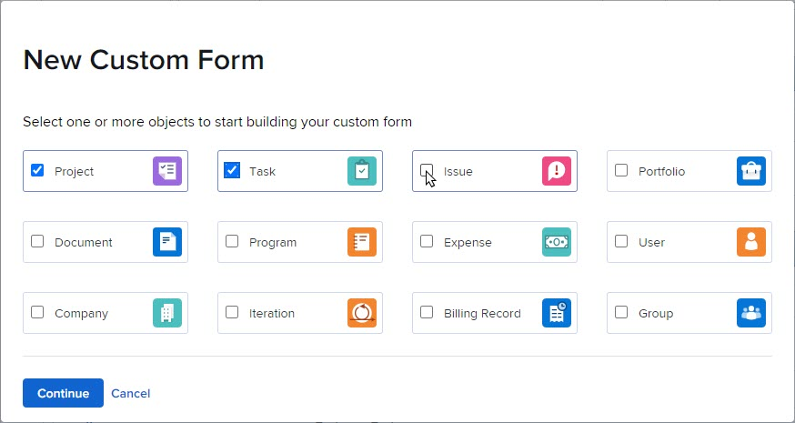

# Créer un formulaire personnalisé

Les informations mises en surbrillance sur cette page font référence à des fonctionnalités qui ne sont pas encore disponibles de manière générale. Il est disponible uniquement dans l’environnement Aperçu pour tous les clients. Après les versions mensuelles de Production, les mêmes fonctionnalités sont également disponibles dans l’environnement Production pour les clients qui ont activé les versions rapides. 

Pour plus d’informations sur les versions rapides, consultez la section [Activer ou désactiver les versions rapides pour votre entreprise](/help/quicksilver/administration-and-setup/set-up-workfront/configure-system-defaults/enable-fast-release-process.md).

Vous pouvez concevoir un formulaire personnalisé à l’aide du concepteur de formulaire dans Adobe Workfront. Vous pouvez joindre des formulaires personnalisés à différents objets Workfront pour capturer des données en rapport avec ces objets.

## Conditions d’accès

+++ Développez pour afficher les exigences d’accès aux fonctionnalités de cet article.

Vous devez disposer des éléments suivants pour effectuer les étapes décrites dans cet article :

<table style="table-layout:auto"> 
 <col> 
 <col> 
 <tbody> 
  <tr data-mc-conditions=""> 
   <td role="rowheader"> 
Formule Adobe Workfront
 </td> 
   <td>Tous</td> 
  </tr> 
  <tr> 
   <td role="rowheader">Licence Adobe Workfront</td> 
   <td>
   
Nouveau : Standard

   
ou

   
Actuel : formule
</td> 
  </tr> 
  <tr data-mc-conditions=""> 
   <td role="rowheader">Configurations des niveaux d’accès</td> 
   <td> 
Accès administratif aux formulaires personnalisés
 </td> 
  </tr>  
 </tbody> 
</table>

Pour plus de détails sur les informations contenues dans ce tableau, consultez l’article [Conditions d’accès dans la documentation Workfront](/help/quicksilver/administration-and-setup/add-users/access-levels-and-object-permissions/access-level-requirements-in-documentation.md).

+++

## Commencer à concevoir un formulaire personnalisé

{{step-1-to-setup}}

1. Cliquez sur **Formulaires personnalisés** dans le panneau de gauche.

1. Cliquez sur **Nouveau formulaire personnalisé**.
1. Sélectionnez les types d’objets auxquels vous souhaitez joindre le formulaire personnalisé, puis cliquez sur **Continuer**.

   

1. Dans la zone **Titre obligatoire**, saisissez le titre du formulaire personnalisé.
1. (Facultatif) Si vous souhaitez ajouter d’autres types d’objets au formulaire afin qu’il puisse être joint à d’autres objets, cliquez sur l’icône **Ajouter**  après **Types d’objet**, puis sélectionnez le type souhaité dans le menu qui s’affiche. Vous pouvez répéter cette opération pour ajouter autant de types d’objet que vous le souhaitez.

   Vous pouvez également cliquer sur le X d’un type d’objet pour le supprimer du formulaire.

   >[!CAUTION]
   >
   >La suppression d’un formulaire personnalisé supprime également toutes les données personnalisées sur les objets associés au formulaire. Les données supprimées ne peuvent pas être récupérées. Envisagez plutôt de désactiver un formulaire personnalisé : lorsque vous désactivez un formulaire personnalisé que vous n’utilisez plus, vous conservez toutes les données historiques associées.
   >
   >Pour plus d’informations, voir [ Ajouter ou supprimer des types d’objet d’un formulaire personnalisé existant ](/help/quicksilver/administration-and-setup/customize-workfront/create-manage-custom-forms/form-designer/manage-a-form/add-or-remove-objects-from-a-form.md) et [Désactiver ou réactiver un formulaire personnalisé](/help/quicksilver/administration-and-setup/customize-workfront/create-manage-custom-forms/form-designer/manage-a-form/activate-deactivate-form.md).

1. Ensuite, vous pouvez commencer à ajouter des champs à votre formulaire personnalisé. Voir les sections suivantes :
   * [Réutiliser un champ ou un widget existant déjà utilisé dans un autre formulaire personnalisé](#reuse-an-existing-field-or-widget-already-used-in-another-custom-form)
   * [Remarques sur les noms et les libellés des champs](#notes-on-field-names-and-labels)
   * [Ajouter des champs de texte](#add-text-fields)
   * [Ajouter des champs calculés](#add-calculated-fields)
   * [Ajout de boutons radio, de groupes de cases à cocher et de listes déroulantes](#add-radio-buttons-checkboxes-and-dropdowns)
   * [Ajouter des champs de frappe continue et des champs de date](#add-typeahead-and-date-fields)
   * [Ajouter des champs de recherche externes](#add-external-lookup-fields)
   * [Ajouter des images, des fichiers PDF et des vidéos
](#add-images-pdfs-and-videos)
   * [Ajouter des champs natifs Workfront](#add-workfront-native-fields)
   * [Ajouter des fichiers Adobe XD](#add-adobe-xd-files)
   * [Ajouter des champs de connexion de planification](#add-planning-connection-fields)

## Ajouter des champs nouveaux ou existants à votre formulaire personnalisé

Vous pouvez utiliser des champs nouveaux ou existants lors de la conception de votre formulaire personnalisé.

Les formulaires personnalisés sont limités à 500 champs. Un compteur en bas à gauche indique le nombre de champs utilisés dans le formulaire. Il est toujours visible lorsque vous faites défiler le concepteur de formulaires.

### Réutiliser un champ ou un widget existant déjà utilisé dans un autre formulaire personnalisé

1. En haut à gauche de l’écran, cliquez sur **Bibliothèque de champs**.

1. Faites glisser le champ ou le widget où vous le souhaitez dans le formulaire personnalisé.
1. (Facultatif) Répétez l’étape précédente pour ajouter d’autres champs ou widgets.

   >[!NOTE]
   >
   >Vous pouvez ajouter jusqu’à 500 champs sur un seul formulaire personnalisé. Cependant, une dégradation des performances peut se produire lorsque le formulaire comporte plus de 100 champs, en fonction de la complexité de votre formulaire personnalisé.
   >
   >
   >Parmi les exemples de formulaires complexes, citons les formulaires avec des paramètres en cascade, des champs de données personnalisées calculés et plusieurs options de valeur dans un même champ.

1. Pour enregistrer vos modifications, cliquez sur **Appliquer** et passez à une autre section pour continuer à créer votre formulaire.

   ou

   Cliquez sur **Enregistrer et fermer**.

### Remarques sur les noms et les libellés des champs {#notes-on-field-names-and-labels}

Le **libellé** est disponible pour la plupart des champs. Il s’agit d’un libellé descriptif qui s’affiche au-dessus du champ ou du widget sur le formulaire personnalisé. Vous pouvez modifier le libellé à tout moment.

>[!NOTE]
>
>Évitez d’utiliser des caractères spéciaux dans ce libellé. Ils ne s’affichent pas correctement dans les rapports.

Un **nom** est requis pour chaque champ. Il s’agit de la manière dont le système identifie le champ personnalisé lorsque vous l’ajoutez à différentes zones dans Workfront, telles que les rapports, l’accueil et les interactions avec l’API. Lorsque vous configurez le champ ou le widget pour la première fois et que vous saisissez le libellé, le champ Nom est automatiquement renseigné pour qu’il corresponde. Les champs Libellé et Nom ne sont toutefois pas synchronisés, ce qui vous donne la possibilité de modifier le libellé que vos utilisateurs et utilisatrices voient sans avoir à modifier le nom que le système voit.

Chaque nom de champ personnalisé doit être unique dans l’instance Workfront de votre entreprise. Ainsi, vous pouvez réutiliser un nom de champ déjà créé pour un autre formulaire personnalisé.

>[!NOTE]
>
>Bien qu’il soit possible de le faire, nous vous recommandons de ne pas modifier ce nom une fois que vous ou d’autres utilisateurs ou utilisatrices aurez commencé à utiliser le formulaire personnalisé dans Workfront. Si vous le faites, le système ne reconnaîtra plus le champ personnalisé là où il peut être référencé actuellement dans d’autres zones de Workfront.
>Par exemple, si vous ajoutez le champ personnalisé à un rapport et que vous modifiez ensuite son nom, Workfront ne le reconnaît pas dans le rapport et il ne fonctionnera plus correctement, à moins que vous ne le rajoutiez au rapport en utilisant le nouveau nom.
>
>Nous vous recommandons de ne pas saisir un nom déjà utilisé pour les champs Workfront intégrés.
>
>Nous vous recommandons de ne pas utiliser le caractère point dans le nom du champ personnalisé afin d’éviter toute erreur lors de l’utilisation du champ dans différentes zones de Workfront.

Les caractères spéciaux suivants ne sont pas pris en charge dans les libellés et noms de champ personnalisés.

* \t
* \n
* \r
* \f
* `[`
* `]`
* (
* )
* :
* `{`
* `}`

### Ajouter des champs de texte

Vous pouvez ajouter plusieurs champs de texte différents à un formulaire personnalisé.

+++ **Développer pour voir les descriptions des champs de texte disponibles**

* **Champ de texte sur une seule ligne** : permet aux utilisateurs de saisir une seule ligne de texte dans le champ.
* **Champ de paragraphe** : permet aux utilisateurs de saisir plusieurs lignes de texte dans le champ.
* **Champ de texte avec formatage** : permet aux utilisateurs de saisir plusieurs lignes de texte dans le champ et de mettre en forme le texte avec des caractères gras, italique, souligné, puces, numérotation, liens hypertexte et guillemets de bloc. La limite de 15 000 caractères permet d’utiliser du texte et des mises en forme variés.

  Ce type de champ personnalisé n’est pas pris en charge dans les filtres sur les listes et les rapports.

  Pour plus d’informations sur l’accès à ce champ par le biais de l’API, voir [Stockage de champs de texte enrichi dans l’API](/help/quicksilver/administration-and-setup/customize-workfront/create-manage-custom-forms/rich-text-field-storage-in-the-api.md).

  >[!NOTE]
  >
  >Les champs de texte avec mise en forme ne sont pas disponibles pour les applications mobiles Workfront (disponibilité dans les prochaines versions).

* **Texte descriptif** : vous permet d’inclure des instructions et des liens vers des pages extérieures à Workfront.

+++

Pour ajouter un champ de texte, procédez comme suit :

1. Dans la partie gauche de l’écran, recherchez l’un des champs de texte suivants et faites-le glisser vers une section de la zone de travail :

   * Texte sur une seule ligne
   * Paragraphe
   * Texte avec formatage
   * Texte descriptif

   

1. Dans la partie droite de l’écran, configurez les options disponibles pour le type de champ personnalisé que vous ajoutez :

   <table>
    <tr>
    <td>Entrée dans</td>
    <td>Description</td>
    <td>Disponible pour </td>
    </tr>
    <tr>
    <td>Taille</td>
    <td>
Modifiez la taille des champs de texte du formulaire.

   </td>
    <td><ul>
    <li>Texte sur une seule ligne</li>
    <li>Paragraphe</li>
    <li>Texte avec formatage</li>
    <li>Texte descriptif</li>
    </ul></td>
    </tr>
    <tr>
    <td>Étiquette</td>
    <td>
(Obligatoire) Saisissez un libellé descriptif à afficher au-dessus du champ. Vous pouvez modifier le libellé à tout moment.

    
IMPORTANT : évitez d’utiliser des caractères spéciaux dans ce libellé. Elles ne s’affichent pas correctement dans les rapports. Pour plus d’informations, voir <a href="design-a-form.md#notes-on-field-names-and-labels">Remarques sur les noms et les libellés de champ</a>.
</td>
    <td><ul>
    <li>Texte sur une seule ligne</li>
    <li>Paragraphe</li>
    <li>Texte avec formatage</li>
    </ul></td>
    </tr>
    <tr>
     <td>Nom</td>
    <td>
(Obligatoire) Ce nom est la façon dont le système identifie le champ. Lorsque vous configurez le widget pour la première fois et que vous saisissez le libellé, le champ Nom est automatiquement renseigné pour qu’il corresponde. Les champs Libellé et Nom ne sont toutefois pas synchronisés, ce qui vous donne la possibilité de modifier le libellé que vos utilisateurs et utilisatrices voient sans avoir à modifier le nom que le système voit.

    
Pour plus d’informations, voir <a href="design-a-form.md#notes-on-field-names-and-labels">Remarques sur les noms et les libellés de champ</a>.

    </td>
    <td><ul>
    <li>Texte sur une seule ligne</li>
    <li>Paragraphe</li>
    <li>Texte avec formatage</li>
    <li>Texte descriptif</li>
    </ul></td>
    </tr>
    <tr>
    <td>Instructions</td>
    <td>Saisissez toute information supplémentaire concernant le champ. En remplissant le formulaire personnalisé, les utilisateurs et les utilisatrices peuvent pointer sur l’icône du point d’interrogation pour afficher une info-bulle contenant les informations que vous saisissez ici.

    </td>
    <td><ul>
    <li>Texte sur une seule ligne</li>
    <li>Paragraphe</li>
    <li>Texte avec formatage</li>
    </ul></td>
    </tr>
    <tr>
    <td>Format</td>
    <td>
Sélectionnez le type de données qui seront capturées dans le champ personnalisé.
 
<b>NOTE</b> :   
    <ul> 
    <li>Ce champ ne peut pas être modifié après l’enregistrement du formulaire. Pour utiliser votre champ dans des calculs mathématiques, assurez-vous de sélectionner le format « Nombre » ou « Devise ».</li> 
    <li>Lorsque vous sélectionnez Nombre ou Devise, le système tronque automatiquement les nombres qui commencent par 0.</li>
    <li>Les champs au format « Nombre » sont limités à 16 caractères. Vous pouvez également utiliser un champ Texte pour saisir des nombres et éviter la limite.</li>
     </ul>
</td> </td>
    <td><ul>
    <li>Texte sur une seule ligne</li>
    <li>Paragraphe</li>
    </ul></td>
    </tr>
    <tr>
    <td>Type d'affichage</td>
    <td>Basculer entre des champs de texte d’une seule ligne et des champs de texte de paragraphe.</td>
    <td><ul>
    <li>Texte sur une seule ligne</li>
    <li>Paragraphe</li>
    </ul></td>
    </tr>
    <tr>
    <td>Lien hypertexte</td>
    <td> Si vous souhaitez appliquer un lien hypertexte au texte descriptif que vous avez saisi, ajoutez-le ici. Le texte descriptif s’affiche sous forme de lien sur les objets auxquels le formulaire est attaché.</td>
    <td><ul><li>Texte descriptif</li></ul></td>
    </tr>
    <tr> 
      <td role="rowheader">Créer un champ obligatoire</td>
      <td>
Sélectionnez cette option si vous souhaitez que le champ soit obligatoire pour que l’utilisateur ou l’utilisatrice puisse remplir le formulaire personnalisé.
</td>
    </tr> 
   </table>

1. (Facultatif) Répétez l’étape précédente pour ajouter d’autres champs ou widgets.

   ou

   Pour copier un champ, pointez dessus et cliquez sur l’icône de copie.

   

1. Pour enregistrer vos modifications, cliquez sur **Appliquer** et passez à une autre section pour continuer à créer votre formulaire.

   ou

   Cliquez sur **Enregistrer et fermer**.

### Ajouter des champs calculés

Dans un formulaire personnalisé, vous pouvez ajouter un champ personnalisé calculé qui utilise les données existantes pour générer de nouvelles données lorsque le formulaire personnalisé est joint à un objet.

Pour ajouter un champ calculé, consultez la section [Ajouter des champs calculés avec le créateur de formulaire](/help/quicksilver/administration-and-setup/customize-workfront/create-manage-custom-forms/form-designer/design-a-form/add-a-calculated-field.md).

### Ajout de boutons radio, de groupes de cases à cocher et de listes déroulantes

Vous pouvez ajouter des boutons radio, des groupes de cases à cocher, des listes déroulantes et des listes déroulantes à sélection multiple à un formulaire personnalisé.

+++ **Développer pour voir les descriptions des champs disponibles**

* **Cases d’option** : demande aux utilisateurs et aux utilisatrices de ne sélectionner qu’un seul choix.
* **Groupe de cases à cocher** : permet aux utilisateurs de sélectionner plusieurs choix.
* **Liste déroulante à sélection unique** : fournit une liste de choix de liste déroulante.
* **Liste déroulante à sélection multiple** : permet aux utilisateurs de sélectionner plusieurs choix dans une liste déroulante.

+++

>[!NOTE]
>
>Les champs qui autorisent plusieurs sélections, tels que Groupe Case à cocher et Menu déroulant multi-sélection, sont difficiles à représenter sous forme de graphiques et à regrouper dans les rapports. Pour simplifier la création de graphiques et de regroupements dans les rapports, vous pouvez créer des champs distincts pour chaque choix (par exemple, un champ de texte d’une seule ligne).

Pour ajouter des boutons radio, des groupes de cases à cocher et des listes déroulantes :

1. Dans la partie gauche de l’écran, recherchez l’un des champs suivants et faites-le glisser vers une section de la zone de travail.

   * Cases d’option
   * Groupe Case à cocher
   * Liste déroulante à sélection unique
   * Menu déroulant multi-sélection

   

1. Dans la partie droite de l’écran, configurez les options disponibles pour le type de champ personnalisé que vous ajoutez :

   <table style="table-layout:auto"> 
    <tbody> 
    <tr>
    <td>Entrée dans</td>
    <td>Description</td>
    <td>Disponible pour </td>
    </tr>
    <tr> 
     <td role="rowheader">Étiquette</td> 
     <td> 
(Obligatoire) Saisissez un libellé descriptif à afficher au-dessus du champ personnalisé. Vous pouvez modifier le libellé à tout moment.
 
<b>IMPORTANT</b> : évitez d’utiliser des caractères spéciaux dans ce libellé. Elles ne s’affichent pas correctement dans les rapports. Pour plus d’informations, voir <a href="design-a-form.md#notes-on-field-names-and-labels">Remarques sur les noms et les libellés de champ</a>.
 </td> 
     <td><ul>
    <li>Cases d’option</li>
    <li>Groupe Case à cocher</li>
    <li>Liste déroulante à sélection unique</li>
    <li>Menu déroulant multi-sélection</li>
    </ul></td>
     </tr> 
     <tr> 
    <td role="rowheader">Nom</td> 
     <td> 
(Obligatoire) Ce nom est la façon dont le système identifie le champ. Lorsque vous configurez le widget pour la première fois et que vous saisissez le libellé, le champ Nom est automatiquement renseigné pour qu’il corresponde. Les champs Libellé et Nom ne sont toutefois pas synchronisés, ce qui vous donne la possibilité de modifier le libellé que vos utilisateurs et utilisatrices voient sans avoir à modifier le nom que le système voit.
 
    
Pour plus d’informations, voir <a href="design-a-form.md#notes-on-field-names-and-labels">Remarques sur les noms et les libellés de champ</a>.
 </td>
     <td><ul>
    <li>Cases d’option</li>
    <li>Groupe Case à cocher</li>
    <li>Liste déroulante à sélection unique</li>
    <li>Menu déroulant multi-sélection</li>
    </ul></td>
    </tr> 
    <tr> 
    <td role="rowheader">Instructions</td> 
    <td> 
Saisissez des informations supplémentaires sur le champ personnalisé. Lorsque les utilisateurs et utilisatrices remplissent le formulaire personnalisé, ils peuvent pointer sur l’icône de point d’interrogation pour afficher une info-bulle contenant les informations saisies ici.
 
    
   

    </td> 
    <td><ul>
    <li>Cases d’option</li>
    <li>Groupe Case à cocher</li>
    <li>Liste déroulante à sélection unique</li>
    <li>Menu déroulant multi-sélection</li>
    </ul></td>
    </tr> 
    <tr> 
    <td role="rowheader">Format</td> 
    <td> 
Sélectionnez le type de données qui seront capturées dans le champ personnalisé.
 
<b>NOTE</b> :   
     <ul> 
    <li>Ce champ ne peut pas être modifié après l’enregistrement du formulaire. Pour utiliser votre champ dans des calculs mathématiques, assurez-vous de sélectionner le format « Nombre » ou « Devise ». </li> 
    <li>Lorsque vous sélectionnez Nombre ou Devise, le système tronque automatiquement les nombres qui commencent par 0.</li>
    <li>Les champs au format « Nombre » sont limités à 16 caractères. Vous pouvez également utiliser un champ Texte pour saisir des nombres et éviter la limite.</li>
     </ul>
</td> 
     <td><ul>
    <li>Cases d’option</li>
    <li>Groupe Case à cocher</li>
    <li>Liste déroulante à sélection unique</li>
    <li>Menu déroulant multi-sélection</li>
    </ul></td>
    </tr> 
    <tr> 
     <td role="rowheader">Type d'affichage</td> 
    <td>Basculez entre les boutons radio, le groupe de cases à cocher, la liste déroulante à sélection unique ou la liste déroulante à sélection multiple pour le champ.</td> 
    <td><ul>
    <li>Cases d’option</li>
    <li>Groupe Case à cocher</li>
    <li>Liste déroulante à sélection unique</li>
    <li>Menu déroulant multi-sélection</li>
    </ul></td>
    </tr> 
     <tr> 
    <td role="rowheader">Créer un champ obligatoire</td> 
    <td>Sélectionnez cette option si vous souhaitez que le champ soit obligatoire pour que l’utilisateur ou l’utilisatrice puisse remplir le formulaire personnalisé. </td> 
    <td><ul>
    <li>Cases d’option</li>
    <li>Groupe Case à cocher</li>
    <li>Liste déroulante à sélection unique</li>
    <li>Menu déroulant multi-sélection</li>
    </ul></td>
     </tr> 
    <tr> 
    <td role="rowheader">Choix </td> 
    <td> 
    <ol> 
    <li> 
Cliquez sur <b>Options</b>, puis activez l’une des options suivantes :
 
    <ul> 
    <li><strong>Afficher les valeurs</strong> : affiche les valeurs de chaque choix dans le champ. Le libellé de chaque choix s’affiche par défaut.</li> 
     <li><strong>Trier les choix dans l’ordre alphabétique</strong> : trie par ordre alphabétique les choix que vous ajoutez dans le champ.</li> 
    </ul> 
    </li> 
    <li> 
Pour chaque choix que vous ajoutez à l’utilisateur ou à l’utilisatrice, cliquez sur l’icône d’engrenage , puis sélectionnez l’une des options suivantes :
 
    <ul> 
    <li><strong>Sélectioner par défaut</strong> : sélectionnez le choix par défaut dans le champ.</li> 
    <li> 
<strong>Masquer le choix</strong> : masquez le choix dans le champ. Les choix masqués restent accessibles dans les rapports.
 </li> 
    <li> 
<strong>Supprimer le choix</strong> : supprimez le choix du champ.
 
<b>AVERTISSEMENT</b> : si ce choix est utilisé pour les objets actuels, ne le supprimez pas du champ. Sa suppression entraînera la perte de données historiques. Sélectionnez plutôt l’option pour le masquer, ce qui empêchera les utilisateurs et utilisatrices de le sélectionner à l’avenir.
 </li> 
    </ul> 
     </li> 
    </ol> </td> 
    <td><ul>
    <li>Cases d’option</li>
    <li>Groupe Case à cocher</li>
    <li>Liste déroulante à sélection unique</li>
    <li>Menu déroulant multi-sélection</li>
    </ul></td>
     </tr> 
    </tbody> 
    </table>

1. (Facultatif) Répétez l’étape précédente pour ajouter d’autres champs ou widgets.

   ou

   Pour copier un champ, pointez dessus et cliquez sur l’icône de copie.

   

1. Pour enregistrer vos modifications, cliquez sur **Appliquer** et passez à une autre section pour continuer à créer votre formulaire.

   ou

   Cliquez sur **Enregistrer et fermer**.

### Ajouter des champs typeahead et des champs de date

Vous pouvez ajouter des champs de saisie semi-automatique et de date à un formulaire personnalisé.

+++ **Développer pour afficher les descriptions des champs disponibles**

* **Saisie semi-automatique** : permet aux utilisateurs et utilisatrices de saisir le nom d’un objet qui existe dans Workfront. Une liste de suggestions s’affiche lorsque l’utilisateur ou l’utilisatrice commence à saisir du texte. Ce type de champ prend en charge les objets suivants :
   * l’utilisateur ou de l’utilisatrice
   * Groupe
   * Fonction
   * Portfolio
   * Programme
   * Projet
   * Equipe
   * Modèle
   * Entreprise
* **Date** : affiche un calendrier dans lequel les utilisateurs peuvent sélectionner une date et une heure.

+++

Pour ajouter des champs de saisie semi-automatique et de date :

1. Dans la partie gauche de l’écran, recherchez l’un des champs suivants et faites-le glisser vers une section de la zone de travail.

   * Frappe continue
   * Date

   

1. Dans la partie droite de l’écran, configurez les options disponibles pour le type de champ personnalisé que vous ajoutez :

   <table style="table-layout:auto"> 
    <tbody> 
     <tr>
    <td>Paramètre du champ</td>
    <td>Description</td>
    <td>Disponible pour </td>
    </tr>
     <tr> 
      <td role="rowheader">Étiquette</td> 
      <td> 
(Obligatoire) Saisissez un libellé descriptif à afficher au-dessus du champ personnalisé. Vous pouvez modifier le libellé à tout moment.
 
<b>IMPORTANT</b> : évitez d’utiliser des caractères spéciaux dans ce libellé. Elles ne s’affichent pas correctement dans les rapports. Pour plus d’informations, voir <a href="design-a-form.md#notes-on-field-names-and-labels">Remarques sur les noms et les libellés de champ</a>.
 </td> 
       <td><ul>
    <li>Frappe continue</li>
    <li>Date</li>
    </ul></td>
     </tr> 
     <tr> 
      <td role="rowheader">Nom</td> 
      <td> 
(Obligatoire) Ce nom est la façon dont le système identifie le champ. Lorsque vous configurez le widget pour la première fois et que vous saisissez le libellé, le champ Nom est automatiquement renseigné pour qu’il corresponde. Les champs Libellé et Nom ne sont toutefois pas synchronisés, ce qui vous donne la possibilité de modifier le libellé que vos utilisateurs et utilisatrices voient sans avoir à modifier le nom que le système voit.
 
      
Pour plus d’informations, voir <a href="design-a-form.md#notes-on-field-names-and-labels">Remarques sur les noms et les libellés de champ</a>.
 </td>
    <td><ul>
    <li>Frappe continue</li>
    <li>Date</li>
    </ul></td>
     </tr> 
     <tr> 
      <td role="rowheader">Instructions</td> 
      <td> 
Saisissez des informations supplémentaires sur le champ personnalisé. Lorsque les utilisateurs et utilisatrices remplissent le formulaire personnalisé, ils peuvent pointer sur l’icône de point d’interrogation pour afficher une info-bulle contenant les informations saisies ici.
 
      
  

      </td> 
         <td><ul>
    <li>Frappe continue</li>
    <li>Date</li>
    </ul></td>
     </tr> 
     <tr> 
      <td role="rowheader">Afficher l'heure</td> 
      <td>Sélectionnez cette option si vous souhaitez afficher l’heure et la date du jour dans le champ.</td> 
         <td><ul>
    <li>Date</li>
    </ul></td>
     </tr> 
     <tr> 
      <td role="rowheader">Type d'objet référencé</td> 
      <td> 
Sélectionnez le type d’objet à associer au champ.
 
Une fois que vous avez cliqué sur « Appliquer » ou sur « Enregistrer + Fermer », vous ne pouvez pas modifier le type d’objet du champ.
 
<b>NOTE</b> :   
        <ul> 
         <li>Si votre administrateur ou administratrice Workfront a personnalisé le nom des Portfolios, Programmes ou Projets dans l’interface utilisateur Workfront, le nom Workfront par défaut de l’objet apparaît dans cette liste déroulante, et non le nom personnalisé. Contactez l’administration Workfront si vous avez besoin d’aide. </li> 
         <li>Les types d’objets suivants sont pris en charge dans les applications mobiles iOS et Android Workfront : « Utilisateur ou utilisatrice », « Société », « Groupe », « Fonction », « Portfolio », « Programme », « Projet » et « Modèle ».</li> 
        </ul> 
 </td> 
         <td><ul>
    <li>Frappe continue</li>
    </ul></td>
     </tr>
     <tr>
      <td role="rowheader">Ajouter filtre</td>
      <td>
Ajoutez un filtre pour un type d’objet afin de limiter les objets que les personnes peuvent sélectionner lorsqu’elles utilisent le champ. 
 
Par exemple, vous pouvez limiter un champ afin que les noms d’utilisateur et d’utilisatrice ne puissent être sélectionnés que s’ils répondent aux critères suivants :
 
       <ul> 
        <li>Ils appartiennent à un ou à des groupes que vous spécifiez.</li> 
        <li>Ils sont associés à un rôle ou à une fonction que vous spécifiez.</li> 
        <li>Ils appartiennent au même groupe que la personne qui utilise le champ.</li> 
       </ul> 
Vous devez définir le filtre correspondant au type d’objet sélectionné à l’aide de la syntaxe mode texte. Pour plus d’informations sur la création d’un filtre à l’aide du mode texte, consultez la section <a href="/help/quicksilver/reports-and-dashboards/reports/text-mode/edit-text-mode-in-filter.md">Modifier un filtre à l’aide du mode texte</a>.

       
<b>NOTE</b> :
       <ul> 
        <li>L’ajout d’un filtre à un champ de saisie automatique lors de la modification d’un formulaire personnalisé ne supprime aucun objet (hors portée du filtre) déjà ajouté par les utilisateurs ou les utilisatrices à l’aide du champ.</li> 
        <li>Ce filtre n’est pas disponible sur les appareils mobiles. Si vous utilisez le filtre pour un champ de frappe continue, il apparaîtra sur les appareils mobiles des personnes qui ne sont pas affectées par le filtre.</li> 
        </ul>
</td> 
      <td>
       <ul>
       <li>Frappe continue</li>
       </ul>
      </td>
     </tr>
     <tr> 
      <td role="rowheader">Créer un champ obligatoire</td> 
      <td>Sélectionnez cette option si vous souhaitez que le champ soit obligatoire pour que l’utilisateur ou l’utilisatrice puisse remplir le formulaire personnalisé. </td> 
       <td><ul>
    <li>Frappe continue</li>
    <li>Date</li>
    </ul></td>
     </tr> 
    </tbody> 
   </table>

1. (Facultatif) Répétez l’étape précédente pour ajouter d’autres champs ou widgets.

   ou

   Pour copier un champ, pointez dessus et cliquez sur l’icône de copie.

   

1. Pour enregistrer vos modifications, cliquez sur **Appliquer** et passez à une autre section pour continuer à créer votre formulaire.

   ou

   Cliquez sur **Enregistrer et fermer**.

### Ajouter des champs de recherche externe

Un champ de recherche externe fait appel à une API externe et renvoie des valeurs sous forme d’options dans un champ déroulant. Les personnes qui travaillent avec l’objet auquel le formulaire personnalisé est attaché peuvent sélectionner une ou plusieurs de ces options dans la liste déroulante. Le champ de recherche externe est également disponible dans les listes et les rapports.

Pour des exemples d’utilisation du champ de recherche externe pour appeler la même instance de Workfront ou une API publique, voir [Exemples du champ de recherche externe dans un formulaire personnalisé](/help/quicksilver/administration-and-setup/customize-workfront/create-manage-custom-forms/form-designer/design-a-form/external-lookup-examples.md).

>[!NOTE]
>
>* Les champs de recherche externes ne sont pas pris en charge dans le module externe Outlook.
>* Les champs de recherche externes ne sont pas disponibles dans les listes lorsque le champ dépend d’un autre champ.

Pour ajouter une recherche externe, procédez comme suit :

1. Dans la partie gauche de l’écran, recherchez le champ **Recherche externe** et faites-le glisser vers une section de la zone de travail.
1. Dans la partie droite de l’écran, configurez les options du champ personnalisé :

   <table style="table-layout:auto"> 
    <col> 
    <col> 
    <tbody> 
     <tr> 
      <td role="rowheader">Étiquette</td> 
      <td> 
(Obligatoire) Saisissez un libellé descriptif à afficher au-dessus du champ personnalisé. Vous pouvez modifier le libellé à tout moment.
 
<b>IMPORTANT</b> : évitez d’utiliser des caractères spéciaux dans ce libellé. Elles ne s’affichent pas correctement dans les rapports. Pour plus d’informations, voir <a href="design-a-form.md#notes-on-field-names-and-labels">Remarques sur les noms et les libellés de champ</a>.
 </td> 
     </tr> 
     <tr> 
      <td role="rowheader">Nom</td> 
      <td> 
(Obligatoire) Ce nom est la façon dont le système identifie le champ. Lorsque vous configurez le widget pour la première fois et que vous saisissez le libellé, le champ Nom est automatiquement renseigné pour qu’il corresponde. Les champs Libellé et Nom ne sont toutefois pas synchronisés, ce qui vous donne la possibilité de modifier le libellé que vos utilisateurs et utilisatrices voient sans avoir à modifier le nom que le système voit.

      
Pour plus d’informations, voir <a href="design-a-form.md#notes-on-field-names-and-labels">Remarques sur les noms et les libellés de champ</a>.
 </td>
     </tr> 
      <td role="rowheader">Instructions</td> 
      <td> 
Saisissez des informations supplémentaires sur le champ personnalisé. Lorsque les utilisateurs et utilisatrices remplissent le formulaire personnalisé, ils peuvent pointer sur l’icône de point d’interrogation pour afficher une info-bulle contenant les informations saisies ici.
 </td> 
     </tr> 
     <tr> 
      <td role="rowheader">Format</td>
      <td>
Sélectionnez le type de données qui seront capturées dans le champ personnalisé.

      
<strong>NOTE :</strong>

      <ul><li>Il est possible de modifier le type de format une fois le formulaire enregistré, mais toutes les valeurs existantes sur les objets doivent être convertibles au nouveau type de format. (Par exemple, si le type de format est Texte et qu’un objet stocke la valeur "abc", vous ne pouvez pas convertir le champ et obtenez une erreur indiquant que le système ne peut pas convertir "abc" en nombre/devise.) Si vous envisagez d’utiliser votre champ dans des calculs mathématiques, veillez à sélectionner le format Nombre ou Devise .</li>
      <li>Lorsque vous sélectionnez Nombre ou Devise, le système tronque automatiquement les nombres qui commencent par 0.</li>
      <li>Les champs au format « Nombre » sont limités à 16 caractères. Vous pouvez également utiliser un champ Texte pour saisir des nombres et éviter la limite.</li>
      </ul></td>
     </tr> 
     <tr> 
      <td role="rowheader">URL API de base</td> 
      <td>
Saisissez ou collez l’URL de l’API.

L’URL de l’API doit renvoyer un contenu JSON des options que vous souhaitez afficher dans la liste déroulante. Vous pouvez utiliser le champ Chemin JSON pour sélectionner les valeurs spécifiques du JSON renvoyées en tant qu’options dans la liste déroulante.

Lors de la saisie de l’URL de l’API, vous pouvez éventuellement transmettre les valeurs suivantes dans l’URL :

      <ul>
      <li>$$HOST : cette valeur représente l’hôte Workfront actuel et peut être utilisée pour effectuer des appels /search à l’API Workfront. Lorsque ce caractère générique est utilisé, l’authentification est prise en charge et les utilisateurs et les utilisatrices n’ont pas besoin d’envoyer des en-têtes d’authentification. (Par exemple, les utilisateurs et les utilisatrices peuvent rechercher des tâches à l’aide de l’URL de base <code>$$HOST/attask/api/task/search</code>, qui permet de rechercher des tâches et de sélectionner des valeurs dans une liste de tâches renvoyée.)</li>
      <li>
$$QUERY : cette valeur représente le texte de recherche que les utilisateurs et utilisatrices finaux saisissent dans le champ et vous permet d’implémenter le filtrage des requêtes pour ces personnes. (L’utilisateur ou l’utilisatrice recherchera la valeur dans la liste déroulante.)

      
Si l’API à laquelle vous faites référence le permet, vous pouvez également inclure des modificateurs dans votre requête de recherche afin d’identifier comment la recherche doit s’effectuer. Par exemple, vous pouvez utiliser l’URL d’API de base suivante pour permettre aux gens de rechercher tous les projets Workfront qui contiennent un texte spécifique : <code>$$HOST/attask/api/v15.0/proj/search?name=$$QUERY&name_Mod=contains</code>.

Pour en savoir plus sur les modificateurs de recherche Workfront, consultez <a href="/help/quicksilver/wf-api/general/api-basics.md">Concepts de base de l’API</a>.

      
<strong>NOTE :</strong> Si vous n’utilisez pas $$QUERY et que l’utilisateur ou l’utilisatrice saisit du texte dans le champ de recherche, les choix déjà disponibles seront réduits. Toutefois, si vous utilisez $$QUERY et que l’utilisateur ou l’utilisatrice saisit quelque chose, un nouvel appel réseau à votre API est effectué. Par conséquent, si vous avez plus de 2 000 valeurs dans votre API et que l’API prend en charge l’interrogation, vous pouvez utiliser $$QUERY pour effectuer une recherche non seulement à partir des 2 000 valeurs existantes, mais aussi à partir de l’API d’origine avec les options réduites.
</li>
      <li>
{fieldName} - Lorsque fieldName est n’importe quel champ personnalisé ou natif dans Workfront. Ainsi, vous pouvez implémenter des filtres d’options de liste déroulante en cascade lorsque vous transmettez la valeur d’un champ déjà sélectionné au champ de recherche externe pour filtrer les options. (Par exemple, le champ Zone géographique existe déjà dans le formulaire et vous réduisez une liste de pays de l’API à ceux qui se trouvent dans une zone géographique spécifique.)

      
Pour un champ de recherche externe dépendant d’autres champs (à l’aide de la syntaxe {fieldName}), les options renvoyées par l’API sont limitées à celles qui correspondent aux chaînes ou aux valeurs saisies dans les autres champs. (Cette fonctionnalité n’est pas prise en charge dans les listes et les rapports.)
</li>
      <li>{referenceObject}.{fieldName} - Lorsque le champ fait partie d’un objet. Cette syntaxe est similaire à celle des expressions personnalisées. (Par exemple, portfolioID={project}.{portfolioID})</li></ul>
      
<strong>NOTE :</strong> consultez la documentation de l’API avec laquelle vous travaillez pour connaître les requêtes spécifiques que vous pouvez définir.
</td>
     </tr>
     <tr> 
      <td role="rowheader">Méthode HTTP</td> 
      <td>Sélectionnez <strong>Get</strong>, <strong>Post</strong>, ou <strong>Put</strong> pour la méthode.</td> 
     </tr>
     <tr> 
      <td role="rowheader">Chemin JSON</td>
      <td>
Saisissez ou collez le chemin JSON pour l’API.
 
Cette option permet d’extraire des données du JSON renvoyé par l’URL de l’API. Elle permet de sélectionner les valeurs du JSON qui apparaîtront dans les options de la liste déroulante.

Par exemple, si l’URL de votre API renvoie du JSON dans ce format : 
      <pre>
      {
data: {
{ name: "USA"},
{ name: "Canada"}
}
}
      </pre>
      

      
vous pouvez alors utiliser « $.data[*].name » pour sélectionner USA et Canada en tant qu’options de la liste déroulante.
 
Pour plus d’informations sur le chemin JSON et pour vous assurer que vous écrivez le bon chemin JSON, consultez <a href="https://jsonpath.com/">https://jsonpath.com/</a>.
</td>
     </tr>
     <tr> 
      <td role="rowheader">En-têtes</td>
      <td>
Cliquez sur <strong>Ajouter un en-tête</strong>, et saisissez ou collez la paire clé-valeur requise pour l’authentification avec l’API.

<strong>NOTE :</strong> les champs de l’en-tête ne sont pas un endroit sûr pour stocker des informations d’identification, et vous devez faire attention à ce que vous saisissez et enregistrez.
</td>
     </tr>
     <tr> 
      <td role="rowheader">Menu déroulant multi-sélection</td>
      <td>
Sélectionnez cette option pour permettre à la personne de sélectionner plusieurs valeurs dans la liste déroulante.
</td>
     </tr>
     </tr>
     <tr> 
      <td role="rowheader">Créer un champ obligatoire</td>
      <td>
Sélectionnez cette option si vous souhaitez que le champ soit obligatoire pour que l’utilisateur ou l’utilisatrice puisse remplir le formulaire personnalisé.
</td>
     </tr>       
    </tbody>
   </table>

1. Pour enregistrer vos modifications, cliquez sur **Appliquer** et passez à une autre section pour continuer à créer votre formulaire.

   ou

   Cliquez sur **Enregistrer et fermer**.

>[!NOTE]
>
>Les éléments suivants sont des limitations techniques de l’appel à l’API externe :
>
>* Nombre maximal d’options : 2 000 (seules les 2 000 premières options uniques du JSON renvoyé sont affichées).
>* Délai d’expiration : 3 secondes
>* Nombre de reprises : 3
>* Durée d’attente entre les reprises : 500 ms
>* Statuts de la réponse attendue : 2xx

### Ajouter des images, des fichiers PDF et des vidéos

Vous pouvez ajouter des images, des PDF et des vidéos à un formulaire personnalisé. Les personnes qui travaillent avec l’objet auquel le formulaire personnalisé est attaché ne peuvent voir l’image, le PDF ou la vidéo que dans les zones suivantes :

* Zone Détails de l’objet (par exemple, pour un projet, la zone Détails du projet)
* La zone Modifier de l’objet, si l’aspect de l’expérience Adobe Workfront est nouveau (par exemple, les zones Modifier le projet et Modifier la tâche).

<!-- Do we need to tell them where they can't see it if we tell them where they can see it?
Currently, users cannot see the widget in the following areas:​
Lists and reports
Home and Summary
The Edit box for the object, if it doesn't have the new Adobe Workfront experience look and feel (for example, the Edit Expense box)
The Workfront Mobile app -->

+++ **Développer pour voir les descriptions des champs disponibles**

* **Image** : permet aux utilisateurs et utilisatrices d’ajouter des fichiers image.
* **PDF** : permet aux utilisateurs et utilisatrices d’ajouter des fichiers PDF.
* **Vidéos** : permet aux utilisateurs et utilisatrices d’ajouter des fichiers vidéo.

+++

Pour ajouter des images, des PDF ou des vidéos, procédez comme suit :

1. Dans la partie gauche de l’écran, recherchez l’un des champs suivants et faites-le glisser vers une section de la zone de travail.

   * Image
   * PDF
   * Vidéo

   

1. Saisissez ou modifiez l’une des propriétés suivantes du widget :

   <table style="table-layout:auto"> 
    <col> 
    <col> 
    <tbody> 
     <tr> 
      <td role="rowheader">Étiquette</td> 
      <td> 
(Obligatoire) Saisissez un libellé descriptif à afficher au-dessus du widget. Vous pouvez modifier le libellé à tout moment.
 
<b>IMPORTANT</b> : évitez d’utiliser des caractères spéciaux dans ce libellé. Elles ne s’affichent pas correctement dans les rapports. Pour plus d’informations, voir <a href="design-a-form.md#notes-on-field-names-and-labels">Remarques sur les noms et les libellés de champ</a>.
 </td> 
     </tr> 
     <tr> 
      <td role="rowheader">Nom</td> 
      <td> 
(Obligatoire) Ce nom correspond à la manière dont le système identifie le widget. Lorsque vous configurez le widget pour la première fois et que vous saisissez le libellé, le champ Nom est automatiquement renseigné pour qu’il corresponde. Les champs Libellé et Nom ne sont toutefois pas synchronisés, ce qui vous donne la possibilité de modifier le libellé que vos utilisateurs et utilisatrices voient sans avoir à modifier le nom que le système voit.
 
Pour plus d’informations, voir <a href="design-a-form.md#notes-on-field-names-and-labels">Remarques sur les noms et les libellés de champ</a>.
 </td> 
     </tr> 
     <tr> 
      <td role="rowheader">URL</td> 
      <td> 
(Obligatoire) Saisissez ou collez l’URL du widget où il est stocké sur Internet.
 
      
Si vous ajoutez un widget vidéo, vous pouvez le faire en ajoutant ce qui suit dans la zone URL :
 
      <ul> 
      <li> 
Lien YouTube ou Vimeo
 </li> 
      <li> 
Lien vidéo Google Drive
 </li> 
      <li> 
Lien vers une vidéo avec les extensions MP4 et MOV
 </li> 
      <li> 
Lien vers une vidéo déjà chargée dans la zone Documents de votre instance Workfront. Pour obtenir des instructions, voir <a href="#add-a-video-widget-to-a-custom-form-from-the-documents-area" class="MCXref xref">Ajouter un widget vidéo à un formulaire personnalisé à partir de la zone Documents</a> dans cet article.
 </li> 
      </ul> 
       </td> 
     </tr> 
     <tr> 
      <td role="rowheader">Instructions</td> 
      <td> 
Saisissez des informations supplémentaires sur le widget. Lorsque les utilisateurs et utilisatrices remplissent le formulaire personnalisé, ils peuvent pointer sur l’icône de point d’interrogation pour afficher une info-bulle contenant les informations saisies ici.
 </td> 
     </tr> 
     <tr> 
      <td role="rowheader">Taille</td> 
      <td>Modifiez la taille d’affichage du widget selon vos besoins.</td> 
     </tr> 
    </tbody> 
   </table>

1. (Facultatif) Répétez l’étape précédente pour ajouter d’autres champs ou widgets.

   ou

   Pour copier un champ, pointez dessus et cliquez sur l’icône de copie.

   

1. Pour enregistrer vos modifications, cliquez sur **Appliquer** et passez à une autre section pour continuer à créer votre formulaire.

   ou

   Cliquez sur **Enregistrer et fermer**.

#### Ajouter un widget vidéo à un formulaire personnalisé à partir de la zone Documents{#add-a-video-widget-to-a-custom-form-from-the-documents-area}

>[!IMPORTANT]
>
>Lorsque vous ajoutez une vidéo à un formulaire personnalisé, seules les autorisations définies pour le formulaire personnalisé s’appliquent à la vidéo lorsque les utilisateurs et utilisatrices accèdent au formulaire sur un objet, et non aux autorisations définies pour la vidéo dans la zone Documents.

1. Accédez à la vidéo dans la zone Documents et générez une épreuve, comme décrit dans [Créer une épreuve interactive pour un site web ou un autre contenu web](/help/quicksilver/review-and-approve-work/proofing/creating-proofs-within-workfront/generate-interactive-proof-for-website-or-other-web-content.md).
1. Ouvrez l’épreuve.
1. Cliquez avec le bouton droit de la souris n’importe où sur la vidéo, puis sélectionnez **Copier l’adresse de la vidéo**.
1. Dans le formulaire personnalisé où vous ajoutez le widget vidéo, collez l’adresse copiée dans la zone **URL**.
1. Pour enregistrer vos modifications, cliquez sur **Appliquer** et passez à une autre section pour continuer à créer votre formulaire.

   ou

   Cliquez sur **Enregistrer et fermer**.

### Ajouter des champs natifs Workfront

Vous pouvez ajouter des champs natifs Workfront à vos formulaires personnalisés. Lorsque le formulaire personnalisé est joint à un objet, le champ est renseigné à partir des données de l’objet. Par exemple, le champ Description d’un formulaire personnalisé joint à un projet extrait la description du projet. (Le champ peut afficher « S.O. » si aucune donnée n’est disponible.)

+++ **Développez pour afficher la liste des champs natifs pris en charge.**

Ce tableau répertorie les champs natifs disponibles pour des objets Workfront spécifiques dans un formulaire personnalisé.

| Nom du champ | Projet | Tâche | Problème | Modèle | Tâche de modèle | Portfolio | Programme | Groupe |
|--------------------------- |-------- |------- |------- |--------- |-------------- | --------- |-------- |------ |
| Date d’achèvement effective | ✓ | ✓ | ✓ |   |   |   |   |   |
| Durée effective | ✓ |   |   |   |   |   |   |   |
| Heures effectives | ✓ |   | ✓ |   |   |   |   |   |
| Date de début effective | ✓ | ✓ | ✓ |   |   |   |   |   |
| Entreprise | ✓ |   |   | ✓ |   |   |   |   |
| Condition | ✓ | ✓ | ✓ |   |   |   |   |   |
| Type de condition | ✓ |   |   | ✓ |   |   |   |   |
| Description | ✓ | ✓ | ✓ | ✓ | ✓ | ✓ | ✓ | ✓ |
| Durée |   | ✓ |   |   | ✓ |   |   |   |
| Type de durée |   | ✓ |   |   | ✓ |   |   |   |
| Unité de durée |   | ✓ |   |   | ✓ |   |   |   |
| Entré par | ✓ | ✓ | ✓ | ✓ | ✓ |   |   | ✓ |
| Date d’entrée | ✓ | ✓ | ✓ | ✓ | ✓ |   |   | ✓ |
| Groupe | ✓ |   |   | ✓ |   | ✓ | ✓ |   |
| Dernière mise à jour par | ✓ | ✓ | ✓ | ✓ | ✓ |   |   |   |
| Date de dernière mise à jour | ✓ | ✓ | ✓ | ✓ | ✓ |   |   |   |
| Nom | ✓ | ✓ | ✓ | ✓ | ✓ | ✓ | ✓ | ✓ |
| Propriétaire | ✓ |   |   | ✓ |   | ✓ | ✓ |   |
| Date d’achèvement prévue | ✓ | ✓ | ✓ |   |   |   |   |   |
| Durée prévue | ✓ |   |   | ✓ |   |   |   |   |
| Heures prévues | ✓ | ✓ | ✓ |   | ✓ |   |   |   |
| Date de début prévue | ✓ |   |   |   |   |   |   |   |
| Portfolio | ✓ |   |   | ✓ |   |   | ✓ |   |
| Priorité | ✓ | ✓ | ✓ | ✓ | ✓ |   |   |   |
| Programme | ✓ |   |   | ✓ |   |   |   |   |
| Date d’achèvement prévisionnelle | ✓ | ✓ |   |   |   |   |   |   |
| Durée prévisionnelle en minutes |   | ✓ |   |   |   |   |   |   |
| Date de début prévisionnelle | ✓ | ✓ |   |   |   |   |   |   |
| Numéro de référence | ✓ | ✓ | ✓ | ✓ | ✓ |   |   |   |
| Mode horaire | ✓ |   |   | ✓ |   |   |   |   |
| Gravité |   |   | ✓ |   |   |   |   |   |
| Sponsor | ✓ |   |   | ✓ |   |   |   |   |
| Statut | ✓ | ✓ |   |   |   |   |   |   |
| Points de l’histoire |   | ✓ |   |   |   |   |   |   |
| Modèle | ✓ |   |   |   |   |   |   |   |
| URL | ✓ | ✓ |   | ✓ | ✓ |   |   |   |

{style="table-layout:auto"}

+++

1. Sur le côté gauche de l’écran, recherchez la **référence de champ native** et faites-la glisser vers une section du canevas.
1. Dans la partie droite de l’écran, configurez les options du champ personnalisé :

   <table style="table-layout:auto"> 
    <col> 
    <col> 
    <tbody> 
     <tr> 
      <td role="rowheader">Étiquette</td> 
      <td> 
(Obligatoire) Saisissez un libellé descriptif à afficher au-dessus du champ. Vous pouvez modifier le libellé à tout moment.
 
<b>IMPORTANT</b> : évitez d’utiliser des caractères spéciaux dans ce libellé. Elles ne s’affichent pas correctement dans les rapports. Pour plus d’informations, voir <a href="design-a-form.md#notes-on-field-names-and-labels">Remarques sur les noms et les libellés de champ</a>.
 </td> 
     </tr> 
     <tr> 
      <td role="rowheader">Nom</td>
      <td> 
(Obligatoire) Ce nom est la façon dont le système identifie le champ. Lorsque vous configurez le champ pour la première fois et que vous saisissez le libellé, le champ Nom est renseigné automatiquement pour correspondre à celui-ci. Mais les champs Libellé et Nom ne sont pas synchronisés, ce qui vous donne la liberté de modifier le libellé que vos utilisateurs et utilisatrices voient sans avoir à modifier le nom que le système voit.

      
Pour plus d’informations, voir <a href="design-a-form.md#notes-on-field-names-and-labels">Remarques sur les noms et les libellés de champ</a>.
</td> 
     </tr> 
     <tr> 
      <td role="rowheader">Instructions</td> 
      <td> 
Saisissez toute information supplémentaire concernant le champ. Lorsque les personnes remplissent le formulaire personnalisé, ils peuvent pointer sur l’icône en forme de point d’interrogation pour afficher une info-bulle contenant les informations que vous saisissez ici.</td> 
     </tr> 
     <tr> 
      <td role="rowheader">Champ de référence</td> 
      <td>
(Obligatoire) Sélectionnez un champ natif Workfront.

Seuls les champs natifs des objets du formulaire sont disponibles. Par exemple, si la liste des types d’objets en haut du créateur de formulaire affiche Projet, vous pourrez sélectionner des champs natifs pour les projets, mais pas des champs spécifiques aux tâches.
</td>
     </tr>
     <tr>
      <td role="rowheader">Ajouter filtre</td>
      <td>
Ajoutez un filtre pour le champ de référence afin de limiter la liste des éléments parmi lesquels les utilisateurs peuvent choisir lorsqu’ils utilisent le champ. 
 
Par exemple, vous pouvez limiter un champ afin que les noms d’utilisateurs ou d’utilisatrices ne puissent être sélectionnés que s’ils répondent aux critères suivants :
 
       <ul>
        <li>Ils appartiennent à un ou à des groupes que vous spécifiez.</li> 
        <li>Ils sont associés à un rôle ou à une fonction que vous spécifiez.</li> 
        <li>Ils appartiennent au même groupe que la personne qui utilise le champ.</li> 
       </ul>
       
Vous devez définir le filtre du champ de référence que vous avez sélectionné à l’aide de la syntaxe Mode texte . Pour plus d’informations sur la création d’un filtre à l’aide du mode texte, consultez la section <a href="/help/quicksilver/reports-and-dashboards/reports/text-mode/edit-text-mode-in-filter.md">Modifier un filtre à l’aide du mode texte</a>.

       
<b>NOTE</b> :
       <ul> 
        <li>L’option de filtre n’est disponible que lorsque vous référencez un champ de type natif, tel que Portfolio, Société ou Propriétaire.</li>
        <li>Si vous modifiez un formulaire personnalisé existant, l’ajout d’un filtre à un champ natif ne supprime aucun objet (hors de la portée du filtre) déjà ajouté par les utilisateurs à l’aide du champ.</li> 
        <li>Ce filtre n’est pas disponible sur les appareils mobiles. Si vous utilisez le filtre pour un champ natif, celui-ci s’affiche sur les appareils mobiles des utilisateurs qui ne sont pas affectés par le filtre.</li> 
        </ul>
</td> 
      <td>
     </tr>
     <tr> 
      <td role="rowheader">Créer un champ obligatoire</td>
      <td>
Sélectionnez cette option si vous souhaitez que le champ soit obligatoire pour que l’utilisateur ou l’utilisatrice puisse remplir le formulaire personnalisé.
</td>
     </tr> 
     <tr> 
      <td role="rowheader">Taille</td> 
      <td>(Facultatif) Modifiez la taille d’affichage du champ selon vos besoins.</td> 
     </tr> 
    </tbody> 
   </table>

1. Pour enregistrer vos modifications, cliquez sur **Appliquer** et passez à une autre section pour continuer à créer votre formulaire

   ou

   Cliquez sur **Enregistrer et fermer**.

### Ajouter des fichiers Adobe XD

Vous pouvez ajouter un prototype Adobe XD directement à un formulaire personnalisé. Les personnes qui travaillent avec l’objet auquel le formulaire personnalisé est attaché ne peuvent voir le fichier Adobe XD que dans les zones suivantes :

* Zone Détails de l’objet (par exemple, pour un projet, la zone Détails du projet)
* La zone Modifier de l’objet, si l’aspect de l’expérience Adobe Workfront est nouveau (par exemple, les zones Modifier le projet et Modifier la tâche).

Pour ajouter un fichier Adobe XD :

1. Sur le côté gauche de l’écran, recherchez **Adobe XD** et faites-le glisser vers une section de la zone de travail.
1. Saisissez ou modifiez l’une des propriétés suivantes du widget :

   <table style="table-layout:auto"> 
    <col> 
    <col> 
    <tbody> 
     <tr> 
      <td role="rowheader">Étiquette</td> 
      <td> 
(Obligatoire) Saisissez un libellé descriptif à afficher au-dessus du widget. Vous pouvez modifier le libellé à tout moment.
 
<b>IMPORTANT</b> : évitez d’utiliser des caractères spéciaux dans ce libellé. Elles ne s’affichent pas correctement dans les rapports. Pour plus d’informations, voir <a href="design-a-form.md#notes-on-field-names-and-labels">Remarques sur les noms et les libellés de champ</a>.
 </td> 
     </tr> 
     <tr> 
      <td role="rowheader">Nom</td> 
      <td> 
(Obligatoire) Ce nom correspond à la manière dont le système identifie le widget. Lorsque vous configurez le widget pour la première fois et que vous saisissez le libellé, le champ Nom est automatiquement renseigné pour qu’il corresponde. Les champs Libellé et Nom ne sont toutefois pas synchronisés, ce qui vous donne la possibilité de modifier le libellé que vos utilisateurs et utilisatrices voient sans avoir à modifier le nom que le système voit.

    
Pour plus d’informations, voir <a href="design-a-form.md#notes-on-field-names-and-labels">Remarques sur les noms et les libellés de champ</a>.
</td> 
     </tr> 
     <tr> 
      <td role="rowheader">URL</td> 
      <td> 
(Obligatoire) Saisissez ou collez un lien de prototype XD valide.
 
      
Remarque : le paramètre Accès au lien de l’onglet Partager d’Adobe XD doit être défini sur Toute personne disposant du lien. Sinon, les utilisateurs et utilisatrices ne pourront pas afficher le prototype. 
   </td> 
     </tr> 
     <tr> 
      <td role="rowheader">Instructions</td> 
      <td> 
Saisissez des informations supplémentaires sur le widget. Lorsque les utilisateurs et utilisatrices remplissent le formulaire personnalisé, ils peuvent pointer sur l’icône de point d’interrogation pour afficher une info-bulle contenant les informations saisies ici.
    
 </td> 
     </tr> 
     <tr> 
      <td role="rowheader">Taille</td> 
      <td>(Facultatif) Modifiez la taille d’affichage du widget selon vos besoins.</td> 
     </tr> 
    </tbody> 
   </table>

1. (Facultatif) Répétez l’étape précédente pour ajouter d’autres champs ou widgets.

   ou

   Pour copier un champ, pointez dessus et cliquez sur l’icône de copie.

   

1. Pour enregistrer vos modifications, cliquez sur **Appliquer** et passez à une autre section pour continuer à créer votre formulaire.

   ou

   Cliquez sur **Enregistrer et fermer**.

### Ajout de champs de connexion Planification

>[!IMPORTANT]
>
>Les informations de cette section font référence à la planification Adobe Workfront, une fonctionnalité supplémentaire d’Adobe Workfront.
>
>Pour accéder à Workfront Planning, vous devez disposer des éléments suivants :
>
>* Un nouveau forfait et une nouvelle licence Workfront. Workfront Planning n’est pas disponible pour les licences ou les forfaits Workfront hérités.
>* Une licence supplémentaire pour la planification Workfront.
>* L’instance Workfront de votre entreprise doit être intégrée à l’expérience unifiée Adobe.
>
> Pour obtenir la liste complète des exigences d’accès à Workfront Planning, consultez la [présentation de l’accès à Adobe Workfront Planning](/help/quicksilver/planning/access/access-overview.md).
> 
>Pour plus d’informations sur la planification Workfront, consultez la [présentation de la planification Adobe Workfront](/help/quicksilver/planning/general/planning-overview.md).

Vous pouvez afficher les enregistrements connectés à partir de la planification Workfront dans un champ personnalisé d’un objet Workfront en ajoutant un champ personnalisé de planification de la connexion au formulaire personnalisé d’un objet.

Vous pouvez ajouter le champ Planification de la connexion aux formulaires personnalisés de tous les objets. Cependant, vous ne pouvez afficher les enregistrements connectés que sur les formulaires personnalisés associés à des objets Workfront pouvant être connectés à partir de Workfront Planning.

>[!NOTE]
>
>Les utilisateurs qui visualisent des informations dans le champ personnalisé doivent avoir accès à la planification Workfront et aux espaces de travail qui contiennent les types d’enregistrement connectés aux objets Workfront.

Pour ajouter un champ Connexion planifiée :

1. Sur le côté gauche de l’écran, recherchez **Planification de la connexion** et faites-le glisser vers une section de la zone de travail.
1. Dans la partie droite de l’écran, configurez les options du champ personnalisé :

   <table style="table-layout:auto"> 
    <col> 
    <col> 
    <tbody> 
     <tr> 
      <td role="rowheader">Étiquette</td> 
      <td> 
(Obligatoire) Saisissez un libellé descriptif à afficher au-dessus du champ. Vous pouvez modifier le libellé à tout moment.
 
<b>IMPORTANT</b> :
 
Évitez d’utiliser des caractères spéciaux dans ce libellé.
 
      
Nous vous recommandons de choisir un libellé qui vous permet d'identifier facilement d'où vient l'enregistrement Planning. Ajoutez des informations telles que le nom de l’espace de travail ou le nom du type d’enregistrement. 
   </td> 
     </tr> 
     <tr> 
      <td role="rowheader">Nom</td>
      <td> 
(Obligatoire) Le nom est la manière dont le système identifie le champ. Lorsque vous configurez le champ pour la première fois et que vous saisissez le libellé, le champ Nom est renseigné automatiquement pour correspondre à celui-ci. Mais les champs Libellé et Nom ne sont pas synchronisés, ce qui vous donne la liberté de modifier le libellé que vos utilisateurs et utilisatrices voient sans avoir à modifier le nom que le système voit.
</td> 
     </tr> 
     <tr> 
      <td role="rowheader">Instructions</td> 
      <td> 
(Recommandé) Saisissez des informations supplémentaires sur le champ. Lorsque les utilisateurs et utilisatrices remplissent le formulaire personnalisé, ils peuvent pointer sur l’icône de point d’interrogation pour afficher une info-bulle contenant les informations saisies ici.

      
Vous pouvez y ajouter des informations explicites sur l’enregistrement et les objets que vous connectez. 

      </td> 
     </tr> 
     <tr> 
      <td role="rowheader">Type d’objet</td> 
      <td>
(Obligatoire) Sélectionnez un type d’objet Workfront connecté à un type d’enregistrement dans Workfront Planning.

      Vous pouvez sélectionner l’un des types d’objet suivants :
      <ul><li> Projet</li>
      <li> Portfolio</li><li> Programme</li><li> Entreprise</li><li> Groupe</li></ul>
       
Seuls les types d’objets Workfront pour les types d’objets du formulaire sont disponibles.
 
 Par exemple, si la liste Types d’objet située en haut du concepteur de formulaire affiche Projet, vous pouvez uniquement sélectionner Projet dans ce champ et vous ne pouvez pas sélectionner Portfolios, bien que les portefeuilles puissent également être connectés à des types d’enregistrement.

      </td>
     </tr>
     <tr> 
      <td role="rowheader">Espace de travail</td> 
      <td> 
(Obligatoire) Sélectionnez l’espace de travail Planification d’où viennent les enregistrements que vous souhaitez afficher dans Workfront.
 
 Seuls les espaces de travail connectés aux types d’objets que vous avez sélectionnés dans le champ Type d’objet s’affichent. </td> 
     </tr> 
     <tr> 
      <td role="rowheader">Type d’enregistrement</td> 
      <td>
(Obligatoire) Sélectionnez le type d’enregistrement Workfront Planning associé au type d’objet Workfront.

Seuls les types d’enregistrement ayant des connexions au type d’objet que vous avez sélectionné dans le champ Type d’objet s’affichent. 
</td> 
     </tr>
     <tr> 
      <td role="rowheader">Champ de connexion</td> 
      <td>
(Obligatoire) Sélectionnez le champ de connexion entre le type d’enregistrement Planification sélectionné que vous souhaitez afficher sur les objets Workfront et le type d’objet Workfront. 
 
 <b>NOTE</b>

Vous pouvez avoir plusieurs champs de connexion entre le même objet et le même type d’enregistrement, mais vous ne pouvez sélectionner qu’un seul champ.
  </td> 
     </tr>
    </tbody> 
   </table>

1. (Facultatif) Répétez les étapes précédentes pour ajouter d’autres champs.

   ou

   Pour copier un champ, pointez dessus et cliquez sur l’icône de copie.

   

1. Pour enregistrer vos modifications, cliquez sur **Appliquer** et passez à une autre section pour continuer à créer votre formulaire.

   ou

   Cliquez sur **Enregistrer et fermer**.

   Vous pouvez maintenant joindre le formulaire à un objet connecté à Workfront Planning et effectuer l’une des opérations suivantes :

   * Affichez les types d’enregistrements de la planification Workfront connectés à l’objet Workfront, le cas échéant.
   * Connectez ou déconnectez des enregistrements de l’objet Workfront.

   Pour plus d’informations, voir [Gestion des connexions d’enregistrement à partir d’objets Workfront](/help/quicksilver/planning/records/manage-records-in-planning-section.md)

## Organiser et prévisualiser un formulaire avec le concepteur de formulaire

Pour plus d’informations sur l’organisation d’un formulaire personnalisé avec des sauts de section et sur l’affichage d’un aperçu du formulaire, voir [Organisation et aperçu d’un formulaire avec le concepteur de formulaire](/help/quicksilver/administration-and-setup/customize-workfront/create-manage-custom-forms/form-designer/design-a-form/organize-a-form.md).
