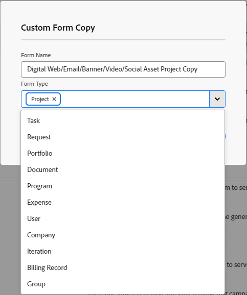

# Création d’un formulaire à partir d’une copie

<!--add preview tags and see below in comment out-->

Vous pouvez concevoir un nouveau formulaire personnalisé basé sur un formulaire existant. Vous pouvez joindre des formulaires personnalisés à différents objets Workfront pour capturer des données en rapport avec ces objets.

## Conditions d’accès

+++ Développez pour afficher les exigences d’accès aux fonctionnalités de cet article.

Vous devez disposer des accès suivants pour effectuer les étapes décrites dans cet article :

<table style="table-layout:auto"> 
 <col> 
 <col> 
 <tbody> 
  <tr data-mc-conditions=""> 
   <td role="rowheader"> 
Formule Adobe Workfront
 </td> 
   <td>Tous</td> 
  </tr> 
  <tr> 
   <td role="rowheader">Licence Adobe Workfront</td> 
   <td>
   
Nouveau : Standard

   
ou

   
Actuel : formule
</td>
  </tr> 
  <tr data-mc-conditions=""> 
   <td role="rowheader">Configurations des niveaux d’accès</td> 
   <td> 
Accès administratif aux formulaires personnalisés
 </td> 
  </tr>  
 </tbody> 
</table>

Pour plus de détails sur les informations contenues dans ce tableau, consultez l’article [Conditions d’accès dans la documentation Workfront](/help/quicksilver/administration-and-setup/add-users/access-levels-and-object-permissions/access-level-requirements-in-documentation.md).

+++

## Copier un formulaire personnalisé pour en créer un nouveau

{{step-1-to-setup}}

1. Cliquez sur **Formulaires personnalisés.**
1. Sélectionnez le formulaire personnalisé à utiliser comme base pour un nouveau formulaire personnalisé, puis cliquez sur l’.
1. Dans la zone **Copie de formulaire personnalisée** qui s’affiche, saisissez les informations suivantes :

   <table style="table-layout:auto"> 
    <col> 
    <col> 
    <tbody> 
     <tr> 
      <td role="rowheader">Nom du formulaire</td> 
      <td>Saisissez le nom du formulaire copié.</td> 
     </tr> 
     <tr> 
      <td role="rowheader"> 
Types de formulaire 
 </td> 
      <td> 
Dans la zone <b>Type de formulaire</b>, sélectionnez les types d’objets avec lesquels vous souhaitez que le formulaire personnalisé fonctionne, puis cliquez sur le X à côté des types que vous souhaitez retirer. Les types déjà associés au formulaire sont désactivés dans la liste.
 
      

 
      
Le formulaire doit être associé à au moins un type d’objet.
 
      </td> 
     </tr> 
    </tbody> 
   </table>

1. Cliquez sur **Copier**.

   Dans le formulaire d’origine, si des champs calculés font référence à des champs incompatibles avec un type d’objet que vous ajoutez au nouveau formulaire, un message vous invite à modifier les calculs dans ces champs.

   De la même manière, si une option d’accès pour un saut de section sur le formulaire d’origine n’est pas compatible avec un type d’objet que vous ajoutez au nouveau formulaire, un message vous invite à ajuster l’option.

1. Sélectionnez le formulaire à copier, puis cliquez sur l’.
1. Apportez des modifications au formulaire, comme expliqué dans les sections suivantes de l’article [Créer un formulaire personnalisé](/help/quicksilver/administration-and-setup/customize-workfront/create-manage-custom-forms/form-designer/design-a-form/design-a-form.md) :

   * [Réutiliser un champ ou un widget existant déjà utilisé dans un autre formulaire personnalisé](/help/quicksilver/administration-and-setup/customize-workfront/create-manage-custom-forms/form-designer/design-a-form/design-a-form.md#reuse-an-existing-field-or-widget-already-used-in-another-custom-form)
   * [Ajouter des champs de texte](/help/quicksilver/administration-and-setup/customize-workfront/create-manage-custom-forms/form-designer/design-a-form/design-a-form.md#add-text-fields)
   * [Ajouter des champs calculés](/help/quicksilver/administration-and-setup/customize-workfront/create-manage-custom-forms/form-designer/design-a-form/design-a-form.md#add-calculated-fields)
   * [Ajout de boutons radio, de groupes de cases à cocher et de listes déroulantes](/help/quicksilver/administration-and-setup/customize-workfront/create-manage-custom-forms/form-designer/design-a-form/design-a-form.md#add-radio-buttons-checkboxes-and-dropdowns)
   * [Ajouter des champs typeahead et des champs de date](/help/quicksilver/administration-and-setup/customize-workfront/create-manage-custom-forms/form-designer/design-a-form/design-a-form.md#add-typeahead-and-date-fields)
   * [&#128279;](/help/quicksilver/administration-and-setup/customize-workfront/create-manage-custom-forms/form-designer/design-a-form/design-a-form.md#add-images-pdfs-and-videos)Ajouter des images, des fichiers PDF et des vidéos

   * [Ajouter des fichiers Adobe XD](/help/quicksilver/administration-and-setup/customize-workfront/create-manage-custom-forms/form-designer/design-a-form/design-a-form.md#add-adobe-xd-files)
   * [Ajouter des champs de connexion Planning](/help/quicksilver/administration-and-setup/customize-workfront/create-manage-custom-forms/form-designer/design-a-form/design-a-form.md#add-planning-connection-fields)

1. (Facultatif) Après avoir cliqué sur **Enregistrer et fermer**, joignez le formulaire à l’objet où vous souhaitez l’utiliser, comme décrit dans la section [Ajouter un formulaire personnalisé à un objet](/help/quicksilver/workfront-basics/work-with-custom-forms/add-a-custom-form-to-an-object.md).
