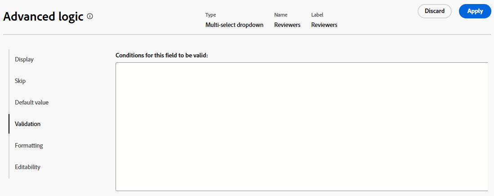

# Ajout de règles logiques aux formulaires et champs personnalisés

Les règles logiques vous permettent de personnaliser davantage les champs de votre formulaire.

Par exemple, vous pouvez afficher ou ignorer des champs ou des sections dans un formulaire personnalisé en fonction des choix effectués par un utilisateur ou une utilisatrice lors du remplissage.

>[!NOTE]
>
>La logique ne s’applique qu’à un seul formulaire et ne peut pas être basée sur les sélections d’un autre formulaire.

## Conditions d’accès

+++ Développez pour afficher les exigences d’accès aux fonctionnalités de cet article.

<table style="table-layout:auto"> 
 <col> 
 <col> 
 <tbody> 
  <tr> 
   <td>Package Adobe Workfront</td> 
   <td> <p>Pour appliquer une logique d’affichage avancé, de valeur par défaut, de mise en forme conditionnelle ou de modifiabilité : Workflow Prime ou version ultérieure.</p>
         <p>Pour appliquer tous les autres types de logiques : tout Workfront ou package de workflow</p> </td> 
  </tr> 
  <tr> 
   <td>Licence Adobe Workfront</td> 
   <td><p>Standard</p>
       <p>Plan</p></td>
  </tr> 
  <tr> 
   <td>Configurations des niveaux d’accès</td> 
   <td> <p>Accès administratif aux formulaires personnalisés</p> </td> 
  </tr>  
 </tbody> 
</table>

Pour plus d’informations, voir [Conditions d’accès dans la documentation Workfront](/help/quicksilver/administration-and-setup/add-users/access-levels-and-object-permissions/access-level-requirements-in-documentation.md).

+++

## Icônes d’indicateur logique

Les formulaires personnalisés affichent des icônes pour indiquer le moment où la logique est appliquée aux champs.

Cliquez sur **Afficher la logique** dans l’en-tête du concepteur de formulaire pour afficher ou masquer les icônes des différents types de logiques de champ.

| Icône | Définition |
| --- | --- |
|  | Le champ est le champ cible dans lequel la logique d’affichage est appliquée. Si une sélection spécifique est effectuée dans le formulaire, ce champ est affiché. |
|  | Le champ est le champ de référence de la logique d’affichage. Une sélection ou une valeur spécifique dans ce champ affiche le champ cible. |
|  | Le champ est le champ cible dans lequel la logique de saut est appliquée. Une sélection ou une valeur spécifique sur ce champ ignore les autres champs et va directement au champ de référence. |
|  | Le champ est le champ de référence pour la logique de saut. Si une sélection spécifique est effectuée sur le champ cible, le formulaire passe directement à ce champ et les champs situés entre les deux sont masqués. |
|  | Le champ est le champ cible dans lequel la logique de validation est appliquée. Une sélection ou une valeur spécifique dans le champ de référence détermine si la validation échoue. Le champ cible et le champ de référence peuvent être identiques pour la logique de validation. |
|  | Le champ est le champ de référence de la logique de validation. Une sélection ou une valeur spécifique sur ce champ détermine si la validation échoue sur le champ cible. Le champ cible et le champ de référence peuvent être identiques pour la logique de validation. |
|  | Le champ est le champ cible dans lequel la logique de valeur par défaut est appliquée. Une sélection ou une valeur spécifique dans le champ de référence détermine la valeur par défaut. Le champ cible et le champ de référence peuvent être identiques pour la logique de valeur par défaut. |
|  | Le champ est le champ de référence de la logique de valeur par défaut. Une sélection ou une valeur spécifique dans ce champ détermine la valeur par défaut dans le champ cible. Le champ cible et le champ de référence peuvent être identiques pour la logique de valeur par défaut. |
|  | Le champ est le champ cible dans lequel la logique de formatage est appliquée. Une sélection ou une valeur spécifique dans le champ de référence détermine la mise en forme. Le champ cible et le champ de référence peuvent être identiques pour la logique de formatage. |
|  | Le champ est le champ de référence pour la logique de formatage. Une sélection ou une valeur spécifique dans ce champ détermine la mise en forme dans le champ cible. Le champ cible et le champ de référence peuvent être identiques pour la logique de formatage. |
|  | Le champ est le champ cible dans lequel la logique d&#39;édition est appliquée. Le champ peut être modifiable ou en lecture seule lorsque les conditions définies sont remplies. Le champ cible et le champ de référence peuvent être identiques pour la logique de modifiabilité. |
|  | Le champ est le champ de référence de la logique d’édition. Lorsque les conditions définies sont remplies sur ce champ, la logique est appliquée au champ cible. Le champ cible et le champ de référence peuvent être identiques pour la logique de modifiabilité. |

[Icônes de logique](assets/custom-form-logic-icon-samples.png)

Pour afficher et ignorer la logique uniquement, sélectionnez un champ pour afficher les règles de logique existantes dans les paramètres du champ.


## Observations relatives à l’utilisation des logiques d’affichage et de saut

* Pour ajouter une logique d’affichage sur un champ personnalisé, un widget ou un saut de section, il faut placer au moins un champ à choix multiples (cases d’option, liste déroulante ou cases à cocher) avant celui-ci dans le formulaire.
Pour plus d’informations sur les champs personnalisés et les widgets dans les formulaires personnalisés, voir [Créer un formulaire personnalisé](/help/quicksilver/administration-and-setup/customize-workfront/create-manage-custom-forms/form-designer/design-a-form/design-a-form.md).
* Vous ne pouvez pas ajouter de logique de saut à un widget ou à un saut de section. Vous ne pouvez l’ajouter qu’à un champ à choix multiples (cases d’option, liste déroulante ou cases à cocher).
* Vous ne pouvez pas appliquer la logique d’affichage ou d’omission pour afficher ou masquer les choix d’un champ à options multiples. Par exemple, vous ne pouvez pas restreindre les choix qui s’affichent pour un champ Liste déroulante, un groupe de cases à cocher ou un champ de bouton radio, en fonction de la logique d’affichage ou d’omission d’un autre champ.
* Vous pouvez ajouter une logique d’affichage et une logique de saut à un champ personnalisé si toutes les conditions suivantes sont remplies :

   * Il s’agit d’un champ à choix multiples (cases d’option, liste déroulante ou cases à cocher).
   * Il est précédé d’un champ à choix multiples.
   * Il est suivi d’un autre champ personnalisé.

* Lorsque vous copiez des formulaires avec une logique d’affichage ou une logique de saut, celle-ci est copiée dans le nouveau formulaire personnalisé.
* Lorsque vous modifiez des objets en masse, tous les champs personnalisés s’affichent dans la zone de modification des objets, y compris les champs qui sont ignorés ou masqués.
* Gardez ce qui suit à l’esprit lorsque vous créez une règle de logique d’affichage pour un formulaire personnalisé :

   * les champs personnalisés non inclus dans une instruction de logique d’affichage s’affichent par défaut sur un formulaire personnalisé.
   * Vous pouvez créer des instructions de logique d’affichage à champs multiples.
   * Si la logique d’affichage est appliquée à tous les champs sous un saut de section et qu’ils sont tous masqués à la suite de cette logique, la section entière sera masquée dans le formulaire personnalisé.

## Ajouter une logique d’affichage à un formulaire personnalisé

La logique d’affichage définit les champs personnalisés qui apparaissent dans le formulaire lorsque l’utilisateur ou l’utilisatrice sélectionne une valeur spécifique dans un champ à choix multiple. La logique est ajoutée au champ cible, qui ne s’affiche que lorsque la valeur est sélectionnée.

>[!NOTE]
>
>Cette procédure décrit le mode de base de la logique d’affichage. Une logique d’affichage avancée est également disponible. Pour plus d’informations, voir [Ajouter une logique d’affichage avancée à un formulaire personnalisé](#add-advanced-display-logic-to-a-custom-form), dans cet article.

{{step-1-to-setup}}

1. Cliquez sur **Formulaires personnalisés**.
1. Créez un formulaire personnalisé ou ouvrez un formulaire existant. Pour plus d’informations, consultez [Création d’un formulaire personnalisé](/help/quicksilver/administration-and-setup/customize-workfront/create-manage-custom-forms/form-designer/design-a-form/design-a-form.md).
1. Ajoutez des champs au formulaire si nécessaire. Au moins un champ à choix multiple (case d’option, liste déroulante ou case à cocher) doit être placé avant le champ cible qui s’affichera.
1. Sélectionnez le champ cible et cliquez sur **Ajouter une logique**.
1. Sélectionnez l’onglet **Affichage** dans le créateur de logiques.
1. Cliquez sur **Ajouter une règle d’affichage**.

   

1. Suivez les étapes ci-dessous pour créer l’instruction logique dans le créateur.

   1. La première option consiste à choisir le champ de définition. Il s’agit du champ avec la valeur de sélection qui affiche la cible. Il doit s’agir d’un champ à choix multiple.
   1. La deuxième option consiste à choisir la valeur de sélection. Seules les valeurs déjà définies pour ce champ sont disponibles.
   1. La troisième option est **Sélectionné** ou **Non sélectionné**. Choisir **Sélectionné** signifie que lorsque la valeur est sélectionnée, le champ cible s’affiche. Choisir **Non sélectionné** signifie que lorsqu’une autre valeur est sélectionnée dans le champ de définition, le champ cible s’affiche.
   1. Pour ajouter une règle **And** à l’instruction de la logique, cliquez sur **Ajouter une règle** directement sous la règle que vous venez de créer. Suivez les mêmes instructions pour créer la règle. Toutes les règles And doivent être respectées pour que le champ cible s’affiche.

      

   1. Pour ajouter une règle **Or** à l’instruction de la logique, cliquez sur **Ajouter une règle** en bas du créateur de logique. Ensuite, cliquez sur **Ajouter une règle** dans la zone Or et suivez les mêmes instructions pour créer la règle. Lorsqu’une règle Or est respectée, le champ cible s’affiche.

1. Cliquez sur **Appliquer** lorsque vous avez fini de créer l’instruction logique.

   La logique est appliquée et les icônes de logique sont ajoutées au champ cible et au champ de référence dans le concepteur de formulaire.

## Ajouter une logique d’affichage avancée à un formulaire personnalisé

La logique d’affichage avancée des champs de formulaire personnalisés vous permet de créer une logique complexe à l’aide de formules. Vous pouvez appliquer cette logique aux types de champ suivants : texte monoligne, paragraphe, texte avec mise en forme, liste déroulante à sélection unique, liste déroulante à sélection multiple, recherche externe, recherche externe à sélection multiple, référence de champ native, saisie semi-automatique, calculé, date, groupe de cases à cocher et boutons radio.

>[!NOTE]
>
>Cette procédure décrit le mode avancé de la logique d’affichage. Une logique d’affichage de base est également disponible. Pour plus d’informations, voir [Ajouter une logique d’affichage à un formulaire personnalisé](#add-display-logic-to-a-custom-form), dans cet article.

### Exemples

Vous pouvez utiliser une logique d’affichage avancée pour contrôler la visibilité des sections de formulaire personnalisé en fonction des rôles des utilisateurs et la visibilité d’un champ en fonction du statut d’un autre champ.

Aucune logique n’est appliquée à la section par défaut du formulaire. Elle est donc toujours visible par tous les utilisateurs et utilisatrices.

Si vous utilisez la condition suivante, la section Ressources requises n’est affichée que lorsqu’un utilisateur disposant de la fonction Gestionnaire de ressources consulte le formulaire.

```IF($$USER.{roleID}="123abc", true)```

Notez que ```123abc``` représente l’ID de rôle du gestionnaire de ressources.


La même condition avec un ID de rôle différent est appliquée à la section KPI financiers du projet pour définir que seul le rôle Conseiller financier peut afficher la section.

Si vous utilisez la condition suivante, le champ KPI Vendu n’est visible qu’une fois le projet terminé. Cette logique est appliquée directement au champ plutôt qu’à une section de formulaire. Il n’est pas nécessaire de spécifier quel rôle peut afficher le champ, car cela est déjà défini dans la section dans laquelle se trouve le champ.

```IF({status}="CPL", true)```


### Définition d’une logique d’affichage avancée

{{step-1-to-setup}}

1. Cliquez sur **Formulaires personnalisés**.
1. Créez un formulaire personnalisé ou ouvrez un formulaire existant. Pour plus d’informations, consultez [Création d’un formulaire personnalisé](/help/quicksilver/administration-and-setup/customize-workfront/create-manage-custom-forms/form-designer/design-a-form/design-a-form.md).
1. Ajoutez des champs au formulaire selon vos besoins.
1. Sélectionnez le champ auquel appliquer la logique, puis cliquez sur **Ajouter une logique**.
1. Sélectionnez l’onglet **Affichage** dans le créateur de logiques.
1. Activez **Mode avancé**.

   Cette option peut être activée automatiquement pour les types de champs qui ne prennent pas en charge le mode simple de la logique d’affichage.

   

1. Créez la condition d’affichage dans l’éditeur.

   Pour plus d’informations sur les calculs et les expressions, voir [Ajouter des champs calculés à un formulaire](/help/quicksilver/administration-and-setup/customize-workfront/create-manage-custom-forms/form-designer/design-a-form/add-a-calculated-field.md) et [Présentation des expressions de données calculées](/help/quicksilver/reports-and-dashboards/reports/calc-cstm-data-reports/calculated-data-expressions.md).

1. Cliquez sur **Appliquer**.

   La logique est appliquée et les icônes de logique sont ajoutées au champ cible et au champ de référence dans le concepteur de formulaire.

   >[!NOTE]
   >
   >La logique d’affichage avancée n’est pas prise en charge dans le mode d’aperçu du créateur de formulaire.

## Ajouter une logique de saut à un formulaire personnalisé

La logique de saut définit des champs de formulaire personnalisés qui sont ignorés lorsque l’utilisateur ou l’utilisatrice sélectionne une valeur spécifique dans un champ à choix multiple. Les champs ignorés sont masqués dans le formulaire. La logique est appliquée au champ de définition dans lequel s’effectue la sélection, et non aux champs qui sont ignorés.

{{step-1-to-setup}}

1. Cliquez sur **Formulaires personnalisés**.
1. Créez un formulaire personnalisé ou ouvrez un formulaire existant. Pour plus d’informations, consultez [Création d’un formulaire personnalisé](/help/quicksilver/administration-and-setup/customize-workfront/create-manage-custom-forms/form-designer/design-a-form/design-a-form.md).
1. Ajoutez des champs au formulaire si nécessaire. Le champ définissant la logique de saut doit être un champ à choix multiple (case d’option, liste déroulante ou case à cocher).
1. Sélectionnez le champ de définition et cliquez sur **Ajouter une logique** en bas à gauche de l’écran.
1. Sélectionnez l’onglet **Ignorer** dans le créateur de logiques.
1. Cliquez sur **Ajouter une règle d’omission**.

   

1. Suivez les étapes ci-dessous pour créer l’instruction logique dans le créateur.

   1. Le champ de définition est indiqué sur le créateur. Il s’agit du champ que vous avez sélectionné pour appliquer la logique de saut.
   1. La première option consiste à choisir la valeur de sélection. Seules les valeurs déjà définies pour le champ sont disponibles.
   1. La deuxième option est **Sélectionné** ou **Non sélectionné**. Choisir **Sélectionné** signifie que lorsque la valeur est sélectionnée, le champ cible est affiché et les champs situés entre les deux sont ignorés. Choisir **Non sélectionné** signifie que lorsqu’une autre valeur est sélectionnée dans le champ de définition, le champ cible est affiché et les champs situés entre les deux sont ignorés.
   1. La troisième option est le champ cible, c’est-à-dire l’endroit où il faut accéder en ignorant les autres champs. Sélectionnez un nom de champ ou cliquez sur **Fin du formulaire**. Vous devrez peut-être cliquer sur le mot « vide » avant de sélectionner une option.

      

   1. Pour ajouter une règle **Or** à l’instruction de logique, cliquez sur **Ajouter une règle** en bas du créateur de logique. Sélectionnez ensuite les options en suivant les mêmes invites pour élaborer la règle. Lorsqu’une règle **Or** est respectée, le champ cible s’affiche.

1. Cliquez sur **Appliquer** lorsque vous avez fini de créer l’instruction logique.

   La logique est appliquée et les icônes de logique sont ajoutées au champ cible et au champ de référence dans le concepteur de formulaire.

## Ajouter une logique de valeur par défaut à un formulaire personnalisé

La logique de valeur par défaut vous permet de configurer les valeurs par défaut des champs de formulaire personnalisés à l’aide de formules. La valeur par défaut s’affiche lorsque les conditions définies sont remplies. Une valeur par défaut peut être une valeur statique ou une valeur dynamique qui fait référence à d’autres champs de l’objet . Bien que la valeur par défaut puisse référencer d’autres champs, elle ne change pas à mesure que d’autres champs du formulaire sont modifiés.

Vous pouvez appliquer une logique de valeur par défaut avancée aux types de champ suivants : texte monoligne, paragraphe, liste déroulante à sélection unique, liste déroulante à sélection multiple, recherche externe, recherche externe à sélection multiple. référence de champ natif, saisie semi-automatique, groupe de cases à cocher et boutons radio.

>[!TIP]
>
>Une valeur par défaut est appliquée une seule fois à un champ personnalisé, lorsque le formulaire personnalisé est joint à l’objet . Si la formule de valeur par défaut dépend de la valeur d’un autre champ, la valeur de l’autre champ doit déjà exister lorsque le formulaire personnalisé est joint.

>[!NOTE]
>
>La logique de valeur par défaut standard dans le concepteur de formulaire existe toujours. Si les deux types sont appliqués au même champ, la logique avancée est prioritaire. Pour plus d’informations sur la logique de valeur par défaut standard, consultez [Ajouter des boutons radio, des groupes de cases à cocher et des listes déroulantes](/help/quicksilver/administration-and-setup/customize-workfront/create-manage-custom-forms/form-designer/design-a-form/design-a-form.md#add-radio-buttons-checkbox-groups-and-drop-downs) dans [Créer un formulaire personnalisé](/help/quicksilver/administration-and-setup/customize-workfront/create-manage-custom-forms/form-designer/design-a-form/design-a-form.md).

### Exemple

À l’aide de la formule suivante, le champ déroulant à sélection multiple auquel la logique est appliquée extrait sa valeur par défaut de la description du projet lorsque le statut du projet est Planification.

```
IF({status} = 'PLN', ARRAY({description}, ','))
```

Lorsque le formulaire personnalisé est joint à un projet et que le statut du projet est Planification, la valeur du champ de description du projet est utilisée comme valeur par défaut dans le champ à sélection multiple. Comme il s’agit d’un champ à sélection multiple, plusieurs valeurs peuvent être extraites lorsque les valeurs correspondent à la description. Si la valeur de description ne correspond à aucune option à valeurs multi-sélection, le champ à sélections multiples ne comporte pas de valeur par défaut et l’utilisateur peut sélectionner une valeur dans la liste déroulante.

### Définir la logique de valeur par défaut

1. Cliquez sur **Formulaires personnalisés**.
1. Créez un formulaire personnalisé ou ouvrez un formulaire existant. Pour plus d’informations, consultez [Création d’un formulaire personnalisé](/help/quicksilver/administration-and-setup/customize-workfront/create-manage-custom-forms/form-designer/design-a-form/design-a-form.md).
1. Ajoutez des champs au formulaire selon vos besoins.
1. Sélectionnez le champ auquel appliquer la logique, puis cliquez sur **Ajouter une logique**.
1. Sélectionnez l’onglet **Valeur par défaut** dans le créateur de logiques.

   

1. Créez la condition de valeur par défaut dans l’éditeur.

   Pour plus d’informations sur les calculs et les expressions, voir [Ajouter des champs calculés à un formulaire](/help/quicksilver/administration-and-setup/customize-workfront/create-manage-custom-forms/form-designer/design-a-form/add-a-calculated-field.md) et [Présentation des expressions de données calculées](/help/quicksilver/reports-and-dashboards/reports/calc-cstm-data-reports/calculated-data-expressions.md).

1. Cliquez sur **Appliquer**.

   La logique est appliquée et les icônes de logique sont ajoutées au champ cible et au champ de référence dans le concepteur de formulaire.

   >[!NOTE]
   >
   >La logique de valeur par défaut n’est pas prise en charge dans le mode d’aperçu du créateur de formulaire.

## Ajouter une logique de validation à un formulaire personnalisé

La logique de validation est créée à l’aide de formules et vous pouvez la rendre aussi simple ou complexe que nécessaire. La validation peut être basée sur les valeurs d’autres champs ou l’état d’objets, et vous pouvez fournir un message d’erreur pour lorsque la validation échoue.

Si le champ avec la logique appliquée remplit les conditions de validation définies lorsqu’un utilisateur remplit le formulaire personnalisé, le champ est mis en surbrillance et le message d’erreur s’affiche.

Vous pouvez appliquer la logique de validation aux types de champ suivants : texte monoligne, paragraphe, liste déroulante à sélection unique, liste déroulante à sélection multiple, recherche externe, recherche externe à sélection multiple, saisie semi-automatique, date, groupe de cases à cocher et boutons radio.

### Exemples

En utilisant la condition suivante, le champ Budget affiche un message sous le champ lorsque l’utilisateur saisit une valeur qui déclenche le message. Par exemple, si la valeur saisie est négative, le premier message s’affiche. Si l’utilisateur ou l’utilisatrice tente de modifier le statut du projet sur Actuel avant de saisir une valeur de budget, le deuxième message s’affiche.

```
IF({DE:Budget Field} < 0,
     "Budget cannot be negative",
     IF({DE:Budget Field} == 0 && {status} == "CUR", "Budget must be specified before moving to Current status")
)
```

Un autre exemple simple est qu’un champ de numéro de téléphone doit contenir un certain nombre de chiffres pour être valide.

Un autre exemple de validation basée sur d’autres champs est un champ pour la taille de la salle de réunion (petite, moyenne ou grande) et un champ distinct pour le nombre de participants à la réunion. Le nombre de personnes pour chaque taille de chambre est écrit dans la formule de validation. Si le nombre de participants que l&#39;utilisateur entre est trop élevé pour la salle de réunion choisie, le message d&#39;erreur s&#39;affiche.

Pour obtenir d’autres exemples de logique de validation, voir [Exemples de logique avancée dans les formulaires personnalisés](/help/quicksilver/administration-and-setup/customize-workfront/create-manage-custom-forms/form-designer/design-a-form/advanced-logic-examples.md).

### Définition de la logique de validation

{{step-1-to-setup}}

1. Cliquez sur **Formulaires personnalisés**.
1. Créez un formulaire personnalisé ou ouvrez un formulaire existant. Pour plus d’informations, consultez [Création d’un formulaire personnalisé](/help/quicksilver/administration-and-setup/customize-workfront/create-manage-custom-forms/form-designer/design-a-form/design-a-form.md).
1. Ajoutez des champs au formulaire selon vos besoins.
1. Sélectionnez le champ auquel appliquer la logique, puis cliquez sur **Ajouter une logique**.
1. Sélectionnez l’onglet **Validation** dans le créateur de logiques.

   

1. Créez la condition de validation dans l’éditeur, y compris le message d’erreur à afficher lorsque la validation n’est pas remplie.

   Pour plus d’informations sur les calculs et les expressions, voir [Ajouter des champs calculés à un formulaire](/help/quicksilver/administration-and-setup/customize-workfront/create-manage-custom-forms/form-designer/design-a-form/add-a-calculated-field.md) et [Présentation des expressions de données calculées](/help/quicksilver/reports-and-dashboards/reports/calc-cstm-data-reports/calculated-data-expressions.md).

1. Cliquez sur **Appliquer**.

   La logique est appliquée et les icônes de logique sont ajoutées au champ cible et au champ de référence dans le concepteur de formulaire.

   >[!NOTE]
   >
   >La logique de validation n’est pas prise en charge dans le mode d’aperçu du créateur de formulaire.

## Ajouter une logique de mise en forme à un formulaire personnalisé

La logique de formatage met en surbrillance une valeur de champ lorsqu’elle remplit les conditions définies. La mise en forme appliquée fonctionne sur plusieurs champs à la fois.

Vous pouvez appliquer une logique de mise en forme aux types de champ suivants : texte monoligne, paragraphe, liste déroulante à sélection unique, liste déroulante à sélection multiple, recherche externe, recherche externe à sélection multiple, saisie semi-automatique, calculé, date, groupe de cases à cocher et boutons radio.

La mise en forme appliquée aux formulaires personnalisés est différente de celle appliquée aux listes et aux rapports. Pour plus d&#39;informations sur le formatage des rapports, voir [Utiliser le formatage conditionnel dans les vues](/help/quicksilver/reports-and-dashboards/reports/reporting-elements/use-conditional-formatting-views.md).

### Exemple

À l’aide de la condition suivante, le champ Budget apparaît en rouge lorsque l’utilisateur ou l’utilisatrice saisit une valeur de 1 000 ou plus. Le champ apparaît en jaune lorsque l’utilisateur ou l’utilisatrice saisit une valeur de 500 ou plus.

Pour ajouter une définition de mise en forme lorsque vous pointez dessus, utilisez le champ Instructions dans le formulaire personnalisé. Par exemple, un message dans le champ Budget peut indiquer « Veuillez entrer un budget dans une plage raisonnable. Les valeurs supérieures à 500 constituent un avertissement, et celles supérieures à 1 000 sont considérées comme trop élevées. »

```
IF(
     {DE:Budget Field} >=1000,
     FORMAT($$NEGATIVE),
     IF({DE:Budget Field} >= 500, FORMAT($$NOTICE))
)
```

### Définir la logique de formatage

{{step-1-to-setup}}

1. Cliquez sur **Formulaires personnalisés**.
1. Créez un formulaire personnalisé ou ouvrez un formulaire existant. Pour plus d’informations, consultez [Création d’un formulaire personnalisé](/help/quicksilver/administration-and-setup/customize-workfront/create-manage-custom-forms/form-designer/design-a-form/design-a-form.md).
1. Ajoutez des champs au formulaire selon vos besoins.
1. Sélectionnez le champ auquel appliquer la logique, puis cliquez sur **Ajouter une logique**.
1. Sélectionnez l’onglet **Formatage** dans le créateur de logiques.

   

1. Créez la condition de formatage dans l’éditeur.

   Vous pouvez ajouter jusqu’à cinq règles de mise en forme par champ.

   Les options de couleur de mise en surbrillance des champs sont les suivantes :

   * `$$POSITIVE (green)`
   * `$$INFORMATIVE (blue)`
   * `$$NEGATIVE (red)`
   * `$$NOTICE (orange)`

   Les options de formatage du texte sont les suivantes :

   * `$$BOLD`
   * `$$ITALIC`
   * `$$UNDERLINE`

   Une seule option de couleur peut être utilisée par fonction, ainsi que trois options de formatage de texte supplémentaires. Si aucune option de couleur n’est spécifiée, la couleur par défaut du système est appliquée.

   Pour plus d’informations sur les calculs et les expressions, voir [Ajouter des champs calculés à un formulaire](/help/quicksilver/administration-and-setup/customize-workfront/create-manage-custom-forms/form-designer/design-a-form/add-a-calculated-field.md) et [Présentation des expressions de données calculées](/help/quicksilver/reports-and-dashboards/reports/calc-cstm-data-reports/calculated-data-expressions.md).

1. Cliquez sur **Appliquer**.

   La logique est appliquée et les icônes de logique sont ajoutées au champ cible et au champ de référence dans le concepteur de formulaire.

   >[!NOTE]
   >
   >La logique de formatage n’est pas prise en charge dans le mode d’aperçu du créateur de formulaire.

## Ajouter une logique d’édition à un formulaire personnalisé

La logique de modifiabilité détermine si un champ de formulaire personnalisé peut être modifié ou s’il est en lecture seule. Cette logique est générée à l’aide de formules. Lorsque le champ remplit les conditions définies, il peut être défini comme modifiable ou en lecture seule.

Vous pouvez appliquer une logique d’édition aux types de champs suivants : texte monoligne, paragraphe, texte avec mise en forme, liste déroulante à sélection unique, liste déroulante à sélection multiple, recherche externe, recherche externe à sélection multiple, saisie semi-automatique, date, groupe de cases à cocher et boutons radio.

### Exemple

À l’aide de la formule suivante, le champ avec une logique appliquée n’est modifiable que lorsque le choix Activé est sélectionné pour un autre champ appelé Radio .

```
IF({DE:Radio} = "Enabled", true)
```

À l’aide de la formule suivante, le champ Description n’est modifiable que s’il est vide. Une fois qu’une valeur est saisie, elle devient en lecture seule.

```
IF(ISBLANK({DE:Description}), true)
```

À l’aide de la formule suivante, le champ avec une logique appliquée n’est modifiable que lorsqu’un utilisateur disposant de la fonction Gestionnaire de ressources affiche le formulaire.

```
IF($$USER.{role}.{name}="Resource Manager", true)
```

### Définition de la logique d’modifiabilité

{{step-1-to-setup}}

1. Cliquez sur **Formulaires personnalisés**.
1. Créez un formulaire personnalisé ou ouvrez un formulaire existant. Pour plus d’informations, consultez [Création d’un formulaire personnalisé](/help/quicksilver/administration-and-setup/customize-workfront/create-manage-custom-forms/form-designer/design-a-form/design-a-form.md).
1. Ajoutez des champs au formulaire selon vos besoins.
1. Sélectionnez le champ auquel appliquer la logique, puis cliquez sur **Ajouter une logique**.
1. Sélectionnez l’onglet **Modifiabilité** dans le créateur de logiques.

   

1. Créez la condition de modifiabilité dans l’éditeur.

   Pour plus d’informations sur les calculs et les expressions, voir [Ajouter des champs calculés à un formulaire](/help/quicksilver/administration-and-setup/customize-workfront/create-manage-custom-forms/form-designer/design-a-form/add-a-calculated-field.md) et [Présentation des expressions de données calculées](/help/quicksilver/reports-and-dashboards/reports/calc-cstm-data-reports/calculated-data-expressions.md).

1. Cliquez sur **Appliquer**.

   La logique est appliquée et les icônes de logique sont ajoutées au champ cible et au champ de référence dans le concepteur de formulaire.

   >[!NOTE]
   >
   >La logique de modifiabilité n’est pas prise en charge dans le mode Aperçu du créateur de formulaire.
