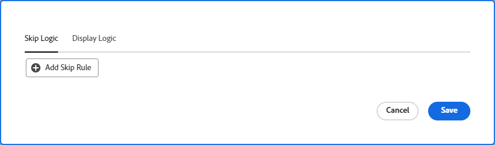
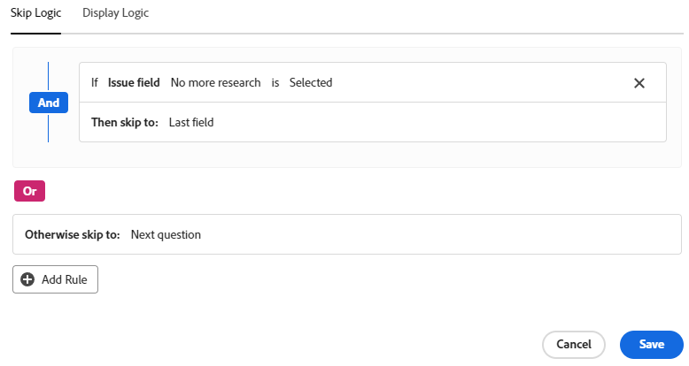

# Ajouter une logique d’affichage et ignorer la logique à un formulaire

L’utilisateur ou l’utilisatrice peut choisir quelles sections d’un formulaire personnalisé doivent être affichées ou ignorées en fonction des choix effectués lors du remplissage.

>[!NOTE]
>
>La logique ne s’applique qu’à un seul formulaire et ne peut pas être basée sur les sélections d’un autre formulaire.

## Conditions d’accès

+++ Développez pour afficher les exigences d’accès aux fonctionnalités de cet article.

Vous devez disposer des éléments suivants pour effectuer les étapes décrites dans cet article :

<table style="table-layout:auto"> 
 <col> 
 <col> 
 <tbody> 
  <tr data-mc-conditions=""> 
   <td role="rowheader">Formule Adobe Workfront </td> 
   <td>Tous</td> 
  </tr> 
  <tr> 
   <td role="rowheader">Licence Adobe Workfront</td> 
   <td>
   
Nouveau : Standard

   
ou

   
Actuel : formule
</td> 
  </tr> 
  <tr data-mc-conditions=""> 
   <td role="rowheader">Configurations des niveaux d’accès</td> 
   <td>Accès administratif aux formulaires personnalisés </td> 
  </tr>  
 </tbody> 
</table>

Pour plus de détails sur les informations contenues dans ce tableau, consultez la section [Conditions d’accès dans la documentation Workfront](/help/quicksilver/administration-and-setup/add-users/access-levels-and-object-permissions/access-level-requirements-in-documentation.md).

+++

## Icônes de logique d’affichage et de saut

Les formulaires personnalisés affichent des icônes pour indiquer la logique appliquée à certains champs. Les icônes sur un champ dans le créateur de formulaire indiquent que la logique est appliquée au champ.

| Icône | Emplacement du champ dans le créateur de formulaire | Définition |
|--- |--- |--- |
|  | En bas à gauche | Le champ est le champ cible pour la logique d’affichage. Si une sélection spécifique est effectuée dans le formulaire, ce champ est affiché. |
|  | En bas à droite | Le champ définit la logique d’affichage. Une sélection ou une valeur spécifique dans ce champ affiche le champ cible. |
|  | En bas à gauche | Le champ est le champ cible pour la logique de saut. Si une sélection spécifique est effectuée dans le formulaire, le formulaire ignore ce champ et les champs intermédiaires sont masqués. |
|  | En bas à droite | Ce champ définit la logique de saut. Une sélection ou une valeur spécifique dans ce champ permet d’ignorer les autres champs et d’accéder directement au champ cible. |

Sélectionnez un champ auquel la logique est appliquée pour afficher les règles de logique existantes dans les paramètres du champ.

## Observations relatives à l’utilisation des logiques d’affichage et de saut

* Pour ajouter une logique d’affichage sur un champ personnalisé, un widget ou un saut de section, il faut placer au moins un champ à choix multiples (cases d’option, liste déroulante ou cases à cocher) avant celui-ci dans le formulaire.
Pour plus d’informations sur les champs personnalisés et les widgets dans les formulaires personnalisés, voir [Créer un formulaire personnalisé](/help/quicksilver/administration-and-setup/customize-workfront/create-manage-custom-forms/form-designer/design-a-form/design-a-form.md).
* Vous ne pouvez pas ajouter de logique de saut à un widget ou à un saut de section. Vous ne pouvez l’ajouter qu’à un champ à choix multiples (cases d’option, liste déroulante ou cases à cocher).
* Vous ne pouvez pas appliquer la logique d’affichage ou d’omission pour afficher ou masquer les choix d’un champ à options multiples. Par exemple, vous ne pouvez pas restreindre les choix qui s’affichent pour un champ Liste déroulante, un groupe de cases à cocher ou un champ de bouton radio, en fonction de la logique d’affichage ou d’omission d’un autre champ.
* Vous pouvez ajouter une logique d’affichage et une logique de saut à un champ personnalisé si toutes les conditions suivantes sont remplies :

   * Il s’agit d’un champ à choix multiples (cases d’option, liste déroulante ou cases à cocher).
   * Il est précédé d’un champ à choix multiples.
   * Il est suivi d’un autre champ personnalisé.

* Lorsque vous copiez des formulaires avec une logique d’affichage ou une logique de saut, celle-ci est copiée dans le nouveau formulaire personnalisé.
* Lorsque vous modifiez des objets en masse, tous les champs personnalisés s’affichent dans la zone de modification des objets, y compris les champs qui sont ignorés ou masqués.
* Gardez ce qui suit à l’esprit lorsque vous créez une règle de logique d’affichage pour un formulaire personnalisé :

   * les champs personnalisés non inclus dans une instruction de logique d’affichage s’affichent par défaut sur un formulaire personnalisé.
   * Vous pouvez créer des instructions de logique d’affichage à champs multiples.
   * Si la logique d’affichage est appliquée à tous les champs sous un saut de section et qu’ils sont tous masqués à la suite de cette logique, la section entière sera masquée dans le formulaire personnalisé.

## Ajouter une logique d’affichage à un formulaire personnalisé

La logique d’affichage définit les champs personnalisés qui apparaissent dans le formulaire lorsque l’utilisateur ou l’utilisatrice sélectionne une valeur spécifique dans un champ à choix multiple. La logique est ajoutée au champ cible, qui ne s’affiche que lorsque la valeur est sélectionnée.

{{step-1-to-setup}}

1. Cliquez sur **Formulaires personnalisés**.
1. Créez un formulaire personnalisé ou ouvrez un formulaire existant. Pour plus d’informations, consultez [Création d’un formulaire personnalisé](/help/quicksilver/administration-and-setup/customize-workfront/create-manage-custom-forms/form-designer/design-a-form/design-a-form.md).
1. Ajoutez des champs au formulaire si nécessaire. Au moins un champ à choix multiple (case d’option, liste déroulante ou case à cocher) doit être placé avant le champ cible qui s’affichera.
1. Sélectionnez le champ cible et cliquez sur **Ajouter une logique** dans le coin inférieur gauche de l’écran.
1. Sélectionnez l’onglet **Logique d’affichage**.
1. Cliquez sur **Ajouter une règle d’affichage** dans le créateur de logique.

   

1. Suivez les étapes ci-dessous dans le créateur pour créer l’instruction de la logique.

   1. La première option consiste à choisir le champ de définition. Il s’agit du champ avec la valeur de sélection qui affiche la cible. Il doit s’agir d’un champ à choix multiple.
   1. La deuxième option consiste à choisir la valeur de sélection. Seules les valeurs déjà définies pour ce champ sont disponibles.
   1. La troisième option est **Sélectionné** ou **Non sélectionné**. Choisir **Sélectionné** signifie que lorsque la valeur est sélectionnée, le champ cible s’affiche. Choisir **Non sélectionné** signifie que lorsqu’une autre valeur est sélectionnée dans le champ de définition, le champ cible s’affiche.
   1. Pour ajouter une règle **And** à l’instruction de la logique, cliquez sur **Ajouter une règle** directement sous la règle que vous venez de créer. Suivez les mêmes instructions pour créer la règle. Toutes les règles And doivent être respectées pour que le champ cible s’affiche.

      

   1. Pour ajouter une règle **Or** à l’instruction de la logique, cliquez sur **Ajouter une règle** en bas du créateur de logique. Ensuite, cliquez sur **Ajouter une règle** dans la zone Or et suivez les mêmes instructions pour créer la règle. Lorsqu’une règle Or est respectée, le champ cible s’affiche.

1. Cliquez sur **Enregistrer** lorsque vous avez terminé la construction de l’instruction de la logique.

   Les icônes de logique d’affichage sont ajoutées au champ cible et au champ de définition dans le créateur de formulaire.

## Ajouter une logique de saut à un formulaire personnalisé

La logique de saut définit des champs de formulaire personnalisés qui sont ignorés lorsque l’utilisateur ou l’utilisatrice sélectionne une valeur spécifique dans un champ à choix multiple. Les champs ignorés sont masqués dans le formulaire. La logique est appliquée au champ de définition dans lequel s’effectue la sélection, et non aux champs qui sont ignorés.

{{step-1-to-setup}}

1. Cliquez sur **Formulaires personnalisés**.
1. Créez un formulaire personnalisé ou ouvrez un formulaire existant. Pour plus d’informations, consultez [Création d’un formulaire personnalisé](/help/quicksilver/administration-and-setup/customize-workfront/create-manage-custom-forms/form-designer/design-a-form/design-a-form.md).
1. Ajoutez des champs au formulaire si nécessaire. Le champ définissant la logique de saut doit être un champ à choix multiple (case d’option, liste déroulante ou case à cocher).
1. Sélectionnez le champ de définition et cliquez sur **Ajouter une logique** en bas à gauche de l’écran.
1. Sélectionnez l’onglet **Logique de saut**.
1. Cliquez sur **Ajouter une règle d’omission** dans le créateur de logique.

   

1. Suivez les étapes ci-dessous dans le créateur pour créer l’instruction de la logique.

   1. Le champ de définition est indiqué sur le créateur. Il s’agit du champ que vous avez sélectionné pour appliquer la logique de saut.
   1. La première option consiste à choisir la valeur de sélection. Seules les valeurs déjà définies pour le champ sont disponibles.
   1. La deuxième option est **Sélectionné** ou **Non sélectionné**. Choisir **Sélectionné** signifie que lorsque la valeur est sélectionnée, le champ cible est affiché et les champs situés entre les deux sont ignorés. Choisir **Non sélectionné** signifie que lorsqu’une autre valeur est sélectionnée dans le champ de définition, le champ cible est affiché et les champs situés entre les deux sont ignorés.
   1. La troisième option est le champ cible, c’est-à-dire l’endroit où il faut accéder en ignorant les autres champs. Sélectionnez un nom de champ ou cliquez sur **Fin du formulaire**. Vous devrez peut-être cliquer sur le mot « vide » avant de sélectionner une option.

      

   1. Pour ajouter une règle **Or** à l’instruction de logique, cliquez sur **Ajouter une règle** en bas du créateur de logique. Sélectionnez ensuite les options en suivant les mêmes invites pour élaborer la règle. Lorsqu’une règle **Or** est respectée, le champ cible s’affiche.

1. Cliquez sur **Enregistrer** lorsque vous avez fini de construire l’instruction de logique.

   Les icônes de logique de saut sont ajoutées au champ cible et au champ de définition dans le créateur de formulaire.

