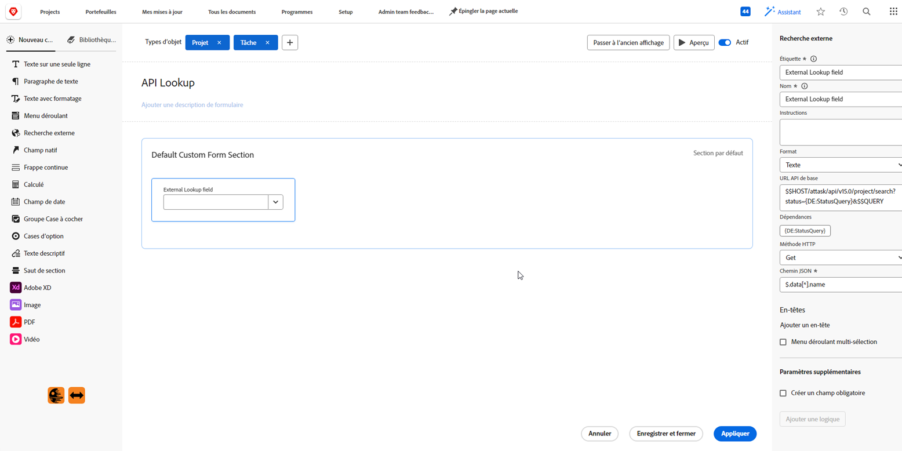
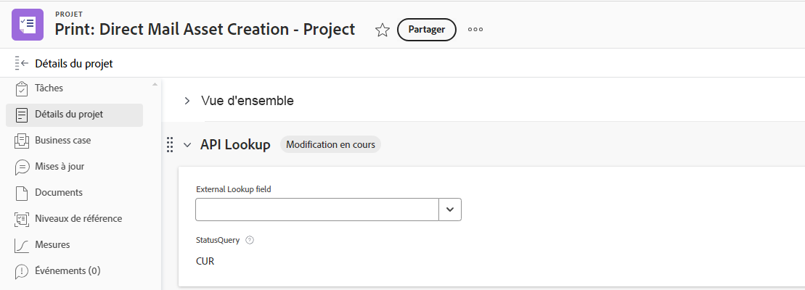

# Exemples de champ de recherche externe dans un formulaire personnalisé

Un champ de recherche externe dans un formulaire personnalisé appelle une API externe et renvoie des valeurs sous forme d’options dans un champ de liste déroulante. Les personnes qui travaillent avec l’objet auquel le formulaire personnalisé est attaché peuvent sélectionner une ou plusieurs de ces options dans la liste déroulante.

Cet article fournit des exemples d’utilisation du champ Recherche externe pour appeler la même instance de Workfront ou une API publique. Vous pouvez également utiliser la recherche externe pour communiquer avec un système externe tel que Jira, Salesforce ou ServiceNow.

Pour plus d’informations sur l’ajout d’un champ Recherche externe à un formulaire personnalisé et des définitions supplémentaires des composants de recherche externe, voir [Création d’un formulaire personnalisé](/help/quicksilver/administration-and-setup/customize-workfront/create-manage-custom-forms/form-designer/design-a-form/design-a-form.md).

## Conditions d’accès

+++ Développez pour afficher les exigences d’accès aux fonctionnalités de cet article.

<table style="table-layout:auto"> 
 <col> 
 <col> 
 <tbody> 
  <tr> 
   <td>Package Adobe Workfront</td> 
   <td>
Tous
</td> 
  </tr> 
  <tr> 
   <td>Licence Adobe Workfront</td> 
   <td>
Standard

       
Plan
</td>
  </tr> 
  <tr> 
   <td>Configurations des niveaux d’accès</td> 
   <td> 
Accès administratif aux formulaires personnalisés
 </td> 
  </tr>  
 </tbody> 
</table>

Pour plus d’informations, voir [Conditions d’accès requises dans la documentation Workfront](/help/quicksilver/administration-and-setup/add-users/access-levels-and-object-permissions/access-level-requirements-in-documentation.md).

+++

## Configurer un champ de recherche externe pour la même instance de Workfront

Vous pouvez utiliser la recherche externe pour importer les données de votre instance Workfront dans le formulaire personnalisé.

Lorsqu’une personne accède au champ dans le formulaire personnalisé, elle ne voit dans la liste des options que ce qu’elle est autorisée à voir dans Workfront. Par exemple, si vous affichez une liste de projets, l’utilisateur ne verra que les projets qui sont partagés avec lui.

### Utiliser des valeurs de champ Workfront natives dans la recherche externe

Cet exemple montre comment appeler l’API Workfront et renseigner une liste de projets dans un champ de recherche externe, filtré par statut à l’aide de la valeur du champ personnalisé « Requête de statut » et d’un terme de recherche via $$QUERY.

1. Ouvrez le formulaire personnalisé.
1. Dans la partie gauche de l’écran, recherchez **Recherche externe** et faites glisser le champ vers une section du canevas.
1. Saisissez l’**étiquette** et le **nom** pour le champ.
1. Sélectionnez le **format** pour le champ.
1. Saisissez l’appel API dans le champ **URL de l’API de base**.

   * Utilisez $$HOST pour référencer la même instance de Workfront que celle où se trouve le formulaire personnalisé.
   * Utilisez $$QUERY pour filtrer les résultats de manière dynamique en fonction des entrées utilisateur.

   **Exemple d’appel API**
   `$$HOST/attask/api/v15.0/project/search?status={DE:Status Query}&description=$$QUERY`

1. Consultez la **Dépendances** pour les champs référencés dans l’appel API.

   Un champ de dépendance peut être n’importe quel champ personnalisé ou natif disponible sur l’objet . Par exemple, lorsque vous créez un formulaire personnalisé pour des groupes qui inclut un champ de recherche externe, les champs de dépendance peuvent inclure tous les champs disponibles sur un groupe.

   Dans cet exemple, `{DE:Status Query}` sera remplacé dynamiquement par la valeur du champ personnalisé « Requête de statut » pour le groupe actuel. Ainsi, lorsque le formulaire est joint au groupe A, `{DE:Status Query}` est remplacé par la valeur définie dans le champ « Requête de statut » pour ce groupe.

1. Sélectionnez la **méthode HTTP** .

   Il s’agira le plus souvent de **Get**.

1. Saisissez le **chemin JSON** pour obtenir les résultats de votre appel API.

   **Exemple**
   `$.data[*].name`

   >[!NOTE]
   >
   >Les informations de l’**en-tête** ne sont pas nécessaires pour un appel à la même instance de Workfront.

1. Cliquez sur **Appliquer**.

   

   Lorsque le formulaire personnalisé est ajouté à un objet Workfront (dans cet exemple, un projet), il ressemble à ceci.

   

   

### Utiliser des valeurs de champ personnalisé dans la recherche externe

Cet exemple montre comment appeler l’API Workfront et importer des données d’un champ personnalisé dans votre champ de recherche externe. L’exemple de champ personnalisé s’appelle « Couleurs personnalisées ».

1. Ouvrez le formulaire personnalisé.
1. Dans la partie gauche de l’écran, recherchez **Recherche externe** et faites glisser le champ vers une section du canevas.
1. Saisissez l’**étiquette** et le **nom** pour le champ.
1. Sélectionnez le **format** pour le champ.
1. Saisissez l’appel à l’URL de l’API dans le champ **URL API de base**.

   **Exemple**
   `$$HOST/attask/api/v18.0/PORT/search?ID={portfolioID}&fields=parameterValues`

1. Consultez le site **Dépendances** pour connaître les champs auxquels ce champ de recherche fait référence dans l’API.

   Un champ de dépendance peut être n’importe quel champ personnalisé ou natif existant dans la page de détails de l’objet.

1. Sélectionnez la **méthode HTTP** .

   Il s’agira le plus souvent de **Get**.

1. Saisissez le **chemin JSON** pour obtenir les résultats de votre appel API.

   **Exemple**
   `$.data[*].parameterValues.["DE:Combo Colors"]`

   * « parameterValues » fait référence à tout champ personnalisé dans Workfront pour l’objet sur lequel vous vous trouvez.
   * Pour cet exemple, « DE:Combo Colors » est le champ personnalisé spécifique contenant les valeurs que vous souhaitez récupérer.

   >[!NOTE]
   >
   >Les informations de l’**en-tête** ne sont pas nécessaires pour un appel à la même instance de Workfront.

1. Cliquez sur **Appliquer**.

   Lorsque le formulaire personnalisé est ajouté à un objet Workfront, toutes les valeurs du champ « Couleurs de liste déroulante » apparaissent dans le menu déroulant Champ de recherche externe .

## Configurer un champ de recherche externe pour l’API Workfront Planning

Un point d’entrée est disponible dans l’API Workfront Planning pour rechercher des enregistrements par identifiant de type d’enregistrement via la méthode Get. Vous pouvez utiliser ce point d&#39;entrée pour référencer des enregistrements Planning dans des champs de recherche externe.

* **URL de l’API de base :** `$$HOST/maestro/api/v1/records/search?recordTypeId={recordTypeID}`
* **Méthode HTTP :** Get
* **Chemin JSON :** `$.records[*].data.{fieldID}`

  **{fieldID}** est le champ à afficher dans les résultats de la recherche externe sur le formulaire personnalisé pour les utilisateurs finaux.

Pour plus d&#39;informations, voir [API Workfront Planning](/help/quicksilver/planning/general/planning-api-basics.md).

## Configurer un champ de recherche externe pour une API publique

Vous pouvez utiliser la recherche externe pour appeler une API publique externe et récupérer des données.

Cet exemple montre comment appeler une API de pays (telle que <https://api.first.org/data/v1/countries>) afin de ne pas avoir à coder en dur tous les noms de pays dans les options de la liste déroulante.

1. Ouvrez le formulaire personnalisé.
1. Dans la partie gauche de l’écran, recherchez **Recherche externe** et faites glisser le champ vers une section du canevas.
1. Saisissez l’**étiquette** et le **nom** pour le champ.
1. Sélectionnez le **format** pour le champ.
1. Saisissez l’appel à l’URL de l’API dans le champ **URL API de base**.

   * Vous pouvez ajouter $$QUERY pour mettre en œuvre le filtrage des requêtes pour vos utilisateurs finaux et utilisatrices finales.

   **Exemples**
Liste de tous les pays : <https://api.first.org/data/v1/countries>

   Permet de rechercher n’importe quel pays dans le champ déroulant : <https://api.first.org/data/v1/countries?q=$$QUERY>

   Permet de rechercher un pays dans une région : <https://api.first.org/data/v1/countries?region={DE:Region}&q=$$QUERY>

   * Les régions disponibles sont définies dans un champ personnalisé distinct dans Workfront.
   * Lorsque l’utilisateur sélectionne une région dans le formulaire, le champ Recherche externe affiche uniquement les pays de cette région (le pays se trouvant dans la région définie dans l’API). La personne peut également rechercher un pays dans la région sélectionnée.

1. Consultez le site **Dépendances** pour connaître les champs auxquels ce champ de recherche fait référence dans l’API.

   Un champ de dépendance peut être n’importe quel champ personnalisé ou natif existant dans la page de détails de l’objet.

   Dans cet exemple, l’élément `{DE:Region}` sera remplacé par la valeur du champ personnalisé Zone géographique.

1. Sélectionnez la **méthode HTTP**.

   Il s’agira le plus souvent de **Get**.

1. Saisissez le **chemin JSON** pour obtenir les résultats de votre appel API.

   Cette option permet d’extraire des données du JSON renvoyé par l’URL de l’API. Elle permet de sélectionner les valeurs du JSON qui apparaîtront dans les options de la liste déroulante.

   **Exemple**
   `$.data[*].country`

1. (Facultatif) Cliquez sur **Ajouter un en-tête**, et saisissez ou collez la paire clé-valeur requise pour l’authentification avec l’API.

   >[!NOTE]
   >
   >Les champs de l’en-tête ne sont pas un endroit sûr pour stocker des informations d’identification, et vous devez faire attention à ce que vous saisissez et enregistrez.

1. (Facultatif) Sélectionnez **Menu déroulant multi-sélection** pour permettre à la personne de sélectionner plusieurs valeurs dans la liste déroulante.

1. Cliquez sur **Appliquer**.

   

   Lorsque le formulaire personnalisé est ajouté à un objet Workfront (dans cet exemple, un projet), il ressemble à ceci.

   

   

## Cas d’utilisation supplémentaires pour les champs de recherche externe

Il existe de nombreux autres cas d’utilisation pour créer une recherche externe.

**Cas d’utilisation :** remplacez les champs de saisie semi-automatique, car ils peuvent entraîner des problèmes de création de rapports.
**Solution :** utilisez un appel API vers les objets existants du système.

Exemple d’URL d’API de base pour les modèles, pour remplacer un champ de saisie semi-automatique :
`$$HOST/attask/api/v17.0/tmpl/search?isActive=true&name_Sort=asc`

**Cas d’utilisation :** créer des champs de liste déroulante avec d’autres fonctionnalités (par exemple, le champ Recherche externe contient un retour à la ligne).
**Solution :** utilisez un appel API aux objets existants dans le système ou créez un objet et utilisez un appel API à cet objet.

**Cas d’utilisation :** permet aux utilisateurs de conserver leurs propres champs en dehors de la zone des formulaires personnalisés. Configurez le champ Recherche externe pour pouvoir donner aux utilisateurs les objets qui composent le champ. Cette option est idéale pour les champs et les équipes à maintenance élevée.
**Solution :** créez un objet et utilisez un appel API vers cet objet.

**Cas pratique :** intégration à des objets situés en dehors de Workfront. Par exemple, l’accès à un autre système pour obtenir le nom de chaque utilisateur ou utilisatrice, plutôt que d’être limité dans un champ de saisie semi-automatique.
**Solution :** l’automatisation Webhook/Fusion pour se connecter à d’autres systèmes.

