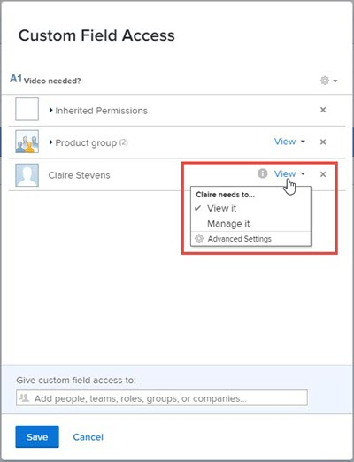

# Configuration du partage de champs et de widgets personnalisés avec le concepteur de formulaires

Par défaut, lorsque vous ajoutez un nouveau champ ou widget personnalisé à un formulaire personnalisé, toute personne du système ayant accès à des formulaires personnalisés peut modifier les propriétés de cet élément, telles que son libellé et son nom. Vous pouvez modifier ce paramètre en contrôlant avec qui il peut être partagé.

Pour plus d’informations sur les champs personnalisés et les widgets dans les formulaires personnalisés, voir [Concevoir un formulaire avec le concepteur de formulaires](/help/quicksilver/administration-and-setup/customize-workfront/create-manage-custom-forms/form-designer/design-a-form/design-a-form.md).

## Conditions d’accès

Les étapes de cet article doivent être les suivantes :

<table style="table-layout:auto"> 
 <col> 
 <col> 
 <tbody> 
  <tr data-mc-conditions=""> 
   <td role="rowheader"> 
Forfait Adobe Workfront
 </td> 
   <td>N’importe quelle</td> 
  </tr> 
  <tr> 
   <td role="rowheader">Licence Adobe Workfront</td> 
   <td>
   
Nouveau : Standard

   
ou

   
Actuel : formule
</td>
  </tr> 
  <tr data-mc-conditions=""> 
   <td role="rowheader">Configurations du niveau d’accès</td> 
   <td> 
Accès administratif aux formulaires personnalisés
 </td> 
  </tr> 
 </tbody> 
</table>

Pour plus d’informations sur ce tableau, consultez [Conditions d’accès requises dans la documentation Workfront](/help/quicksilver/administration-and-setup/add-users/access-levels-and-object-permissions/access-level-requirements-in-documentation.md).

## Configuration du partage d’un champ ou d’un widget personnalisé à partir de la liste des formulaires

{{step-1-to-setup}}

1. Dans le panneau de gauche, cliquez sur **Forms personnalisée**.
1. Cliquez sur **Champs** pour ouvrir la zone Champs .
1. Sélectionnez l’élément pour lequel vous souhaitez configurer le partage, puis cliquez sur .
1. Dans la zone Accès aux champs personnalisés qui s’affiche, indiquez avec qui partager l’élément et comment le partager :

   1. Près du coin inférieur gauche du **Accès aux champs personnalisés** sous **Autoriser l’accès aux champs personnalisés**, commencez à saisir le nom d’un utilisateur, d’une équipe, d’un rôle de tâche, d’un groupe ou d’une société avec lequel vous souhaitez partager l’élément, puis cliquez sur le nom lorsqu’il apparaît.

      

   1. Si vous souhaitez être plus précis sur la manière dont vous souhaitez partager l’élément, cliquez sur la liste déroulante à droite du nom, puis utilisez l’une des options suivantes :

      

      <table style="table-layout:auto"> 
       <col> 
       <col> 
       <tbody> 
        <tr> 
         <td role="rowheader">L'afficher</td> 
         <td> 
Cliquez sur <strong>Paramètres avancés</strong> pour indiquer si vous souhaitez que l’utilisateur ou les utilisateurs puissent utiliser leur accès pour ajouter l’élément à un formulaire personnalisé ou le partager avec d’autres utilisateurs.
 </td> 
        </tr> 
        <tr> 
         <td role="rowheader">Le gérer</td> 
         <td> 
Permet d’accéder à la modification du champ personnalisé et de l’afficher dans la bibliothèque de champs et sur la page sur laquelle vous créez des formulaires personnalisés.
 
Cliquez sur <strong>Paramètres avancés</strong> pour indiquer si vous souhaitez que l’utilisateur ou les utilisateurs puissent utiliser leur accès pour supprimer l’élément du système ou le partager avec d’autres utilisateurs.
 </td> 
        </tr> 
       </tbody> 
      </table>

1. (Facultatif) Répétez l’étape précédente pour ajouter d’autres noms à la liste et configurer leurs options.
1. (Facultatif) Cliquez sur l’icône d’engrenage  dans le coin supérieur droit si vous souhaitez choisir une option de partage à l’échelle du système pour le champ .

   Toutes les options suivantes ne s’affichent pas simultanément dans ce menu déroulant. Par exemple, la seconde s’affiche uniquement lorsque l’une des deux autres est sélectionnée.

   * **Rendre cette modification possible à l’échelle du système afin que tous les utilisateurs de Workfront puissent la modifier.** (option par défaut)

     Lorsque vous ajoutez un champ ou un widget personnalisé et que vous ne limitez pas le partage, tous les utilisateurs du système ayant accès à des formulaires personnalisés peuvent le consulter et modifier ses propriétés.

   * **Suppression de l’accès de modification à l’échelle du système**

     Limite l’accès à ceux que vous avez ajoutés à la liste.

   * **rendre visible à l’échelle du système afin que tous les utilisateurs de Workfront puissent le voir ;**

1. Cliquer sur **Enregistrer**.

## Configuration du partage d’un champ ou d’un widget personnalisé à partir du concepteur de formulaires

{{step-1-to-setup}}

1. Dans le panneau de gauche, cliquez sur **Forms personnalisée**.
1. Ouvrez un formulaire personnalisé ou créez un formulaire personnalisé.
1. Dans le concepteur de formulaires, sélectionnez l’élément pour lequel vous souhaitez configurer le partage, puis cliquez sur **Partager** dans la zone d’édition du champ à droite.
1. Dans la zone qui s’affiche, sous **Accorder l’accès à un formulaire personnalisé à**, commencez à saisir le nom de l’utilisateur, de l’équipe, du rôle de tâche, du groupe ou de la société avec lequel vous souhaitez partager l’élément, puis appuyez sur **Entrée** lorsque le nom s’affiche.
1. Si vous souhaitez être plus précis sur la manière dont vous partagez l’élément, cliquez sur le menu déroulant à droite du nom, puis utilisez l’une des options suivantes :

   <table style="table-layout:auto"> 
    <col> 
    <col> 
      <tbody> 
       <tr> 
        <td role="rowheader">L'afficher</td> 
        <td> 
Cliquez sur <strong>Paramètres avancés</strong> pour indiquer si vous souhaitez que les utilisateurs puissent ajouter l’élément à un formulaire personnalisé ou le partager avec d’autres utilisateurs.
 </td> 
       </tr> 
       <tr> 
        <td role="rowheader">Le gérer</td> 
        <td> 
Permet d’accéder à la modification du champ personnalisé et de l’afficher dans la bibliothèque de champs et dans le concepteur de formulaires.
 
Cliquez sur <strong>Paramètres avancés</strong> pour indiquer si vous souhaitez que les utilisateurs puissent supprimer l’élément du système ou le partager avec d’autres utilisateurs.
 </td> 
       </tr> 
     </tbody> 
    </table>

1. (Facultatif) Répétez les étapes 5 à 6 pour ajouter d’autres noms à la liste et configurer leurs options.
1. (Facultatif) Choisissez une option de partage à l’échelle du système pour le champ :

   * **Tout le monde dans le système peut modifier** (option par défaut)

     Lorsque vous ajoutez un champ ou un widget personnalisé et que vous ne limitez pas le partage, tous les utilisateurs du système ayant accès à des formulaires personnalisés peuvent le consulter et modifier ses propriétés.

   * **Tout le monde dans le système peut voir**
   * **Seules les personnes invitées peuvent accéder à**

     Limite l’accès à ceux que vous avez ajoutés à la liste.

   

1. Cliquer sur **Enregistrer**.

## Accès hérité aux champs et widgets personnalisés lorsqu’un formulaire personnalisé est partagé

Lorsqu’une personne partage un formulaire personnalisé avec un groupe, un rôle de tâche, une équipe ou une entreprise, les destinataires héritent de l’option Afficher l’accès à tous les champs et widgets personnalisés du formulaire. Ce niveau d’accès à ces éléments du formulaire est toujours conservé afin que le formulaire puisse fonctionner pour les destinataires comme l’a prévu la personne qui l’a créé. C’est le cas même pour les destinataires disposant de l’accès Modifier au formulaire.

Vous pouvez déterminer qui a hérité de l’accès à un champ ou à un widget personnalisé et vous pouvez en supprimer l’accès.

>[!NOTE]
>
>Si un destinataire dispose de l’option Gérer l’accès à un champ ou à un widget personnalisé sur le formulaire personnalisé partagé, cet accès est conservé pour le destinataire.

### Découvrez qui a hérité de l’accès à un champ ou à un widget personnalisé {#find-out-who-has-inherited-access-to-a-custom-field-or-widget}

{{step-1-to-setup}}

1. Dans le panneau de gauche, cliquez sur **Forms personnalisée**.
1. Cliquez sur **Champs**, puis sélectionnez le champ, l’image ou le widget d’accès.
1. Dans la zone qui s’affiche, cliquez sur **Autorisations héritées** et afficher les noms qui s’affichent.
1. Cliquez sur **Annuler**.

### Supprimer l’accès à un champ ou à un widget personnalisé dans un formulaire personnalisé qui a été partagé {#remove-access-to-a-custom-field-or-widget-in-a-custom-form-that-was-shared}

Si vous devez supprimer l’accès à un champ ou à un widget personnalisé dans un formulaire personnalisé qui a été partagé, vous devez annuler le partage du formulaire. Pour obtenir des instructions, reportez-vous à la section [Supprimer l’accès à un formulaire personnalisé](/help/quicksilver/administration-and-setup/customize-workfront/create-manage-custom-forms/share-access-to-a-custom-form.md#remove-access-to-a-custom-form-from-the-list-of-forms) dans l’article [Partage d’un formulaire personnalisé](/help/quicksilver/administration-and-setup/customize-workfront/create-manage-custom-forms/share-access-to-a-custom-form.md).
