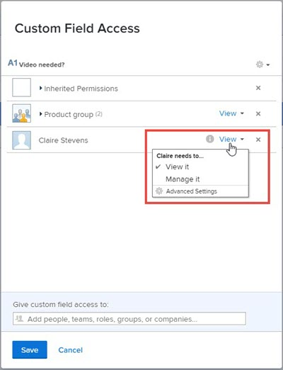
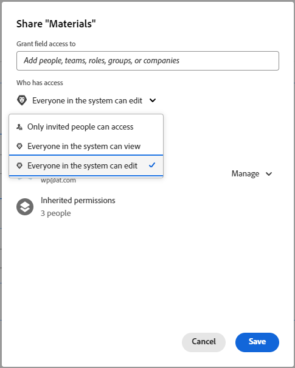

# Configuration du partage de champs et de widgets personnalisés

Par défaut, lorsque vous ajoutez un nouveau champ personnalisé ou widget à un formulaire personnalisé, toute personne dans le système ayant accès aux formulaires personnalisés peut modifier les propriétés de cet élément, telles que son libellé et son nom. Vous pouvez modifier ce paramètre en contrôlant avec qui l’information peut être partagée.

Pour plus d’informations sur les champs personnalisés et les widgets dans les formulaires personnalisés, voir [Créer un formulaire personnalisé](/help/quicksilver/administration-and-setup/customize-workfront/create-manage-custom-forms/form-designer/design-a-form/design-a-form.md).

## Conditions d’accès

+++ Développez pour afficher les exigences d’accès aux fonctionnalités de cet article.

<table style="table-layout:auto"> 
 <col> 
 <col> 
 <tbody> 
  <tr> 
   <td>Package Adobe Workfront</td> 
   <td>
Tous
</td> 
  </tr> 
  <tr> 
   <td>Licence Adobe Workfront</td> 
   <td>
Standard

       
Plan
</td>
  </tr> 
  <tr> 
   <td>Configurations des niveaux d’accès</td> 
   <td> 
Accès administratif aux formulaires personnalisés
 </td> 
  </tr>  
 </tbody> 
</table>

Pour plus d’informations, voir [Conditions d’accès dans la documentation Workfront](/help/quicksilver/administration-and-setup/add-users/access-levels-and-object-permissions/access-level-requirements-in-documentation.md).

+++

<!--

## Configure sharing a custom field or widget from the list of forms

{{step-1-to-setup}}

1. In the left panel, click **Custom Forms**.
1. Click **Fields** to open the Fields area.
1. Select the item you want to configure sharing for, then click .
1. In the Custom Field Access box that displays, specify who you want to share the item with and how you want to share it:

   1. Near the lower-left corner of the **Custom Field Access** box, under **Give custom field access to**, start typing the name of a user, team, job role, group, or company you want to share the item with, then click the name when it appears.

      

   1. If you want to be more specific about how you want to share the item, click the drop-down list to the right of the name, then use any of the following options:

      

      <table style="table-layout:auto"> 
       <col> 
       <col> 
       <tbody> 
        <tr> 
         <td role="rowheader">View it</td> 
         <td> 
You can click <strong>Advanced Settings</strong> to specify whether you want the user or users to be able to use their access to add the item to a custom form or share it with other users.
 </td> 
        </tr> 
        <tr> 
         <td role="rowheader">Manage it</td> 
         <td> 
Allows access to edit the custom field and to see it in the Field Library and on the page where you build custom forms.
 
You can click <strong>Advanced Settings</strong> to specify whether you want the user or users to be able to use their access to delete the item from the system or share it with other users.
 </td> 
        </tr> 
       </tbody> 
      </table>   

1. (Optional) Repeat the previous step to add other names to the list and configure their options.
1. (Optional) Click the gear icon  in the top-right corner if you want to choose a system-wide sharing option for the field.

   Not all of the following options display in this drop-down menu at the same time. For example, the second one displays only when one of the other two are selected.

   * **Make this editable system-wide so that everyone in Workfront can edit it** (the default option)

     When you add a custom field or widget and you don't limit sharing for it, everyone in the system who has access to custom forms can view it and edit its properties.
   
   * **Remove system-wide edit access**

     Limits access to only those whom you added to the list. 
   
   * **Make this visible system-wide so that everyone in Workfront can see it**

1. Click **Save**.

-->

## Configuration du partage d’un champ ou d’un widget personnalisé

{{step-1-to-setup}}

1. Dans le panneau de gauche, cliquez sur **Formulaires personnalisés**.
1. Pour partager depuis la liste des formulaires et champs :

   1. Cliquez sur **Champs** pour ouvrir la zone Champs.
   1. Sélectionnez le champ à partager, puis cliquez sur .

1. Pour partager à partir du concepteur de formulaire :
   1. Ouvrez un formulaire personnalisé ou créez un formulaire personnalisé.
   1. Dans le concepteur de formulaire, sélectionnez le champ à partager, puis cliquez sur **Partager** dans la zone d’édition du champ à droite.

1. Dans la zone de partage, sous **Accorder l’accès au champ à**, commencez à saisir le nom de l’utilisateur, de l’équipe, de la fonction, du groupe, de la société ou du profil professionnel avec lequel vous souhaitez partager l’élément, puis appuyez sur **Entrée** lorsque le nom s’affiche.
1. Si vous souhaitez être plus précis sur la manière de partager l’élément, cliquez sur le menu déroulant à droite du nom, puis utilisez l’une des options suivantes :

   * **Afficher** : cliquez sur l’icône **Paramètres avancés**  pour indiquer si vous souhaitez que les utilisateurs puissent ajouter l’élément à un formulaire personnalisé ou le partager avec d’autres utilisateurs.
   * **Gérer** : permet d’accéder à la modification du champ personnalisé et de le voir à la fois dans la bibliothèque de champs et dans le concepteur de formulaire. Cliquez sur l’icône **Paramètres avancés**  pour indiquer si vous souhaitez que les utilisateurs puissent supprimer l’élément du système ou le partager avec d’autres utilisateurs.

1. (Facultatif) Répétez les étapes 5 et 6 pour ajouter d’autres noms à la liste et configurer leurs options.
1. (Facultatif) Choisissez une option de partage à l’échelle du système pour le champ :

   * **Tout le monde peut modifier dans le système** (option par défaut)

     Lorsque vous ajoutez un champ personnalisé ou un widget et que vous n’en limitez pas le partage, tous les utilisateurs et utilisatrices du système qui ont accès aux formulaires personnalisés peuvent le voir et modifier ses propriétés.

   * **Tout le monde peut voir**

     Toute personne du système ayant accès aux formulaires personnalisés peut afficher le champ mais ne peut pas le modifier.

   * **Seules les personnes invitées peuvent y accéder**

     Limite l’accès aux seuls éléments que vous avez ajoutés à la liste.

   

1. Cliquer sur **Enregistrer**.

## Accès hérité aux champs personnalisés et aux widgets lorsqu’un formulaire personnalisé est partagé.

Lorsqu’une personne partage un formulaire personnalisé avec un groupe, une fonction, une équipe, une entreprise ou un profil d’entreprise, les destinataires héritent d’un accès en lecture seule à tous les champs et widgets personnalisés figurant dans le formulaire. Ce niveau d’accès à ces éléments du formulaire est toujours conservé afin que le formulaire puisse fonctionner pour les personnes destinataires comme prévu par la personne qui l’a créé. Ceci est également valable pour les personnes destinataires qui disposent d’un accès Modifier au formulaire.

Vous pouvez savoir qui dispose d’un accès hérité à un champ personnalisé ou à un widget et vous pouvez supprimer cet accès.

>[!NOTE]
>
>Si une personne destinataire dispose d’un accès en gestion à un champ personnalisé ou à un widget sur le formulaire personnalisé partagé, cet accès est conservé pour la personne destinataire.

### Connaître les personnes disposant d’un accès hérité à un champ personnalisé ou à un widget {#find-out-who-has-inherited-access-to-a-custom-field-or-widget}

{{step-1-to-setup}}

1. Dans le panneau de gauche, cliquez sur **Formulaires personnalisés**.
1. Cliquez sur **Champs**, puis sélectionnez le champ, l’image ou le widget d’accès.
1. Dans la zone qui s’affiche, cliquez sur **Anciennes autorisations** et consultez les noms qui s’affichent.
1. Cliquez sur **Annuler**.

### Supprimer l’accès à un champ personnalisé ou à un widget dans un formulaire personnalisé qui a été partagé. {#remove-access-to-a-custom-field-or-widget-in-a-custom-form-that-was-shared}

Si vous devez supprimer l’accès à un champ personnalisé ou à un widget dans un formulaire personnalisé qui a été partagé, vous devez annuler le partage du formulaire. Pour plus d’informations, consultez la section [Supprimer l’accès à un formulaire personnalisé](/help/quicksilver/administration-and-setup/customize-workfront/create-manage-custom-forms/share-access-to-a-custom-form.md#remove-access-to-a-custom-form) dans l’article [Partager un formulaire personnalisé](/help/quicksilver/administration-and-setup/customize-workfront/create-manage-custom-forms/share-access-to-a-custom-form.md).

