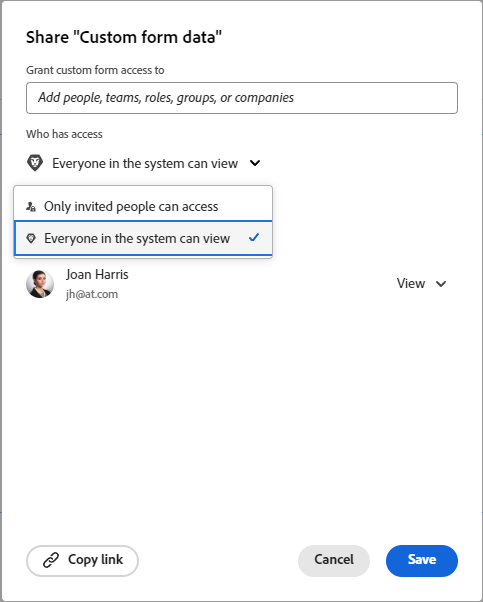

# Partager un formulaire personnalisé

Vous pouvez configurer l’accès à un formulaire personnalisé pour contrôler qui (personne, rôle, groupe, équipe, entreprise) peut l’afficher, le partager et le modifier.

## Conditions d’accès

+++ Développez pour afficher les exigences d’accès aux fonctionnalités de cet article.

Vous devez disposer des éléments suivants pour effectuer les étapes décrites dans cet article :

<table style="table-layout:auto"> 
 <col> 
 <col> 
 <tbody> 
  <tr data-mc-conditions=""> 
   <td role="rowheader"> 
Forfait Adobe Workfront
 </td> 
   <td>N’importe quelle</td> 
  </tr> 
  <tr> 
   <td role="rowheader">Licence Adobe Workfront</td> 
   <td>
   
Nouvelle : standard

   
ou

   
Actuelle : formule
</td>
  </tr> 
  <tr data-mc-conditions=""> 
   <td role="rowheader">Configurations du niveau d’accès</td> 
   <td> 
Accès administratif aux formulaires personnalisés
 </td> 
  </tr> 
 </tbody> 
</table>

Pour plus d’informations sur ce tableau, consultez [Conditions d’accès requises dans la documentation Workfront](/help/quicksilver/administration-and-setup/add-users/access-levels-and-object-permissions/access-level-requirements-in-documentation.md).

+++

## Accéder aux formulaires personnalisés {#access-to-custom-forms}

Par défaut, lorsque vous créez un formulaire personnalisé et qu’une personne le joint à un objet, toute personne affectée à l’objet peut afficher et remplir le formulaire. Cela inclut les utilisateurs et utilisatrices disposant de licences de demande et les utilisateurs et utilisatrices externes.

Cependant, sur un objet pour lequel le formulaire personnalisé n’est pas déjà joint, un utilisateur ou une utilisatrice (même s’il dispose d’un niveau d’accès Planificateur ou planificatrice) ne peut pas le joindre à partir du menu déroulant Formulaires personnalisés, sauf si l’une des conditions suivantes est remplie :

* Une personne a partagé le formulaire personnalisé avec l’utilisateur ou l’utilisatrice ou avec son équipe, sa fonction, son groupe ou son entreprise, en accordant au moins des autorisations d’affichage avec l’option Joindre aux données personnalisées sélectionnée.
* L’utilisateur ou l’utilisatrice dispose d’une licence de plan et son niveau d’accès permet l’accès administratif aux formulaires personnalisés.

## Partager un formulaire personnalisé à partir de la liste des formulaires

Plutôt que de laisser un formulaire personnalisé au statut de partage par défaut (décrit à la section [Accéder aux formulaires personnalisés](#access-to-custom-forms) de cet article), configurez des niveaux d’accès spécifiques au formulaire pour certaines personnes, fonctions, groupes, équipes et entreprises.

{{step-1-to-setup}}

1. Dans le panneau de gauche, cliquez sur **Formulaires personnalisés**.
1. Sélectionnez le formulaire personnalisé, puis cliquez sur l’.
1. Dans la zone qui s’affiche, sous **Accorder l’accès à un formulaire personnalisé**, commencez à saisir le nom de la personne, de l’équipe, de la fonction, du groupe ou de l’entreprise avec lequel vous souhaitez partager le formulaire personnalisé, puis appuyez sur **Entrée** lorsque le nom s’affiche.
1. Pour ajuster l’accès de la personne, de l’équipe, de la fonction, du groupe ou de l’entreprise que vous venez d’ajouter, cliquez sur le menu déroulant à droite du nom, puis configurez l’une des options disponibles suivantes, ainsi que l’un de ses paramètres avancés :

   <table style="table-layout:auto"> 
    <col> 
    <col> 
    <tbody> 
     <tr> 
      <td role="rowheader">L’afficher</td> 
      <td> 
Possibilité d’afficher et de remplir le formulaire personnalisé sur les objets
 
<b>NOTE</b> : pour les titulaires d’une licence Contribution et Light (ou travail, révision et demande), il s’agit de l’option la plus élevée disponible.
 
Cliquez sur <strong>Paramètres avancés</strong> pour indiquer si vous souhaitez autoriser les éléments suivants :
 
       <ul> 
        <li><strong>Joindre à des données personnalisées</strong> : possibilité de joindre un formulaire personnalisé aux projets, tâches et problèmes pour lesquels les personnes disposent d’autorisations de gestion.</li> 
        <li> 
<strong>Partager</strong> : possibilité de partager le formulaire personnalisé avec d’autres personnes du système.
 
Les titulaires d’une licence Contribution ou Light (ou travail, révision ou demande) peuvent partager un formulaire personnalisé uniquement par le biais de l’API ou d’un rapport de formulaires personnalisés.
 </li>
       </ul> </td> 
     </tr> 
     <tr> 
      <td role="rowheader">Le gérer</td> 
      <td> 
Disponible uniquement pour les personnes titulaires d’une licence de plan ou standard. 
 
En plus de pouvoir ajouter le formulaire aux objets pour lesquels ils disposent d’un accès en modification, les personnes peuvent également modifier entièrement le formulaire personnalisé, y compris ajouter, modifier et supprimer des champs.
 
Cliquez sur <strong>Paramètres avancés</strong> pour indiquer si vous souhaitez autoriser les éléments suivants :
 
       <ul> 
        <li> 
<strong>Joindre à des données personnalisées</strong> : possibilité de joindre un formulaire personnalisé aux projets, tâches et problèmes pour lesquels les personnes disposent d’autorisations de gestion.
 </li> 
        <li><strong>Supprimer</strong> : supprime le formulaire personnalisé du système.</li> 
        <li><strong>Partager</strong> : partage du formulaire personnalisé avec d’autres personnes du système.</li> 
       </ul> </td> 
     </tr> 
    </tbody> 
   </table>

1. (Facultatif) Répétez les étapes 4 à 5 pour ajouter d’autres noms à la liste et configurer leurs options.
1. (Facultatif) Si vous souhaitez limiter l’accès au formulaire personnalisé (sur les objets auxquels il est associé) aux personnes que vous avez spécifiées aux étapes précédentes, cliquez sur l’icône d’engrenage  dans le coin supérieur droit de la boîte de partage, puis cliquez sur **Supprimer l’accès à l’échelle du système**.

   Si vous changez d’avis, vous pouvez cliquer sur **Rendre cet élément visible à l’échelle du système** (option par défaut).

   >[!NOTE]
   >
   >* Lorsque vous affichez un formulaire personnalisé sur tout le système, vous autorisez uniquement les personnes à le consulter et à le remplir sur les objets auxquels ils sont affectés, et non à le joindre à d’autres objets. Vous pouvez accorder la possibilité de joindre le formulaire personnalisé à des objets à l’aide de l’option « Joindre aux données personnalisées », décrite à l’étape 5.
   >* La plupart des entreprises souhaitent s’assurer que toutes les personnes du système peuvent remplir un formulaire personnalisé lorsqu’il est joint aux objets sur lesquels ils travaillent et afficher ses données dans les rapports. Si votre entreprise et concernée, nous vous recommandons d’activer l’option **Rendre cet élément visible à l’échelle du système**. Lorsque l’option est configurée de cette manière, « Visible sur tout le système » s’affiche dans la boîte de dialogue :
   >   
   >
   >   
   >Si la confidentialité d’un formulaire personnalisé vous préoccupe, dans lequel les personnes peuvent saisir des données sensibles lorsqu’il est joint à certains objets, limitez le partage de ces *objets* plutôt que l’accès au formulaire lui-même.

1. Cliquer sur **Enregistrer**.

## Partager un formulaire personnalisé à partir du créateur de formulaire

{{step-1-to-setup}}

1. Dans le panneau de gauche, cliquez sur **Formulaires personnalisés**.
1. Ouvrez un formulaire personnalisé ou créez un formulaire personnalisé.
1. Cliquez sur **Partager** en haut à droite du créateur de formulaire lorsque le formulaire est prêt à être partagé.
1. Dans la zone qui s’affiche, sous **Accorder l’accès à un formulaire personnalisé**, commencez à saisir le nom de la personne, de l’équipe, de la fonction, du groupe ou de l’entreprise avec lequel vous souhaitez partager le formulaire personnalisé, puis appuyez sur **Entrée** lorsque le nom s’affiche.
1. Pour ajuster l’accès de la personne, de l’équipe, de la fonction, du groupe ou de l’entreprise que vous venez d’ajouter, cliquez sur le menu déroulant à droite du nom, puis configurez l’une des options disponibles suivantes, ainsi que l’un de ses paramètres avancés :

   <table style="table-layout:auto"> 
    <col> 
    <col> 
    <tbody> 
     <tr> 
      <td role="rowheader">L’afficher</td> 
      <td> 
Possibilité d’afficher et de remplir le formulaire personnalisé sur les objets
 
<b>NOTE</b> : pour les titulaires d’une licence Contribution et Light (ou travail, révision et demande), il s’agit de l’option la plus élevée disponible.
 
Cliquez sur <strong>Paramètres avancés</strong> pour indiquer si vous souhaitez autoriser les éléments suivants :
 
       <ul> 
        <li><strong>Joindre à des données personnalisées</strong> : possibilité de joindre un formulaire personnalisé aux projets, tâches et problèmes pour lesquels les personnes disposent d’autorisations de gestion.</li> 
        <li> 
<strong>Partager</strong> : possibilité de partager le formulaire personnalisé avec d’autres personnes du système.
 
Les titulaires d’une licence Contribution ou Light (ou travail, révision ou demande) peuvent partager un formulaire personnalisé uniquement par le biais de l’API ou d’un rapport de formulaires personnalisés.
 </li>
       </ul> </td> 
     </tr> 
     <tr> 
      <td role="rowheader">Le gérer</td> 
      <td> 
Disponible uniquement pour les personnes titulaires d’une licence de plan ou standard. 
 
En plus de pouvoir ajouter le formulaire aux objets pour lesquels ils disposent d’un accès en modification, les personnes peuvent également modifier entièrement le formulaire personnalisé, y compris ajouter, modifier et supprimer des champs.
 
Cliquez sur <strong>Paramètres avancés</strong> pour indiquer si vous souhaitez autoriser les éléments suivants :
 
       <ul> 
        <li> 
<strong>Joindre à des données personnalisées</strong> : possibilité de joindre un formulaire personnalisé aux projets, tâches et problèmes pour lesquels les personnes disposent d’autorisations de gestion.
 </li> 
        <li><strong>Supprimer</strong> : supprime le formulaire personnalisé du système.</li> 
        <li><strong>Partager</strong> : partage du formulaire personnalisé avec d’autres personnes du système.</li> 
       </ul> </td> 
     </tr> 
    </tbody> 
   </table>

1. (Facultatif) Répétez les étapes 5 et 6 pour ajouter d’autres noms à la liste et configurer leurs options.
1. (Facultatif) Si vous souhaitez limiter l’accès au formulaire personnalisé (sur les objets auxquels il est associé) aux personnes que vous avez spécifiées aux étapes précédentes, cliquez sur la flèche de liste déroulante sous **Qui a accès**, puis sélectionnez **Accessible par les personnes invitées uniquement**.

   Si vous changez d’avis, vous pouvez sélectionner **Visible par tous dans le système**.

   >[!NOTE]
   >
   >* Lorsque vous affichez un formulaire personnalisé sur tout le système, vous autorisez uniquement les personnes à le consulter et à le remplir sur les objets auxquels ils sont affectés, et non à le joindre à d’autres objets. Vous pouvez accorder la possibilité de joindre le formulaire personnalisé à des objets à l’aide de l’option « Joindre aux données personnalisées », décrite à l’étape 6.
   >* La plupart des entreprises souhaitent s’assurer que toutes les personnes du système peuvent remplir un formulaire personnalisé lorsqu’il est joint aux objets sur lesquels ils travaillent et afficher ses données dans les rapports. Si votre entreprise est concernée, nous vous recommandons d’utiliser **Visible par tous dans le système**. Lorsque l’option est configurée de cette manière, « Visible sur tout le système » s’affiche dans la boîte de dialogue :
   >   
   >
   >   
   >Si la confidentialité d’un formulaire personnalisé vous préoccupe, dans lequel les personnes peuvent saisir des données sensibles lorsqu’il est joint à certains objets, limitez le partage de ces *objets* plutôt que l’accès au formulaire lui-même.

1. Cliquer sur **Enregistrer**.

## Supprimer l’accès à un formulaire personnalisé de la liste des formulaires

{{step-1-to-setup}}

1. Dans le panneau de gauche, cliquez sur **Formulaires personnalisés**.
1. Sélectionnez le formulaire personnalisé, puis cliquez sur l’.
1. Dans la zone qui s’affiche, cliquez sur le bouton X situé à droite du nom de la personne, de l’équipe, du rôle, du groupe ou de l’entreprise dont vous ne souhaitez plus qu’il dispose d’un accès spécial au formulaire.
1. (Facultatif) Répétez l’étape précédente pour les autres noms que vous souhaitez supprimer.
1. Cliquer sur **Enregistrer**.
