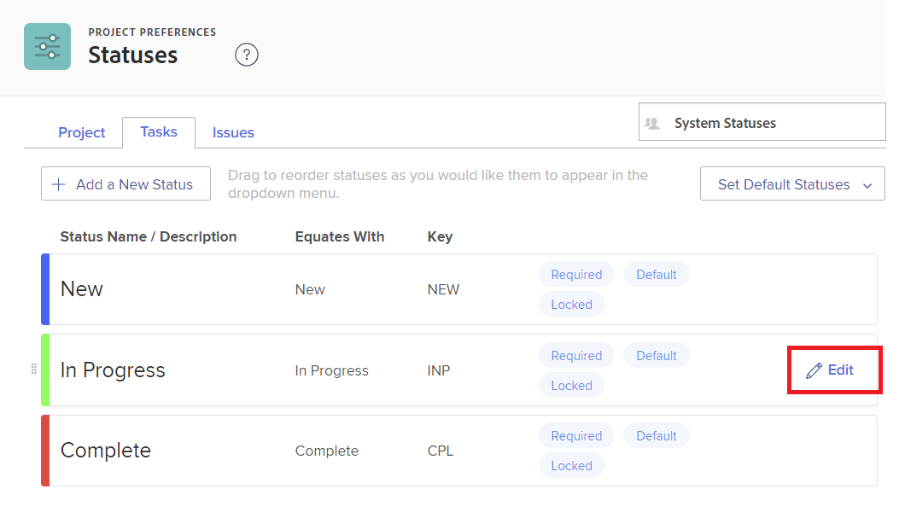

# Créer ou modifier un statut

<!-- Audited: 1/2024 -->

<!--DON'T DELETE, DRAFT OR HIDE THIS ARTICLE. IT IS LINKED TO THE PRODUCT THROUGH CONTEXT SENSITIVE HELP LINKS.-->

En tant qu’administrateur ou administratrice Adobe Workfront, vous pouvez créer des statuts personnalisés pour les projets, les tâches et les problèmes. Ils peuvent être pour les utilisateurs et utilisatrices de l’ensemble du système Workfront ou pour des groupes ou sous-groupes spécifiques. Pour plus d’informations sur les statuts, voir [Vue d’ensemble des statuts](../../../administration-and-setup/customize-workfront/creating-custom-status-and-priority-labels/statuses-overview.md).

>[!NOTE]
>
>Les administrateurs et administratrices de groupes peuvent également créer leurs propres statuts de groupe, à l’usage exclusif de leurs groupes. Pour plus d’informations, voir [Créer ou modifier un statut de groupe](../../../administration-and-setup/manage-groups/manage-group-statuses/create-or-edit-a-group-status.md).

## Conditions d’accès

+++ Développez pour afficher les exigences d’accès aux fonctionnalités de cet article.

Vous devez disposer des accès suivants pour effectuer les étapes décrites dans cet article :

<table style="table-layout:auto"> 
 <col> 
 <col> 
 <tbody> 
  <tr> 
   <td role="rowheader">Formule Adobe Workfront</td> 
   <td>Tous</td> 
  </tr> 
  <tr> 
   <td role="rowheader">Licence Adobe Workfront</td> 
   <td>
     
Nouveau : Standard

     
ou

     
Actuel : formule

   </td> 
  </tr> 
  <tr> 
   <td role="rowheader">Configurations des niveaux d’accès</td> 
   <td>[!UICONTROL System Administrator]</td>
  </tr> 
 </tbody> 
</table>

Pour plus de détails sur les informations contenues dans ce tableau, consultez [Conditions d’accès préalables dans la documentation Workfront](/help/quicksilver/administration-and-setup/add-users/access-levels-and-object-permissions/access-level-requirements-in-documentation.md).

+++

## Créer ou modifier un statut personnalisé

Vous pouvez ajouter un statut personnalisé qui sera utilisé par l’ensemble de votre organisation ou par un seul groupe.

Lorsque vous créez un statut personnalisé pour l’ensemble de l’organisation, vous pouvez le configurer de manière à ce que tous les groupes du système puissent l’utiliser sans le modifier. Vous pouvez également le configurer de manière à ce que les administrateurs et administratrices de groupes puissent le modifier pour leurs groupes, comme expliqué dans [Créer ou modifier un statut de groupe](../../../administration-and-setup/manage-groups/manage-group-statuses/create-or-edit-a-group-status.md).

{{step-1-to-setup}}

1. Dans le panneau de gauche, cliquez sur **Préférences du projet** > **Statuts**.

1. (Le cas échéant) Si vous créez ou modifiez un statut destiné à être utilisé à l’échelle du système, assurez-vous que l’option **Statuts du système** est sélectionnée dans la zone située dans le coin supérieur droit.

   

   Ou

   Si le statut est pour un groupe ou un sous-groupe, commencez à saisir le nom du groupe dans le coin supérieur droit, puis sélectionnez-le lorsqu’il apparaît.

   

1. Sélectionnez l’onglet du type d’objet (**Projet**, **Tâche**, ou **Problèmes**) que vous souhaitez associer au statut.

1. Si vous créez un statut, cliquez sur **Ajouter un nouveau statut**.

   Ou

   Si vous modifiez un statut existant, survolez-le, puis cliquez sur l’icône **Modifier** qui s’affiche complètement à droite.

   

1. Configurez le statut à l’aide des options suivantes :

   <table style="table-layout:auto"> 
    <col> 
    <col> 
    <tbody> 
     <tr> 
      <td role="rowheader">Nom du statut</td> 
      <td> 
Saisissez le nom du statut. Champ obligatoire.
 
Lorsque vous créez un nom de statut, sachez que d’autres utilisateurs et utilisatrices du système peuvent créer un statut portant le même nom. Il est recommandé d’utiliser un nom unique afin d’éviter toute confusion lors de la sélection de statuts dans Workfront.
 </td> 
     </tr> 
     <tr> 
      <td role="rowheader">Description</td> 
      <td>(Facultatif) Saisissez une description du statut. Cette action communique sa fonctionnalité aux personnes qui l’utilisent.</td> 
     </tr> 
     <tr> 
      <td role="rowheader">Couleur</td> 
      <td> 
Personnalisez la couleur du statut en cliquant sur le champ de couleur et en sélectionnant une couleur dans le panneau d’échantillons. Vous pouvez également saisir un nombre hexadécimal dans le champ.
 
La couleur du statut est visible dans le coin supérieur droit de Workfront lorsqu’un utilisateur ou une utilisatrice affiche l’objet.
  
 </td> 
     </tr> 
     <tr> 
      <td role="rowheader">Équivaut à</td> 
      <td> 
Sélectionnez l’une des options de la liste qui décrit le mieux la fonction du statut. Par exemple, si le nom du statut est Terminé, l’option à laquelle il correspond doit être Terminé.
 
Chaque statut doit correspondre à l’une de ces options, car celles-ci déterminent le fonctionnement du statut.
 
Cette option ne peut pas être modifiée une fois le statut créé.
 </td> 
     </tr> 
     <tr> 
      <td role="rowheader">Clé</td> 
      <td> 
Si vous créez un statut, saisissez un code ou une abréviation pour le statut ou utilisez celui généré pour vous. Cette clé doit être unique dans Workfront, car elle peut être utilisée à des fins de création de rapports. Si vous essayez de spécifier une clé déjà utilisée dans le système, le champ devient rouge.
 
Il peut s’avérer utile d’utiliser une abréviation facilement reconnaissable pour les personnes qui l’utiliseront.
 
Cette option ne peut pas être modifiée une fois le statut créé.
 
Vous ne pouvez pas modifier le code clé des statuts Planification, Actuel et Terminé. Prenez cela en compte lorsque vous créez un rapport en mode texte.
 </td> 
     </tr> 
     <tr> 
      <td role="rowheader">Masquer le statut</td> 
      <td> 
(Statuts des projets et des tâches uniquement)
 
Activez cette option si vous souhaitez que le statut soit masqué aux utilisateurs et utilisatrices. Lorsque cette option est désactivée (paramètre par défaut), tous les utilisateurs et toutes les utilisatrices du système peuvent utiliser le statut.
 
Vous pouvez masquer le statut d’un problème en désactivant cette option pour les 4 types de problèmes (rapport de bug, ordre de modification, problème, demande).
 </td> 
     </tr> 
     <tr> 
      <td role="rowheader">Verrouiller pour tous les groupes</td> 
      <td>
       
Lorsqu’un statut est verrouillé, les personnes de l’ensemble du système peuvent le voir et l’utiliser et les administrateurs et administratrices de groupe ne peuvent pas le personnaliser pour leurs groupes.
 
       
Lorsqu’un statut est déverrouillé, les administrateurs et administratrices de groupe peuvent le personnaliser pour leurs groupes individuels.

   

       
Vous pouvez utiliser les statuts verrouillés et déverrouillés dans le cadre d’un processus d’approbation de système. Si vous créez un processus d’approbation de système avec un statut déverrouillé, les utilisateurs et utilisatrices dans tout le système peuvent associer le processus d’approbation à n’importe quel objet (projet, tâche ou problème) du système.

       
 Dans les scénarios suivants, des messages d’avertissement s’affichent pour vous aider, vous et vos utilisateurs et utilisatrices, à comprendre les conséquences du déverrouillage d’un statut :

       <ul>
       <li>Un administrateur ou une administratrice déverrouille un statut au niveau du système utilisé dans un processus d’approbation. Un message l’avertit que le statut de déverrouillage de ses groupes est susceptible d’être supprimé, ce qui empêcherait les personnes membres de ces groupes d’utiliser correctement ce processus d’approbation pour les objets qui leur sont affectés.</li>
       <li>Une personne commence à modifier un processus d’approbation qui utilise le statut déverrouillé. Un message l’avertit du statut déverrouillé afin qu’elle puisse déterminer s’il est préférable de le reverrouiller ou de le remplacer.</li>
       <li>Un processus d’approbation au niveau du système avec un statut déverrouillé est associé à un objet et le statut a été supprimé pour le groupe affecté à l’objet. Lorsqu’une personne membre du groupe accède à la section Approbations de l’objet, un message explique que le processus d’approbation ne peut pas être lancé pour l’objet.</li>
       </ul>
       
Pour plus d’informations sur les statuts de verrouillage, voir <a href="../../../administration-and-setup/customize-workfront/creating-custom-status-and-priority-labels/lock-or-unlock-a-custom-system-level-status.md" class="MCXref xref">Statuts verrouillés et déverrouillés au niveau du système</a>.

       

      </td>
     </tr> 
    </tbody> 
   </table>

1. Cliquer sur **Enregistrer**.

   Pour savoir comment faire de ce statut un statut par défaut, voir [Utiliser des statuts personnalisés comme statuts par défaut](../../../administration-and-setup/customize-workfront/creating-custom-status-and-priority-labels/use-custom-statuses-as-default-statuses.md).

Pour plus d’informations sur la réorganisation des statuts de groupe, voir [Réorganiser les statuts au niveau du système et des groupes](../../../administration-and-setup/customize-workfront/creating-custom-status-and-priority-labels/reorder-system-statuses.md).
