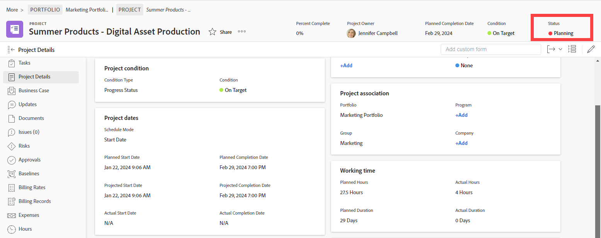

# Vue d’ensemble des statuts

<!-- Audited: 01/2024 -->

Pour connaître l’état actuel du développement d’un projet, d’une tâche ou d’un problème, l’utilisateur ou l’utilisatrice peut consulter son statut.

Par exemple, dans ce projet, le statut Planification indique que la personne responsable du projet planifie actuellement certains aspects du projet, tels que sa chronologie, les affectations de tâches et les approbations.

Pour afficher leur statut, vous devez disposer des autorisations et des droits d’accès suivants sur un projet, une tâche ou un événement :

* Afficher ou un accès supérieur dans votre niveau d&#39;accès aux projets, tâches et événements
* Autorisations d’affichage ou supérieures sur l’objet

Vous devez disposer des autorisations et des droits d’accès suivants sur un projet, une tâche ou un événement pour modifier manuellement leur statut :

* Modifier l&#39;accès dans votre niveau d&#39;accès aux projets, tâches et événements
* Autorisations de niveau Contribution ou supérieur sur la tâche ou l’événement
* Gérez les autorisations du projet.

La modification du statut d’un projet, d’une tâche ou d’un problème est généralement un processus manuel. Cependant, il arrive que le statut d’un problème soit automatiquement modifié, en fonction d’autres facteurs se produisant dans le système.

Adobe Workfront est fourni avec 9 statuts de projet, 3 statuts de tâche et 10 statuts de problème. Pour plus d’informations à ce sujet, voir les articles suivants :

* [Accéder à la liste des statuts des projets du système](../../../administration-and-setup/customize-workfront/creating-custom-status-and-priority-labels/project-statuses.md)
* [Accéder à la liste des statuts des tâches système](../../../administration-and-setup/customize-workfront/creating-custom-status-and-priority-labels/task-statuses.md)
* [Accéder à la liste des statuts des problèmes du système](../../../administration-and-setup/customize-workfront/creating-custom-status-and-priority-labels/issue-statuses.md)

## Statuts personnalisés

Outre les statuts par défaut fournis avec Workfront, un administrateur ou une administratrice Workfront peut ajouter des statuts de projet, de tâche et de problème personnalisés pour répondre aux besoins de votre entreprise. Vous pouvez créer des statuts au niveau du système utilisés par tous les utilisateurs et utilisatrices de votre instance Workfront ou des statuts au niveau du groupe utilisés uniquement par certains groupes. Pour plus d’informations, voir [Créer ou modifier un statut](../../../administration-and-setup/customize-workfront/creating-custom-status-and-priority-labels/create-or-edit-a-status.md).

## Statuts de groupes

Les administrateurs et administratrices de groupe peuvent créer des statuts personnalisés au niveau du groupe pour répondre aux besoins de leurs groupes. Pour plus d’informations, voir [Gérer les statuts d’un groupe](../../../administration-and-setup/manage-groups/manage-group-statuses/manage-group-statuses.md).
