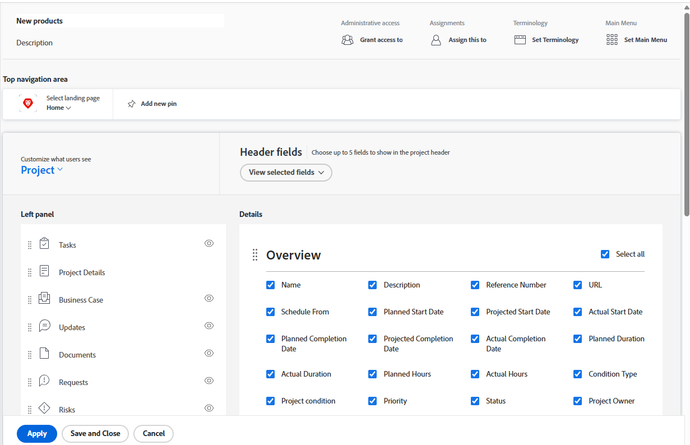

# Personnaliser la vue Détails à l’aide d’un modèle de mise en page

En tant qu’administrateur Adobe Workfront, vous pouvez utiliser un modèle de mise en page pour déterminer les informations qui s’affichent lorsqu’un utilisateur clique sur l’icône Détails  dans le panneau de gauche lors de l’affichage d’une tâche, d’un événement, d’un document, d’un programme ou d’un portfolio.

Vous pouvez également modifier l’ordre dans lequel ces informations apparaissent. Par exemple, pour toutes les tâches que vos utilisateurs et utilisatrices voient, vous pouvez déplacer les informations sur les formulaires personnalisés en haut de la vue Détails.

Pour plus d’informations sur la création de modèles de mise en page, voir [Créer et gérer des modèles de mise en page](../use-layout-templates/create-and-manage-layout-templates.md).

Pour plus d’informations sur les modèles de mise en page pour les groupes, voir [Créer et modifier des modèles de mise en page d’un groupe](../../../administration-and-setup/manage-groups/work-with-group-objects/create-and-modify-a-groups-layout-templates.md).

Après avoir configuré un modèle de mise en page, vous devez l’affecter aux utilisateurs et utilisatrices pour que les modifications que vous avez apportées soient visibles par d’autres personnes. Pour plus d’informations sur l’attribution d’un modèle de mise en page aux utilisateurs et utilisatrices, voir [Attribuer des utilisateurs et utilisatrices à un modèle de mise en page](../use-layout-templates/assign-users-to-layout-template.md).

Les modifications apportées à la vue Détails d’un objet déterminent également la disponibilité et l’ordre des champs visibles par les utilisateurs et utilisatrices dans les zones suivantes :

* Zones « Créer un objet », telles que Créer une tâche

  

* Écrans « Modifier un objet » lors de la modification d’un objet, tels que Modifier une tâche, Modifier un problème et Modifier un projet

  

* Écrans « Modifier des objets » lors de la modification d’objets en masse. Actuellement, cette fonctionnalité est prise en charge pour la modification en masse de projets.

  

* Panneau Résumé  pour les listes de tâches et d’événements

  

  >[!NOTE]
  >
  >Les modifications apportées aux modèles de mise en page affectent l’ordre et la disponibilité des champs du panneau Résumé uniquement pour les tâches et les problèmes affectés à la personne connectée.

* Zones de conversion, telles que les zones Convertir le problème en tâche ou Convertir le problème en projet.

  

Pour plus d’informations sur les modèles de mise en page pour les groupes, voir [Créer et modifier des modèles de mise en page d’un groupe](../../../administration-and-setup/manage-groups/work-with-group-objects/create-and-modify-a-groups-layout-templates.md).

## Conditions d’accès

+++ Développez pour afficher les exigences d’accès aux fonctionnalités de cet article.

<table style="table-layout:auto"> 
 <col> 
 <col> 
 <tbody> 
  <tr> 
   <td>Package Adobe Workfront</td> 
   <td>
Tous
</td> 
  </tr> 
  <tr> 
   <td>Licence Adobe Workfront</td> 
   <td>
Standard

       
Plan
</td>
  </tr> 
  </tr> 
  <tr> 
   <td>Configurations des niveaux d’accès</td> 
   <td> 
Pour effectuer ces étapes au niveau du système, vous devez disposer du niveau d’accès Administrateur ou administratrice système.

        
Pour les exécuter pour un groupe, vous devez être une personne responsable de ce groupe.
 </td> 
  </tr> 
 </tbody> 
</table>

Pour plus d’informations, voir [Conditions d’accès requises dans la documentation Workfront](/help/quicksilver/administration-and-setup/add-users/access-levels-and-object-permissions/access-level-requirements-in-documentation.md).

+++

## Personnaliser ce que voient les utilisateurs et utilisatrices dans la vue Détails.

1. Commencez à travailler sur un modèle de mise en page, comme décrit dans la section [Créet et gérer des modèles de mise en page](../../../administration-and-setup/customize-workfront/use-layout-templates/create-and-manage-layout-templates.md).
1. Cliquez sur la flèche vers le bas  sous **Personnaliser ce que voient les utilisateurs**, puis cliquez sur **Projet**, **Tâche**, **Problème**, **Program** ou **Portfolio.**<!--, or billing record-->
1. Dans la section **Détails**, pour personnaliser ce que voient les utilisateurs et utilisatrices dans la vue Détails, effectuez l’une des opérations suivantes :

   * Faites glisser les en-têtes de section  pour modifier leur ordre.
   * Activez ou désactivez les options dans les différentes zones (telles que **Présentation**, **Finance** et **Forms personnalisé**) pour les afficher ou les masquer.

     Si vous masquez tous les champs de l’une de ces sections, la section entière est masquée.

     Tous les champs sont activés par défaut. Vous pouvez cocher ou décocher la case **Tout sélectionner** dans une zone pour afficher ou masquer tous les champs de cette zone.

     

1. Continuez à personnaliser le modèle de mise en page. Vous pouvez cliquer sur **Appliquer** à tout moment pour enregistrer votre progression.

   Ou

   Si vous avez terminé la personnalisation, cliquez sur **Enregistrer et fermer**.

