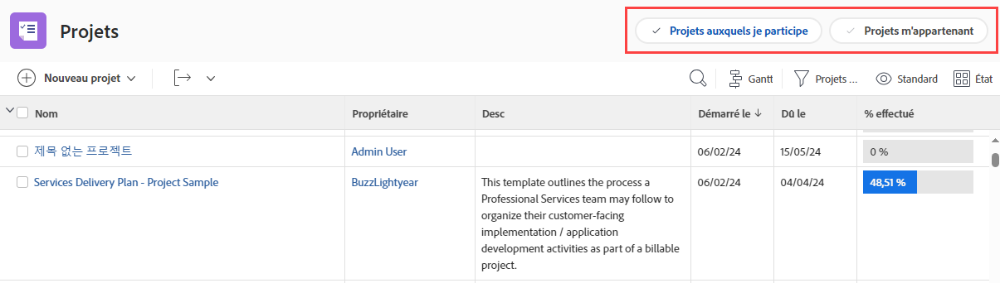

# Personnaliser les filtres, les vues et les regroupements à l’aide d’un modèle de mise en page

En tant qu’administrateur ou administratrice Adobe Workfront, vous pouvez utiliser un modèle de mise en page pour spécifier les contrôles de listes qui s’affichent dans les menus déroulants Filtre, Vue et Regroupement. Ces menus apparaissent au-dessus des listes dans Workfront, telles que la liste des tâches d’un projet :

Pour plus d’informations sur les modèles de mise en page, voir [Créer et gérer des modèles de mise en page](../../../administration-and-setup/customize-workfront/use-layout-templates/create-and-manage-layout-templates.md).

Pour plus d’informations sur les modèles de mise en page pour les groupes, voir [Créer et modifier des modèles de mise en page d’un groupe](../../../administration-and-setup/manage-groups/work-with-group-objects/create-and-modify-a-groups-layout-templates.md).

Après avoir configuré un modèle de mise en page, vous devez l’affecter aux utilisateurs et utilisatrices pour que les modifications que vous avez apportées soient visibles par d’autres personnes. Pour plus d’informations sur l’attribution d’un modèle de mise en page à des utilisateurs et utilisatrices, voir [Attribuer un modèle de mise en page à des utilisateurs et utilisatrices](../use-layout-templates/assign-users-to-layout-template.md).

## Conditions d’accès

+++ Développez pour afficher les exigences d’accès aux fonctionnalités de cet article.

<table style="table-layout:auto"> 
 <col> 
 <col> 
 <tbody> 
  <tr> 
   <td>Package Adobe Workfront</td> 
   <td>
Tous
</td> 
  </tr> 
  <tr> 
   <td>Licence Adobe Workfront</td> 
   <td>
Standard

       
Plan
</td>
  </tr> 
  </tr> 
  <tr> 
   <td>Configurations des niveaux d’accès</td> 
   <td> 
Pour effectuer ces étapes au niveau du système, vous devez disposer du niveau d’accès Administrateur ou administratrice système.

        
Pour les exécuter pour un groupe, vous devez être une personne responsable de ce groupe.
 </td> 
  </tr> 
 </tbody> 
</table>

Pour plus d’informations, voir [Conditions d’accès requises dans la documentation Workfront](/help/quicksilver/administration-and-setup/add-users/access-levels-and-object-permissions/access-level-requirements-in-documentation.md).

+++

## Personnaliser les contrôles de liste Filtrer, Afficher et Regrouper

1. Commencez à travailler sur un modèle de mise en page, comme décrit dans la section [Créer et gérer des modèles de mise en page](../../../administration-and-setup/customize-workfront/use-layout-templates/create-and-manage-layout-templates.md).
1. Cliquez sur la flèche vers le bas  sous **Personnaliser ce que voient les utilisateurs**, puis cliquez sur **Listes** dans le menu déroulant qui s’affiche.

   

1. Cliquez sur la flèche vers le bas  sous **Sélectionnez une liste à personnaliser**, puis sélectionnez le type d&#39;objet Workfront pour lequel vous souhaitez personnaliser les contrôles de liste Filtrer, Afficher et Regrouper.

   

   >[!NOTE]
   >
   >Si vous sélectionnez Projets comme liste à personnaliser, désactivez Projets auxquels je participe ou Projets dont je suis propriétaire dans la section Filtre, les personnes ne verront plus ce filtre ou ne pourront plus l’utiliser :
   >
   >* Dans la liste des filtres qui s’affiche lorsqu’ils cliquent sur l’icône de filtre  au-dessus d’une liste :
   >   
   >  
   >   
   >* dans l’en-tête de la zone Projets :
   >   
   >  

1. (Facultatif) Si vous souhaitez modifier le filtre, la vue ou le regroupement par défaut du modèle de mise en page, pointez sur le filtre, la vue ou le regroupement, puis cliquez sur **Définir comme valeur par défaut**.

   Les valeurs par défaut que vous choisissez déterminent le filtre, la vue et le regroupement que les personnes verront dans les listes de Workfront lorsque le modèle de mise en page leur sera attribué. Si vous ne modifiez pas ces valeurs par défaut, les personnes voient toutes les listes comme suit :

   * **Filtres** : tous
   * **Vue** : standard (le cas échéant, certaines listes n’ont pas cette vue).
   * **Regroupement** : rien

   Vous pouvez masquer les options Tous, Standard et Rien après avoir sélectionné d’autres valeurs par défaut (voir Étape 5), mais elles ne peuvent pas être supprimées.

   Vous pouvez supprimer toute autre option utilisée par défaut, mais vous devez d’abord sélectionner une autre option par défaut.

   Pour plus d’informations sur la suppression de filtres, de vues et de regroupements, voir [Créer, modifier et partager des filtres, vues et groupes par défaut](../../../administration-and-setup/set-up-workfront/configure-system-defaults/create-and-share-default-fvgs.md).

1. Masquez et ajoutez des contrôles de listes comme suit :

   <table style="table-layout:auto"> 
    <col> 
    <col> 
    <tbody> 
     <tr> 
      <td role="rowheader">Masquer un contrôle de listes</td> 
      <td> 
Décochez ou cochez la case en regard du contrôle de listes à masquer ou à afficher.
 
Si une case à cocher est grisée, vous ne pouvez pas masquer ce contrôle de listes. Le paramètre par défaut  de chaque contrôle de listes est grisé, car vous ne pouvez pas masquer le paramètre actuellement configuré comme valeur par défaut.
 </td> 
     </tr> 
     <tr> 
      <td role="rowheader">Ajouter un contrôle de listes personnalisé</td> 
      <td> 
 
        <ol> 
         <li value="1"> Cliquez sur <strong>Ajouter un filtre</strong>, <strong>Ajouter une vue</strong>, ou <strong>Ajouter un regroupement</strong> au bas de la liste Filtre, Vue ou Regroupement. Dans la zone qui s’affiche, commencez à saisir le nom d’un contrôle de listes personnalisé existant précédemment créé pour votre organisation, puis cliquez sur le nom lorsqu’il apparaît.</li> 
         <li value="2"> Si vous souhaitez que le nouveau contrôle de listes personnalisé soit défini comme filtre, vue ou regroupement par défaut pour le modèle de mise en page, cliquez sur <strong>Définir comme valeur par défaut</strong>. </li> 
         <li value="3"> 
Cliquez sur <strong>Ajouter</strong> lorsque vous avez terminé.
 
<b>NOTE</b> : 
Les utilisateurs et utilisatrices peuvent ajouter des contrôles de listes personnalisés à leurs propres listes. Si vous ajoutez des contrôles de listes personnalisés dans un modèle de mise en page, vos contrôles de listes sont ajoutés et les leurs sont déplacés vers le bas du panneau ; les vôtres ne remplacent pas les leurs.
 
Cela est également vrai si vous affectez l’utilisateur ou l’utilisatrice à un nouveau modèle de mise en page qui comporte des contrôles de liste personnalisés. 
 
Pour plus d’informations sur la personnalisation des contrôles de listes, voir <a href="../../../reports-and-dashboards/reports/reporting-elements/filters-overview.md" class="MCXref xref">Vue d’ensemble des filtres</a>, <a href="../../../reports-and-dashboards/reports/reporting-elements/views-overview.md" class="MCXref xref">Vue d’ensemble des vues dans Adobe Workfront</a>, et <a href="../../../reports-and-dashboards/reports/reporting-elements/groupings-overview.md" class="MCXref xref">Vue d’ensemble des regroupements dans Adobe Workfront</a>.
 
 </li> 
        </ol> 
 </td> 
     </tr> 
    </tbody> 
   </table>

1. Continuez à personnaliser le modèle de mise en page. Vous pouvez cliquer sur **Appliquer** à tout moment pour enregistrer votre progression.

   Ou

   Si vous avez terminé la personnalisation, cliquez sur **Enregistrer et fermer**.
