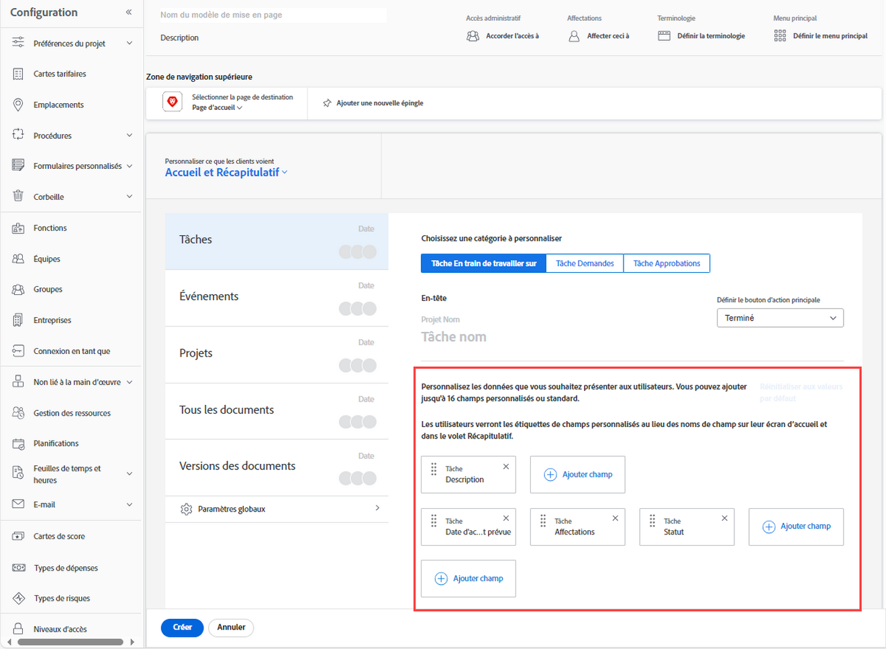

# Personnalisation du panneau Résumé à l’aide d’un modèle de mise en page

<!--Audited: 11/2024-->

Vous pouvez utiliser un modèle de mise en page pour configurer ce que les utilisateurs voient dans le panneau Résumé lorsqu’ils cliquent sur une tâche ou un événement. Chaque configuration effectuée à l’aide des étapes ci-dessous affecte le panneau Résumé . Ces personnalisations ne s’appliquent pas au panneau Résumé du document.

Vous pouvez configurer les éléments suivants :

* Les champs qui s’affichent pour une tâche ou un problème dans la zone Détails et dans quel ordre.
* Si les mises à jour, le temps consigné, les documents joints et les horodatages s’affichent pour une tâche ou un problème sélectionné.

Vous pouvez également personnaliser les champs affichés par les personnes dans la zone Accueil lorsque les personnes cliquent sur l’approbation d’un projet, l’approbation de document ou l’approbation de version du document qui leur est affectée.

Pour plus d’informations sur le panneau Résumé, voir [Vue d’ensemble du résumé](../../../workfront-basics/the-new-workfront-experience/summary-overview.md).

Pour plus d’informations sur la création de modèles de mise en page, voir [Créer et gérer des modèles de mise en page](../use-layout-templates/create-and-manage-layout-templates.md).

Pour plus d’informations sur les modèles de mise en page pour les groupes, voir [Créer et modifier des modèles de mise en page d’un groupe](../../../administration-and-setup/manage-groups/work-with-group-objects/create-and-modify-a-groups-layout-templates.md).

Après avoir configuré un modèle de mise en page, vous devez l’affecter aux utilisateurs et utilisatrices pour que les modifications que vous avez apportées soient visibles par d’autres personnes. Pour plus d’informations sur l’attribution d’un modèle de mise en page à des utilisateurs et utilisatrices, voir [Attribuer un modèle de mise en page à des utilisateurs et utilisatrices](../use-layout-templates/assign-users-to-layout-template.md).

## Conditions d’accès

+++ Développez pour afficher les exigences d’accès aux fonctionnalités de cet article.

<table style="table-layout:auto"> 
 <col> 
 <col> 
 <tbody> 
  <tr> 
   <td>Package Adobe Workfront</td> 
   <td>
Tous
</td> 
  </tr> 
  <tr> 
   <td>Licence Adobe Workfront</td> 
   <td>
Standard

       
Plan
</td>
  </tr> 
  </tr> 
  <tr> 
   <td>Configurations des niveaux d’accès</td> 
   <td> 
Pour effectuer ces étapes au niveau du système, vous devez disposer du niveau d’accès Administrateur ou administratrice système.

        
Pour les exécuter pour un groupe, vous devez être une personne responsable de ce groupe.
 </td> 
  </tr> 
 </tbody> 
</table>

Pour plus d’informations, voir [Conditions d’accès requises dans la documentation Workfront](/help/quicksilver/administration-and-setup/add-users/access-levels-and-object-permissions/access-level-requirements-in-documentation.md).

+++

## Personnalisation du panneau Résumé à l’aide d’un modèle de mise en page

1. Commencez à travailler sur un modèle de mise en page, comme décrit dans la section [Créer et gérer des modèles de mise en page](../../../administration-and-setup/customize-workfront/use-layout-templates/create-and-manage-layout-templates.md).

1. Cliquez sur la flèche vers le bas  sous **Personnaliser ce que voient les utilisateurs**, puis cliquez sur **Panneau Résumé**.

1. Dans la liste qui s’affiche en dessous, cliquez sur le type d’objet pour lequel vous souhaitez personnaliser le panneau Résumé .

   Le tableau ci-dessous explique ce que vous pouvez personnaliser pour chaque objet

   <table style="table-layout:auto"> 
    <col> 
    <col> 
    <tbody> 
     <tr> 
      <td role="rowheader">Tâches</td> 
      <td> 
Dans une liste de tâches, ce paramètre affecte le panneau Résumé qui s’affiche sur le côté droit de la page lorsqu’un utilisateur sélectionne une tâche, puis clique sur l’icône Ouvrir le résumé .

   
  
 </td> 
     </tr> 
     <tr> 
      <td role="rowheader">Problèmes</td> 
      <td>
Dans une liste de problèmes, ce paramètre affecte le panneau Résumé qui s’affiche sur le côté droit de la page lorsqu’une personne sélectionne un problème, puis clique sur l’icône Ouvrir le résumé .
 </td> 
     </tr> 
    </tbody> 
   </table>

<!--These were removed with the new Home: 

<tr> 
      <td role="rowheader">Projects</td> 
      <td><ul><li>
In Home, when a user clicks a project approval assigned to them, your configuration for this setting affects the area to the right of the approval.

      
<b>IMPORTANT:</b> 

This is a deprecated feature. Any changes you make to this area are related to a feature that Workfront has removed. This option will be removed from Workfront with a later maintenance update.
</li>
      </ul> 
      </td> 
     </tr> 
     <tr> 
      <td role="rowheader">Documents</td> 
      <td>
     <ul><li>
In Home, when a user clicks a document approval assigned to them, your configuration for this setting affects the area to the right of the approval.

      
<b>IMPORTANT:</b> 

 This is a deprecated feature. Any changes you make to this area are related to a feature that Workfront has removed. This option will be removed from Workfront with a later maintenance update.
</li>
      </ul>
      </td> 
     </tr> 
     <tr> 
      <td role="rowheader">Document Versions</td> 
      <td><ul><li>
In Home, when a user clicks an approval assigned to them for a particular version of a document, your configuration for this setting affects the area to the right of the approval.

      

<b>IMPORTANT:</b>
 This is a deprecated feature. Any changes you make to this area are related to a feature that Workfront has removed. This option will be removed from Workfront with a later maintenance update.
</li>
      </ul>
      </td> 
     </tr> -->

>[!IMPORTANT]
>
>Si une tâche n’est pas affectée, la personne affectée au modèle de mise en page ne verra pas les personnalisations des champs dans le résumé.

1. (Le cas échéant) Si vous avez cliqué sur Tâches ou Problèmes à l’étape précédente, sélectionnez la catégorie de tâches ou de problèmes que vous souhaitez personnaliser.

   

1. (Conditionnel) Si le menu déroulant **Bouton Définir l’action principale** s’affiche (si vous sélectionnez **Tâches** ou **Événements** dans la liste de gauche), cliquez sur l’action principale (**Terminé** ou **Statut**) que vous souhaitez rendre disponible pour les utilisateurs dans le panneau Résumé lorsqu’ils affichent une tâche ou un événement.

   

1. Ajoutez des champs  ou masquer  pour le type d’objet sélectionné.

   

1. Répétez les étapes 3 à 6 pour personnaliser le panneau Résumé pour tout autre type d’objet.
1. Cliquez sur **Paramètres globaux**, en bas à gauche, puis activez ou désactivez l’une des options suivantes liées aux objets Adobe Workfront dans le résumé :

   <table style="table-layout:auto"> 
    <col> 
    <col> 
    <tbody> 
     <tr> 
      <td role="rowheader">Afficher les mises à jour pour le travail</td> 
      <td>Affiche toutes les mises à jour apportées à une tâche ou un événement sélectionné dans le panneau Résumé. Cela inclut les mises à jour du système et les mises à jour effectuées par un utilisateur ou une utilisatrice. Les personnes peuvent toujours filtrer les mises à jour du système, comme décrit dans la section <a href="../../../workfront-basics/updating-work-items-and-viewing-updates/update-work.md#enable" class="MCXref xref">Activer ou désactiver des mises à jour système</a> dans <a href="../../../workfront-basics/updating-work-items-and-viewing-updates/update-work.md" class="MCXref xref">Mettre à jour le travail</a>.</td> 
     </tr> 
     <tr> 
      <td role="rowheader">Consigner les heures de travail</td> 
      <td>Affiche l’option Consigner le temps passé sur le travail lorsqu’une tâche ou un problème est sélectionné, ce qui permet aux personnes de consigner le temps passé sur les tâches directement à partir des zones Accueil et Résumé.</td> 
     </tr> 
     <tr> 
      <td role="rowheader">Afficher les documents associés au travail</td> 
      <td>Affiche une zone Documents dans le panneau Résumé lorsqu’une tâche ou un événement est sélectionné, répertoriant tous les documents joints à la tâche ou à l’événement. Les personnes peuvent cliquer sur les documents pour les afficher dans une fenêtre d’aperçu.</td> 
     </tr> 
     <tr> 
      <td role="rowheader">Masquer l'horodatage</td> 
      <td>Masque l’horodatage des champs de date suivants dans le panneau Résumé :
       <ul>
        <li>Date d'achèvement prévue</li>
        <li>Date d’engagement</li>
        <li>Date d’envoi</li>
       </ul></td> 
     </tr> 
    </tbody> 
   </table>

1. Continuez à personnaliser le modèle de mise en page. Vous pouvez cliquer sur **Appliquer** à tout moment pour enregistrer votre progression.

   Ou

   Si vous avez terminé la personnalisation, cliquez sur **Enregistrer et fermer**.

Pour plus d’informations sur les modèles de mise en page, voir [Créer et gérer des modèles de mise en page](../../../administration-and-setup/customize-workfront/use-layout-templates/create-and-manage-layout-templates.md).
