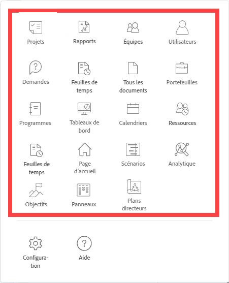

# Personnalisation du menu principal à l’aide d’un modèle de mise en page

<!--Audited: 01/2024-->

En tant qu’administrateur Adobe Workfront ou administrateur de groupe, vous pouvez utiliser un modèle de mise en page pour configurer les options que les utilisateurs voient lorsqu’ils ouvrent le menu principal dans Workfront.

>[!NOTE]
>
>Les options du menu principal que les utilisateurs voient dépendent de leur type de licence et des paramètres configurés à leur niveau d’accès. Certains utilisateurs qui utiliseront ce modèle de mise en page ne verront peut-être pas toutes les options que vous choisissez ici. Pour plus d’informations, voir [Fonctionnement des niveaux d’accès et des autorisations](../../../administration-and-setup/add-users/access-levels-and-object-permissions/how-access-levels-permissions-work-together.md) et [Accès configurable à la fonctionnalité pour chaque type d’objet](../../../administration-and-setup/add-users/access-levels-and-object-permissions/configurable-functionality-in-each-access-level-by-object-type.md).

Pour plus d’informations sur la création de modèles de mise en page, voir [Création et gestion des modèles de mise en page](../use-layout-templates/create-and-manage-layout-templates.md).

Pour plus d’informations sur les modèles de mise en page pour les groupes, voir [Création et modification des modèles de mise en page d’un groupe](../../../administration-and-setup/manage-groups/work-with-group-objects/create-and-modify-a-groups-layout-templates.md).

Après avoir configuré un modèle de mise en page, vous devez l’affecter aux utilisateurs pour que les modifications que vous avez apportées soient visibles par d’autres utilisateurs. Pour plus d’informations sur l’attribution d’un modèle de mise en page aux utilisateurs, voir [Affecter des utilisateurs à un modèle de mise en page](../use-layout-templates/assign-users-to-layout-template.md).

## Exigences d’accès

Vous devez disposer des accès suivants pour effectuer les étapes de cet article :

<table style="table-layout:auto"> 
 <col> 
 <col> 
 <tbody> 
  <tr> 
   <td role="rowheader"><strong>Formule Adobe Workfront</strong></td> 
   <td>Quelconque</td> 
  </tr> 
  <tr> 
   <td role="rowheader"><strong>Licence Adobe Workfront*</strong></td> 
   <td>
Actuel : Plan

   Ou
   
Nouveau : Standard
</td> 
  </tr> 
  <tr> 
   <td role="rowheader"><strong>Configuration du niveau d’accès</strong></td> 
   <td> 
Pour effectuer ces étapes au niveau du système, vous devez disposer du niveau d’accès Administrateur système.

    
Pour les exécuter pour un groupe, vous devez être un responsable de ce groupe.
 
     </td> 
  </tr> 
 </tbody> 
</table>

*Pour plus d’informations sur les exigences d’accès, voir [Conditions d’accès requises dans la documentation Workfront](/help/quicksilver/administration-and-setup/add-users/access-levels-and-object-permissions/access-level-requirements-in-documentation.md).

## Personnalisation du menu principal

1. Commencez à travailler sur un modèle de mise en page, comme décrit dans la section [Création et gestion des modèles de mise en page](../../../administration-and-setup/customize-workfront/use-layout-templates/create-and-manage-layout-templates.md).
1. Cliquez sur **Menu principal** dans le coin supérieur droit du modèle.

   La boîte de dialogue Menu principal s’ouvre. Vous pouvez y voir les zones qui s’affichent actuellement dans le menu principal pour le modèle, ainsi que les éléments disponibles à ajouter. Vous trouverez ci-dessous tous les éléments que vous pouvez ajouter :
   * Page d’accueil

     >[!TIP]
     >
     >Par défaut, l’icône Accueil du menu principal affiche la zone Mes mises à jour pour les utilisateurs ayant une licence de révision (dans le plan de licence actuel), sauf s’ils disposent d’un modèle de mise en page associé à leur profil qui inclut la zone Mes mises à jour du menu principal, en plus de la zone Accueil.

   * Portefeuilles
   * Programmes
   * Projets
   * Rapports
   * Tableaux de bord
   * Calendriers
   * Ressources
   * Scénarios

     >[!NOTE]
     >
     >Le planificateur de scénario nécessite une licence supplémentaire. Pour plus d’informations sur le planificateur de scénario Workfront, voir [Présentation du planificateur de scénarios](../../../scenario-planner/scenario-planner-overview.md).

   * Équipes
   * Utilisateurs

     >[!NOTE]
     >
     >Seuls les utilisateurs possédant une licence Plan (dans le modèle de licence actuel) ou une licence Standard (dans le nouveau modèle de licence) peuvent voir la zone Utilisateurs  dans le menu principal.

   * Demandes
   * Feuilles de temps
   * Documents
   * Modèles
   * Analytique
   * Relecture
   * Objectifs

     >[!NOTE]
     >
     >Les objectifs requièrent une licence supplémentaire. Pour plus d’informations sur les objectifs de Workfront, voir [Présentation des objectifs d’Adobe Workfront](../../../workfront-goals/goal-management/wf-goals-overview.md).

   * Mes mises à jour
   * Panneaux
   * Plans directeurs

1. Effectuez l’une des opérations suivantes :

   * Masquer  **Éléments actifs** que vous ne souhaitez pas afficher
   * Afficher  **Éléments disponibles** que vous souhaitez afficher dans le menu principal.
   * Glisser  **Éléments actifs** pour modifier l’ordre d’affichage dans le menu principal.

1. Cliquez sur **Terminé**.

   Cliquez également sur **Annuler** à tout moment si vous souhaitez ignorer vos modifications.

1. Poursuivez la personnalisation du modèle de mise en page.

   Ou

   Si vous avez terminé de personnaliser, cliquez sur **Enregistrer**.

   >[!TIP]
   >
   >Vous pouvez cliquer à tout moment sur Enregistrer pour enregistrer votre progression, puis continuer à modifier le modèle ultérieurement.

Pour plus d’informations sur les modèles de mise en page, voir [Création et gestion des modèles de mise en page](../../../administration-and-setup/customize-workfront/use-layout-templates/create-and-manage-layout-templates.md).
