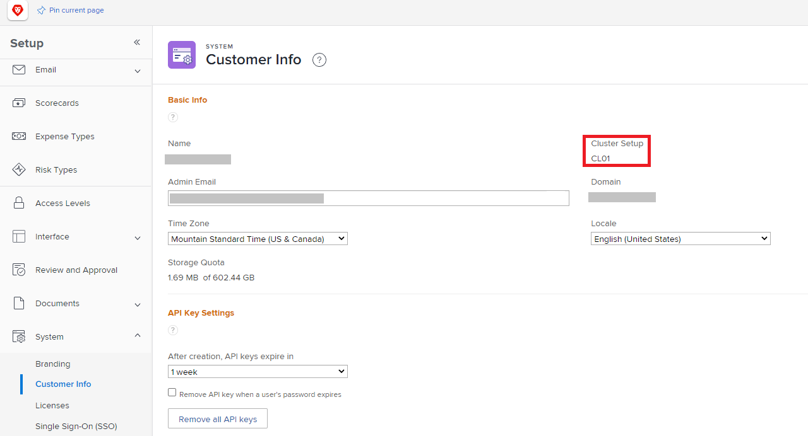

# Vue d’ensemble du pare-feu

Étant donné qu’Adobe Workfront communique avec le réseau de votre entreprise, le pare-feu de votre organisation doit être configuré de manière à autoriser cette communication. Les pare-feux sont des mesures de sécurité très efficaces qui séparent le réseau d’une entreprise d’Internet. Ils garantissent que seules les données et le trafic réseau sélectionnés peuvent entrer ou sortir du réseau de l’entreprise. Le pare-feu autorise ou bloque les données en fonction du site qui les envoie ou les reçoit. En tant qu’administrateur ou administratrice d’Adobe Workfront, vous devez vous assurer que les données envoyées vers ou depuis Workfront peuvent franchir le pare-feu de votre entreprise.

Pour ce faire, il vous faut une liste autorisée, qui est pour ainsi dire une « liste » des sites « autorisés » à envoyer ou recevoir des données par le biais du pare-feu. Les sites peuvent être identifiés de deux façons :

* **adresse IP** : une série de nombres tels que 52.31.132.175
* **Domaine** : partie d’une URL, telle que `thisdomain` dans `www.thisdomain.com`.

Workfront utilise des adresses IP et des domaines spécifiques pour la communication web. Ces éléments doivent être ajoutés à la liste autorisée de votre entreprise pour que vous puissiez utiliser Workfront dans votre organisation.

En règle générale, une liste autorisée est configurée par un administrateur ou une administratrice réseau. Contactez l’administrateur ou l’administratrice réseau de votre entreprise pour vous assurer que votre pare-feu autorise ces adresses IP. Si vous ne savez pas qui est votre administrateur ou administratrice réseau, le service informatique de votre entreprise peut vous assister.

>[!IMPORTANT]
>
>En tant qu’administrateur ou administratrice de Workfront, vous devez vous assurer que ces adresses et domaines IP sont ajoutés à la liste autorisée de votre entreprise. Cela est valable même si vous ne les ajoutez pas vous-même. Workfront ne peut pas configurer la liste autorisée de votre entreprise.

## Collecter des informations pour configurer votre pare-feu

Pour configurer votre pare-feu pour Workfront, votre administrateur ou administratrice réseau doit savoir quelles adresses IP et domaines ajouter. Certaines de ces informations sont accessibles uniquement à un administrateur ou une administratrice de Workfront. En tant qu’administrateur ou administratrice de Workfront, vous devez localiser ces informations et les fournir à votre administrateur ou administratrice réseau.

>[!NOTE]
>
>La bonne pratique en matière de sécurité consiste à ajouter uniquement les adresses IP et les domaines qui se connectent à la fonctionnalité utilisée actuellement par votre entreprise. En fournissant ces informations, vous pouvez vous assurer que cette bonne pratique est respectée.

Fournissez les informations suivantes à votre administrateur ou administratrice réseau :

<table style="table-layout:auto"> 
 <col> 
 <col> 
 <tbody> 
  <tr> 
   <td role="rowheader">Adresses IP et domaines spécifiques autorisés</td> 
   <td> 
L’article <a href="../../administration-and-setup/get-started-wf-administration/configure-your-firewall.md" class="MCXref xref">Configurer la liste autorisée de votre pare-feu</a> contient la liste des adresses IP et des domaines que votre entreprise doit ajouter à sa liste autorisée. 
 
Votre administrateur ou administratrice réseau peut ne pas avoir accès à l’article « Configurer la liste autorisée de votre pare-feu ». Dans ce cas, vous devez le lui fournir. Il est déconseillé d’imprimer une copie papier. Une copie numérique permet à l’administrateur ou à l’administratrice réseau de copier et coller les adresses, ce qui est plus rapide et plus précis que la saisie à partir d’une copie papier.
 </td> 
  </tr> 
  <tr> 
   <td role="rowheader">Votre cluster</td> 
   <td>Pour localiser le cluster de votre organisation, voir <a href="#view-your-organization-s-cluster-and-workfront-package" class="MCXref xref">Afficher le cluster de votre organisation et le package Workfront</a>.</td> 
  </tr> 
  <tr> 
   <td role="rowheader">Votre package Workfront</td> 
   <td> 
Pour localiser le package de votre organisation, voir <a href="#view-your-organization-s-cluster-and-workfront-package" class="MCXref xref">Afficher le cluster de votre organisation et le package Workfront.</a>
 </td> 
  </tr> 
  <tr> 
   <td role="rowheader">Votre domaine</td> 
   <td> 
Pour localiser votre domaine, consultez l’adresse web que vous utilisez pour vous connecter à Workfront.
 
Exemple : dans l’adresse web <code>greatcompany.my.workfront.com</code>, le domaine est « greatcompany ».
 </td> 
  </tr> 
  <tr> 
   <td role="rowheader">Autres produits Adobe Workfront</td> 
   <td> 
Indiquez à votre administrateur ou administratrice réseau si vous disposez de licences pour l’une des solutions suivantes :
 
    <ul> 
     <li> 
Adobe Workfront Proof
 </li> 
     <li> 
Adobe Workfront Fusion 
 </li> 
    </ul> </td> 
  </tr> 
  <tr> 
   <td role="rowheader">Intégrations Adobe Workfront</td> 
   <td>Informez votre administrateur ou administratrice réseau si vous utilisez l’une des solutions suivantes :
    <ul>
     <li>
Workfront pour Microsofts Teams
</li>
     <li>
Workfront pour Microsoft Outlook
</li>
    </ul></td> 
  </tr> 
  <tr> 
   <td role="rowheader">Fonctionnalités supplémentaires</td> 
   <td> 
Si vous utilisez les fonctionnalités suivantes, informez votre administrateur ou administratrice réseau :
 
    <ul> 
     <li> 
Lecteur de test Workfront
 </li> 
    </ul> </td>
  </tr> 
 </tbody> 
</table>

>[!IMPORTANT]
>
>Si vous ajoutez l’un de ces produits ou l’une de ces intégrations ou fonctionnalités ultérieurement, vous devez contacter l’administration réseau afin qu’elle puisse mettre à jour la liste autorisée.

### Afficher le package Workfront et cluster de votre organisation {#view-your-organization-s-cluster-and-workfront-package}

{{step-1-to-setup}}

1. Cliquez sur **Système** dans le panneau de gauche.
1. Pour afficher votre cluster, sélectionnez **Infos client**.

   Votre cluster s’affiche près de l’angle supérieur droit de la section **Informations de base**.

   

1. Pour afficher votre package Workfront, sélectionnez **Licences**.

   Votre package s’affiche dans le coin supérieur droit de la page.

   
