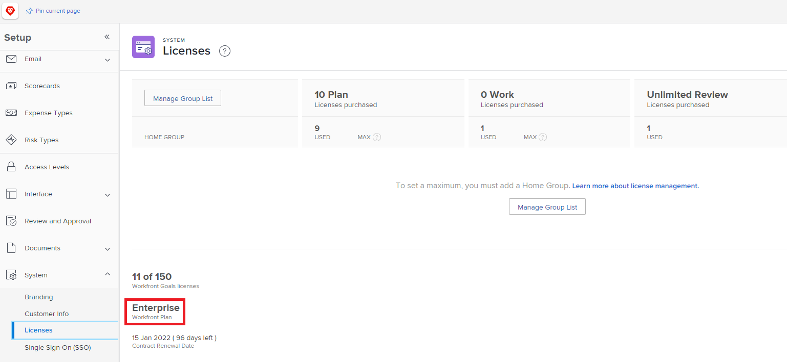

# Présentation du pare-feu

Comme Adobe Workfront communique avec le réseau de votre entreprise, le pare-feu de votre entreprise doit être configuré pour autoriser cette communication. Les pare-feu sont des mesures de sécurité très efficaces qui fonctionnent en séparant le réseau d&#39;une organisation d&#39;Internet. Elles garantissent que seules les données et le trafic réseau sélectionnés peuvent entrer ou sortir du réseau de l’entreprise. Le pare-feu autorise ou bloque les données en fonction du site qui envoie ou reçoit les données. En tant qu’administrateur Adobe Workfront, vous devez vous assurer que les données envoyées vers ou depuis Workfront peuvent passer par le pare-feu de votre entreprise.

Pour ce faire, vous devez effectuer une liste autorisée, qui est essentiellement une &quot;liste&quot; des sites &quot;autorisés&quot; à envoyer ou recevoir des données par le biais du pare-feu. Les sites peuvent être identifiés de deux façons :

* **Adresse IP**: une série de nombres comme 52.31.132.175
* **Domaine**: d’une partie d’une URL, telle que &quot;this domain&quot; dans www.thisdomain.com ;

Workfront utilise des adresses IP et des domaines spécifiques pour la communication web. Elles doivent être ajoutées à la liste autorisée de votre entreprise avant de pouvoir utiliser Workfront dans votre entreprise.

En règle générale, une liste autorisée est configurée par un administrateur réseau. Contactez l’administrateur réseau de votre entreprise pour vous assurer que votre pare-feu autorise ces adresses IP. Si vous ne savez pas qui est votre administrateur réseau, le service informatique de votre entreprise peut vous indiquer la bonne direction.

>[!IMPORTANT]
>
>En tant qu’administrateur Workfront, vous devez vous assurer que ces adresses et domaines IP sont ajoutés à la liste autorisée de votre entreprise. C&#39;est vrai même si vous ne les ajoutez pas vous-même. Workfront ne peut pas configurer la liste autorisée de votre entreprise.

## Collecter les informations pour configurer votre pare-feu

Pour configurer votre pare-feu pour Workfront, votre administrateur réseau doit savoir quelles adresses IP et domaines ajouter. Certaines de ces informations sont accessibles uniquement à un administrateur Workfront. En tant qu’administrateur de Workfront, vous devez localiser ces informations et les fournir à votre administrateur réseau.

>[!NOTE]
>
>La bonne pratique en matière de sécurité consiste à ajouter uniquement les adresses IP et les domaines qui se connectent à la fonctionnalité que votre entreprise utilise activement. En fournissant ces informations, vous pouvez vous assurer que cette bonne pratique est respectée.

Fournissez les informations suivantes à votre administrateur réseau :

<table style="table-layout:auto"> 
 <col> 
 <col> 
 <tbody> 
  <tr> 
   <td role="rowheader">Adresses et domaines IP spécifiques autorisés</td> 
   <td> 
L'article <a href="../../administration-and-setup/get-started-wf-administration/configure-your-firewall.md" class="MCXref xref">Configuration de la liste autorisée de votre pare-feu</a> contient la liste des adresses IP et des domaines que votre entreprise doit ajouter à sa liste autorisée. 
 
Il se peut que votre administrateur réseau n’ait pas accès à l’article "Configurer votre pare-feu". Dans ce cas, vous devez les leur fournir. Il est déconseillé d'imprimer une copie papier (papier). Une copie numérique permet à l’administrateur réseau de copier et coller les adresses, ce qui est plus rapide et plus précis que la saisie sur papier.
 </td> 
  </tr> 
  <tr> 
   <td role="rowheader">Votre grappe</td> 
   <td>Pour localiser la grappe de votre entreprise, voir <a href="#view-your-organization-s-cluster-and-workfront-plan" class="MCXref xref">Affichage de la grappe et du plan Workfront de votre entreprise</a></td> 
  </tr> 
  <tr> 
   <td role="rowheader">Votre formule Workfront</td> 
   <td> 
Le plan de votre entreprise est l’un des suivants :
 
    <ul> 
     <li> 
Entreprise 
 </li> 
     <li> 
Société 
 </li> 
     <li> 
Pro 
 </li> 
     <li> 
Équipe 
 </li> 
    </ul> 
Pour localiser votre plan, voir <a href="#view-your-organization-s-cluster-and-workfront-plan" class="MCXref xref">Affichez la grappe et le plan Workfront de votre entreprise.</a>
 </td> 
  </tr> 
  <tr> 
   <td role="rowheader">Votre domaine</td> 
   <td> 
Pour localiser votre domaine, consultez l’adresse web que vous utilisez pour vous connecter à Workfront.
 
Exemple : dans l’adresse web <code>greatcompany.my.workfront.com</code>, le domaine est "grande société"
 </td> 
  </tr> 
  <tr> 
   <td role="rowheader">Autres produits Adobe Workfront</td> 
   <td> 
Indiquez à votre administrateur réseau si vous disposez de licences pour l’une des fonctionnalités suivantes :
 
    <ul> 
     <li> 
Bon à tirer Adobe Workfront
 </li> 
     <li> 
Adobe Workfront Fusion 
 </li> 
    </ul> </td> 
  </tr> 
  <tr> 
   <td role="rowheader">Intégrations Adobe Workfront</td> 
   <td>Si vous utilisez l’une des méthodes suivantes, informez votre administrateur réseau :
    <ul>
     <li>

Workfront pour Jira

</li>
     <li>
Workfront for G Suite
</li>
     <li>
Workfront pour les Microsofts Teams
</li>
     <li>
Workfront pour Outlook
</li>
     <li>
Workfront pour Salesforce
</li>
    </ul></td> 
  </tr> 
  <tr> 
   <td role="rowheader">Fonctionnalité supplémentaire</td> 
   <td> 
Si vous utilisez l’une des méthodes suivantes, informez votre administrateur réseau :
 
    <ul> 
     <li> 
Un lecteur de test Workfront
 </li> 
     <li> 
Workfront Ascent
 </li> 
    </ul> </td> 
  </tr> 
 </tbody> 
</table>

>[!IMPORTANT]
>
>Si vous ajoutez l’un de ces produits, intégrations ou fonctionnalités ultérieurement, vous devez contacter votre administrateur réseau afin qu’il puisse ajuster la liste autorisée.

### Affichage de la grappe et du plan Workfront de votre entreprise {#view-your-organization-s-cluster-and-workfront-plan}

1. Cliquez sur le bouton **Menu Principal** icon  dans le coin supérieur droit d’Adobe Workfront, puis cliquez sur **Configuration** .

1. Cliquez sur **Système** dans le panneau de gauche
1. Pour afficher la grappe, sélectionnez **Informations sur le client**.

   Votre grappe s’affiche près de l’angle supérieur droit du **Informations de base** .

   

1. Pour afficher votre formule Workfront, sélectionnez **Licences**.

   Votre plan s’affiche près du bas de la page.

   
