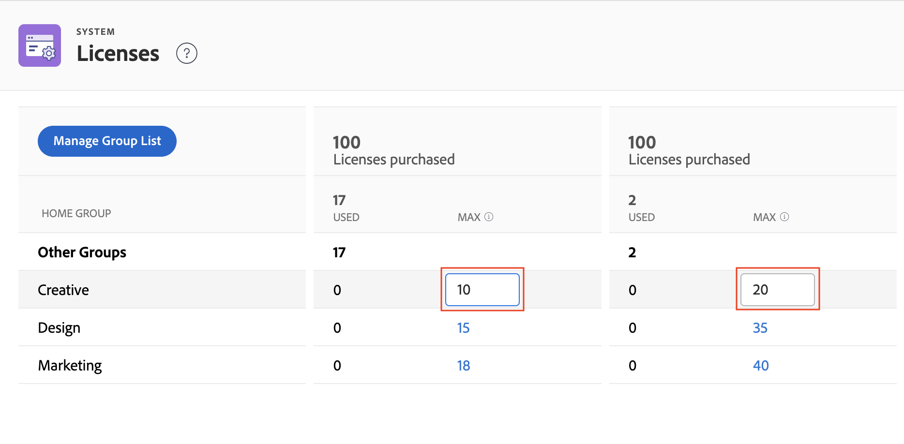

# Gestion des licences disponibles dans votre système

En tant qu’administrateur Adobe Workfront, vous pouvez accéder aux informations sur votre compte Workfront, y compris le nombre de licences achetées pour votre entreprise, ainsi que le nombre de licences en cours d’utilisation.

## Exigences d’accès

Vous devez disposer des accès suivants pour effectuer les étapes de cet article :

<table style="table-layout:auto">
 <col> 
 <col> 
 <tbody> 
  <tr> 
   <td role="rowheader">Formule Adobe Workfront</td> 
   <td>Tous</td> 
  </tr> 
  <tr> 
   <td role="rowheader">Licence Adobe Workfront</td> 
   <td>Plan</td> 
  </tr> 
  <tr> 
   <td role="rowheader">Paramétrages du niveau d'accès</td> 
   <td> 
Vous devez être un administrateur Workfront. Pour plus d’informations, voir <a href="../../administration-and-setup/add-users/configure-and-grant-access/grant-a-user-full-administrative-access.md" class="MCXref xref">Octroi d’un accès administratif complet à un utilisateur</a>.
 
<b>REMARQUE</b>: Si vous n’avez toujours pas accès à , demandez à votre administrateur Workfront s’il définit des restrictions supplémentaires à votre niveau d’accès. Pour plus d’informations sur la façon dont un administrateur Workfront peut modifier votre niveau d’accès, voir <a href="../../administration-and-setup/add-users/configure-and-grant-access/create-modify-access-levels.md" class="MCXref xref">Création ou modification de niveaux d’accès personnalisés</a>.
 </td> 
  </tr> 
 </tbody> 
</table>

## Affichage des licences de votre entreprise

Le nombre de licences utilisées est automatiquement mis à jour lorsque vous attribuez des niveaux d’accès aux utilisateurs que vous ajoutez à Workfront. Pour plus d’informations, voir [Ajout d’utilisateurs](../../administration-and-setup/add-users/create-and-manage-users/add-users.md).

Pour afficher les informations de licence dans votre système :

1. Cliquez sur le bouton **Menu Principal** icon  dans le coin supérieur droit d’Adobe Workfront, puis cliquez sur **Configuration** .

1. Au bas du panneau de gauche, cliquez sur **Système** > **Licences**.

   Pour plus d’informations sur les licences répertoriées sur cette page, voir [Présentation des licences Adobe Workfront](../../administration-and-setup/add-users/access-levels-and-object-permissions/wf-licenses.md).

   >[!NOTE]
   >
   >Les licences de BAT sont disponibles uniquement pour les clients qui ont acheté le module complémentaire de BAT Workfront payant en plus de leur licence Workfront. Pour plus d’informations sur ce module complémentaire, voir [BAT Workfront](../../workfront-proof/workfront-proof.md).

1. (Conditionnel) Si le message s’affiche **Pour définir un maximum, vous devez ajouter un groupe d’accueil.**, ajoutez un groupe d’accueil dans votre système, comme expliqué dans la section . [Ajout ou suppression d’un groupe d’accueil sur la page Licences](#add-or-remove-a-home-group-to-the-licenses-page) dans cet article.

## Affichage des informations sur les licences des modules complémentaires Workfront

Dans la capture d’écran ci-dessous, **5 sur 10 licences de BAT** indique que cette organisation dispose du module complémentaire Workfront Bon à tirer payant et qu’elle utilise actuellement 5 des 10 licences Workfront Bon à tirer qu’elle a achetées.

Si votre entreprise a acheté les objectifs Workfront, les informations de licence de ce produit s’affichent également ici. Dans ce cas, vous pouvez afficher les informations suivantes :

* Nombre total de licences Workfront Goals achetées par votre entreprise.
* Nombre de licences Workfront Goals associées aux utilisateurs. Il s’agit du nombre d’utilisateurs à qui accorder au moins l’accès Afficher aux objectifs à leur niveau d’accès.

Pour plus d’informations sur les objectifs de Workfront, voir [Présentation des objectifs d’Adobe Workfront](../../workfront-goals/goal-management/wf-goals-overview.md). Pour plus d’informations sur l’accès aux objectifs Workfront, voir [Accorder l’accès aux objectifs Adobe Workfront](../../administration-and-setup/add-users/configure-and-grant-access/grant-access-goals.md)

>[!NOTE]
>
>Workfront vous permet d’attribuer d’autres licences Workfront Goals que vous avez achetées. Cependant, lorsque vous attribuez plus de licences que ce que votre contrat avec les objectifs de Workfront autorise, un gestionnaire de compte Workfront vous contactera pour vous informer que vous avez dépassé votre numéro contractuel.

<!--
If an organization has other paid add-on products, their license information also displays here. If the organization doesn't have any paid add-on products, nothing displays here. (Drafted this because not sure this is accurate: Scenario Planner is an add-on product and its licenses are not displayed there.)
-->

>[!TIP]
>
>Les utilisateurs sans accès administrateur peuvent utiliser un rapport Groupe pour afficher le nombre de licences. Dans l&#39;onglet Rapport , créez un nouveau rapport de groupe et ajoutez les colonnes suivantes :>
>* Limite du type de licence : Limite de traitement
>* Limite du type de licence : Limite du planificateur
>
>Pour en savoir plus sur la création d’un rapport, voir [Création d’un rapport personnalisé](../../reports-and-dashboards/reports/creating-and-managing-reports/create-custom-report.md).

## Ajout ou suppression d’un groupe d’accueil sur la page Licences {#add-or-remove-a-home-group-to-the-licenses-page}

Un forfait Business ou Enterprise Workfront est requis pour utiliser cette fonctionnalité. Pour plus d’informations sur les différents plans disponibles, voir [Formules Workfront.](https://www.workfront.com/plans)

Chaque utilisateur ne peut être affecté qu’à un seul groupe d’accueil. Workfront fournit un nombre de licences orientées groupe en calculant le nombre de licences attribuées et actuellement utilisées dans chaque groupe d’accueil.

Si le message s’affiche **Pour définir un maximum, vous devez ajouter un groupe d’accueil.** sur la page Licences , vous devez ajouter au moins un groupe d’accueil à la page Licences .

>[!IMPORTANT]
>
>* Pour gérer efficacement les licences avec les groupes d’accueil, nous vous recommandons de configurer des groupes d’accueil spécifiques pour les unités opérationnelles avant de mettre à jour le nombre maximal de licences. Pour plus d’informations, voir [Présentation des groupes d’accueil](../../administration-and-setup/manage-groups/groups-overview/home-groups.md).
>* Vous pouvez ajouter uniquement des groupes de niveau supérieur en tant que groupes d’accueil, et non des sous-groupes. Si un sous-groupe est affecté à un utilisateur en tant que groupe d’accueil, sa licence est ajoutée au nombre de licences du groupe de niveau supérieur au-dessus de ce sous-groupe.
>

Pour ajouter ou supprimer un groupe d’accueil à la page Licences :

1. Cliquez sur le bouton **Menu Principal** icon  dans le coin supérieur droit d’Adobe Workfront, puis cliquez sur **Configuration** .

1. Au bas du panneau de gauche, cliquez sur **Système** > **Licences**.

1. Cliquez sur **Gérer la liste des groupes**.
1. Commencez à saisir le nom du groupe de niveau supérieur dans le champ **Groupes d’accueil** de la boîte.
1. Pour ajouter le groupe, cliquez sur son nom lorsqu’il apparaît.

   Ou

   Pour supprimer le groupe, cliquez sur l’icône X située à droite de son nom.

1. Cliquer sur **Enregistrer**.

En tant qu’administrateur Workfront, vous pouvez définir le nombre maximal de licences pour les groupes d’accueil afin d’empêcher une unité opérationnelle d’utiliser les licences Workfront achetées pour d’autres unités opérationnelles. Pour obtenir des instructions, voir [Définition du nombre maximal de licences pour un groupe d’accueil](#set-the-maximum-license-count-for-a-home-group) dans cet article.

## Définition du nombre maximal de licences pour un groupe d’accueil {#set-the-maximum-license-count-for-a-home-group}

En tant qu’administrateur de Workfront, vous pouvez définir le nombre maximal de licences pour les groupes d’accueil de niveau supérieur de votre système. Cela vous permet d’empêcher une unité opérationnelle d’utiliser des licences Workfront achetées pour d’autres unités opérationnelles de votre entreprise.

Par défaut, le nombre maximal de licences est défini sur N/A, ce qui signifie qu’il n’y a aucune limite.

Les administrateurs de groupe peuvent afficher le nombre de licences attribuées et utilisées dans un groupe d’accueil qu’ils gèrent. Pour plus d’informations, voir [Afficher le nombre de licences attribuées et utilisées dans un groupe dans la nouvelle expérience Adobe Workfront](../../administration-and-setup/manage-groups/create-and-manage-groups/view-number-licenses-allocated-used-group.md).

Pour définir le nombre maximal de licences pour un groupe d’accueil :

1. Cliquez sur le bouton **Menu Principal** icon  dans le coin supérieur droit d’Adobe Workfront, puis cliquez sur **Configuration** .

1. Au bas du panneau de gauche, cliquez sur **Système** > **Licences**.

1. Recherchez le Groupe d’accueil dans la liste.
1. Dans le **Max** du groupe, cliquez sur la valeur pour laquelle vous souhaitez définir un maximum.
1. Saisissez le nombre maximal, puis appuyez sur Entrée.

   

   >[!NOTE]
   >
   >Pour rétablir la valeur de licence maximale d’un groupe sur la valeur par défaut, ne saisissez pas 0. Supprimez plutôt le numéro dans la zone. La définition de la valeur de licence maximale sur 0 indique qu’aucune licence n’est allouée à ce groupe.
