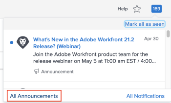

# Envoyer des annonces

En tant qu’administrateur Adobe Workfront, vous pouvez utiliser la page Annonces pour envoyer des annonces aux utilisateurs.

Les messages d’annonce de Workfront incluent généralement des informations sur les nouvelles fonctionnalités et versions, les modifications de processus, etc.

Pour plus d’informations sur l’affichage des annonces, voir [Affichage et gestion des notifications in-app](../../workfront-basics/using-notifications/view-and-manage-in-app-notifications.md).

## Conditions d’accès

+++ Développez pour afficher les exigences d’accès aux fonctionnalités de cet article.

Vous devez disposer des accès suivants pour effectuer les étapes de cet article :

<table style="table-layout:auto"> 
 <col> 
 <col> 
 <tbody> 
  <tr> 
   <td role="rowheader">Forfait Adobe Workfront</td> 
   <td>N’importe quelle</td> 
  </tr> 
  <tr> 
   <td role="rowheader">Licence Adobe Workfront</td> 
   <td>Plan</td> 
  </tr> 
  <tr> 
   <td role="rowheader">Configurations du niveau d’accès</td> 
   <td> 
Vous devez être un administrateur Workfront. Pour plus d’informations, voir <a href="../../administration-and-setup/add-users/configure-and-grant-access/grant-a-user-full-administrative-access.md" class="MCXref xref">Octroyer un accès administratif intégral pour les utilisateurs et utilisatrices</a>.
 
<b>REMARQUE</b> : si vous n’avez toujours pas l’accès, demandez à votre administrateur ou administratrice Workfront si des restrictions supplémentaires à votre niveau d’accès ont été appliquées. Pour plus d’informations sur la façon dont un administrateur ou une administratrice Workfront peut modifier votre niveau d’accès, voir <a href="../../administration-and-setup/add-users/configure-and-grant-access/create-modify-access-levels.md" class="MCXref xref">Créer ou modifier les niveaux d’accès personnalisés</a>.
 </td> 
  </tr> 
 </tbody> 
</table>

+++

## Envoyer des annonces aux utilisateurs

Vous pouvez utiliser la page **Annonces** pour communiquer avec les utilisateurs de votre système Workfront en transférant les annonces envoyées depuis Workfront et en composant de nouvelles annonces. Vous pouvez envoyer des annonces à des utilisateurs, des groupes, des équipes ou des sociétés spécifiques de votre système Workfront.

* [Transférer les annonces Workfront aux utilisateurs](#forward-workfront-announcements-to-users)
* [Composition de nouvelles annonces](#compose-new-announcements)

### Transférer les annonces Workfront aux utilisateurs {#forward-workfront-announcements-to-users}

Vous pouvez facilement transférer les messages que vous recevez de Workfront vers les utilisateurs de votre système.

1. Accédez à la page des annonces en cliquant sur l’icône **Notification** dans le coin supérieur droit de l’interface de Workfront, puis cliquez sur **Toutes les annonces**.

   

1. Sur la page **Annonces**, sélectionnez le message à transférer.
1. Cliquez sur **Forward**.
1. Dans la zone **Envoyer à**, commencez à saisir le nom d’un utilisateur, d’un groupe, d’une équipe ou d’une société qui souhaite recevoir le message d’annonce, puis cliquez sur le nom lorsqu’il apparaît dans la liste déroulante. Répétez cette procédure pour ajouter plusieurs utilisateurs, groupes, équipes ou entreprises.

   Ou

   Pour transférer l’annonce à tous les utilisateurs de votre système, commencez à saisir **Tout le monde**, puis cliquez dessus lorsqu’il apparaît dans la liste déroulante.

1. Passez à l’étape 3 de la section [Composer les nouvelles annonces](#compose-new-announcements).

### Composition de nouvelles annonces {#compose-new-announcements}

1. Accédez à la page des annonces en cliquant sur l’icône **Notification** dans le coin supérieur droit de l’interface de Workfront, puis cliquez sur **Toutes les annonces**.

   

1. Sur la page **Annonces**, cliquez sur **Nouvelle annonce.**

1. Dans la zone **Envoyer à**, commencez à saisir le nom d’un utilisateur, d’un groupe, d’une équipe ou d’une société qui souhaite recevoir le message d’annonce, puis cliquez sur le nom lorsqu’il apparaît dans la liste déroulante. Répétez cette procédure pour ajouter plusieurs utilisateurs, groupes, équipes ou entreprises.

   Par défaut, lors de l’envoi d’un nouveau message d’annonce, **Tout le monde** est prérenseigné dans ce champ. Si vous ne souhaitez pas que tous les utilisateurs de votre système reçoivent le message d’annonce, supprimez **Tout le monde** de la liste.

1. Indiquez les informations supplémentaires suivantes :

   | Objet | Indiquez l’objet de l’annonce. |
   |---|---|
   | Saisissez le message ici. | Indiquez le contenu de votre message. L’éditeur de messages vous permet d’inclure des balises communes, notamment le gras, l’italique, le soulignement, les listes à puces et numérotées, ainsi que des hyperliens. |
   | Pièces jointes | Cliquez sur **Ajouter une pièce jointe,** , puis recherchez et sélectionnez le fichier à joindre au message. |

   {style="table-layout:auto"}

1. (Facultatif) Cliquez sur **Enregistrer en tant que brouillon** pour enregistrer le message (y compris la liste de destinataires, l’objet et les pièces jointes) en tant que brouillon.

1. (Facultatif) Pour afficher un brouillon, dans la zone **Annonces**, cliquez sur **Brouillons**.

1. Cliquez sur **Envoyer.**

   Les utilisateurs peuvent désormais afficher le message d’annonce, comme décrit dans [Affichage et gestion des notifications in-app](../../workfront-basics/using-notifications/view-and-manage-in-app-notifications.md).

## Limitez les types d’annonces Workfront que vous recevez

Si vous êtes administrateur Workfront, vous pouvez vous désabonner de la réception de certains types de messages.

Par défaut, vous recevez tous les messages envoyés depuis Workfront. Il s’agit de la configuration recommandée.

1. Sur la page **Annonces**, cliquez sur **Paramètres.**
1. Sélectionnez les rubriques pour lesquelles vous ne souhaitez plus recevoir de messages.
1. Cliquez sur **Enregistrer les paramètres.**
