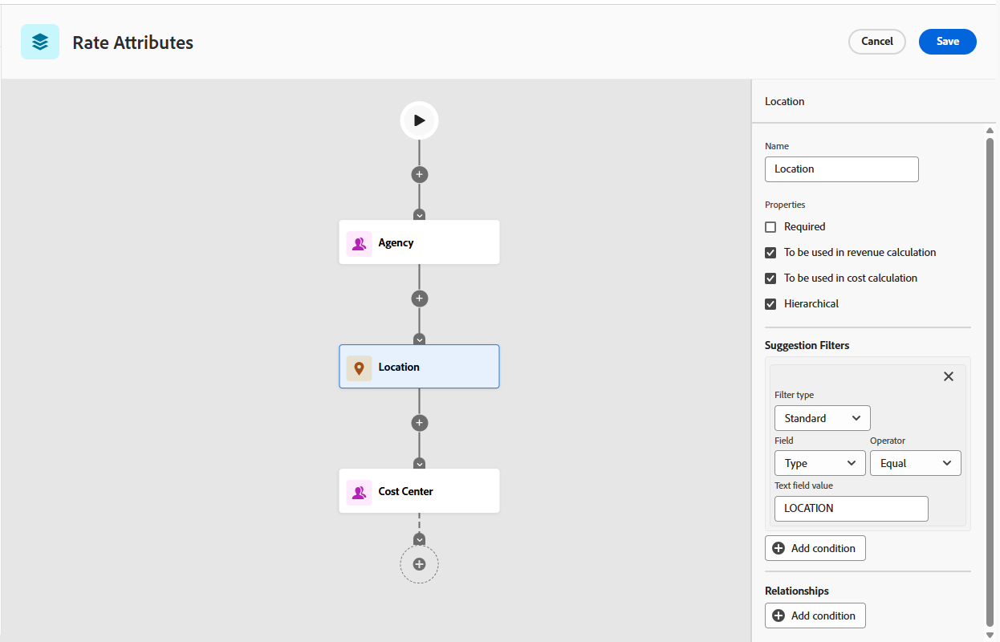

# Définir les attributs de taux

Les attributs de taux étendent la fonctionnalité de carte tarifaire et de taux d’Adobe Workfront en vous permettant d’ajouter des dimensions supplémentaires aux taux au-delà de la fonction. Cela est essentiel pour les agences et les entreprises dont les taux varient non seulement en fonction de la fonction, mais également de facteurs tels que l’agence, l’emplacement, la marque, le centre de coûts ou d’autres facteurs.
En combinant ces attributs, Workfront peut sélectionner automatiquement le taux correct pour les affectations, assurant ainsi la précision et la cohérence financières entre les projets.

>[!IMPORTANT]
>
>Les attributs de taux sont une configuration de base unique.

Une fois que les attributs sont activés et appliqués aux cartes tarifaires et aux taux, leur modification ultérieure peut compromettre l’intégrité des données dans l’ensemble de votre configuration financière.

## Présentation des attributs de taux

Les attributs de taux sont considérés comme une configuration ponctuelle, car :

* Une fois activés, les attributs font partie du modèle de données financières.
* Les taux, les affectations, les valeurs prévues et les valeurs réelles dépendent toutes des valeurs d&#39;attribut choisies.
* La modification ultérieure des attributs (changement de nom, suppression ou réorganisation) peut entraîner :

   * Perte du lien entre les taux et les attributs
   * Taux non valides ou « orphelins »
   * Désalignement dans la facturation et le reporting

Pour ces raisons, les attributs doivent être soigneusement conçus lors de votre implémentation Workfront initiale et laissés inchangés par la suite.

### Objets utilisés comme attributs de taux

Workfront prend actuellement en charge trois objets système qui peuvent être utilisés comme attributs de taux :

* **Groupe** : souvent renommé _Agence_ ou _Unité opérationnelle_.
* **Société** : peut représenter _Marque_, _Client_ ou _Client_.
* **Emplacement** : généralement utilisé comme _marché_, _région_ ou _bureau_.

  L’emplacement est défini de manière hiérarchique jusqu’à 3 niveaux. (Exemple : si vous définissez « Emplacement » sur Los Angeles, la Californie et les États-Unis seront également utilisés dans les correspondances de taux.)

Chaque objet peut être renommé pour correspondre à la terminologie de votre organisation lorsque vous configurez vos attributs.
Par exemple :

* Libellé « Agence » = Référence d’objet de groupe
* Libellé « Centre de coûts » = Référence d&#39;objet de sous-groupe
* Libellé « Emplacement » = Référence d’objet d’emplacement.

Cela permet à la configuration de refléter votre structure d’entreprise tout en préservant l’intégrité du modèle de données Workfront.

### Remarques sur les attributs de taux dans Workfront

* Workfront prend en charge jusqu’à 5 niveaux d’attributs. Le système suit toujours la hiérarchie des attributs, sélectionnant la correspondance la plus spécifique disponible.

   * 0 = taux de base générique
   * 1 - 5 = taux de plus en plus spécifiques

* Vous pouvez renommer les attributs en fonction de votre activité (agence, marque, marché, centre de coûts, etc.).
* La configuration est unique : la modification ultérieure des attributs risque de compromettre l’intégrité des données financières.
* Les attributs qui ne sont référencés nulle part dans le système peuvent être supprimés en toute sécurité.

  Cependant, si un attribut est déjà utilisé (référencé dans les cartes tarifaires, les profils utilisateur, les ressources ou les affectations), la suppression est bloquée pour protéger l’intégrité des données. Dans ce cas, toute tentative de suppression de l’attribut, en particulier par le biais d’un appel API, entraînera une erreur.

* Tester avant la mise en production : créez une carte tarifaire pilote et vérifiez que les taux corrects sont résolus dans les affectations.
* Documentez votre configuration : partagez la configuration de vos attributs de taux avec vos équipes afin qu’elles comprennent le fonctionnement des taux.

### Où les attributs de taux peuvent être appliqués

Les attributs de taux sont pris en charge dans toutes les zones où des taux existent dans Workfront :

* Cartes tarifaires : permettent de définir des taux par fonction et attributs.
* Remplacements au niveau du projet : appliquez des attributs lors du remplacement des taux au niveau du projet.
* Fonctions (dans la configuration) : définissez les taux de fonctions par défaut avec des attributs.
* Utilisateurs (profils utilisateur) : attribuez des attributs natifs à des utilisateurs individuels, de sorte que leurs affectations soient automatiquement résolues aux taux corrects.

<!--
BULLET POINT Staffing plan resources
BULLET POINT Non-labor resources: Attributes can also be defined on resources such as equipment or services.-->

<!--Non-labor resource categories and -->Les fonctions ne prennent pas en charge les attributs de taux directement au niveau de l’objet. Ils sont connectés aux attributs de taux par le biais des taux qui y sont définis.

Lorsque vous pouvez créer des affectations d’espace réservé liées aux valeurs d’attribut correctes, vos taux sont renseignés en conséquence.

* Pour les fonctions, lorsque vous remplacez ultérieurement l’espace réservé par un utilisateur réel, le système réinitialise automatiquement les attributs de l’affectation sur ceux définis sur le profil de cet utilisateur. À ce stade, les attributs ne peuvent plus être modifiés au niveau de l’affectation. Ils héritent de l’utilisateur pour préserver la cohérence et empêcher le décalage entre les attributs utilisateur et les taux appliqués.

<!-- BULLET POINT For non-labor resource categories, placeholder assignments can be used similarly: You assign the category through a placeholder that carries the required attributes. Once the actual non-labor resource is substituted, the attributes are automatically pulled from the resource's profile. Just like with users, these attributes cannot be overridden manually at the assignment level, ensuring financial data integrity and preventing accidental mismatches between resources and their designated attributes.-->

## Conditions d’accès

+++ Développez pour afficher les exigences d’accès aux fonctionnalités de cet article.

<table style="table-layout:auto"> 
 <col> 
 <col> 
 <tbody> 
  <tr> 
   <td>[!DNL Adobe Workfront] paquet</td> 
   <td>Workflow Ultimate</td> 
  </tr> 
  <tr> 
   <td>[!DNL Adobe Workfront] licence</td> 
   <td>
[!UICONTROL Standard]
</td>
  </tr> 
  <tr> 
   <td>Configurations des niveaux d’accès</td> 
   <td>[!UICONTROL System Administrator]</td> 
  </tr> 
 </tbody> 
</table>

Pour plus d’informations, voir [Conditions d’accès requises dans la documentation Workfront](/help/quicksilver/administration-and-setup/add-users/access-levels-and-object-permissions/access-level-requirements-in-documentation.md).

+++

## Configurer les attributs de taux

Chaque attribut possède un ensemble d’options configurables, y compris des propriétés générales et des filtres.
Les filtres contrôlent la manière dont les valeurs d’attribut sont suggérées et validées lors de la définition des taux. Ils sont essentiels pour garantir la cohérence des sélections d’attributs, guider les utilisateurs et utilisatrices vers des options valides et empêcher les combinaisons non valides.

{{step-1-to-setup}}

1. Dans le panneau de gauche, cliquez sur **Attributs de taux**.
1. Cliquez sur une icône représentant un signe plus dans le diagramme pour ajouter un attribut.

   >[!NOTE]
   >
   >Le diagramme peut contenir jusqu’à cinq attributs. L’ordre de haut en bas définit la hiérarchie de l’application des attributs. Cliquez sur l’icône **Rotation**  pour afficher le diagramme de gauche à droite. Vous pouvez également effectuer un zoom avant ou arrière et ajuster le diagramme à l’écran.

1. Sélectionnez un attribut pour ouvrir le panneau de configuration à droite de l’écran.

   

1. Renommez les objets (Groupe, Société, Lieu) en termes adaptés à votre entreprise (Agence, Lieu, Centre de coûts, etc.).
1. Cliquez sur **Enregistrer** sur chaque attribut pour enregistrer votre convention de nommage.

   Les noms de ces attributs seront affichés sur toutes les cartes et tous les taux du système.

1. Définissez les propriétés de chaque attribut du panneau de configuration :

   * **Obligatoire** : indiquez si l’attribut est un champ obligatoire sur les taux.
   * **À utiliser dans le calcul des revenus** : inclut cet attribut dans les calculs des taux de facturation.
   * **A utiliser dans le calcul des coûts** : Inclut cet attribut dans les calculs des taux de coût.

     >[!NOTE]
     >
     >Au moins une des options de calcul doit être sélectionnée pour que l&#39;attribut fonctionne dans les calculs financiers.

   * (Facultatif) **Hiérarchique** : permet à l’attribut de respecter les relations parent-enfant, telles que Ville > État > Pays.

     Cette propriété est disponible uniquement pour l’objet Location.

### Définir des filtres pour les attributs

Deux types de filtres sont disponibles pour les attributs :

* Les filtres de suggestions réduisent la liste des options disponibles en fonction de la logique du système ou des sélections d’attributs précédentes. Ils rendent les listes déroulantes contextuelles sensibles et faciles à utiliser.

  Exemple : Agence > Emplacement > Centre De Coûts

  Dans cette configuration, l&#39;attribut Centre de coûts doit avoir un filtre de suggestions qui fait référence à la fois à l&#39;agence et au lieu.

  Lors de l’ajout d’un taux, si vous sélectionnez d’abord Agence = « Étoile », la liste déroulante Emplacement ne propose que des emplacements appartenant à « Étoile ».

  Si vous sélectionnez ensuite Emplacement = Chicago sur le taux, la liste déroulante Centre de coûts ne suggérera que les Centres de coûts liés à « Étoile » et à Chicago.

* Les filtres de relation établissent la chaîne de dépendance entre les attributs. Elles garantissent que le système comprend la manière dont les attributs sont liés les uns aux autres et appliquent des dépendances valides.

  Exemple : Agence > Emplacement > Centre De Coûts

  Dans cette configuration, l&#39;attribut Agence doit avoir un filtre de relation qui le lie à des emplacements et des centres de coûts valides.

Les filtres doivent toujours être configurés dans les deux directions. Si l’attribut A possède un filtre de relation avec l’attribut B, l’attribut B doit avoir un filtre de suggestion pour l’attribut A. Cela garantit l’intégrité des données et une expérience utilisateur épurée.

1. Sélectionnez les options pour définir les filtres de suggestion et les filtres de relation pour l’attribut dans le panneau de configuration :

   * **Type de filtre** :

      * Un filtre **Standard** applique une condition universelle à l’objet d’attribut. Par exemple, Emplacement > Est actif = Vrai (seuls les emplacements actifs seront affichés).

        Le filtre Standard est toujours appliqué, que d’autres attributs soient sélectionnés ou non.

      * Un filtre **Attribut** lie un attribut à un autre dans la chaîne. Par exemple, Emplacement > Référence = Agence (seuls les emplacements liés à l’agence sélectionnée s’affichent).

        Le filtre Attribut n’est appliqué que si l’attribut référencé possède une valeur. Par exemple, si Agence est sélectionné, seuls des emplacements valides sont suggérés. Si Agence est vide, tous les emplacements sont affichés (mais peuvent toujours être limités par les filtres standard appliqués à l’emplacement).

   * **Champ** : champ direct de l’objet d’attribut, tel que l’ID d’emplacement ou l’indicateur actif.
   * **Opérateur** : ces options dépendent du type de champ sélectionné. Exemples : Est égal à, N’est pas égal à, Est vide, Vrai/Faux.
   * (Type de filtre standard uniquement) **Valeur** : par exemple, Est actif = Vrai.
   * (Type de filtre Attribut uniquement) **Référence** : attribut dont dépend ce filtre, par exemple Agence.
   * (Type de filtre Attribut uniquement) **Champ de référence** : champ de l’attribut référencé qui doit correspondre, tel que l’ID d’agence.

1. Cliquez sur **Enregistrer** sur chaque attribut pour enregistrer les propriétés et les filtres.
