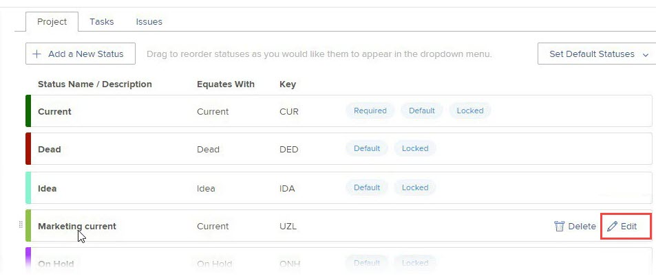

# Création ou modification d’un état de groupe

En tant qu’administrateur de groupe, vous pouvez créer des états personnalisés pour un groupe que vous gérez. Cela permet d’éliminer le besoin de dizaines d’états personnalisés à l’échelle de l’entreprise et d’accroître l’autonomie de vos hiérarchies de groupe.

Vous pouvez également modifier l’état au niveau du système d’un groupe que vous gérez si un administrateur Workfront l’a déverrouillé. Pour plus d’informations, voir [États au niveau du système verrouillés et déverrouillés](../../../administration-and-setup/customize-workfront/creating-custom-status-and-priority-labels/lock-or-unlock-a-custom-system-level-status.md).

S’il existe des groupes au-dessus de votre groupe, leurs administrateurs peuvent également effectuer ces opérations pour votre groupe. Il en va de même pour les administrateurs de Workfront (pour n’importe quel groupe).

>[!NOTE]
>
>Les statuts de groupe personnalisés ne peuvent pas être affichés sur un projet lors de l’affichage du projet dans une vue agile. Seuls les états verrouillés par défaut et personnalisés sont visibles lors de l’affichage d’un projet dans une vue agile. Pour plus d’informations sur la personnalisation d’une vue agile pour un projet, voir la section [Création ou personnalisation d’une vue agile](../../../reports-and-dashboards/reports/reporting-elements/views-overview.md#customizing-an-agile-view) dans l’article [Présentation des vues dans Adobe Workfront](../../../reports-and-dashboards/reports/reporting-elements/views-overview.md).

Pour obtenir des informations générales sur les états, voir [Présentation des états](../../../administration-and-setup/customize-workfront/creating-custom-status-and-priority-labels/statuses-overview.md).

## Exigences d’accès

Les étapes de cet article doivent être les suivantes :

<table style="table-layout:auto"> 
 <col> 
 <col> 
 <tbody> 
  <tr> 
   <td role="rowheader">Formule Workfront*</td> 
   <td>Tous</td> 
  </tr> 
  <tr> 
   <td role="rowheader">Licence Adobe Workfront*</td> 
   <td> 
Plan 
 
Vous devez être un administrateur de groupe du groupe ou un administrateur Workfront. Pour plus d’informations, voir <a href="../../../administration-and-setup/manage-groups/group-roles/group-administrators.md" class="MCXref xref">Administrateurs de groupe</a> et <a href="../../../administration-and-setup/add-users/configure-and-grant-access/grant-a-user-full-administrative-access.md" class="MCXref xref">Octroi d’un accès administratif complet à un utilisateur</a>.
 </td> 
  </tr> 
 </tbody> 
</table>

&#42;Si vous devez savoir quel plan ou type de licence vous avez, contactez votre administrateur Workfront.

## Création ou modification d’un état pour un groupe

1. Cliquez sur le bouton **Menu Principal** icon  dans le coin supérieur droit d’Adobe Workfront, puis cliquez sur **Configuration** .

1. Dans le panneau de gauche, cliquez sur **Groupes** .

1. Cliquez sur le nom du groupe dans lequel vous souhaitez créer ou personnaliser des états.
1. Dans le panneau de gauche, cliquez sur **Statuts**.

   Si le groupe que vous affichez est un groupe de niveau supérieur, la liste qui s’affiche comprend les éléments suivants :

   * États verrouillés au niveau du système.
   * Statuts personnalisés déjà créés pour le groupe.

   En outre, si le groupe que vous affichez est un sous-groupe, la liste comprend également :

   * Statuts verrouillés appartenant aux groupes situés au-dessus du sous-groupe.
   * Les états déverrouillés qui appartenaient aux groupes situés au-dessus du sous-groupe lors de sa création.

      Une fois qu’un sous-groupe est créé, les états déverrouillés créés dans les groupes ci-dessus ne sont pas inclus dans la liste des états du sous-groupe. Cependant, si quelqu’un verrouille l’un d’eux plus tard, il est alors inclus dans la liste d’état du sous-groupe. Pour plus d’informations, voir [Comment les groupes héritent des états](../../../administration-and-setup/manage-groups/manage-group-statuses/how-groups-inherit-statuses.md).

1. Sélectionnez l’onglet du type d’objet (**Projet**, **Tâches** ou **Problèmes**) que vous souhaitez associer à l’état .

1. (Conditionnel) Si l’état est problématique, assurez-vous que la variable **Liste des Principal** est sélectionnée.

   

   Pour plus d’informations sur la personnalisation des autres types de problèmes (rapport de bogues, ordre de modification, problème, requête), voir [Personnalisation des types de problèmes par défaut](../../../administration-and-setup/set-up-workfront/configure-system-defaults/customize-default-issue-types.md).

1. (Conditionnel) Pour créer un état, cliquez sur **Ajouter un nouvel état**.

   Ou

   Pour modifier un état existant, placez le pointeur de la souris sur l’état que vous souhaitez modifier, puis cliquez sur le bouton **Modifier** qui s’affiche à l’extrême droite.

   

   >[!NOTE]
   >Vous ne pouvez modifier l’état de votre groupe que si :
   >      
   >* Vous gérez le groupe pour lequel l’état a été créé.
   >* Un administrateur Workfront a déverrouillé l’état au niveau du système.
   >* Un administrateur de groupe d’un groupe situé au-dessus de votre groupe a déverrouillé l’état .

   >      
   >      
   >Lorsque vous modifiez un état existant, vous ne pouvez modifier que son nom, sa description et sa couleur.
   >
   >Lorsque vous modifiez l’état verrouillé, vos modifications affectent tous les sous-groupes qui ont hérité de l’état de votre groupe.
   >   
   >A l’inverse, la modification d’un état déverrouillé n’affecte pas les sous-groupes qui ont hérité de l’état de votre groupe.

1. Indiquez les informations suivantes.

   Si vous modifiez un état, seuls les 3 premiers paramètres peuvent être modifiés.

   <table style="table-layout:auto"> 
    <col> 
    <col> 
    <tbody> 
     <tr> 
      <td role="rowheader">Nom du statut</td> 
      <td> 
Saisissez le nom de l’état. Champ obligatoire.
 
Lorsque vous créez un nom d’état, sachez que d’autres utilisateurs du système peuvent créer un état portant le même nom. Il est recommandé d’utiliser un nom unique afin d’éviter toute confusion lors de la sélection d’états dans Workfront.
 </td> 
     </tr> 
     <tr> 
      <td role="rowheader">Description</td> 
      <td>(Facultatif) Saisissez une description de l’état. Cela communique son but à ceux qui l'utilisent.</td> 
     </tr> 
     <tr> 
      <td role="rowheader">Couleur</td> 
      <td> 
Personnalisez la couleur de l’état en cliquant sur le champ de couleur et en sélectionnant une couleur dans le panneau d’échantillon. Vous pouvez également saisir un nombre hexadécimal dans le champ.
 
La couleur d’état s’affiche dans le coin supérieur droit de Workfront lorsqu’un utilisateur affiche l’objet.
 
  
 </td> 
     </tr> 
     <tr> 
      <td role="rowheader">Équivaut à</td> 
      <td> 
Sélectionnez l’une des options de la liste qui décrit le mieux la fonction de l’état. Par exemple, si le nom de l’état est Terminé, l’option à laquelle il correspond doit être Terminé.
 
Chaque état doit correspondre à l’une de ces options, car cela détermine le fonctionnement de l’état.
 
Cette option ne peut pas être modifiée une fois l’état créé.
 </td> 
     </tr> 
     <tr> 
      <td role="rowheader">Clé</td> 
      <td> 
Si vous créez un état, saisissez un code ou une abréviation pour le statut ou utilisez celui généré pour vous. Cette clé doit être unique dans Workfront, car elle peut être utilisée à des fins de création de rapports. Si vous essayez de spécifier une clé déjà utilisée dans le système, le champ devient rouge.
 
Il peut s’avérer utile d’utiliser une abréviation reconnaissable par ceux qui l’utiliseront.
 
Cette option ne peut pas être modifiée une fois l’état créé.
 
Vous ne pouvez pas modifier le code clé des états Planification, Actuel et Terminé. Ceci est important si vous créez un rapport en mode texte.
 </td> 
     </tr> 
     <tr> 
      <td role="rowheader">Masquer l’état</td> 
      <td> 
(Statuts des projets et des tâches uniquement)
 
Activez cette option si vous souhaitez que l’état soit masqué aux utilisateurs. Lorsqu’il est désactivé (paramètre par défaut), tous les sous-groupes situés sous le groupe peuvent utiliser l’état .
 
Conseil : Vous pouvez masquer l’état d’un problème en désactivant les 4 types de problème (rapport de bogues, ordre de modification, problème, requête).
 </td> 
     </tr> 
     <tr> 
      <td role="rowheader">Verrouiller pour tous les groupes</td> 
      <td> 
       
Si vous laissez cette option activée, les utilisateurs de votre groupe et de ses sous-groupes peuvent afficher et utiliser l’état et les administrateurs de groupe ne peuvent pas la personnaliser pour les sous-groupes inférieurs.
 
       
Lorsque cette option est désactivée, les administrateurs de groupe peuvent personnaliser l’état des sous-groupes inférieurs.
 
       
<b>REMARQUE</b>: Vous pouvez utiliser les états verrouillés et déverrouillés dans un processus d’approbation de groupe. Si vous créez un processus d’approbation de groupe avec le statut de groupe déverrouillé, les utilisateurs peuvent associer le processus d’approbation à n’importe quel projet, tâche ou problème associé au groupe.
 
       
Pour plus d’informations sur le verrouillage des états, voir <a href="../../../administration-and-setup/manage-groups/manage-group-statuses/lock-or-unlock-a-custom-group-status.md" class="MCXref xref">Statuts de groupe verrouillés et déverrouillés</a>.
 
       </td> 
     </tr>
    </tbody> 
   </table>

1. Cliquer sur **Enregistrer**.

   L’état est désormais disponible pour tous les projets associés à votre groupe ou sous-groupe. Si vous l’avez verrouillé, il est disponible pour tous les sous-groupes inférieurs.

   Vous pouvez configurer l’état comme état par défaut pour le groupe. Pour plus d’informations, voir [Utiliser un état personnalisé comme état par défaut pour un groupe](../../../administration-and-setup/manage-groups/manage-group-statuses/use-custom-statuses-as-default-statuses-group.md).

## Création d’un état personnalisé pour plusieurs groupes

Si vous êtes administrateur de Workfront, vous pouvez créer un état personnalisé pour plusieurs groupes en créant un état à l’échelle du système, puis en masquant cet état à tous les groupes qui n’en ont pas besoin.

Si vous êtes administrateur de groupe (ou administrateur Workfront), vous pouvez créer un état personnalisé pour plusieurs sous-groupes au sein d’une hiérarchie de groupes que vous gérez en créant un état pour un groupe de niveau supérieur, puis en masquant cet état auprès des sous-groupes inférieurs qui n’en ont pas besoin.

1. Si vous êtes administrateur de Workfront, créez un état de déverrouillage à l’échelle du système, comme décrit à la section [Création ou modification d’un état](../../../administration-and-setup/customize-workfront/creating-custom-status-and-priority-labels/create-or-edit-a-status.md).
1. Dans la zone située dans le coin supérieur droit, supprimez **États du système**, commencez à saisir le nom d’un groupe dans lequel vous souhaitez masquer l’état, puis cliquez sur le nom qui s’affiche.
1. Pointez sur l’état que vous souhaitez masquer du groupe, puis cliquez sur **Modifier** lorsqu’il apparaît.

   

1. Activez la variable **Masquer l’état** qui s’affiche.

   

1. Cliquer sur **Enregistrer**.

   L’état est grisé et n’est plus visible pour tous les utilisateurs de ce groupe.

1. Répétez les étapes 3 à 5 pour masquer l’état personnalisé de tous les autres groupes qui n’en ont pas besoin.
