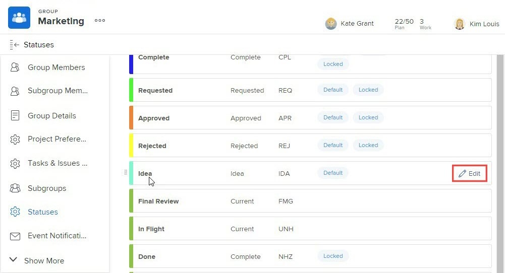

# Créer ou modifier un statut de groupe

En tant qu’administrateur ou administratrice de groupe, vous pouvez créer des statuts personnalisés pour un groupe que vous gérez. Cela permet d’éliminer le besoin de dizaines de statuts personnalisés à l’échelle de l’entreprise et d’accroître l’autonomie de vos hiérarchies de groupe.

Vous pouvez également modifier le statut au niveau du système d’un groupe que vous gérez si l’administration de Workfront a déverrouillé le statut. Pour plus d’informations, consultez la section [Statuts au niveau du système verrouillés et déverrouillés](../../../administration-and-setup/customize-workfront/creating-custom-status-and-priority-labels/lock-or-unlock-a-custom-system-level-status.md).

S’il existe des groupes au-dessus de votre groupe, leurs administrateurs ou administratrices peuvent également effectuer ces opérations pour votre groupe. Il en va de même pour l’administration de Workfront (pour n’importe quel groupe).

>[!NOTE]
>
>Les statuts de groupe personnalisés ne peuvent pas être affichés sur un projet lors de la consultation du projet dans une vue Agile. Seuls les statuts verrouillés par défaut et personnalisés sont visibles lors de l’affichage d’un projet dans une vue Agile. Pour plus d’informations sur la personnalisation d’une vue Agile pour un projet, consultez la section [Créer ou personnaliser une vue Agile](/help/quicksilver/reports-and-dashboards/reports/reporting-elements/create-edit-views.md#create-or-customize-an-agile-view) dans l’article [Créer ou modifier des vues dans Adobe Workfront](/help/quicksilver/reports-and-dashboards/reports/reporting-elements/create-edit-views.md).

Pour obtenir des informations générales sur les états, consultez la section [Vue d’ensemble des statuts](../../../administration-and-setup/customize-workfront/creating-custom-status-and-priority-labels/statuses-overview.md).

## Conditions d’accès

Vous devez disposer des éléments suivants pour effectuer les étapes décrites dans cet article :

<table style="table-layout:auto"> 
 <col> 
 <col> 
 <tbody> 
  <tr> 
   <td role="rowheader">Plan Workfront*</td> 
   <td>N’importe quelle</td> 
  </tr> 
  <tr> 
   <td role="rowheader">Licence Adobe Workfront*</td> 
   <td> 
Plan 
 
Vous devez être un administrateur ou une administratrice de groupe pour le groupe ou un administrateur ou une administratrice de Workfront. Pour plus d’informations, consultez les sections <a href="../../../administration-and-setup/manage-groups/group-roles/group-administrators.md" class="MCXref xref">Administrateurs et administratrices de groupe</a> et <a href="../../../administration-and-setup/add-users/configure-and-grant-access/grant-a-user-full-administrative-access.md" class="MCXref xref">Accorder l’accès administratif complet à une personne</a>.
 </td> 
  </tr> 
 </tbody> 
</table>

&#42;Pour savoir votre plan ou type de licence, contactez l’administration de Workfront.

## Créer ou modifier un statut pour un groupe

1. Cliquez sur l’icône **Menu principal**  dans le coin supérieur droit d’Adobe Workfront, puis sur **Configuration** .

1. Dans le panneau de gauche, cliquez sur **Groupes** .

1. Cliquez sur le nom du groupe dans lequel vous souhaitez créer ou personnaliser des statuts.
1. Dans le panneau de gauche, cliquez sur **Statuts**.

   Si le groupe que vous affichez est un groupe de niveau supérieur, la liste qui s’affiche comprend les éléments suivants :

   * Statuts verrouillés au niveau du système
   * Statuts personnalisés déjà créés pour le groupe

   En outre, si le groupe que vous affichez est un sous-groupe, la liste comprend également :

   * Statuts verrouillés appartenant aux groupes situés au-dessus du sous-groupe
   * Les statuts déverrouillés qui appartenaient aux groupes situés au-dessus du sous-groupe lors de sa création.

     Une fois qu’un sous-groupe est créé, les statuts déverrouillés créés dans les groupes ci-dessus ne sont pas inclus dans la liste des statuts du sous-groupe. Cependant, si une personne verrouille l’un d’eux plus tard, il est alors inclus dans la liste de statuts du sous-groupe. Pour plus d’informations, consultez la section [Héritage de statuts par les groupes](../../../administration-and-setup/manage-groups/manage-group-statuses/how-groups-inherit-statuses.md).

1. Sélectionnez l’onglet du type d’objet (**Projet**, **Tâche** ou **Problèmes**) que vous souhaitez associer au statut.

1. (Le cas échéant) Si le statut est problématique, assurez-vous de sélectionner **Liste principale des statuts**.

   

   Pour plus d’informations sur la personnalisation des autres types de problèmes (rapport de bugs, ordre de modification, problème, demande), consultez la section [Personnaliser les types de problèmes par défaut](../../../administration-and-setup/set-up-workfront/configure-system-defaults/customize-default-issue-types.md).

1. (Le cas échéant) Pour créer un statut, cliquez sur **Ajouter un nouveau statut**.

   Ou

   Pour modifier un staut existant, placez le pointeur de la souris sur le statut à modifier, puis cliquez sur l’option **Modifier** qui s’affiche à l’extrême droite.

   

   >[!NOTE]
   >Vous ne pouvez modifier le statut de votre groupe que si vous répondez aux exigences suivantes :
   >      
   >* Vous gérez le groupe pour lequel le statut a été créé.
   >* Un administrateur ou une administratrice de Workfront a déverrouillé le statut au niveau du système.
   >* Un administrateur ou une administratrice de groupe pour un groupe situé au-dessus de votre groupe a déverrouillé le statut.
   >      
   >      
   >Lorsque vous modifiez un statut existant, vous ne pouvez modifier que son nom, sa description et sa couleur.
   >
   >Lorsque vous modifiez un statut verrouillé, les modifications affectent tous les sous-groupes qui ont hérité du statut de votre groupe.
   >   
   >A l’inverse, les modifications apportées à un statut déverrouillé n’affectent pas les sous-groupes qui ont hérité du statut de votre groupe.

1. Indiquez les informations suivantes.

   Si vous modifiez un statut, seuls les 3 premiers paramètres peuvent être modifiés.

   <table style="table-layout:auto"> 
    <col> 
    <col> 
    <tbody> 
     <tr> 
      <td role="rowheader">Nom du statut</td> 
      <td> 
Saisissez un nom pour ce modèle... Il s’agit d’un champ obligatoire.
 
Lorsque vous créez un nom de statut, tenez compte du faut que d’autres personnes du système peuvent créer un statut homographe. Il est recommandé d’utiliser un nom unique afin d’éviter toute confusion lors de la sélection de statuts dans Workfront.

En cas de statuts en double, l’administrateur ou l’administratrice de groupe doit mettre à jour les noms pour les différencier. Le seul élément unique du système est la clé de statut.
 </td> 
     </tr> 
     <tr> 
      <td role="rowheader">Description</td> 
      <td>(Facultatif) Fournissez une description du statut. Les personnes qui l’utilisent seront ainsi informées de sa finalité.</td> 
     </tr> 
     <tr> 
      <td role="rowheader">Couleur</td> 
      <td> 
Personnalisez la couleur du statut en cliquant sur le champ de couleur et en sélectionnant une couleur dans le panneau d’échantillon. Vous pouvez également saisir un nombre hexadécimal dans le champ.
 
La couleur de statut s’affiche dans le coin supérieur droit de Workfront lorsqu’une personne affiche l’objet.
 
  
 </td> 
     </tr> 
     <tr> 
      <td role="rowheader">Équivaut à</td> 
      <td> 
Sélectionnez l’une des options de la liste qui décrit le mieux la fonction du statut. Par exemple, si le nom du statut est Terminé, l’option à laquelle il correspond doit être Terminé.
 
Chaque statut doit correspondre à l’une de ces options, car cela détermine le fonctionnement du statut.
 
Cette option ne peut pas être modifiée une fois le statut créé.
 </td> 
     </tr> 
     <tr> 
      <td role="rowheader">Clé</td> 
      <td> 
Si vous créez un statut, saisissez un code ou une abréviation pour le statut ou utilisez celui généré pour vous. Cette clé doit être unique dans Workfront, car elle peut être utilisée à des fins de création de rapports. Si vous essayez de spécifier une clé déjà utilisée dans le système, le champ devient rouge.
 
Il peut s’avérer utile d’utiliser une abréviation reconnaissable par les personnes qui l’utiliseront.
 
Cette option ne peut pas être modifiée une fois le statut créé.
 
Vous ne pouvez pas modifier le code clé des statuts Planification, En cours et Terminé. Tenez-en compte lorsque vous créez un rapport en mode texte.
 </td> 
     </tr> 
     <tr> 
      <td role="rowheader">Masquer le statut</td> 
      <td> 
(Statuts des projets et des tâches uniquement)
 
Activez cette option si vous souhaitez que l’état soit masqué aux utilisateurs et utilisatrices. Lorsque cette option est désactivée (paramètre par défaut), tous les sous-groupes situés sous le groupe peuvent utiliser le statut.
 
Conseil : vous pouvez masquer le statut d’un problème en désactivant les 4 types de problèmes (rapport de bugs, ordre de modification, problème, demande).
 </td> 
     </tr> 
     <tr> 
      <td role="rowheader">Verrouiller pour tous les groupes</td> 
      <td> 
       
Si vous laissez cette option activée, les utilisateurs et utilisatrices de votre groupe et de ses sous-groupes peuvent afficher et utiliser le statut et les administrateurs et administratrices de groupe ne peuvent pas la personnaliser pour les sous-groupes inférieurs.
 
       
Lorsque cette option est désactivée, les administrateurs et administratrices de groupe peuvent personnaliser le statut des sous-groupes inférieurs.
 
       
<b>REMARQUE</b> : vous pouvez utiliser les statuts verrouillés et déverrouillés dans un processus d’approbation de groupe. Si vous créez un processus d’approbation de groupe avec le statut de groupe déverrouillé, les utilisateurs et utilisatrices peuvent associer le processus d’approbation à n’importe quel projet, tâche ou problème associé au groupe.
 
       
Pour plus d’informations sur le verrouillage des états, consultez la section <a href="../../../administration-and-setup/manage-groups/manage-group-statuses/lock-or-unlock-a-custom-group-status.md" class="MCXref xref">Statuts de groupe verrouillés et déverrouillés</a>.
 
       </td> 
     </tr>
    </tbody> 
   </table>

1. Cliquer sur **Enregistrer**.

   Le statut est désormais disponible pour tous les projets associés à votre groupe ou sous-groupe. Si vous l’avez verrouillé, il est disponible pour tous les sous-groupes inférieurs.

   Vous pouvez configurer le statut comme statut par défaut pour le groupe. Pour plus d’informations, consultez la section [Utiliser un statut personnalisé comme statut défaut pour un groupe](../../../administration-and-setup/manage-groups/manage-group-statuses/use-custom-statuses-as-default-statuses-group.md).

## Créer un statut personnalisé pour plusieurs groupes

Si vous êtes administrateur ou administratrice de Workfront, vous pouvez créer un statut personnalisé pour plusieurs groupes en créant un statut à l’échelle du système, puis en masquant celui-ci à tous les groupes qui n’en ont pas besoin.

Si vous êtes administrateur ou administratrice de groupe (ou de Workfront), vous pouvez créer un statut personnalisé pour plusieurs sous-groupes au sein d’une hiérarchie de groupes que vous gérez en créant un statut pour un groupe de niveau supérieur, puis en masquant ce statut auprès des sous-groupes inférieurs qui n’en ont pas besoin.

1. Si vous êtes administrateur ou administratrice de Workfront, créez un statut déverouillé à l’échelle du système, comme décrit à la section [Créer ou modifier un statut](../../../administration-and-setup/customize-workfront/creating-custom-status-and-priority-labels/create-or-edit-a-status.md).
1. Dans la zone située dans le coin supérieur droit, supprimez **Statuts du système**, commencez à saisir le nom d’un groupe pour lequel vous souhaitez masquer le statut, puis cliquez sur le nom qui s’affiche.
1. Placez la souris sur le statut que vous souhaitez masquer dans le groupe, puis cliquez sur **Modifier** lorsqu’il apparaît.

   

1. Activez l’option **Masquer le statut** qui s’affiche.

   

1. Cliquer sur **Enregistrer**.

   Le statut est grisé et n’est plus visible pour tous les utilisateurs et utilisatrices de ce groupe.

1. Répétez les étapes 3 à 5 pour masquer le statut personnalisé dans tous les autres groupes qui n’en ont pas besoin.

