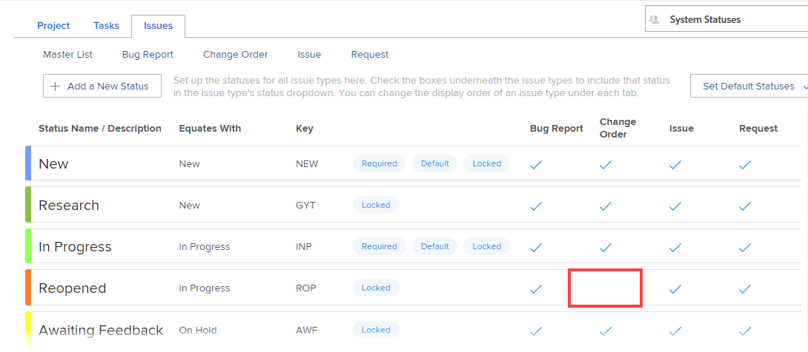

# Utiliser un état personnalisé comme état par défaut pour un groupe

En tant qu’administrateur de groupe, vous pouvez configurer un état personnalisé comme état par défaut pour un groupe ou un sous-groupe que vous gérez. Cela s’avère utile lorsque le système doit attribuer automatiquement un état Workfront à un projet, à une tâche ou à un problème. Un projet, une tâche ou un problème affiche toujours l’état personnalisé que vous définissez comme état par défaut au lieu d’afficher l’état Workfront auquel il correspond.

L’état que vous configurez peut être tout état personnalisé créé pour le groupe, hérité d’un groupe situé au-dessus du groupe ou hérité au niveau du système.

S’il existe des groupes au-dessus du groupe que vous gérez, leur équipe d’administration peut également le faire pour votre groupe. Il en va de même pour l’administration de Workfront (pour n’importe quel groupe).

>[!INFO]
>
>**Exemple :** Vous pouvez créer un état personnalisé appelé Terminé et le définir comme état par défaut associé à l’état Workfront Terminé.
>
>Ensuite, pour les tâches définies pour passer à l’état Terminé lorsqu’elles atteignent 100 %, l’état s’affiche comme Terminé au lieu de Terminé.

## Conditions d’accès

+++ Développez pour afficher les exigences d’accès aux fonctionnalités de cet article.

Vous devez disposer des éléments suivants pour effectuer les étapes décrites dans cet article :

<table style="table-layout:auto"> 
 <col> 
 <col> 
 <tbody> 
  <tr> 
   <td role="rowheader">Plan Workfront*</td> 
   <td>N’importe quelle</td> 
  </tr> 
  <tr> 
   <td role="rowheader">Licence Adobe Workfront*</td> 
   <td> 
Plan 
 
Vous devez être un administrateur ou une administratrice de groupe pour le groupe ou un administrateur ou une administratrice de Workfront. Pour plus d’informations, consultez les sections <a href="../../../administration-and-setup/manage-groups/group-roles/group-administrators.md" class="MCXref xref">Administrateurs et administratrices de groupe</a> et <a href="../../../administration-and-setup/add-users/configure-and-grant-access/grant-a-user-full-administrative-access.md" class="MCXref xref">Accorder l’accès administratif complet à une personne</a>.
 </td> 
  </tr> 
 </tbody> 
</table>

&#42;Pour savoir votre plan ou type de licence, contactez l’administration de Workfront.

+++

## Statuts des problèmes

Si l’état personnalisé est un état de problème, les quatre types de problème doivent être activés pour celui-ci (rapport de bogue, ordre de modification, problème et requête). Par exemple, dans l’état ci-dessous, l’état Réouvert ne peut pas être utilisé comme état par défaut, car le type de problème Modifier l’ordre n’est pas sélectionné :

## Définir un état personnalisé comme état par défaut pour un groupe

{{step-1-to-setup}}

1. Dans le panneau de gauche, cliquez sur **Groupes** , puis sur le nom du groupe dans lequel vous souhaitez créer ou personnaliser des états.
1. Dans le panneau de gauche, cliquez sur **États** .
1. Ouvrez l’onglet **Projet**, **Tâches** ou **Problèmes**, selon le type d’état que vous souhaitez définir comme état par défaut.
1. Cliquez sur **Définir les états par défaut** près du coin supérieur droit.
1. Dans la liste déroulante qui s’affiche, en regard de l’état dans lequel vous souhaitez définir l’état par défaut, sélectionnez l’état par défaut à définir.
1. Cliquer sur **Enregistrer**.

   L’état est désormais disponible comme état par défaut pour une utilisation avec les projets associés au groupe.

1. Associez l’état personnalisé au projet dans lequel vous souhaitez l’utiliser.

   Vous associez le statut au projet en associant le groupe où il réside au projet. Les utilisateurs ne peuvent utiliser l’état personnalisé que si le groupe où réside l’état est associé au projet.

   >[!NOTE]
   >
   >Si vous affectez le projet à un autre groupe, l’état du projet se recharge et peut changer.

   1. Accédez au projet dans lequel vous souhaitez utiliser l’état personnalisé.
   1. Cliquez sur le menu Plus , puis sur **Modifier**.
   1. Dans la zone **Edit Project** (Modifier le projet) qui s’affiche, dans le champ **Group** sous **Project association**, sélectionnez le groupe auquel l’état personnalisé est associé.

   1. Cliquez sur **Enregistrer les modifications**.

## Les groupes héritent des configurations d’état par défaut.

Lorsqu’un administrateur Workfront configure un état personnalisé comme état par défaut, les nouveaux groupes créés héritent de cette configuration.

De même, lorsqu’un administrateur de groupe définit un état personnalisé comme état par défaut, les nouveaux sous-groupes créés directement sous le groupe héritent de cette configuration.

Pour plus d’informations, consultez la section [Héritage de statuts par les groupes](../../../administration-and-setup/manage-groups/manage-group-statuses/how-groups-inherit-statuses.md).

## Lorsqu’un état par défaut est masqué

Si vous masquez un état par défaut (en activant l’option Masquer l’état ), le système tente plutôt de définir un autre état du type équivalent comme valeur par défaut.

S’il n’existe aucun état disponible du type équivalent, le type d’état s’affiche comme **Masqué** et n’est pas disponible pour les tâches.

